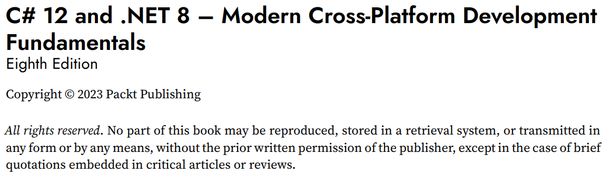
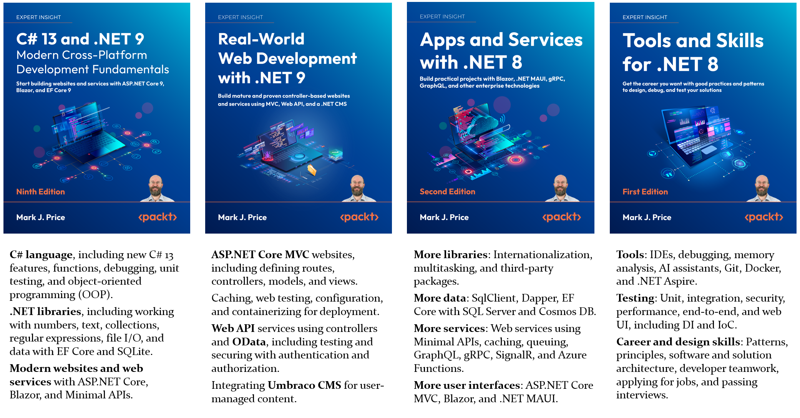
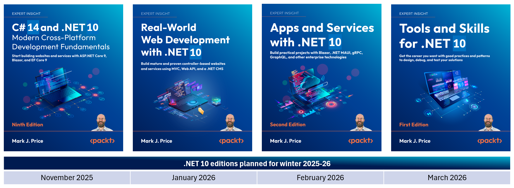

**FAQs**

For questions about book pricing, distribution, and so on, please contact the publisher Packt at the following email address: customercare@packt.com

- [Where can I buy your books in my country?](#where-can-i-buy-your-books-in-my-country)
- [Can you give me a free copy of your book? Can you give me permission to read an illegal copy of your book?](#can-you-give-me-a-free-copy-of-your-book-can-you-give-me-permission-to-read-an-illegal-copy-of-your-book)
- [How to get a Packt book you have purchased as a PDF](#how-to-get-a-packt-book-you-have-purchased-as-a-pdf)
- [Will there be .NET 9 editions of your other books? What about future versions of .NET?](#will-there-be-net-9-editions-of-your-other-books-what-about-future-versions-of-net)
- [Is there a roadmap that shows what order to learn .NET technologies?](#is-there-a-roadmap-that-shows-what-order-to-learn-net-technologies)

# Where can I buy your books in my country?

I live in the UK and I have no experience with buying books in your country but you probably do. Where have you bought books before in your country? Most bookstores will order a book for you if they do not have it in stock. If they cannot, then please ask the publisher, Packt, where you can buy Packt books in your country: customercare@packt.com. 

# Can you give me a free copy of your book? Can you give me permission to read an illegal copy of your book?

Some readers think that because my name is on the front cover, that means the books are "mine". Inside the book cover you will see who owns the book: **Copyright &copy; 2023 Packt Publishing**, as shown in the figure below: 

Authors with publishers just write the content. Authors are not involved in pricing and distribution, and they certainly cannot give the books away for free, or give you permission to read the books without paying for them. 

# How to get a Packt book you have purchased as a PDF

If you have purchased a Packt book then you have two options to get it in PDF format:

1. If you purchase any other format of the book from anywhere else then you can get the PDF edition by completing a form on Packt's website with proof of purchase: https://www.packtpub.com/page/free-ebook. For example, you might buy the paperback from your local independent bookstore, or you might buy the Kindle edition from Amazon.

2. If you purchase an ebook from Packt's website then you get it in PDF and EPUB formats as well as their online reader. 
 
My .NET 9 books on Packt's website:
- [C# 13 and .NET 9 – Modern Cross-Platform Development Fundamentals](https://www.packtpub.com/en-us/product/c-13-and-net-9-modern-cross-platform-development-fundamentals-9781835881224)
- [Real-World Web Development with .NET 9](https://www.packtpub.com/en-us/product/real-world-web-development-with-net-9-9781835880395)

My .NET 8 books on Packt's website:
- [C# 12 and .NET 8 – Modern Cross-Platform Development Fundamentals](https://www.packtpub.com/en-us/product/c-12-and-net-8-modern-cross-platform-development-fundamentals-9781837635870)
- [Apps and Services with .NET 8](https://www.packtpub.com/en-us/product/apps-and-services-with-net-8-9781837637133)
- [Tools and Skills for .NET 8](https://www.packtpub.com/en-us/product/tools-and-skills-for-net-8-9781837635207)

# Will there be .NET 9 editions of your other books? What about future versions of .NET?

Although I have updated my C# and .NET fundamentals book and created a new book for web development that both cover .NET 9, I will not be updating my *Apps and Services* or *Tools and Skills* books until .NET 10. 

Until the end of 2025, the most up-to-date editions of my .NET books are shown in the following figure:

Starting in November 2025, my plan* is that all four .NET books will be updated for .NET 10, shown in the following figure:

*Plan not guaranteed!

# Is there a roadmap that shows what order to learn .NET technologies?

Some decent .NET road maps include: 
- https://roadmap.sh/aspnet-core
- https://github.com/MoienTajik/AspNetCore-Developer-Roadmap/blob/master/aspnetcore-developer-roadmap.png

