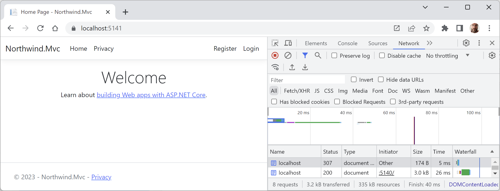
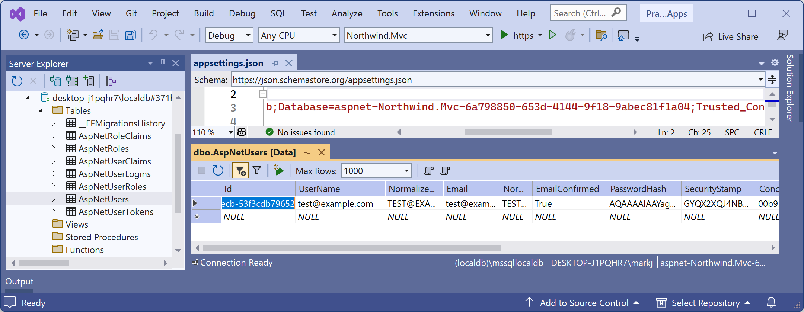

# Setting up an ASP.NET Core MVC website

- [Setting up an ASP.NET Core MVC website](#setting-up-an-aspnet-core-mvc-website)
  - [Creating an ASP.NET Core MVC website](#creating-an-aspnet-core-mvc-website)
  - [Creating the authentication database for SQL Server LocalDB](#creating-the-authentication-database-for-sql-server-localdb)
  - [Changing the port numbers and starting the website](#changing-the-port-numbers-and-starting-the-website)
  - [Exploring visitor registration](#exploring-visitor-registration)
  - [Reviewing an MVC website project structure](#reviewing-an-mvc-website-project-structure)
  - [Reviewing the ASP.NET Core Identity database](#reviewing-the-aspnet-core-identity-database)


ASP.NET Core Razor Pages are good for simple websites. For more complex websites, it would be better to have a more formal structure to manage that complexity.

This is where the **Model-View-Controller (MVC)** design pattern is useful. It uses technologies like Razor syntax, but allows a cleaner separation between technical concerns, as shown in the following list:

- **Models**: Classes that represent the data entities and view models used on the website.
- **Views**: *Razor View* files, that is, `.cshtml` files, that render data in view models into HTML web pages. *Razor Views* are different from *Razor Pages* but they share the same file extension `.cshtml`. When creating a Razor Page, it must have the `@page` directive at the top of its file. When creating a *Razor View*, you must *not* use the `@page` directive! If you do, the controller will not pass the model and it will be `null`, throwing a `NullReferenceException` when you try to access any of its members.
- **Controllers**: Classes that execute code when an HTTP request arrives at the web server. The controller methods usually instantiate a view model and pass that to a view to generate an HTTP response. This is returned to the web browser or other client that made the original request.

The best way to understand using the MVC design pattern is to see a working example.

## Creating an ASP.NET Core MVC website

You will use a project template to create an ASP.NET Core MVC website project that has a database for authenticating and authorizing users. Visual Studio 2022 defaults to using SQL Server LocalDB for the accounts database. Visual Studio Code (or more accurately the dotnet CLI tool) uses SQLite by default and you can specify a switch to use SQL Server LocalDB instead.

Let's see it in action:

1.	Use your preferred code editor to open the `PracticalApps` solution.
2.	Add an MVC website project with authentication accounts stored in a database, as defined in the following list:
    - Project template: **ASP.NET Core Web App (Model-View-Controller)** [C#] / `mvc`.
    - Project file and folder: `Northwind.Mvc`.
    - Solution file and folder: `PracticalApps`.
    - **Authentication type**: Individual Accounts / `--auth Individual`.
    - For Visual Studio 2022, leave all other options as their defaults, for example, HTTPS is enabled, and Docker is disabled.
    - For Visual Studio Code, in the `PracticalApps` solution folder, use: `dotnet new mvc --auth Individual -o Northwind.Mvc` and then `dotnet sln add Northwind.Mvc`.
    - For JetBrains Rider, right-click the `PracticalApps` solution, navigate to **Add** | **New Project…**, in the **New Project** dialog box, select **ASP.NET Core Web Application**, for **Type**, select **Web App (Model-View-Controller)**, and for **Auth**, select **Individual authentication**, and then click **Create**.
3.	Build the `Northwind.Mvc` project.
4.	At the command prompt or terminal, use the `--help` switch to see other options for this project template, as shown in the following command:
```
dotnet new mvc --help
```

5.	Note the results, as shown in the following partial output:
```
ASP.NET Core Web App (Model-View-Controller) (C#)
Author: Microsoft
Description: A project template for creating an ASP.NET Core application with example ASP.NET Core MVC Views and Controllers. This template can also be used for RESTful HTTP services.
```

There are many options, especially related to authentication, as shown in *Table 14.1*:

Switches|Description
---|---
`-au` or `--auth`|The type of authentication to use:<br/>`None` (default): This choice also allows you to disable HTTPS.<br/>`Individual`: Individual authentication that stores registered users and their passwords in a database (SQLite by default). We will use this in the project we create for this chapter.<br/>`IndividualB2C`: Individual authentication with Azure AD B2C.<br/>`SingleOrg`: Organizational authentication for a single tenant.<br/>`MultiOrg`: Organizational authentication for multiple tenants.<br/>`Windows`: Windows authentication. Mostly useful for intranets.
`-uld` or `--use-local-db`|Whether to use SQL Server LocalDB instead of SQLite. This option only applies if `--auth Individual` or `--auth IndividualB2C` is specified. The value is an optional bool with a default of `false`.
`-rrc` or `--razor-runtime-compilation`|Determines if the project is configured to use Razor runtime compilation in `Debug` builds. This can improve the performance of the startup process during debugging because it can defer the compilation of Razor views. The value is an optional bool with a default of `false`.
`-f` or `--framework`|The target framework for the project. Values can be `net8.0` (default), `net7.0`, or `net6.0`. Older versions are no longer supported.

*Table 14.1: Additional switches for the dotnet new mvc project template*

## Creating the authentication database for SQL Server LocalDB

If you created the MVC project using Visual Studio 2022, or you used `dotnet new mvc` with the `-uld` or `--use-local-db` switch, then the database for authentication and authorization will be stored in SQL Server LocalDB. But the database does not yet exist.

If you created the MVC project using `dotnet new` or JetBrains Rider, then the database for authentication and authorization will be stored in SQLite and the file has already been created, named `app.db`.

The connection string for the authentication database is named `DefaultConnection` and it is stored in the `appsettings.json` file in the root folder for the MVC website project.

For SQLite, see the following setting:
```json
{
  "ConnectionStrings": {
    "DefaultConnection": "DataSource=app.db;Cache=Shared"
  },
```

If you created the MVC project using Visual Studio 2022 only, then let's create its authentication database now by following a few simple steps:

1.	In the `Northwind.Mvc` project, in `appsettings.json`, note the database connection string named `DefaultConnection`, as shown in the following configuration:
```json
{
  "ConnectionStrings": {
    "DefaultConnection": "Server=(localdb)\\mssqllocaldb;Database=aspnet-Northwind.Mvc-440bc3c1-f7e7-4463-99d5-896b6a6500e0;Trusted_Connection=True;MultipleActiveResultSets=true"
  },
  "Logging": {
    "LogLevel": {
      "Default": "Information",
      "Microsoft.AspNetCore": "Warning"
    }
  },
  "AllowedHosts": "*"
}
```

> Your database name will use the pattern `aspnet-<ProjectName>-<GUID>` and have a different GUID value from the example above.

2.	At a command prompt or terminal, in the `Northwind.Mvc` folder, enter the command to run database migrations so that the database used to store credentials for authentication is created, as shown in the following command:
```
dotnet ef database update
```

3.	Note the database is created with tables like `AspNetRoles`, as shown in the following partial output:
```
Build started...
Build succeeded.
info: Microsoft.EntityFrameworkCore.Infrastructure[10403]
      Entity Framework Core 8.0.0 initialized 'ApplicationDbContext' using provider 'Microsoft.EntityFrameworkCore.SqlServer:8.0.0' with options: None
info: Microsoft.EntityFrameworkCore.Database.Command[20101]
      Executed DbCommand (129ms) [Parameters=[], CommandType='Text', CommandTimeout='60']
      CREATE DATABASE [aspnet-Northwind.Mvc2-440bc3c1-f7e7-4463-99d5-896b6a6500e0];
...
info: Microsoft.EntityFrameworkCore.Database.Command[20101]
      Executed DbCommand (3ms) [Parameters=[], CommandType='Text', CommandTimeout='30']
      CREATE TABLE [AspNetRoles] (
          [Id] nvarchar(450) NOT NULL,
          [Name] nvarchar(256) NULL,
          [NormalizedName] nvarchar(256) NULL,
          [ConcurrencyStamp] nvarchar(max) NULL,
          CONSTRAINT [PK_AspNetRoles] PRIMARY KEY ([Id])
      );
...
info: Microsoft.EntityFrameworkCore.Database.Command[20101]
      Executed DbCommand (8ms) [Parameters=[], CommandType='Text', CommandTimeout='30']
      INSERT INTO [__EFMigrationsHistory] ([MigrationId], [ProductVersion])
      VALUES (N'00000000000000_CreateIdentitySchema', N'8.0.0');
```

## Changing the port numbers and starting the website

Let's review the behavior of the default ASP.NET Core MVC website project template:

1.	In the `Northwind.Mvc` project, expand the `Properties` folder.
2.	In `launchSettings.json`, change the configured port numbers for the `https` profile, as shown highlighted in the following configuration:
```json
"applicationUrl": "https://localhost:5141;http://localhost:5140",
```

3.	Save the changes to the `launchSettings.json` file.
4.	Start the Northwind.Mvc website using the `https` launch profile:
    - If you are using Visual Studio 2022, then in the toolbar, select the **https** profile, select **Google Chrome** as the **Web Browser**, and then start the project without debugging.
    - If you are using Visual Studio Code, then enter the command to start the project with the `https` launch profile, as shown in the following command: `dotnet run --launch-profile https`, and then start Chrome.
5.	In Chrome, open **Developer Tools**.
6.	Navigate to http://localhost:5140/ and note the following, as shown in *Figure 14.1*:

    - Requests for HTTP on port 5140 are automatically redirected to HTTPS on port 5141.
    - The top navigation menu with links to **Home**, **Privacy**, **Register**, and **Login**. If the viewport width is 575 pixels or less, then the navigation collapses into a hamburger menu.
    - The title of the website, **Northwind.Mvc**, shown in the header and footer:


*Figure 14.1: The ASP.NET Core MVC project template website home page*

7.	Leave the browser running.

## Exploring visitor registration

By default, passwords must have at least one non-alphanumeric character, at least one digit (0-9), and at least one uppercase letter (A-Z). I use Pa$$w0rd in scenarios like this when I am just exploring.

The MVC project template follows best practices for **double-opt-in (DOI)**, meaning that after filling in an email and password to register, an email is sent to the email address, and the visitor must click a link in that email to confirm that they want to register.

We have not yet configured an email provider to send that email, so we must simulate that step:

1.	In Chrome, close the **Developer Tools** pane.
2.	In the top navigation menu, click **Register**.
3.	Enter an email and password, and then click the **Register** button. (I used `test@example.com` and `Pa$$w0rd`.)
4.	On the **Register confirmation** page, click the link with the text **Click here to confirm your account** and note that you are redirected to a **Confirm email** page that you could customize. By default, the **Confirm email** page just says **Thank you for confirming your email**.
5.	In the top navigation menu, click **Login**, enter your email and password (note that there is an optional checkbox to remember you, and there are links if the visitor has forgotten their password or they want to register as a new visitor), and then click the **Log in** button.
6.	In the top navigation menu, click your email address. This will navigate to an account management page. Note that you can set a phone number, change your email address, change your password, enable two-factor authentication (if you add an authenticator app), and download and delete your personal data. This last feature is good for compliance with legal regulations like the European GDPR.
7.	Close Chrome and shut down the web server.

## Reviewing an MVC website project structure

In your code editor, set the option to show all files for a solution:
- In Visual Studio 2022, in **Solution Explorer**, toggle on **Show All Files**.
- In JetBrains Rider, hover your mouse in the **Solution** pane and click the eyeball icon.

Review the folder structure of an MVC website project. We will look in more detail at some of these parts later, but for now, note the following:

- `Areas`: This folder contains nested folders and a file needed to integrate your website project with **ASP.NET Core Identity**, which is used for authentication.
- `bin`, `obj`: These folders contain temporary files needed during the build process and the compiled assemblies for the project.
- `Controllers`: This folder contains C# classes that have methods (known as actions) that fetch a model and pass it to a view, for example, `HomeController.cs`.
- `Data`: This folder contains Entity Framework Core migration classes used by the ASP.NET Core Identity system to provide data storage for authentication and authorization, for example, `ApplicationDbContext.cs`.
- `Models`: This folder contains C# classes that represent all of the data gathered together by a controller and passed to a view, for example, `ErrorViewModel.cs`.
- `Properties`: This folder contains a configuration file for IIS or IIS Express on Windows and for launching the website during development named `launchSettings.json`. This file is only used on the local development machine and is not deployed to your production website.
- `Views`: This folder contains the `.cshtml` Razor files that combine HTML and C# code to dynamically generate HTML responses. The `_ViewStart.cshtml` file sets the default layout and `_ViewImports.cshtml` imports common namespaces used in all views like tag helpers:
    - `Home`: This subfolder contains Razor files for the home and privacy pages.
    - `Shared`: This subfolder contains Razor files for the shared layout, an error page, and two partial views for logging in and validation scripts.
- `wwwroot`: This folder contains static content used by the website, such as CSS for styling, libraries of JavaScript, JavaScript for this website project, and a `favicon.ico` file. You also put images and other static file resources like PDF documents in here. The project template includes Bootstrap and jQuery libraries.
- `app.db`: This is the SQLite database that stores registered visitors. (If you used SQL Server LocalDB, then it will not be needed.)
- `appsettings.json` and `appsettings.Development.json`: These files contain settings that your website can load at runtime, for example, the database connection string for the ASP.NET Core Identity system and logging levels.
- `Northwind.Mvc.csproj`: This file contains project settings like the use of the web .NET SDK, an entry for SQLite to ensure that the `app.db` file is copied to the website's output folder, and a list of NuGet packages that your project requires, including EF Core and ASP.NET Core Identity packages.
- `Northwind.Mvc.csproj.user`: This file contains Visual Studio 2022 session settings for remembering options. For example, which launch profile was selected, like `https`. Visual Studio 2022 hides this file, and it should not normally be included in source code control because it is specific to an individual developer.
- `Program.cs`: This file defines a hidden `Program` class that contains the `<Main>$` entry point. It builds a pipeline for processing incoming HTTP requests and hosts the website using default options like configuring the Kestrel web server and loading app settings. It adds and configures services that your website needs, for example, ASP.NET Core Identity for authentication, SQLite or SQL Server for identity data storage, and so on, and routes for your application.

## Reviewing the ASP.NET Core Identity database

Open `appsettings.json` to find the connection string used for the ASP.NET Core Identity database, as shown for SQL Server LocalDB in the following markup:
```json
{
  "ConnectionStrings": {
    "DefaultConnection": "Server=(localdb)\\mssqllocaldb;Database=aspnet-Northwind.Mvc-2F6A1E12-F9CF-480C-987D-FEFB4827DE22;Trusted_Connection=True;MultipleActiveResultSets=true"
  },
  "Logging": {
    "LogLevel": {
      "Default": "Information",
      "Microsoft.AspNetCore": "Warning"
    }
  },
  "AllowedHosts": "*"
}
```

If you used SQL Server LocalDB for the identity data store, then you can use **Server Explorer** to connect to the database. You can copy and paste the connection string from the `appsettings.json` file. Remember to remove the second backslash between `(localdb)` and `mssqllocaldb`. 

If you installed an SQLite tool such as SQLiteStudio, then you can open the SQLite `app.db` database file.

You can then see the tables that the ASP.NET Core Identity system uses to register users and roles, including the `AspNetUsers` table used to store the registered visitor, as shown in *Figure 14.2*:
 

*Figure 14.2: AspNetUsers table with the registered user*

