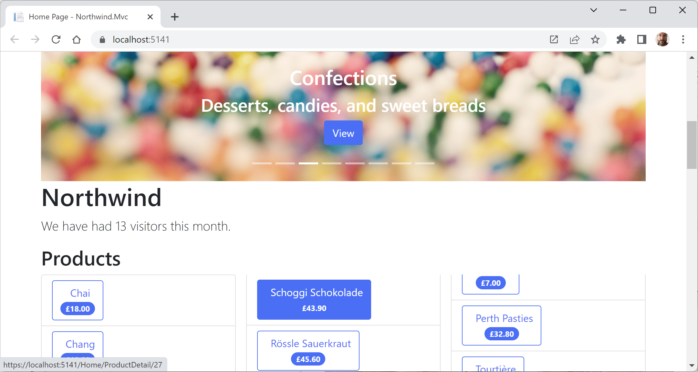
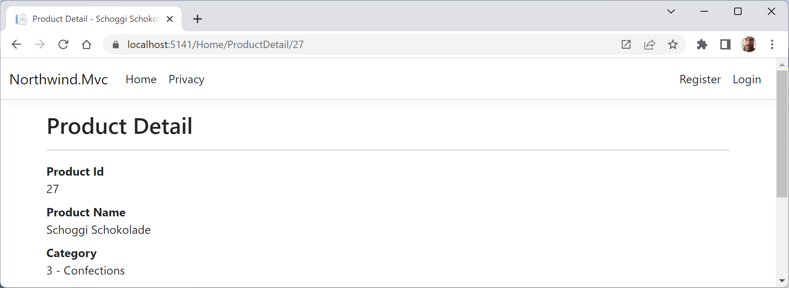
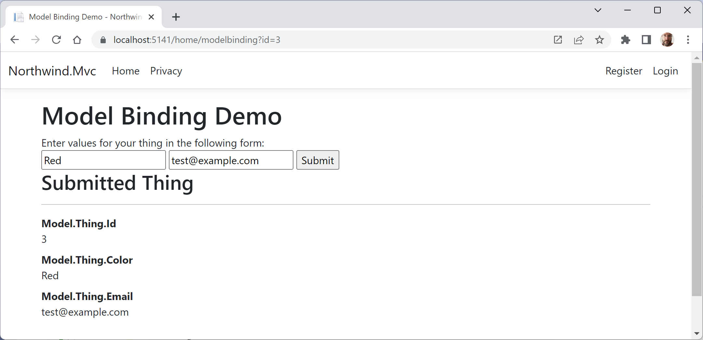
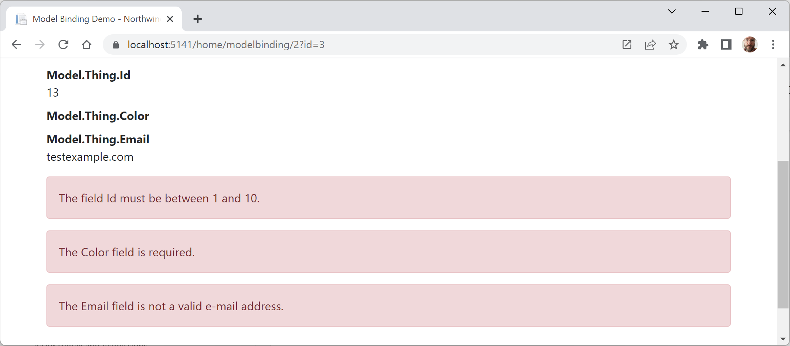

# Customizing an ASP.NET Core MVC website

Now that you've reviewed the structure of a basic MVC website, you will customize and extend it. You have already registered an EF Core model for the Northwind database, so the next task is to output some of that data on the home page.

- [Customizing an ASP.NET Core MVC website](#customizing-an-aspnet-core-mvc-website)
  - [Defining a custom style](#defining-a-custom-style)
  - [Setting up the category images](#setting-up-the-category-images)
  - [Razor syntax and expressions](#razor-syntax-and-expressions)
  - [Defining a typed view](#defining-a-typed-view)
  - [Passing parameters using a route value](#passing-parameters-using-a-route-value)
  - [Disambiguating action methods](#disambiguating-action-methods)
  - [Model binders in detail](#model-binders-in-detail)
  - [Passing a route parameter](#passing-a-route-parameter)
  - [Passing a form parameter](#passing-a-form-parameter)
  - [Defining views with HTML Helper methods](#defining-views-with-html-helper-methods)
  - [Defining views with Tag Helpers](#defining-views-with-tag-helpers)
  - [Cross-functional filters](#cross-functional-filters)
  - [Using a filter to define a custom route](#using-a-filter-to-define-a-custom-route)


## Defining a custom style

The home page will show a list of the 77 products in the Northwind database. To make efficient use of space, we want to show the list in three columns. To do this, we need to customize the stylesheet for the website:

1.	In the `wwwroot\css` folder, open the `site.css` file.
2.	At the bottom of the file, add a new style that will apply to an element with the `product-columns` ID, as shown in the following code:
```css
#product-columns
{
  column-count: 3;
}
```

## Setting up the category images

The Northwind database includes a table of eight categories, but they do not have images, and websites look better with some colorful pictures:

1.	In the `wwwroot` folder, create a folder named `images`.
2.	In the `images` folder, add eight image files named `category1.jpeg`, `category2.jpeg`, and so on, up to `category8.jpeg`.

> You can download images from the GitHub repository for this book at the following link: https://github.com/markjprice/cs12dotnet8/tree/main/code/images/Categories

## Razor syntax and expressions

Before we customize the home page view, let's review an example Razor file. The file has an initial Razor code block that instantiates an order with the price and quantity, and then outputs information about the order on the web page, as shown in the following markup:
```cs
@{
  Order order = new()
  {
    OrderId = 123,
    Product = "Sushi",
    Price = 8.49M,
    Quantity = 3
  };
}
```
```html
<div>Your order for @order.Quantity of @order.Product has a total cost of $@ order.Price * @order.Quantity</div>
```

The preceding Razor file would result in the following incorrect output:
```
Your order for 3 of Sushi has a total cost of $8.49 * 3
```

Although Razor markup can include the value of any single property using the `@object.property` syntax, you should wrap expressions in parentheses, as shown in the following markup:
```html
<div>Your order for @order.Quantity of @order.Product has a total cost of $@ (order.Price * order.Quantity)</div>
```

The preceding Razor expression results in the following correct output:
```
Your order for 3 of Sushi has a total cost of $25.47
```

## Defining a typed view

To improve the IntelliSense when writing a view, you can define what type the view can expect using an @model directive at the top:

1.	In the `Views\Home` folder, open `Index.cshtml`.
2.	At the top of the file, add statements to import the namespace for Northwind entities and set the model type to use the `HomeIndexViewModel`, as shown in the following code:
```cs
@using Northwind.EntityModels
@model HomeIndexViewModel
```

Now, whenever we type `Model` in this view, your code editor will know the correct type for the model and will provide IntelliSense for it.

While entering code in a view, remember the following:
- Declare the type for the model using `@model` (with a lowercase `m`).
- Interact with the instance of the model using `@Model` (with an uppercase `M`).

Let's continue customizing the view for the home page.

3.	In the initial Razor code block, add a statement to declare a string variable for the current item, as shown highlighted in the following markup:
```cs
@{
  ViewData["Title"] = "Home Page";
  string currentItem = "";
}
```

4.	Under the existing `<div>` element, after its closing `</div>`, add new markup to output categories in a carousel and products as an unordered list, as shown in the following markup:
```html
@if (Model is not null)
{
<div id="categories" class="carousel slide" data-bs-ride="carousel" 
     data-bs-interval="3000" data-keyboard="true">
  <ol class="carousel-indicators">
  @for (int c = 0; c < Model.Categories.Count; c++)
  {
    if (c == 0)
    {
      currentItem = "active";
    }
    else
    {
      currentItem = "";
    }
    <li data-bs-target="#categories" data-bs-slide-to="@c"  
        class="@currentItem"></li>
  }
  </ol>

  <div class="carousel-inner">
  @for (int c = 0; c < Model.Categories.Count; c++)
  {
    if (c == 0)
    {
      currentItem = "active";
    }
    else
    {
      currentItem = "";
    }
    <div class="carousel-item @currentItem">
      
      <div class="carousel-caption d-none d-md-block">
        <h2>@Model.Categories[c].CategoryName</h2>
        <h3>@Model.Categories[c].Description</h3>
        <p>
          <a class="btn btn-primary" href="/home/categorydetail/
@Model.Categories[c].CategoryId">View</a>
        </p>
      </div>
    </div>
  }
  </div>
  <a class="carousel-control-prev" href="#categories" 
    role="button" data-bs-slide="prev">
    <span class="carousel-control-prev-icon" 
      aria-hidden="true"></span>
    <span class="sr-only">Previous</span>
  </a>
  <a class="carousel-control-next" href="#categories" 
    role="button" data-bs-slide="next">
    <span class="carousel-control-next-icon" aria-hidden="true"></span>
    <span class="sr-only">Next</span>
  </a>
</div>
}

<div class="row">
  <div class="col-md-12">
    <h1>Northwind</h1>
    <p class="lead">
      We have had @Model?.VisitorCount visitors this month.
    </p>
    @if (Model is not null)
    {
    <h2>Products</h2>
    <div id="product-columns">
      <ul class="list-group">
      @foreach (Product p in @Model.Products)
      {
        <li class="list-group-item d-flex justify-content-between align-items-start">
          <a asp-controller="Home" asp-action="ProductDetail"
             asp-route-id="@p.ProductId" class="btn btn-outline-primary">
            <div class="ms-2 me-auto">@p.ProductName</div>
            <span class="badge bg-primary rounded-pill">
              @(p.UnitPrice is null ? "zero" : p.UnitPrice.Value.ToString("C"))
            </span>
          </a>
        </li>
      }
      </ul>
    </div>
    }
  </div>
</div>
```

While reviewing the preceding Razor markup, note the following:
- JetBrains Rider might tell you that `Model` is never `null`, implying that you do not need to check for `null`. Visual Studio 2022 will warn you the opposite, which is why I put in the `null` check. Unfortunately, it is a common programmer error to pass an object for the model that is `null` and therefore Rider is wrong to assume it will never be `null`.
- It is easy to mix static HTML elements such as `<ul>` and `<li>` with C# code to output the carousel of categories and the list of product names.
- The `<div>` element with the `id` attribute of `product-columns` will use the custom style that we defined earlier, so all the content in that element will display in three columns.
- The `` element for each category uses parentheses around a Razor expression to ensure that the compiler does not include the `.jpeg` as part of the expression, as shown in the following markup: `~/images/category@(Model.Categories[c].CategoryID).jpeg`.
- The `<a>` elements for the product links use tag helpers to generate URL paths. Clicks on these hyperlinks will be handled by the `HomeController` and its `ProductDetail` action method. This action method does not exist yet, but you will add it later in this chapter. The ID of the product is passed as a route segment named `id`, as shown in the following URL path for Ipoh Coffee: https://localhost:5141/Home/ProductDetail/43.

Let's see the result of our customized home page:
1.	Start the `Northwind.Mvc` website project using the `https` launch profile.
2.	Note the home page has a rotating carousel showing categories, a random number of visitors, and a list of products in three columns, as shown in *Figure 14.4*:

 
*Figure 14.4: The updated Northwind MVC website home page*

For now, clicking on any of the categories or product links gives `404 Not Found` errors, so let's see how we can implement pages that use the parameters passed to them to see the details of a product or category.

3.	Close Chrome and shut down the web server.

## Passing parameters using a route value

One way to pass a simple parameter is to use the id segment defined in the default route:

1.	In `HomeController`, import the namespace for calling the `Include` extension method so that we can get related entities, as shown in the following code:
```cs
using Microsoft.EntityFrameworkCore; // To use Include method.
```

2.	Add an action method named `ProductDetail`, as shown in the following code:
```cs
public IActionResult ProductDetail(int? id)
{
  if (!id.HasValue)
  {
    return BadRequest("You must pass a product ID in the route, for example, /Home/ProductDetail/21");
  }

  Product? model = _db.Products.Include(p => p.Category)
    .SingleOrDefault(p => p.ProductId == id);

  if (model is null)
  {
    return NotFound($"ProductId {id} not found.");
  }

  return View(model); // Pass model to view and then return result.
}
```

Note the following:
- This method uses a feature of ASP.NET Core called **model binding** to automatically match the `id` passed in the route to the parameter named `id` in the method.
- Inside the method, we check to see whether `id` does not have a value, and if so, we call the `BadRequest` method to return a 400 status code with a custom message explaining the correct URL path format.
- Otherwise, we can connect to the database and try to retrieve a product using the `id` value and include the related category information so we can see its name.
- If we find a product, we pass it to a view; otherwise, we call the `NotFound` method to return a 404 status code and a custom message explaining that a product with that ID was not found in the database.

3.	In the `Views/Home` folder, add a new Razor View file named `ProductDetail.cshtml`. (In Visual Studio, the item template is named **Razor View - Empty**. In Visual Studio Code, at the command prompt or terminal, enter `dotnet new view -n ProductDetail`.)

> **Warning!** Be careful not to add a Razor Page. If you do, then the file will have an `@page` directive at the top, which will prevent the model from being passed from the controller to the view and you will get a `NullReferenceException`!

4.	Modify the contents, as shown in the following markup:
```html
@model Northwind.EntityModels.Product 
@{
  ViewData["Title"] = $"Product Detail - {Model.ProductName}";
}
<h2>Product Detail</h2>
<hr />
<div>
  <dl class="dl-horizontal">
    <dt>Product Id</dt>
    <dd>@Model.ProductId</dd>
    <dt>Product Name</dt>
    <dd>@Model.ProductName</dd>
    <dt>Category</dt>
    <dd>@Model.CategoryId - @Model.Category?.CategoryName</dd>
    <dt>Unit Price</dt>
    <dd>@(Model.UnitPrice is null ? "zero" : 
          Model.UnitPrice.Value.ToString("C"))</dd>
    <dt>Units In Stock</dt>
    <dd>@Model.UnitsInStock</dd>
  </dl>
</div>
```

5.	Start the `Northwind.Mvc` project using the `https` launch profile.
6.	When the home page appears with the list of products, click on one of them, for example, the second product, **Chang**.
7.	Note the URL path in the browser's address bar, the page title shown in the browser tab, and the product details page, as shown in *Figure 14.5*:


*Figure 14.5: The product details page for Schoggi Schokolade*

8.	View **Developer Tools**.
9.	Edit the URL in the address box of Chrome to request a product ID that does not exist, like 99, and note the `404 Not Found` status code and custom error response.
10.	Close Chrome and shut down the web server.

## Disambiguating action methods

Although the C# compiler can differentiate between the two methods by noting that the signatures are different, from the point of view of routing an HTTP request, both methods are potential matches. We need an HTTP-specific way to disambiguate the action methods.

We could do this by creating different names for the actions or by specifying that one method should be used for a specific HTTP verb, like GET, POST, or DELETE. You do this by decorating the action method with one of the following attributes: `[HttpPost]`, `[HttpPut]`, and so on.

## Model binders in detail

Model binders are a powerful yet easy way to set parameters of action methods based on values passed in an HTTP request, and the default one does a lot for you. After the default route identifies a controller class to instantiate and an action method to call, if that method has parameters, then those parameters need to have values set.

Model binders do this by looking for parameter values passed in the HTTP request as any of the following types of parameters:
- Route parameter, like `id` as we used in the previous section, as shown in the following URL path: `/Home/ProductDetail/2`
- Query string parameter, as shown in the following URL path: `/Home/ProductDetail?id=2`
- Form parameter, as shown in the following markup:
```html
<form action="post" action="/Home/ProductDetail">
  <input type="text" name="id" value="2" />
  <input type="submit" />
</form>
```

Model binders can populate almost any type:
- Simple types, like `int`, `string`, `DateTime`, and `bool`.
- Complex types defined by `class`, `record`, or `struct`.
- Collection types, like arrays and lists.

The process of model binding can cause errors, for example, data type conversions or validation errors if the model has been decorated with validation rules. What data has been bound and any binding or validation errors are stored in `ControllerBase.ModelState`.

Let's create a somewhat artificial example to illustrate what can be achieved using the default model binder and what we can do with the model state by applying some validation rules to the bound model and showing invalid data messages in the view:

1.	In the `Models` folder, add a new file named `Thing.cs`.
2.	Modify the contents to define a record with three properties; a nullable integer named `Id`, a `string` named `Color`, and a `string` named `Email`, each with appropriate validation attributes, as shown in the following code:
```cs
// To use [Range], [Required], [EmailAddress].
using System.ComponentModel.DataAnnotations;

namespace Northwind.Mvc.Models;

public record Thing(
  [Range(1, 10)] int? Id, 
  [Required] string? Color,
  [EmailAddress] string? Email
);
```

3.	In the `Models` folder, add a new class file named `HomeModelBindingViewModel.cs`.
4.	Modify its contents to define a record with properties to store the bound model, a flag to indicate that there are errors, and a sequence of error messages, as shown in the following code:
```cs
namespace Northwind.Mvc.Models;

public record HomeModelBindingViewModel(Thing Thing, bool HasErrors, 
  IEnumerable<string> ValidationErrors);
```

5.	In `HomeController`, add two new action methods, one to show a page with a form and one to display a thing with a parameter using your new model type, as shown in the following code:
```cs
// This action method will handle GET and other requests except POST.
public IActionResult ModelBinding()
{
  return View(); // The page with a form to submit.
}

[HttpPost] // This action method will handle POST requests.
public IActionResult ModelBinding(Thing thing)
{
  HomeModelBindingViewModel model = new(
    Thing: thing, HasErrors: !ModelState.IsValid, 
    ValidationErrors: ModelState.Values
      .SelectMany(state => state.Errors)
      .Select(error => error.ErrorMessage)
  );

  return View(model); // Show the model bound thing.
}
```

The first `ModelBinding` action method will implicitly be used for all other types of HTTP requests, like `GET`, `PUT`, `DELETE`, and so on, because the second ModelBinding action method is decorated with `[HttpPost]`.

6.	In the `Views\Home` folder, add a new file named `ModelBinding.cshtml` and modify its contents, as shown in the following markup:
```html
@model HomeModelBindingViewModel 
@{
  ViewData["Title"] = "Model Binding Demo";
}
<h1>@ViewData["Title"]</h1>
<div>
  Enter values for your thing in the following form:
</div>
<form method="POST" action="/home/modelbinding?id=3">
  <input name="color" value="Red" />
  <input name="email" value="test@example.com" />
  <input type="submit" />
</form>
@if (Model is not null)
{
<h2>Submitted Thing</h2>
<hr />
<div>
  <dl class="dl-horizontal">
    <dt>Model.Thing.Id</dt>
    <dd>@Model.Thing.Id</dd>
    <dt>Model.Thing.Color</dt>
    <dd>@Model.Thing.Color</dd>
    <dt>Model.Thing.Email</dt>
    <dd>@Model.Thing.Email</dd>
  </dl>
</div>
  @if (Model.HasErrors)
  {
  <div>
    @foreach(string errorMessage in Model.ValidationErrors)
    {
      <div class="alert alert-danger" role="alert">@errorMessage</div>
    }
  </div>
  }
}
@section Scripts {
  <partial name="_ValidationScriptsPartial" />
}
```

7.	In `Views/Home`, in `Index.cshtml`, in the first `<div>`, after rendering the heading, add a new paragraph with a link to the model binding page, as shown in the following markup:
```html
<p><a asp-action="ModelBinding" asp-controller="Home">Binding</a></p>
```

8.	Start the `Northwind.Mvc` website project using the `https` launch profile.
9.	On the home page, click **Binding**.
10.	Click the **Submit** button and note the value for the `Id` property is set from the query string parameter in the action of the form, and the values for the color and email properties are set from the form elements, as shown in **Figure 14.6**:

 
*Figure 14.6: The Model Binding Demo page*

11.	Close Chrome and shut down the web server.

## Passing a route parameter

Now we will set the property using a route parameter:

1.	In the `Views\Home` folder, in `ModelBinding.cshtml`, modify the action for the form to pass the value `2` as an MVC route parameter, as shown highlighted in the following markup:
```html
<form method="POST" action="/home/modelbinding/2?id=3">
```

2.	Start the `Northwind.Mvc` website project using the `https` launch profile.
3.	On the home page, click **Binding**.
4.	Click the **Submit** button and note the value for the `Id` property is set from the route parameter.
5.	Close Chrome and shut down the web server.

## Passing a form parameter

Now we will set the property using a form parameter:
1.	In the `Views\Home` folder, in `ModelBinding.cshtml`, modify the action for the form to pass the value `1` as a form element parameter, as shown in the following markup:
```html
<form method="POST" action="/home/modelbinding/2?id=3">
  <input name="id" value="1" />
  <input name="color" value="Red" />
  <input name="email" value="test@example.com" />
  <input type="submit" />
</form>
```

2.	Start the `Northwind.Mvc` website project using the `https` launch profile.
3.	On the home page, click **Binding**.
4.	Click the **Submit** button and note the values for all the properties are both set from the form element parameters.

> **Good Practice**: If you have multiple parameters with the same name, then remember that form parameters have the highest priority and query string parameters have the lowest priority for automatic model binding.

5.	Enter an **Id** of `13`, clear the color textbox, delete the `@` from the email address, click the **Submit** button, and note the error messages, as shown in *Figure 14.7*:

 
*Figure 14.7: The Model Binding Demo page with field validations*

6.	Close Chrome and shut down the web server.

> **Good Practice**: What regular expression does Microsoft use for the implementation of the EmailAddress validation attribute? Find out at the following link: https://github.com/microsoft/referencesource/blob/5697c29004a34d80acdaf5742d7e699022c64ecd/System.ComponentModel.DataAnnotations/DataAnnotations/EmailAddressAttribute.cs#L54

## Defining views with HTML Helper methods

While creating a view for ASP.NET Core MVC, you can use the `Html` object and its methods to generate markup. When Microsoft first introduced ASP.NET MVC in 2009, these **HTML Helper methods** were the way to programmatically render HTML. Modern ASP.NET Core retains these HTML Helper methods for backward compatibility and provides **Tag Helpers** that are usually easier to read and write in most scenarios. But there are notable situations where Tag Helpers cannot be used, like in Razor components.

Some useful methods include the following:
- `ActionLink`: Use this to generate an anchor `<a>` element that contains a URL path to the specified controller and action. For example, `Html.ActionLink(linkText: "Binding", actionName: "ModelBinding", controllerName: "Home")` would generate `<a href="/home/modelbinding">Binding</a>`. You can achieve the same result using the anchor tag helper `<a asp-action="ModelBinding" asp-controller="Home">Binding</a>`.
- `AntiForgeryToken`: Use this inside a `<form>` to insert a `<hidden>` element containing an anti-forgery token that will be validated when the form is submitted.
- `Display` and `DisplayFor`: Use this to generate HTML markup for the expression relative to the current model using a display template. There are built-in display templates for .NET types and custom templates can be created in the `DisplayTemplates` folder. The folder name is case-sensitive on case-sensitive filesystems.
- `DisplayForModel`: Use this to generate HTML markup for an entire model instead of a single expression.
- `Editor` and `EditorFor`: Use this to generate HTML markup for the expression relative to the current model using an editor template. There are built-in editor templates for .NET types that use `<label>` and `<input>` elements, and custom templates can be created in the `EditorTemplates` folder. The folder name is case-sensitive on case-sensitive filesystems.
- `EditorForModel`: Use this to generate HTML markup for an entire model instead of a single expression.
- Encode: Use this to safely encode an object or string into HTML. For example, the string value `"<script>"` would be encoded as `"&lt;script&gt;"`. This is not normally necessary since the Razor `@` symbol encodes string values by default.
- `Raw`: Use this to render a string value without encoding as HTML.
- `PartialAsync` and `RenderPartialAsync`: Use these to generate HTML markup for a partial view. You can optionally pass a model and view data.

## Defining views with Tag Helpers

**Tag Helpers** make it easier to make static HTML elements dynamic. The markup is cleaner and easier to read, edit, and maintain than if you use HTML Helpers. 

However, Tag Helpers do not replace HTML Helpers because there are some things that can only be achieved with HTML Helpers, like rendering output that contains multiple nested tags. Tag Helpers also cannot be used in Razor components. So, you must learn how to use HTML Helpers and treat Tag Helpers as an optional choice that is better in some scenarios.

Tag Helpers are especially useful for Front End (FE) developers who primarily work with HTML, CSS, and JavaScript because the FE developer does not have to learn C# syntax. Tag Helpers just use what look like normal HTML attributes on elements. The attribute names and values can also be selected from IntelliSense if your code editor supports that; both Visual Studio 2022 and Visual Studio Code do.

For example, to render a linkable hyperlink to a controller action, you could use an HTML Helper method, as shown in the following markup:
```cs
@Html.ActionLink("View our privacy policy.", "Privacy", "Home")
```

To make it clearer how it works, you could use named parameters:
```cs
@Html.ActionLink(linkText: "View our privacy policy.", 
  action: "Privacy", controller: "Home")
```

But using a Tag Helper would be even clearer and cleaner for someone who works a lot with HTML:
```html
<a asp-action="Privacy" asp-controller="Home">View our privacy policy.</a>
```

All three examples above generate the following rendered HTML element:
```html
<a href="/home/privacy">View our privacy policy.</a>
```

## Cross-functional filters

When you need to add some functionality to multiple controllers and actions, you can use or define your own filters that are implemented as an attribute class.

Filters can be applied at the following levels:
- At the action level, by decorating an action method with the attribute. This will only affect that one action method.
- At the controller level, by decorating the controller class with the attribute. This will affect all methods of the controller.
- At the global level, by adding the attribute type to the Filters collection of the MvcOptions instance, which can be used to configure MVC when calling the AddControllersWithViews method, as shown in the following code:
```cs
builder.Services.AddControllersWithViews(options =>
  {
    options.Filters.Add(typeof(MyCustomFilter));
  });
```

## Using a filter to define a custom route

You might want to define a simplified route for an action method instead of using the default route.

For example, showing the privacy page currently requires the following URL path, which specifies both the controller and action:
https://localhost:5141/home/privacy

We could make the route simpler, as shown in the following link:
https://localhost:5141/private

Let's see how to do that:

1.	In `HomeController.cs`, add an attribute to the `Privacy` method to define a simplified route, as shown highlighted in the following code:
```cs
[Route("private")]
public IActionResult Privacy()
```

2.	Start the `Northwind.Mvc` website project using the `https` launch profile.
3.	In the address bar, enter the following URL path, and note that the simplified path shows the **Privacy** page:
https://localhost:5141/private
4.	Close Chrome and shut down the web server.

