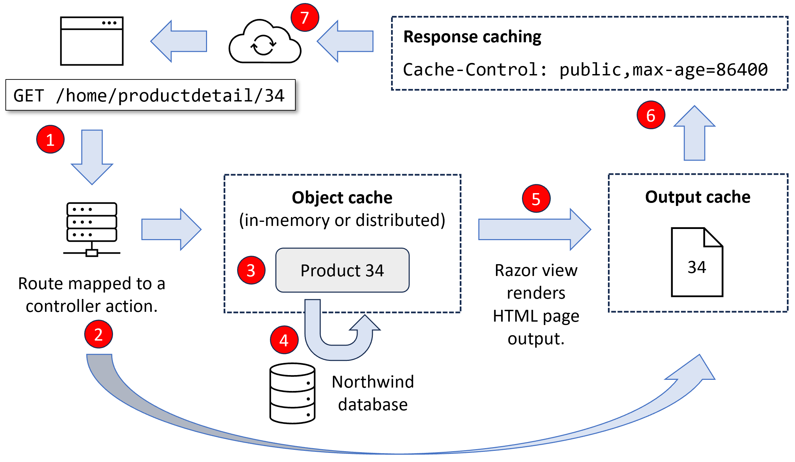

# Improving performance and scalability using caching

- [Improving performance and scalability using caching](#improving-performance-and-scalability-using-caching)
  - [Caching HTTP responses](#caching-http-responses)
  - [Output caching endpoints](#output-caching-endpoints)
  - [Output caching MVC views](#output-caching-mvc-views)
  - [Varying cached data by query string](#varying-cached-data-by-query-string)
  - [Disabling caching to avoid confusion](#disabling-caching-to-avoid-confusion)


*Figure 14.8* is a summary diagram of types and locations of caching:


*Figure 14.8: Types and locations for caching*

Let's review a scenario. The numbered bullets match the numbered labels in *Figure 14.8*:

1.	A web browser requests the product detail page for the product with an ID of 34.
2.	On the web server, the output caching system looks in the output cache to see if that web page already exists with a match on its route. If not, the request is mapped to the appropriate controller action method and the id value 34 is passed in.
3.	The action method implementation looks in the object cache to see if that entity already exists.
4.	If not, it is retrieved from the database and stored in the object cache. Using an object cache is covered in *Chapter 14, Building and Consuming Web Services*.
5.	The action method passes the product entity to the appropriate Razor view, which renders it into an HTML page and stores it in the output cache.
6.	The action method adds response caching headers to the response before returning it.
7.	Any intermediaries as well as the web browser can read the HTTP response headers and cache it if allowed.

On the next request, caching at various levels could improve matters:
1.	The web browser might have the page in its local cache due to response caching. No further action is required. If not, a request is made to the web server. If intermediaries like a content delivery network (CDN) were allowed to cache the response, then they could return it to the browser without needing to forward the request to the web server.
2.	If a request arrives at the web server, and the page is in the output cache, the action method processing can be bypassed, and, 6. the page is immediately returned with new response headers set.

## Caching HTTP responses

To improve response times and scalability, you might want to try to cache the HTTP response that is generated by an action method by decorating the method with the `[ResponseCache]` attribute. This tells intermediaries like CDNs and the web browser itself how long they should cache the response for by adding HTTP headers to the response. 

> **Good Practice**: Response caching is only advisory. You cannot force other systems to cache if you do not control them. Keep in mind that any response caching you configure could be ignored.

You indicate where the response should be cached and for how long by setting parameters in the `[ResponseCache]` attribute, as shown in the following list:
- `Duration`: In seconds. This sets the `max-age` HTTP response header measured in seconds. Common choices are one hour (3,600 seconds) and one day (86,400 seconds).
- `Location`: One of the `ResponseCacheLocation` values, `Any`, `Client`, or `None`. This sets the `cache-control` HTTP response header.
- `NoStore`: If `true`, this ignores `Duration` and `Location` and sets the `cache-control` HTTP response header to `no-store`.

Let's see an example:

1.	In `HomeController.cs`, add an attribute to the `Index` method to cache the response for 10 seconds on the browser or any proxies between the server and browser, as shown highlighted in the following code:
```cs
[ResponseCache(Duration = 10 /* seconds */,
  Location = ResponseCacheLocation.Any)]
public IActionResult Index()
```

2.	In `Views`, in `Home`, open `Index.cshtml`, and after the Welcome heading, add a paragraph to output the current time in long format to include seconds, as shown in the following markup:
```html
<p class="alert alert-primary">@DateTime.Now.ToLongTimeString()</p>
```

3.	Start the `Northwind.Mvc` website project using the `https` launch profile.
4.	Note the time on the home page.
5.	View **Developer Tools**, select the **Network** tab, select the **localhost** request, refresh the page, and note the `Cache-Control` response header, as shown in the following output:
```
Cache-Control: public,max-age=10
```

6.	Click **Register** so that you leave the home page.

> **Warning!** Do not click the **Reload the page** button as this will override the cache and refresh the page with a new request to the web server.

7.	Click **Home** and note the time on the home page is the same because a cached version of the page is used.
8.	Click **Register**. Wait at least 10 seconds.
9.	Click **Home** and note the time has now updated.
10.	Click **Log in**, enter your email and password, and then click **Log in**.
11.	Note the time on the home page.
12.	Click **Privacy**.
13.	Click **Home** and note the page is not cached.
14.	View the console and note the warning message explaining that your caching has been overridden because the visitor is logged in and, in this scenario, ASP.NET Core uses anti-forgery tokens and they should not be cached, as shown in the following output:
```
warn: Microsoft.AspNetCore.Antiforgery.DefaultAntiforgery[8]
      The 'Cache-Control' and 'Pragma' headers have been overridden and set to 'no-cache, no-store' and 'no-cache' respectively to prevent caching of this response. Any response that uses antiforgery should not be cached.
```
15.	Close Chrome and shut down the web server.

## Output caching endpoints

**Output caching** stores dynamically generated responses on the server so that they do not have to be regenerated again for another request. This can improve performance.

Let's see it in action with examples of applying output caching to some endpoints:

1.	In the `Northwind.Mvc` project, in `Program.cs`, add statements after the call to `AddNorthwindContext` to add the output cache middleware and override the default expiration timespan to make it only 10 seconds, as shown highlighted in the following code:
```cs
builder.Services.AddNorthwindContext();

builder.Services.AddOutputCache(options =>
{
  options.DefaultExpirationTimeSpan = TimeSpan.FromSeconds(10);
});
```

> **Good Practice**: The default expiration timespan is one minute. Think carefully about what the duration should be based on your website's typical visitor behavior.

2.	In `Program.cs`, add statements before the call to map controllers to use the output cache, as shown highlighted in the following code:
```cs
app.UseOutputCache();

app.MapControllerRoute(
    name: “default”,
    pattern: “{controller=Home}/{action=Index}/{id?}”);
```

3.	In `Program.cs`, add statements after the call to map Razor Pages to create two endpoints that respond with plain text, one that is not cached and one that uses the output cache, as shown highlighted in the following code:
```cs
app.MapRazorPages();

app.MapGet(“/notcached”, () => DateTime.Now.ToString());
app.MapGet(“/cached”, () => DateTime.Now.ToString()).CacheOutput();
```

4.	In `appsettings.Development.json`, add a log level of `Information` for the output caching middleware, as shown highlighted in the following configuration:
```json
{
  “Logging”: {
    “LogLevel”: {
      “Default”: “Information”,
      “Microsoft.AspNetCore”: “Warning”,
      “Microsoft.AspNetCore.OutputCaching”: “Information”
    }
  }
}
```

5.	Start the `Northwind.Mvc` website project using the `https` launch profile.
6.	Arrange the browser and command prompt or terminal window so that you can see both.
7.	In the browser, make sure that you are not logged in to the MVC website because that would disable caching, then navigate to https://localhost:5141/notcached, and note nothing is written to the command prompt or terminal.
8.	In the browser, click the **Refresh** button several times and note that the time is always updated because it is not served from the output cache.
9.	In the browser, navigate to https://localhost:5141/cached, and note that messages are written to the console or terminal to tell you that you have made a request for a cached resource, but it does not have anything in the output cache, so it has now cached the output, as shown in the following output:
```
info: Microsoft.AspNetCore.OutputCaching.OutputCacheMiddleware[7]
      No cached response available for this request.
info: Microsoft.AspNetCore.OutputCaching.OutputCacheMiddleware[9]
      The response has been cached.
```

10.	In the browser, click the **Refresh** button several times and note that the time is not updated, and an output caching message tells you that the value was served from the cache, as shown in the following output:
```
info: Microsoft.AspNetCore.OutputCaching.OutputCacheMiddleware[5]
      Serving response from cache.
```

11.	Continue refreshing until 10 seconds have passed and note that messages are written to the command prompt or terminal to tell you that the cached output has been updated.
12.	Close the browser and shut down the web server.

## Output caching MVC views

Now let's see how we can output cache an MVC view:
1.	In the `Views\Home` folder, in `ProductDetail.cshtml`, add a paragraph `<p>` to show the current time, as shown highlighted in the following markup:
```html
<h2>Product Detail</h2>
<p class="alert alert-success">@DateTime.Now.ToLongTimeString()</p>
```

2.	Start the `Northwind.Mvc` website project using the `https` launch profile.
3.	Arrange the browser and command prompt or terminal window so that you can see both.
4.	On the home page, scroll down and then select one of the products.
5.	On the product detail page, note the current time, and then refresh the page and note that the time updates every second.
6.	Close the browser and shut down the web server.
7.	In `Program.cs`, at the end of the call to map controllers, add a call to the `CacheOutput` method, as shown highlighted in the following code:
```cs
app.MapControllerRoute(
    name: "default",
    pattern: "{controller=Home}/{action=Index}/{id?}")
  .CacheOutput();
```

8.	Start the `Northwind.Mvc` website project using the `https` launch profile and arrange the browser window and command prompt or terminal window so that you can see both.
9.	On the home page, scroll down, select one of the products, and note that the product detail page is not in the output cache, so SQL commands are executed to get the data. Then, once the Razor view generates the page, it is stored in the cache, as shown in the following output:
```
info: Microsoft.AspNetCore.OutputCaching.OutputCacheMiddleware[7]
      No cached response available for this request.
dbug: 20/09/2022 17:23:02.402 RelationalEventId.CommandExecuting[20100] (Microsoft.EntityFrameworkCore.Database.Command)

      Executing DbCommand [Parameters=[@__id_0='?' (DbType = Int32)], CommandType='Text', CommandTimeout='30']
      SELECT "p"."ProductId", "p"."CategoryId", "p"."Discontinued", "p"."ProductName", "p"."QuantityPerUnit", "p"."ReorderLevel", "p"."SupplierId", "p"."UnitPrice", "p"."UnitsInStock", "p"."UnitsOnOrder", "c"."CategoryId", "c"."CategoryName", "c"."Description", "c"."Picture"
      FROM "Products" AS "p"
      LEFT JOIN "Categories" AS "c" ON "p"."CategoryId" = "c"."CategoryId"
      WHERE "p"."ProductId" = @__id_0
      LIMIT 2
info: Microsoft.EntityFrameworkCore.Database.Command[20101]
      Executed DbCommand (7ms) [Parameters=[@__id_0='?' (DbType = Int32)], CommandType='Text', CommandTimeout='30']
      SELECT "p"."ProductId", "p"."CategoryId", "p"."Discontinued", "p"."ProductName", "p"."QuantityPerUnit", "p"."ReorderLevel", "p"."SupplierId", "p"."UnitPrice", "p"."UnitsInStock", "p"."UnitsOnOrder", "c"."CategoryId", "c"."CategoryName", "c"."Description", "c"."Picture"
      FROM "Products" AS "p"
      LEFT JOIN "Categories" AS "c" ON "p"."CategoryId" = "c"."CategoryId"
      WHERE "p"."ProductId" = @__id_0
      LIMIT 2
info: Microsoft.AspNetCore.OutputCaching.OutputCacheMiddleware[9]
      The response has been cached.
```

10.	On the product detail page, note the current time, and then refresh the page and note that the whole page, including the time and product detail data, is served from the output cache, as shown in the following output:
```
info: Microsoft.AspNetCore.OutputCaching.OutputCacheMiddleware[5]
      Serving response from cache.
```

11.	Keep refreshing until 10 seconds have passed and note that the page is then regenerated from the database and the current time is shown.
12.	In the browser address bar, change the product ID number to a value between 1 and 77 to request a different product, and note that the time is current, and therefore a new cached version has been created for that product ID, because the ID is part of the relative path.
13.	Refresh the browser and note the time is cached (and therefore the whole page is).
14.	In the browser address bar, change the product ID number to a value between 1 and 77 to request a different product, and note that the time is current, and therefore a new cached version has been created for that product ID, because the ID is part of the relative path.
15.	In the browser address bar, change the product ID number back to the previous ID and note the page is still cached with the time that the previous page was first added to the output cache.
16.	Close the browser and shut down the web server.

## Varying cached data by query string

If a value is different in the relative path, then output caching automatically treats the request as a different resource and so caches different copies for each, including differences in any query string parameters. Consider the following URLs:
- https://localhost:5141/Home/ProductDetail/12 
- https://localhost:5141/Home/ProductDetail/29
- https://localhost:5141/Home/ProductDetail/12?color=red
- https://localhost:5141/Home/ProductDetail/12?color=blue

All four requests will have their own cached copy of their own page. If the query string parameters have no effect on the generated page, then that is a waste.

Let's see how we can fix this problem. We will start by disabling varying the cache by query string parameter values, and then implement some page functionality that uses a query string parameter:

1.	In `Program.cs`, in the call to `AddOutputCache`, increase the default expiration to 20 seconds (or set a larger value to give yourself more time later) and add a statement to define a named policy to disable varying by query string parameters, as shown highlighted in the following code:
```cs
builder.Services.AddOutputCache(options =>
{
  options.DefaultExpirationTimeSpan = TimeSpan.FromSeconds(20);
  options.AddPolicy("views", p => p.SetVaryByQuery(""));
});
```

2.	In `Program.cs`, in the call to `CacheOutput` for MVC, specify the named policy, as shown in the following code:
```cs
app.MapControllerRoute(
    name: "default",
    pattern: "{controller=Home}/{action=Index}/{id?}")
  .CacheOutput(policyName: "views");
```

3.	In `ProductDetail.cshtml`, modify the `<p>` that outputs the current time to set its alert style based on a value stored in the `ViewData` dictionary, as shown highlighted in the following markup:
```html
<p class="alert alert-@ViewData["alertstyle"]">
  @DateTime.Now.ToLongTimeString()</p>
```

4.	In the `Controllers` folder, in `HomeController.cs`, in the `ProductDetail` action method, store a query string value in the `ViewData` dictionary, as shown in the following code:
```cs
public IActionResult ProductDetail(int? id, 
  string alertstyle = "success")
{
  ViewData["alertstyle"] = alertstyle;
```

5.	Start the `Northwind.Mvc` website project using the `https` launch profile.
6.	Arrange the browser and command prompt or terminal window so that you can see both.
7.	On the home page, scroll down, select one of the products, and note the color of the alert is green because the `alertstyle` defaults to `success`.
8.	In the browser address bar, append a query string parameter, `?alertstyle=warning`, and note that it is ignored, because the same cached page is returned.
9.	In the browser address bar, change the product ID number to a value between 1 and 77 to request a different product and append a query string parameter, `?alertstyle=warning`. Note that the alert is yellow because it is treated as a new request.
10.	In the browser address bar, append a query string parameter, `?alertstyle=info`, and note that it is ignored, because the same cached page is returned.
11.	Close the browser and shut down the web server.
12.	In `Program.cs`, in the call to `AddOutputCache`, in the call to `AddPolicy`, set `alertstyle` as the only named parameter to vary by for query string parameters, as shown highlighted in the following code:
```cs
builder.Services.AddOutputCache(options =>
{
  options.DefaultExpirationTimeSpan = TimeSpan.FromSeconds(20);
  options.AddPolicy("views", p => p.SetVaryByQuery("alertstyle"));
});
```

13.	Start the `Northwind.Mvc` website project using the `https` launch profile.
14.	Repeat the steps above to confirm that requests for different alertstyle values do have their own cached copies but any other query string parameter would be ignored.
15.	Close the browser and shut down the web server.

## Disabling caching to avoid confusion

Before we continue, let's disable view output caching otherwise you are likely to be confused by the website behavior if or when you forget caching is enabled!

1.	In `Program.cs`, disable the output caching by commenting out the call to `CacheOutput`, as shown highlighted in the following code:
```cs
app.MapControllerRoute(
    name: "default",
    pattern: "{controller=Home}/{action=Index}/{id?}");
//  .CacheOutput(policyName: "views");
```
2.	Save the changes.

