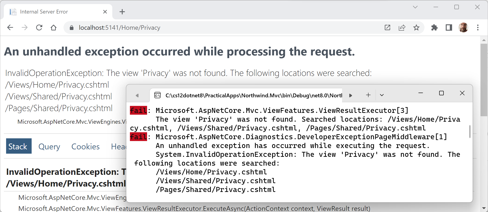

**Building Websites Using the Model-View-Controller Pattern**

This chapter is about building websites with a modern HTTP architecture on the server side using ASP.NET Core MVC, including the configuration, authentication, authorization, routes, request and response pipeline, models, views, and controllers that make up an ASP.NET Core MVC project.

This chapter will cover the following topics:

- [Setting up an ASP.NET Core MVC website](#setting-up-an-aspnet-core-mvc-website)
  - [Creating an ASP.NET Core MVC website](#creating-an-aspnet-core-mvc-website)
  - [Creating the authentication database for SQL Server LocalDB](#creating-the-authentication-database-for-sql-server-localdb)
  - [Changing the port numbers and starting the website](#changing-the-port-numbers-and-starting-the-website)
  - [Exploring visitor registration](#exploring-visitor-registration)
  - [Reviewing an MVC website project structure](#reviewing-an-mvc-website-project-structure)
  - [Reviewing the ASP.NET Core Identity database](#reviewing-the-aspnet-core-identity-database)
- [Exploring an ASP.NET Core MVC website](#exploring-an-aspnet-core-mvc-website)
  - [ASP.NET Core MVC initialization](#aspnet-core-mvc-initialization)
  - [The default MVC route](#the-default-mvc-route)
  - [Controllers and actions](#controllers-and-actions)
  - [The ControllerBase class](#the-controllerbase-class)
  - [The Controller class](#the-controller-class)
  - [The responsibilities of a controller](#the-responsibilities-of-a-controller)
  - [The view search path convention](#the-view-search-path-convention)
  - [Logging using the dependency service](#logging-using-the-dependency-service)
  - [Using entity and view models](#using-entity-and-view-models)
  - [Implementing views](#implementing-views)
  - [How cache busting with Tag Helpers works](#how-cache-busting-with-tag-helpers-works)


# Setting up an ASP.NET Core MVC website

ASP.NET Core Razor Pages are good for simple websites. For more complex websites, it would be better to have a more formal structure to manage that complexity.

This is where the **Model-View-Controller (MVC)** design pattern is useful. It uses technologies like Razor syntax, but allows a cleaner separation between technical concerns, as shown in the following list:

- **Models**: Classes that represent the data entities and view models used on the website.
- **Views**: *Razor View* files, that is, `.cshtml` files, that render data in view models into HTML web pages. *Razor Views* are different from *Razor Pages* but they share the same file extension `.cshtml`. When creating a Razor Page, it must have the `@page` directive at the top of its file. When creating a *Razor View*, you must *not* use the `@page` directive! If you do, the controller will not pass the model and it will be `null`, throwing a `NullReferenceException` when you try to access any of its members.
- **Controllers**: Classes that execute code when an HTTP request arrives at the web server. The controller methods usually instantiate a view model and pass that to a view to generate an HTTP response. This is returned to the web browser or other client that made the original request.

The best way to understand using the MVC design pattern is to see a working example.

## Creating an ASP.NET Core MVC website

You will use a project template to create an ASP.NET Core MVC website project that has a database for authenticating and authorizing users. Visual Studio 2022 defaults to using SQL Server LocalDB for the accounts database. Visual Studio Code (or more accurately the dotnet CLI tool) uses SQLite by default and you can specify a switch to use SQL Server LocalDB instead.

Let's see it in action:

1.	Use your preferred code editor to open the `PracticalApps` solution.
2.	Add an MVC website project with authentication accounts stored in a database, as defined in the following list:
    - Project template: **ASP.NET Core Web App (Model-View-Controller)** [C#] / `mvc`.
    - Project file and folder: `Northwind.Mvc`.
    - Solution file and folder: `PracticalApps`.
    - **Authentication type**: Individual Accounts / `--auth Individual`.
    - For Visual Studio 2022, leave all other options as their defaults, for example, HTTPS is enabled, and Docker is disabled.
    - For Visual Studio Code, in the `PracticalApps` solution folder, use: `dotnet new mvc --auth Individual -o Northwind.Mvc` and then `dotnet sln add Northwind.Mvc`.
    - For JetBrains Rider, right-click the `PracticalApps` solution, navigate to **Add** | **New Project…**, in the **New Project** dialog box, select **ASP.NET Core Web Application**, for **Type**, select **Web App (Model-View-Controller)**, and for **Auth**, select **Individual authentication**, and then click **Create**.
3.	Build the `Northwind.Mvc` project.
4.	At the command prompt or terminal, use the `--help` switch to see other options for this project template, as shown in the following command:
```
dotnet new mvc --help
```

5.	Note the results, as shown in the following partial output:
```
ASP.NET Core Web App (Model-View-Controller) (C#)
Author: Microsoft
Description: A project template for creating an ASP.NET Core application with example ASP.NET Core MVC Views and Controllers. This template can also be used for RESTful HTTP services.
```

There are many options, especially related to authentication, as shown in *Table 14.1*:

Switches|Description
---|---
`-au` or `--auth`|The type of authentication to use:<br/>`None` (default): This choice also allows you to disable HTTPS.<br/>`Individual`: Individual authentication that stores registered users and their passwords in a database (SQLite by default). We will use this in the project we create for this chapter.<br/>`IndividualB2C`: Individual authentication with Azure AD B2C.<br/>`SingleOrg`: Organizational authentication for a single tenant.<br/>`MultiOrg`: Organizational authentication for multiple tenants.<br/>`Windows`: Windows authentication. Mostly useful for intranets.
`-uld` or `--use-local-db`|Whether to use SQL Server LocalDB instead of SQLite. This option only applies if `--auth Individual` or `--auth IndividualB2C` is specified. The value is an optional bool with a default of `false`.
`-rrc` or `--razor-runtime-compilation`|Determines if the project is configured to use Razor runtime compilation in `Debug` builds. This can improve the performance of the startup process during debugging because it can defer the compilation of Razor views. The value is an optional bool with a default of `false`.
`-f` or `--framework`|The target framework for the project. Values can be `net8.0` (default), `net7.0`, or `net6.0`. Older versions are no longer supported.

*Table 14.1: Additional switches for the dotnet new mvc project template*

## Creating the authentication database for SQL Server LocalDB

If you created the MVC project using Visual Studio 2022, or you used `dotnet new mvc` with the `-uld` or `--use-local-db` switch, then the database for authentication and authorization will be stored in SQL Server LocalDB. But the database does not yet exist.

If you created the MVC project using `dotnet new` or JetBrains Rider, then the database for authentication and authorization will be stored in SQLite and the file has already been created, named `app.db`.

The connection string for the authentication database is named `DefaultConnection` and it is stored in the `appsettings.json` file in the root folder for the MVC website project.

For SQLite, see the following setting:
```json
{
  "ConnectionStrings": {
    "DefaultConnection": "DataSource=app.db;Cache=Shared"
  },
```

If you created the MVC project using Visual Studio 2022 only, then let's create its authentication database now by following a few simple steps:

1.	In the `Northwind.Mvc` project, in `appsettings.json`, note the database connection string named `DefaultConnection`, as shown in the following configuration:
```json
{
  "ConnectionStrings": {
    "DefaultConnection": "Server=(localdb)\\mssqllocaldb;Database=aspnet-Northwind.Mvc-440bc3c1-f7e7-4463-99d5-896b6a6500e0;Trusted_Connection=True;MultipleActiveResultSets=true"
  },
  "Logging": {
    "LogLevel": {
      "Default": "Information",
      "Microsoft.AspNetCore": "Warning"
    }
  },
  "AllowedHosts": "*"
}
```

> Your database name will use the pattern `aspnet-<ProjectName>-<GUID>` and have a different GUID value from the example above.

2.	At a command prompt or terminal, in the `Northwind.Mvc` folder, enter the command to run database migrations so that the database used to store credentials for authentication is created, as shown in the following command:
```
dotnet ef database update
```

3.	Note the database is created with tables like `AspNetRoles`, as shown in the following partial output:
```
Build started...
Build succeeded.
info: Microsoft.EntityFrameworkCore.Infrastructure[10403]
      Entity Framework Core 8.0.0 initialized 'ApplicationDbContext' using provider 'Microsoft.EntityFrameworkCore.SqlServer:8.0.0' with options: None
info: Microsoft.EntityFrameworkCore.Database.Command[20101]
      Executed DbCommand (129ms) [Parameters=[], CommandType='Text', CommandTimeout='60']
      CREATE DATABASE [aspnet-Northwind.Mvc2-440bc3c1-f7e7-4463-99d5-896b6a6500e0];
...
info: Microsoft.EntityFrameworkCore.Database.Command[20101]
      Executed DbCommand (3ms) [Parameters=[], CommandType='Text', CommandTimeout='30']
      CREATE TABLE [AspNetRoles] (
          [Id] nvarchar(450) NOT NULL,
          [Name] nvarchar(256) NULL,
          [NormalizedName] nvarchar(256) NULL,
          [ConcurrencyStamp] nvarchar(max) NULL,
          CONSTRAINT [PK_AspNetRoles] PRIMARY KEY ([Id])
      );
...
info: Microsoft.EntityFrameworkCore.Database.Command[20101]
      Executed DbCommand (8ms) [Parameters=[], CommandType='Text', CommandTimeout='30']
      INSERT INTO [__EFMigrationsHistory] ([MigrationId], [ProductVersion])
      VALUES (N'00000000000000_CreateIdentitySchema', N'8.0.0');
```

## Changing the port numbers and starting the website

Let's review the behavior of the default ASP.NET Core MVC website project template:

1.	In the `Northwind.Mvc` project, expand the `Properties` folder.
2.	In `launchSettings.json`, change the configured port numbers for the `https` profile, as shown highlighted in the following configuration:
```json
"applicationUrl": "https://localhost:5141;http://localhost:5140",
```

3.	Save the changes to the `launchSettings.json` file.
4.	Start the Northwind.Mvc website using the `https` launch profile:
    - If you are using Visual Studio 2022, then in the toolbar, select the **https** profile, select **Google Chrome** as the **Web Browser**, and then start the project without debugging.
    - If you are using Visual Studio Code, then enter the command to start the project with the `https` launch profile, as shown in the following command: `dotnet run --launch-profile https`, and then start Chrome.
5.	In Chrome, open **Developer Tools**.
6.	Navigate to http://localhost:5140/ and note the following, as shown in *Figure 14.1*:

    - Requests for HTTP on port 5140 are automatically redirected to HTTPS on port 5141.
    - The top navigation menu with links to **Home**, **Privacy**, **Register**, and **Login**. If the viewport width is 575 pixels or less, then the navigation collapses into a hamburger menu.
    - The title of the website, **Northwind.Mvc**, shown in the header and footer:


*Figure 14.1: The ASP.NET Core MVC project template website home page*

7.	Leave the browser running.

## Exploring visitor registration

By default, passwords must have at least one non-alphanumeric character, at least one digit (0-9), and at least one uppercase letter (A-Z). I use Pa$$w0rd in scenarios like this when I am just exploring.

The MVC project template follows best practices for **double-opt-in (DOI)**, meaning that after filling in an email and password to register, an email is sent to the email address, and the visitor must click a link in that email to confirm that they want to register.

We have not yet configured an email provider to send that email, so we must simulate that step:

1.	In Chrome, close the **Developer Tools** pane.
2.	In the top navigation menu, click **Register**.
3.	Enter an email and password, and then click the **Register** button. (I used `test@example.com` and `Pa$$w0rd`.)
4.	On the **Register confirmation** page, click the link with the text **Click here to confirm your account** and note that you are redirected to a **Confirm email** page that you could customize. By default, the **Confirm email** page just says **Thank you for confirming your email**.
5.	In the top navigation menu, click **Login**, enter your email and password (note that there is an optional checkbox to remember you, and there are links if the visitor has forgotten their password or they want to register as a new visitor), and then click the **Log in** button.
6.	In the top navigation menu, click your email address. This will navigate to an account management page. Note that you can set a phone number, change your email address, change your password, enable two-factor authentication (if you add an authenticator app), and download and delete your personal data. This last feature is good for compliance with legal regulations like the European GDPR.
7.	Close Chrome and shut down the web server.

## Reviewing an MVC website project structure

In your code editor, set the option to show all files for a solution:
- In Visual Studio 2022, in **Solution Explorer**, toggle on **Show All Files**.
- In JetBrains Rider, hover your mouse in the **Solution** pane and click the eyeball icon.

Review the folder structure of an MVC website project. We will look in more detail at some of these parts later, but for now, note the following:

- `Areas`: This folder contains nested folders and a file needed to integrate your website project with **ASP.NET Core Identity**, which is used for authentication.
- `bin`, `obj`: These folders contain temporary files needed during the build process and the compiled assemblies for the project.
- `Controllers`: This folder contains C# classes that have methods (known as actions) that fetch a model and pass it to a view, for example, `HomeController.cs`.
- `Data`: This folder contains Entity Framework Core migration classes used by the ASP.NET Core Identity system to provide data storage for authentication and authorization, for example, `ApplicationDbContext.cs`.
- `Models`: This folder contains C# classes that represent all of the data gathered together by a controller and passed to a view, for example, `ErrorViewModel.cs`.
- `Properties`: This folder contains a configuration file for IIS or IIS Express on Windows and for launching the website during development named `launchSettings.json`. This file is only used on the local development machine and is not deployed to your production website.
- `Views`: This folder contains the `.cshtml` Razor files that combine HTML and C# code to dynamically generate HTML responses. The `_ViewStart.cshtml` file sets the default layout and `_ViewImports.cshtml` imports common namespaces used in all views like tag helpers:
    - `Home`: This subfolder contains Razor files for the home and privacy pages.
    - `Shared`: This subfolder contains Razor files for the shared layout, an error page, and two partial views for logging in and validation scripts.
- `wwwroot`: This folder contains static content used by the website, such as CSS for styling, libraries of JavaScript, JavaScript for this website project, and a `favicon.ico` file. You also put images and other static file resources like PDF documents in here. The project template includes Bootstrap and jQuery libraries.
- `app.db`: This is the SQLite database that stores registered visitors. (If you used SQL Server LocalDB, then it will not be needed.)
- `appsettings.json` and `appsettings.Development.json`: These files contain settings that your website can load at runtime, for example, the database connection string for the ASP.NET Core Identity system and logging levels.
- `Northwind.Mvc.csproj`: This file contains project settings like the use of the web .NET SDK, an entry for SQLite to ensure that the `app.db` file is copied to the website's output folder, and a list of NuGet packages that your project requires, including EF Core and ASP.NET Core Identity packages.
- `Northwind.Mvc.csproj.user`: This file contains Visual Studio 2022 session settings for remembering options. For example, which launch profile was selected, like `https`. Visual Studio 2022 hides this file, and it should not normally be included in source code control because it is specific to an individual developer.
- `Program.cs`: This file defines a hidden `Program` class that contains the `<Main>$` entry point. It builds a pipeline for processing incoming HTTP requests and hosts the website using default options like configuring the Kestrel web server and loading app settings. It adds and configures services that your website needs, for example, ASP.NET Core Identity for authentication, SQLite or SQL Server for identity data storage, and so on, and routes for your application.

## Reviewing the ASP.NET Core Identity database

Open `appsettings.json` to find the connection string used for the ASP.NET Core Identity database, as shown for SQL Server LocalDB in the following markup:
```json
{
  "ConnectionStrings": {
    "DefaultConnection": "Server=(localdb)\\mssqllocaldb;Database=aspnet-Northwind.Mvc-2F6A1E12-F9CF-480C-987D-FEFB4827DE22;Trusted_Connection=True;MultipleActiveResultSets=true"
  },
  "Logging": {
    "LogLevel": {
      "Default": "Information",
      "Microsoft.AspNetCore": "Warning"
    }
  },
  "AllowedHosts": "*"
}
```

If you used SQL Server LocalDB for the identity data store, then you can use **Server Explorer** to connect to the database. You can copy and paste the connection string from the `appsettings.json` file. Remember to remove the second backslash between `(localdb)` and `mssqllocaldb`. 

If you installed an SQLite tool such as SQLiteStudio, then you can open the SQLite `app.db` database file.

You can then see the tables that the ASP.NET Core Identity system uses to register users and roles, including the `AspNetUsers` table used to store the registered visitor, as shown in *Figure 14.2*:
 

*Figure 14.2: AspNetUsers table with the registered user*

# Exploring an ASP.NET Core MVC website

Let's walk through the parts that make up a modern ASP.NET Core MVC website.

> .NET 5 and earlier ASP.NET Core project templates used both a `Program` class and a `Startup` class to separate initialization and configuration, but with .NET 6 and later, Microsoft encourages putting everything in a single `Program.cs` file.

> **Good Practice**: I recommend adding `#region` blocks to make it clear what goes where in your `Program.cs` file.

## ASP.NET Core MVC initialization

Appropriately enough, we will start by exploring the MVC website's default initialization and configuration:

1.	In `Program.cs`, note that it can be divided into four important sections from top to bottom. As you review the sections, you might want to add regions to remind yourself of what each section is used for.
2.	The first section imports some namespaces, as shown in the following code:
```cs
#region Import namespaces
using Microsoft.AspNetCore.Identity; // To use IdentityUser.
using Microsoft.EntityFrameworkCore; // To use UseSqlServer method.
using Northwind.Mvc.Data; // To use ApplicationDbContext.
#endregion
```

> Remember that, by default, many other namespaces are imported using the implicit usings feature of .NET 6 and later. Build the project and then the globally imported namespaces can be found in the following file: `obj\Debug\net8.0\Northwind.Mvc.GlobalUsings.g.cs`.

3.	The second section creates and configures a web host builder that does the following:
    - Registers an application database context using SQL Server or SQLite. The database connection string is loaded from the `appsettings.json` file.
    - Adds ASP.NET Core Identity for authentication and configures it to use the application database.
    - Adds support for MVC controllers with views, as shown in the following code:
```cs
#region Configure the host web server including services

var builder = WebApplication.CreateBuilder(args);

// Add services to the container.
var connectionString = builder.Configuration
  .GetConnectionString("DefaultConnection") ??
  throw new InvalidOperationException(
    "Connection string 'DefaultConnection' not found.");

builder.Services.AddDbContext<ApplicationDbContext>(options =>
  options.UseSqlServer(connectionString)); // Or UseSqlite.

builder.Services.AddDatabaseDeveloperPageExceptionFilter();

builder.Services.AddDefaultIdentity<IdentityUser>(options => 
  options.SignIn.RequireConfirmedAccount = true)
  .AddEntityFrameworkStores<ApplicationDbContext>();

builder.Services.AddControllersWithViews();

var app = builder.Build();

#endregion
```

The `builder` object has two commonly used objects, `Configuration` and `Services`:
- `Configuration` contains merged values from all the places you could set configuration: `appsettings.json`, environment variables, command-line arguments, and so on.
- `Services` is a collection of registered dependency services.
The call to `AddDbContext` is an example of registering a dependency service. ASP.NET Core implements the dependency injection (DI) design pattern so that other components like controllers can request needed services through their constructors. Developers register those services in this section of `Program.cs` (or if using a `Startup` class then in its `ConfigureServices` method).

4.	The third section configures the HTTP pipeline through which requests and responses flow in and out. It configures a relative URL path to run database migrations if the website runs in development, or a friendlier error page and HSTS for production. HTTPS redirection, static files, routing, and ASP.NET Identity are enabled, and an MVC default route and Razor Pages are configured, as shown in the following code:
```cs
#region Configure the HTTP request pipeline.

if (app.Environment.IsDevelopment())
{
  app.UseMigrationsEndPoint();
}
else
{
  app.UseExceptionHandler("/Home/Error");
  // The default HSTS value is 30 days. You may want to change this for production scenarios, see https://aka.ms/aspnetcore-hsts.
  app.UseHsts();
}

app.UseHttpsRedirection();
app.UseStaticFiles();

app.UseRouting();

app.UseAuthorization();

app.MapControllerRoute(
  name: "default",
  pattern: "{controller=Home}/{action=Index}/{id?}");

app.MapRazorPages();

#endregion
```

We learned about most of these methods and features in Chapter 13, Building Websites Using ASP.NET Core Razor Pages.

> **Good Practice**: What does the extension method `UseMigrationsEndPoint` do? You could read the official documentation, but it does not help much. For example, it does not tell us what relative URL path it defines by default: https://learn.microsoft.com/en-us/dotnet/api/microsoft.aspnetcore.builder.migrationsendpointextensions.usemigrationsendpoint. Luckily, ASP.NET Core is open source, so we can read the source code and discover what it does, at the following link: https://github.com/dotnet/aspnetcore/blob/main/src/Middleware/Diagnostics.EntityFrameworkCore/src/MigrationsEndPointOptions.cs#L18. Get into the habit of exploring the source code for ASP.NET Core to understand how it works.

Apart from the `UseAuthorization` method, the most important new method in this section of `Program.cs` is `MapControllerRoute`, which maps a default route for use by MVC. This route is very flexible because it will map to almost any incoming URL, as you will see in the next topic.

> *Warning!* Although we will not create any Razor Pages in this chapter, we need to leave the method call that maps Razor Page support because our MVC website uses ASP.NET Core Identity for authentication and authorization, and it uses a Razor Class Library for its user interface components, like visitor registration and login.

5.	The fourth and final section has a thread-blocking method call that runs the website and waits for incoming HTTP requests to respond to, as shown in the following code:
```cs
#region Start the host web server listening for HTTP requests.

app.Run(); // This is a blocking call.

#endregion
```

## The default MVC route

The responsibility of a route is to discover the name of a controller class to instantiate and an action method to execute, with an optional id parameter to pass into the method that will generate an HTTP response.

A default route is configured for MVC, as shown in the following code:
```cs
endpoints.MapControllerRoute(
  name: "default",
  pattern: "{controller=Home}/{action=Index}/{id?}");
```
The route pattern has parts in curly brackets `{}` called **segments**, and they are like named parameters of a method. The value of these segments can be any `string`. Segments in URLs are not case-sensitive.

The route pattern looks at any URL path requested by the browser and matches it to extract the name of a `controller`, the name of an `action`, and an optional `id` value (the `?` symbol makes it optional).

If the user hasn't entered these names, it uses the defaults of `Home` for the `controller` and `Index` for the `action` (the `=` assignment sets a default for a named segment).

*Table 14.2* contains example URLs and how the default route would work out the names of a controller and action:

URL|Controller|Action|ID
---|---|---|---
/|Home|Index|
/Muppet|Muppet|Index|
/Muppet/Kermit|Muppet|Kermit|
/Muppet/Kermit/Green|Muppet|Kermit|Green
/Products|Products|Index|
/Products/Detail|Products|Detail|
/Products/Detail/3|Products|Detail|3

*Table 14.2: Example URLs mapped via the default route*

## Controllers and actions

In MVC, the C stands for *controller*. From the route and an incoming URL, ASP.NET Core knows the name of the controller, so it will then look for a class that is decorated with the `[Controller]` attribute or derives from a class decorated with that attribute, for example, the Microsoft-provided class named `ControllerBase`, as shown in the following code:
```cs
namespace Microsoft.AspNetCore.Mvc
{
  //
  // Summary:
  // A base class for an MVC controller without view support.
  [Controller]
  public abstract class ControllerBase
  {
...
```

## The ControllerBase class

As you can see in the XML comment, `ControllerBase` does not support views. It is used for creating web services, as you will see in *Chapter 14, Building and Consuming Web Services*.

`ControllerBase` has many useful properties for working with the current HTTP context, as shown in *Table 14.3*:

Property|Description
---|---
`Request`|Just the HTTP request, for example, headers, query string parameters, the body of the request as a stream that you can read from, the content type and length, and cookies.
`Response`|Just the HTTP response, for example, headers, the body of the response as a stream that you can write to, the content type and length, status code, and cookies. There are also delegates like `OnStarting` and `OnCompleted` that you can hook a method up to.
`HttpContext`|Everything about the current HTTP context including the request and response, information about the connection, a collection of features that have been enabled on the server with middleware, and a `User` object for authentication and authorization.

*Table 14.3: Useful properties for working with the current HTTP context*

## The Controller class

Microsoft provides another class named `Controller` that your classes can inherit from if they need view support, as shown in the following code:
```cs
namespace Microsoft.AspNetCore.Mvc
{
  //
  // Summary:
  // A base class for an MVC controller with view support.
  public abstract class Controller : ControllerBase,
    IActionFilter, IFilterMetadata, IAsyncActionFilter, IDisposable
  {
...
```

`Controller` has many useful properties for working with views, as shown in *Table 14.4*:

Property|Description
---|---
`ViewData`|A dictionary in which the controller can store key/value pairs that is accessible in a view. The dictionary's lifetime is only for the current request/response.
`ViewBag`|A dynamic object that wraps `ViewData` to provide a friendlier syntax for setting and getting dictionary values. For example, `ViewBag.Greeting = "Hello";` instead of `ViewData["Greeting"] = "Hello";`.
`TempData`|A dictionary in which the controller can store key/value pairs that is accessible in a view. The dictionary's lifetime is for the current request/response and the next request/response for the same visitor session. This is useful for storing a value during an initial request, responding with a redirect, and then reading the stored value in the subsequent request.

*Table 14.4: Useful properties for working with views*

`Controller` has many useful methods for working with views, as shown in *Table 14.5*:

Method|Description
---|---
`View`|Returns a `ViewResult` after executing a view that renders a full response, for example, a dynamically generated web page. The view can be selected using a convention or be specified with a `string` name. A model can be passed to the view. For example, `return View("Index", model);`.
`PartialView`|Returns a `PartialViewResult` after executing a view that is part of a full response, for example, a dynamically generated chunk of HTML. The view can be selected using a convention or be specified with a string name. A model can be passed to the view.
`ViewComponent`|Returns a `ViewComponentResult` after executing a component that dynamically generates HTML. The component must be selected by specifying its type or its name. An object can be passed as an argument.
`Json`|Returns a `JsonResult` containing a JSON-serialized object. This can be useful for implementing a simple Web API as part of an MVC controller that primarily returns HTML for a human to view.

*Table 14.5: Useful methods for working with views*

> All the methods in *Table 14.5* return a type that implements `IActionResult`.

## The responsibilities of a controller

The responsibilities of a controller are as follows:
- Identify the services that the controller needs to be in a valid state and to function properly in their class constructor(s).
- Use the action name to identify a method to execute.
- Extract parameters from the HTTP request.
- Use the parameters to fetch any additional data needed to construct a view model and pass it to the appropriate view for the client. For example, if the client is a web browser, then a view that renders HTML would be most appropriate. Other clients might prefer alternative renderings, like document formats such as a PDF file or an Excel file, or data formats, like JSON or XML.
- Return the results from the view to the client as an HTTP response with an appropriate status code.

> **Good Practice**: Controllers should be thin, meaning they only perform the above-listed activities but do not implement any business logic. All business logic should be implemented in services that the controller calls when needed.

Let's review the controller used to generate the home, privacy, and error pages:

1.	Expand the `Controllers` folder.
2.	Open the file named `HomeController.cs`.
3.	Note, as shown in the following code, that:
    - Extra namespaces are imported, which I have added comments for to show which types they are needed for.
    - A private read-only field is declared to store a reference to a logger for the `HomeController` that is set in a constructor.
    - All three action methods call a method named `View` and return the results as an `IActionResult` interface to the client.
    - The `Error` action method passes a view model into its view with a request ID used for tracing. The error response will not be cached.
```cs
using Microsoft.AspNetCore.Mvc; // To use Controller, IActionResult.
using Northwind.Mvc.Models; // To use ErrorViewModel.
using System.Diagnostics; // To use Activity.

namespace Northwind.Mvc.Controllers;

public class HomeController : Controller
{
  private readonly ILogger<HomeController> _logger;

  public HomeController(ILogger<HomeController> logger)
  {
    _logger = logger;
  }

  public IActionResult Index()
  {
    return View();
  }

  public IActionResult Privacy()
  {
    return View();
  }

  [ResponseCache(Duration = 0,
    Location = ResponseCacheLocation.None, NoStore = true)]
  public IActionResult Error()
  {
    return View(new ErrorViewModel { RequestId = 
      Activity.Current?.Id ?? HttpContext.TraceIdentifier });
  }
}
```

> **Note:** If the visitor navigates to a path of `/` or `/Home`, then it is the equivalent of `/Home/Index` because those were the default names for the controller and action in the default route.

## The view search path convention

The `Index` and `Privacy` methods are identical in implementation, yet they return different web pages. This is because of conventions. The call to the `View` method looks in different paths for the Razor file to generate the web page.

Let's deliberately break one of the page names so that we can see the paths searched by default:

1.	In the `Northwind.Mvc` project, expand the `Views` folder and then the `Home` folder.
2.	Rename the `Privacy.cshtml` file to `Privacy2.cshtml`.
3.	Start the `Northwind.Mvc` website project using the `https` launch profile.
4.	Start Chrome, navigate to https://localhost:5141/, click **Privacy**, and note the paths that are searched for a view to render the web page (including in `Shared` folders for MVC views and Razor Pages) in the exception in both the browser and the command prompt or terminal output, as shown in *Figure 14.3*:

 
*Figure 14.3: An exception showing the default search path for views*

5.	Close Chrome and shut down the web server.
6.	Rename the `Privacy2.cshtml` file back to `Privacy.cshtml`.

You have now seen the view search path convention, as shown in the following list:
- Specific Razor view: `/Views/{controller}/{action}.cshtml`
- Shared Razor view: `/Views/Shared/{action}.cshtml`
- Shared Razor Page: `/Pages/Shared/{action}.cshtml`

Since `controller` was `Home` and `action` was `Privacy`, it there looked in the following three locations, as shown in the following list:
- Specific Razor view: `/Views/Home/Privacy.cshtml`
- Shared Razor view: `/Views/Shared/Privacy.cshtml`
- Shared Razor Page: `/Pages/Shared/Privacy.cshtml`

## Logging using the dependency service

You have just seen that some errors are caught and written to the console. You can write your own messages to the console in the same way by using the logger.

1.	In the `Controllers` folder, in `HomeController.cs`, in the `Index` method, add statements before the return statement to use the logger to write some messages of various levels to the console, as shown highlighted in the following code:
```cs
public IActionResult Index()
{
  _logger.LogError("This is a serious error (not really!)");
  _logger.LogWarning("This is your first warning!");
  _logger.LogWarning("Second warning!");
  _logger.LogInformation("I am in the Index method of the HomeController.");

  return View();
}
```

2.	Start the `Northwind.Mvc` website project using the `https` launch profile.
3.	Start Chrome and navigate to the home page for the website.
4.	At the command prompt or terminal, note the messages, as shown in the following output:
```
fail: Northwind.Mvc.Controllers.HomeController[0]
      This is a serious error (not really!)
warn: Northwind.Mvc.Controllers.HomeController[0]
      This is your first warning!
warn: Northwind.Mvc.Controllers.HomeController[0]
      Second warning!
info: Northwind.Mvc.Controllers.HomeController[0]
      I am in the Index method of the HomeController.
```

5.	Close Chrome and shut down the web server.

> **More Information**: You can learn a lot more about ASP.NET Core logging at the following link: https://learn.microsoft.com/en-us/aspnet/core/fundamentals/logging/.

## Using entity and view models

In MVC, the M stands for *model*. Models represent the data required to respond to a request. There are two types of models commonly used: entity models and view models.

**Entity models** represent entities in a database like SQL Server or SQLite. Based on the request, one or more entities might need to be retrieved from data storage. Entity models are defined using classes, since they might need to change and then be used to update the underlying data store.

All the data that we want to show in response to a request is the **MVC model**, sometimes called a **view model**, because it is a model that is passed into a view for rendering into a response format like HTML or JSON. View models should be immutable, so they are commonly defined using `record` types.

For example, the following HTTP `GET` request might mean that the browser is asking for the product details page for product number 3: http://www.example.com/products/details/3.

The controller would need to use the ID route value 3 to retrieve the entity for that product and pass it to a view that can then turn the model into HTML for display in a browser.

Imagine that when a user comes to our website, we want to show them a carousel of categories, a list of products, and a count of the number of visitors we have had this month.

We will reference the Entity Framework Core entity data model for the Northwind database that you created in *Chapter 12, Introducing Web Development Using ASP.NET Core*:

1.	In the `Northwind.Mvc` project, add a project reference to `Northwind.DataContext` for either SQLite or SQL Server, as shown in the following markup:
```xml
<ItemGroup>
  <!-- change Sqlite to SqlServer if you prefer -->
  <ProjectReference Include=
"..\Northwind.DataContext.Sqlite\Northwind.DataContext.Sqlite.csproj" />
</ItemGroup>
```

2.	If you are using SQL Server, then add a package reference for ADO.NET for SQL Server, as shown in the following markup:
```xml
<PackageReference
  Include="Microsoft.Data.SqlClient" Version="5.1.1" />
```

3.	Build the `Northwind.Mvc` project to compile its dependencies.
4.	If you are using SQL Server, or if you might want to switch to SQL Server from SQLite, then in `appsettings.json`, add a connection string for the Northwind database using SQL Server, as shown highlighted in the following markup:
```json
{
  "ConnectionStrings": {
    "DefaultConnection": "Server=(localdb)\\mssqllocaldb;Database=aspnet-Northwind.Mvc-DC9C4FAF-DD84-4FC9-B925-69A61240EDA7;Trusted_Connection=True;MultipleActiveResultSets=true",
    "NorthwindConnection": "Server=.;Database=Northwind;Integrated Security=True;MultipleActiveResultSets=true;TrustServerCertificate=true;"
  },
```

> Modify the connection string to match wherever your Northwind database is, for example, in Azure SQL Database in the cloud or Azure SQL Edge in Docker, for example. If you have to use SQL Server authentication, do not store the user and password in this file! You will set them from environment variables in code.

5.	In `Program.cs`, import the namespace to work with your entity model types, as shown in the following code:
```cs
using Northwind.EntityModels; // To use AddNorthwindContext method.
```

6.	Before the `builder.Build`` method call, add statements to load the appropriate connection string and then to register the Northwind database context, as shown in the following code:
```cs
// If you are using SQLite, default is "..\Northwind.db".
builder.Services.AddNorthwindContext();

/*
// If you are using SQL Server.
string? sqlServerConnection = builder.Configuration
  .GetConnectionString("NorthwindConnection");

if (sqlServerConnection is null)
{
  Console.WriteLine("SQL Server database connection string is missing!");
}
else
{
  // If you are using SQL Server authentication then disable
  // Windows Integrated authentication and set user and password.
  Microsoft.Data.SqlClient.SqlConnectionStringBuilder sql = 
    new(sqlServerConnection);

  sql.IntegratedSecurity = false;
  sql.UserID = Environment.GetEnvironmentVariable("MY_SQL_USR");
  sql.Password = Environment.GetEnvironmentVariable("MY_SQL_PWD");

  builder.Services.AddNorthwindContext(sql.ConnectionString);
}
*/
```

7.	In the `Models` folder, add a class file named `HomeIndexViewModel.cs`.

> **Good Practice**: Although the `ErrorViewModel` class created by the MVC project template does not follow this convention, I recommend that you use the naming convention `{controller}{action}ViewModel` for your view model classes.

8.	In `HomeIndexViewModel.cs`, add statements to define an immutable record that has three properties for a count of the number of visitors, and lists of categories and products, as shown in the following code:
```cs
using Northwind.EntityModels; // To use Category, Product.

namespace Northwind.Mvc.Models;

public record HomeIndexViewModel(int VisitorCount,
  IList<Category> Categories, IList<Product> Products);
```

9.	In `HomeController.cs`, import the `Northwind.EntityModels` namespace, as shown in the following code:
```cs
using Northwind.EntityModels; // To use NorthwindContext.
```

10.	Add a field to store a reference to a `NorthwindContext` instance and initialize it in the constructor, as shown highlighted in the following code:
```cs
public class HomeController : Controller
{
  private readonly ILogger<HomeController> _logger;
  private readonly NorthwindContext _db;

  public HomeController(ILogger<HomeController> logger,
    NorthwindContext db)
  {
    _logger = logger;
    _db = db;
  }
```

> ASP.NET Core will use constructor parameter injection to pass an instance of the `NorthwindContext` database context using the connection string you specified in `Program.cs`.

11.	In the `Index` action method, create an instance of the view model for this method, simulating a visitor count using the `Random` class to generate a number between 1 and 1,000, and using the Northwind database to get lists of categories and products and then pass the model to the view, as shown highlighted in the following code:
```cs
  HomeIndexViewModel model = new
  (
    VisitorCount: Random.Shared.Next(1, 1001),
    Categories: _db.Categories.ToList(),
    Products: _db.Products.ToList()
  );

  return View(model); // Pass the model to the view.
}
```

Remember the view search convention: when the `View` method is called in a controller's action method, ASP.NET Core MVC looks in the `Views` folder for a subfolder with the same name as the current controller, that is, `Home`. It then looks for a file with the same name as the current action, that is, `Index.cshtml`. It will also search for views that match the action method name in the `Shared` folder and for Razor Pages in the `Pages` folder.

## Implementing views

In MVC, the V stands for *view*. The responsibility of a view is to transform a model into HTML or other formats.

There are multiple **view engines** that could be used to do this. The default view engine is called Razor, and it uses the `@` symbol to indicate server-side code execution. The Razor Pages feature introduced with ASP.NET Core 2 uses the same view engine and so can use the same Razor syntax.

Let's modify the home page view to render the lists of categories and products:

1.	Expand the `Views` folder, and then expand the `Home` folder.
2.	In `Index.cshtml`, note the block of C# code wrapped in `@{ }`. This will execute first and can be used to store data that needs to be passed into a shared layout file, like the title of the web page, as shown in the following code:
```cs
@{
  ViewData["Title"] = "Home Page";
}
```

3.	Note the static HTML content in the `<div>` element that uses Bootstrap for styling.

> **Good Practice**: As well as defining your own styles, base your styles on a common library, such as Bootstrap, that implements responsive design.

Just as with Razor Pages, there is a file named `_ViewStart.cshtml` that gets executed by the `View` method. It is used to set defaults that apply to all views.

For example, it sets the `Layout` property of all views to a shared layout file, as shown in the following markup:
```cs
@{
  Layout = "_Layout";
}
```

4.	In the `Views` folder, in `_ViewImports.cshtml`, note that it imports some namespaces and then adds the ASP.NET Core tag helpers, as shown in the following code:
```cs
@using Northwind.Mvc 
@using Northwind.Mvc.Models
@addTagHelper *, Microsoft.AspNetCore.Mvc.TagHelpers
```

5.	In the `Shared` folder, open the `_Layout.cshtml` file.
6.	Note that the title is being read from the `ViewData` dictionary that was set earlier in the `Index.cshtml` view, as shown in the following markup:
```html
<title>@ViewData["Title"] – Northwind.Mvc</title>
```

7.	Note the rendering of links to support Bootstrap and a site stylesheet, where `~`` means the `wwwroot`` folder, as shown in the following markup:
```html
<link rel="stylesheet" 
  href="~/lib/bootstrap/dist/css/bootstrap.css" />
<link rel="stylesheet" href="~/css/site.css" />
```

> In *Chapter 13, Building Websites Using ASP.NET Core Razor Pages*, we used the public link to the Bootstrap website to reference version 5.3. The MVC project template uses a local copy of Bootstrap version 5.1. This might have been updated to a later version by the time you read this.

8.	Note the rendering of a navigation bar in the header, as shown in the following markup:
```html
<body>
  <header>
    <nav class="navbar ...">
```

9.	Note the rendering of a collapsible `<div>` containing a partial view for logging in, and hyperlinks to allow users to navigate between pages using ASP.NET Core tag helpers with attributes like asp-controller and asp-action, as shown in the following markup:
```html
<div class=
  "navbar-collapse collapse d-sm-inline-flex justify-content-between">
  <ul class="navbar-nav flex-grow-1">
    <li class="nav-item">
      <a class="nav-link text-dark" asp-area=""
        asp-controller="Home" asp-action="Index">Home</a>
    </li>
    <li class="nav-item">
      <a class="nav-link text-dark"
        asp-area="" asp-controller="Home" 
        asp-action="Privacy">Privacy</a>
    </li>
  </ul>
  <partial name="_LoginPartial" />
</div>
```

The `<a>` elements use tag helper attributes named `asp-controller` and `asp-action` to specify the controller name and action name that will execute when the link is clicked on. If you want to navigate to a feature in a Razor Class Library, like the employees component that you created in the previous chapter, then you use `asp-area` to specify the feature name.

10.	Note the rendering of the body inside the `<main>` element, as shown in the following markup:
```html
<div class="container">
  <main role="main" class="pb-3">
    @RenderBody()
  </main>
</div>
```

The `RenderBody` method injects the contents of a specific Razor view for a page like the `Index.cshtml` file at that point in the shared layout.

11.	Note the rendering of `<script>` elements at the bottom of the page so that it does not slow down the display of the page, and that you can add your own script blocks into an optional defined section named `scripts`, as shown in the following markup
```html
<script src="~/lib/jquery/dist/jquery.min.js"></script>
<script src="~/lib/bootstrap/dist/js/bootstrap.bundle.min.js">
</script>
<script src="~/js/site.js" asp-append-version="true"></script>
@await RenderSectionAsync("Scripts", required: false)
```

12.	In `_LoginPartial.cshtml`, note the log-in functionality is implemented using the ASP.NET Core Identity system as Razor Pages using an `asp-area` named `Identity`, as shown in the following markup:
```html
@using Microsoft.AspNetCore.Identity
@inject SignInManager<IdentityUser> SignInManager
@inject UserManager<IdentityUser> UserManager

<ul class="navbar-nav">
  @if (SignInManager.IsSignedIn(User))
  {
    <li class="nav-item">
      <a class="nav-link text-dark" asp-area="Identity" 
         asp-page="/Account/Manage/Index" title="Manage">
      Hello @User.Identity?.Name!</a>
    </li>
    <li class="nav-item">
      <form class="form-inline" asp-area="Identity" 
            asp-page="/Account/Logout" 
            asp-route-returnUrl="@Url.Action("Index", "Home", 
            new { area = "" })">
        <button type="submit" class="nav-link btn 
                btn-link text-dark">Logout</button>
      </form>
    </li>
  }
  else
  {
    <li class="nav-item">
      <a class="nav-link text-dark" asp-area="Identity" 
         asp-page="/Account/Register">Register</a>
    </li>
    <li class="nav-item">
      <a class="nav-link text-dark" asp-area="Identity" 
         asp-page="/Account/Login">Login</a>
    </li>
  }
</ul>
```

13.	In `_ValidationScriptsPartial.cshtml``, note this partial view has references to a pair of jQuery scripts for performing validation, as shown in the following markup:
```html
<script src="~/lib/jquery-validation/dist/jquery.validate.min.js"></script>
<script src="~/lib/jquery-validation-unobtrusive/jquery.validate.unobtrusive.min.js"></script>
```

> **Good Practice**: If you create a Razor View that uses a model with validation attributes like `[Required]` and `[StringLength]`, then add this partial view to the `Scripts` block to enable validation on the client side by the browser, as shown in the following markup:
```html
@section Scripts {
  <partial name="_ValidationScriptsPartial" />
}
```

## How cache busting with Tag Helpers works

When `asp-append-version` is specified with a `true` value in a `<link>`, ``, or `<script>` element, the Tag Helper for that tag type is invoked.

They work by automatically appending a query string value named `v` that is generated from a SHA256 hash of the referenced source file, as shown in the following example generated output:
```html
<script src="~/js/site.js? v=Kl_dqr9NVtnMdsM2MUg4qthUnWZm5T1fCEimBPWDNgM"></script>
```

You can see this for yourself in the current project because the `_Layout.cshtml` file has the `<script src="~/js/site.js" asp-append-version="true"></script>` element.
If even a single byte within the `site.js` file changes, then its hash value will be different, and therefore if a browser or CDN is caching the script file, then it will bust the cached copy and replace it with the new version.

The `src` attribute must be set to a static file stored on the local web server, usually in the `wwwroot` folder, but you can configure additional locations. Remote references are not supported.

