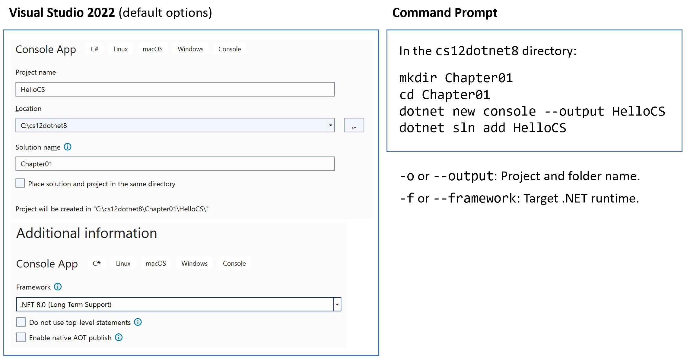
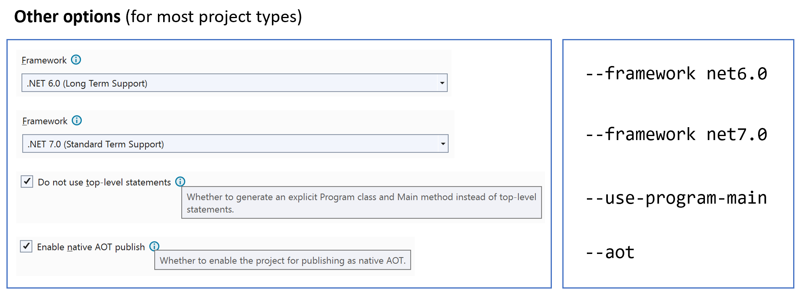
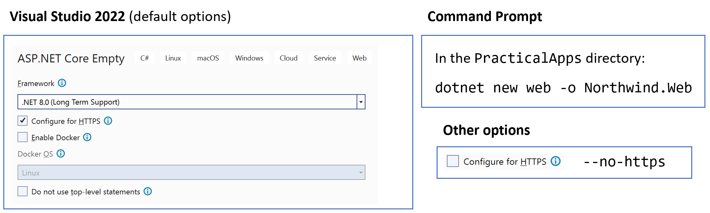
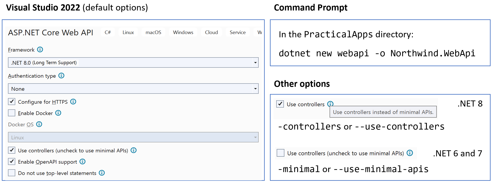
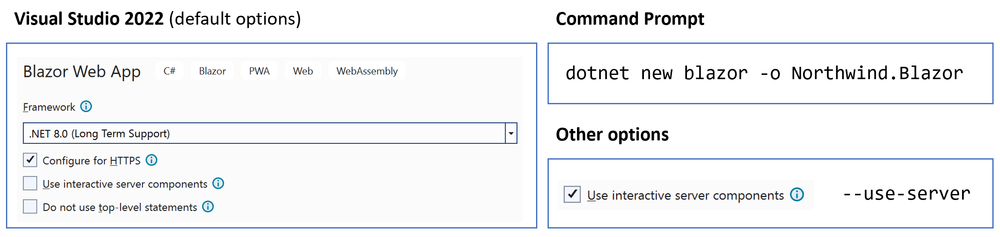
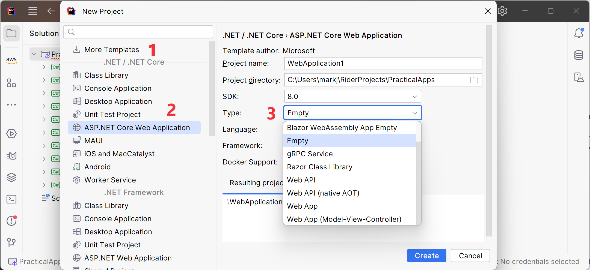

**Project Options**

When creating new project either using Visual Studio 2022 or using the command prompt for tools like Visual Studio Code, it is useful to see a summary of your options for common types of project template.

- [Console App / `console`](#console-app--console)
- [Class Library / `classlib`](#class-library--classlib)
- [ASP.NET Core Empty / `web`](#aspnet-core-empty--web)
- [ASP.NET Core Web App (Model-View-Controller) / `mvc`](#aspnet-core-web-app-model-view-controller--mvc)
- [ASP.NET Core Web API / `webapi`](#aspnet-core-web-api--webapi)
- [ASP.NET Core Web API (native AOT) / `webapiaot`](#aspnet-core-web-api-native-aot--webapiaot)
- [Blazor Web App / `blazor`](#blazor-web-app--blazor)
- [JetBrains Rider options](#jetbrains-rider-options)

# Console App / `console`

# Class Library / `classlib`

Create a .NET 8.0 class library:

`dotnet new classlib`

Create a .NET Standard 2.0 class library:

`dotnet new classlib --framework netstandard2.0`

# ASP.NET Core Empty / `web`

# ASP.NET Core Web App (Model-View-Controller) / `mvc`

This project template has the same options as **ASP.NET Core Empty** / `web`.

# ASP.NET Core Web API / `webapi`

> **Warning!** The .NET SDK 8 defaults to implementing services using Minimal APIs and you must use the `--use-controllers` or `-controllers` switch to implement services using controllers. The .NET SDK 6 or 7 defaults to implementing services using controllers and you must use the `--use-minimal-apis` or `-minimal` switch to implement services using Minimal APIs. JetBrains Rider does not yet have an option to "use controllers" so you should use the `dotnet new` command to create a Web API project if you need to use controllers.

# ASP.NET Core Web API (native AOT) / `webapiaot`

This project template always implements the service using Minimal APIs and only enables `http`.

# Blazor Web App / `blazor`

# JetBrains Rider options

All ASP.NET Core projects created from Chapter 13 onwards have a project template of **ASP.NET Core Web Application** and you select the **Type** to select between choices like **Empty**, **Web API**, or **Web App (Model-View-Controller)**.

1. In the **.NET / .NET Core** section...
2. ...select the **ASP.NET Core Web Application** project template.
3. And then select the **Type**.

