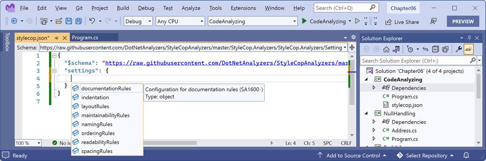
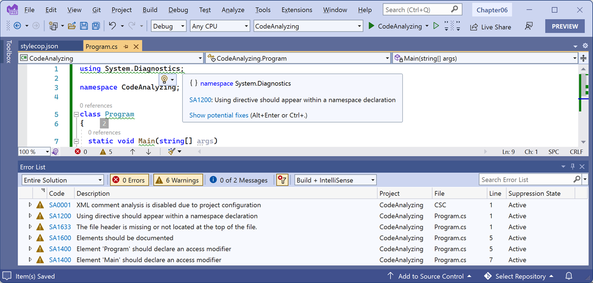

**Writing better code**

Now that you have learned the fundamentals of the C# language, let's see some ways that you can write better code.

- [Treating warnings as errors](#treating-warnings-as-errors)
- [Controlling warnings and errors](#controlling-warnings-and-errors)
- [Understanding warning waves](#understanding-warning-waves)
  - [Warning wave 5 diagnostics were added in C# 9](#warning-wave-5-diagnostics-were-added-in-c-9)
  - [Warning wave 6 diagnostics were added in C# 10](#warning-wave-6-diagnostics-were-added-in-c-10)
  - [Warning wave 7 diagnostics were added in C# 11](#warning-wave-7-diagnostics-were-added-in-c-11)
- [Using an analyzer to write better code](#using-an-analyzer-to-write-better-code)
- [Suppressing warnings](#suppressing-warnings)
- [Fixing the code](#fixing-the-code)
- [Understanding common StyleCop recommendations](#understanding-common-stylecop-recommendations)


# Treating warnings as errors

A simple yet effective way to write better code is to force yourself to fix compiler warnings. By default, warnings can be ignored. You can ask the compiler to prevent you from ignoring them.

Let's review the default experience and then see how we can improve it:

1.	Use your preferred code editor to add a **Console App** / `console` project named `WarningsAsErrors` to the `Chapter06` solution.
2.	In `Program.cs`, modify the existing statements to prompt the user to enter a name and then say hello to them, as shown highlighted in the following code:
```cs
// See https://aka.ms/new-console-template for more information
Console.Write("Enter a name: ");
string name = Console.ReadLine();
Console.WriteLine($"Hello, {name} has {name.Length} characters!");
```

3.	Build the `WarningsAsErrors` project using `dotnet build` at the command prompt or terminal and note that the build succeeds but there are two warnings, as shown in the following output:
```
Build succeeded.

C:\cs12dotnet8\Chapter06\WarningsAsErrors\Program.cs(3,15): warning CS8600: Converting null literal or possible null value to non-nullable type. [C:\cs12dotnet8\Chapter06\WarningsAsErrors\WarningsAsErrors.csproj]
C:\cs12dotnet8\Chapter06\WarningsAsErrors\Program.cs(9,40): warning CS8602: Dereference of a possibly null reference. [C:\cs12dotnet8\Chapter06\WarningsAsErrors\WarningsAsErrors.csproj]
    2 Warning(s)
    0 Error(s)
```

4.	Build the `WarningsAsErrors` project a second time using `dotnet build` at the command prompt or the terminal and note that the build succeeds and the warnings have gone, as shown in the following output:
```
Build succeeded.
    0 Warning(s)
    0 Error(s)
```

If you use the Visual Studio 2022 **Build** menu and look in the **Error List** then you will continue to see the two warnings because Visual Studio 2022 is not showing the true output from the compiler. Visual Studio 2022 runs its own checks on your code.

> **Good Practice**: You can "clean" a project either using the Visual Studio 2022 **Build** menu or using the command `dotnet clean` so that the warnings reappear the next time you build.

5.	In the project file, add an entry to ask the compiler to treat warnings as errors, as shown in the following markup:
```xml
<Project Sdk="Microsoft.NET.Sdk">

  <PropertyGroup>
    <OutputType>Exe</OutputType>
    <TargetFramework>net8.0</TargetFramework>
    <ImplicitUsings>enable</ImplicitUsings>
    <Nullable>enable</Nullable>
    <TreatWarningsAsErrors>true</TreatWarningsAsErrors>
  </PropertyGroup>

</Project>
```

6.	Build the `WarningsAsErrors` project and note that the build fails and there are two *errors* (no longer just warnings), as shown in the following output:
```
Build FAILED.
C:\cs12dotnet8\Chapter06\WarningsAsErrors\Program.cs(3,15): error CS8600: Converting null literal or possible null value to non-nullable type. [C:\cs12dotnet8\Chapter06\WarningsAsErrors\WarningsAsErrors.csproj]
C:\cs12dotnet8\Chapter06\WarningsAsErrors\Program.cs(9,40): error CS8602: Dereference of a possibly null reference. [C:\cs12dotnet8\Chapter06\WarningsAsErrors\WarningsAsErrors.csproj]
    0 Warning(s)
    2 Error(s)
```

7.	Build the `WarningsAsErrors` project again and note that the build fails again, so we cannot run the console app until we fix the issues.
8.	Fix the error by adding a nullable operator `?` after the `string` variable declaration and by checking for a `null` value and exiting the app if the variable is null, as shown in the following code:
```cs
Console.Write("Enter a name: ");
string? name = Console.ReadLine(); // Must declare the variable as nullable to remove the warning.
if (name == null) return; // Must check for null to remove the warning.
Console.WriteLine($"Hello, {name} has {name.Length} characters!");
```

9.	Build the `WarningsAsErrors` project and note that the build succeeds without errors.

> Do NOT run this project. The project implementation is not written to actually function as a check if someone has entered their name because that's not the point of this section. This section shows how to follow best practice and treat warnings as errors. But doing so means you must write extra code in common scenarios to fix all warnings that will now be treated as errors that prevent compilation during the build process. So this section also shows how to disable some common warnings by adding extra code.

> The project is NOT designed to be run. The code in it is written only to illustrate some common warnings and how to disable them to allow a build. For example, one warning is caused by the compiler thinking there could be a null dereference. To disable the warning, you therefore need to check for a null value even though we know that can never actually happen as explained in the note. That extra code check is pointless if you run the console app and expect it to work correctly.

In the scenario above, the `ReadLine` method always returns a non-`null` value, so we could have fixed the warning simply by suffixing the call to `ReadLine` with the null-forgiving operator, as shown in the following code:
```cs
string name = Console.ReadLine()!; // ! is the null-forgiving operator.
```

> **Good Practice**: Do not ignore warnings. The compiler is warning you for a reason. At the project level, treat warnings as errors to force yourself to fix the issue. For an individual issue, like the compiler not knowing that the `ReadLine` method will not in practice return `null`, you can disable that individual warning.

# Controlling warnings and errors

As well as the `<TreatWarningsAsErrors>` element, there are other elements that allow you to control how warnings are treated, as shown in the following table:

|Element|Description|
|---|---|
|`<TreatWarningsAsErrors>`|When `true`, all warnings (except those explicitly excluded) are treated as errors and therefore prevent compilation.|
|`<WarningsAsErrors>`|When set to a list of compiler warning or error code like `8600,CS8602`, those are treated as errors.|
|`<WarningsNotAsErrors>`|When set to a list of compiler warning or error code like `8600,CS8602`, those are excluded from errors.|
|`<NoWarn>`|When set to a list of compiler warning codes like `8600,CS8602`, those are excluded from warnings.|

> **Note**: The `CS` prefix for warnings is optional. `CS8600` or `8600` mean the same.

> **More Information**: Learn more at the following link: https://learn.microsoft.com/en-us/dotnet/csharp/language-reference/compiler-options/errors-warnings.

# Understanding warning waves

New warnings and errors may be introduced in each release of the C# compiler.

When new warnings could be reported on existing code, those warnings are introduced under an opt-in system referred to as a warning wave. The opt-in system means that you shouldn't see new warnings on existing code without taking action to enable them. 

Warning waves are enabled using the `AnalysisLevel` element in your project file. For example, if you want to disable the warning wave warnings introduced with .NET 7, you set the analysis level to `6.0`, as shown highlighted in the following markup:
```xml
<Project Sdk="Microsoft.NET.Sdk">

  <PropertyGroup>
    <OutputType>Exe</OutputType>
    <TargetFramework>net8.0</TargetFramework>
    <ImplicitUsings>enable</ImplicitUsings>
    <Nullable>enable</Nullable>
    <AnalysisLevel>6.0</AnalysisLevel>
  </PropertyGroup>

</Project>
```

There are many potential values for the analysis level setting, as shown in the following table:

Level|Description
---|---
`5.0`|Enables only up to warning wave 5 warnings.
`6.0`|Enables only up to warning wave 6 warnings.
`7.0`|Enables only up to warning wave 7 warnings.
`latest` (default)|Enables all warning wave warnings.
`preview`|Enables all warning wave warnings, including preview waves.
`none`|Disables all warning wave warnings.

If you tell the compiler treat warnings as errors, enabled warning wave warnings generate errors.

## Warning wave 5 diagnostics were added in C# 9

Some examples include:
- **CS8073** - The result of the expression is always `false` (or `true`). The `==` and `!=` operators always return `false` (or `true`) when comparing an instance of a `struct` type `s` to `null`, as shown in the following code:
```cs
if (s == null) { } // CS8073: The result of the expression is always 'false'
if (s != null) { } // CS8073: The result of the expression is always 'true'
```
- **CS8892** - Method will not be used as an entry point because a synchronous entry point 'method' was found. If you have both a normal `Main` method and an `async` one, then the normal one takes precedence and so the compiler warns that the `async` one will never be used.

## Warning wave 6 diagnostics were added in C# 10

- **CS8826** - Partial method declarations have signature differences.

## Warning wave 7 diagnostics were added in C# 11

- **CS8981** - The type name only contains lower-cased ascii characters. C# keywords are all lowercase ASCII characters. This warning makes sure that none of your types conflict with future C# keywords. Some source code generated by tools triggers this warning, for example, Google's design tools that generate .NET proxies for gRPC services.

> You can learn what warnings were added during warning waves at the following link: https://docs.microsoft.com/en-us/dotnet/csharp/language-reference/compiler-messages/warning-waves.

# Using an analyzer to write better code

We have now spent many chapters learning how to write C# code. Before we move on to learning about the .NET libraries, let's see how we can get help to write better code.

.NET analyzers find potential issues and suggest fixes for them. **StyleCop** is a commonly used analyzer for helping you write better C# code.

Let's see it in action:
1.	Use your preferred code editor to add a **Console App** / `console` project named `CodeAnalyzing` to the `Chapter06` solution using the old style project template that has an explicitly defined `Program` class:
    - If you are using Visual Studio 2022, then select the check box named **Do not use top-level statements**.
    - If you are using Visual Studio Code, then use the switch `--use-program-main`.
2.	In the `CodeAnalyzing` project, add a package reference for `StyleCop.Analyzers`, as shown in the following configuration:
```xml
<Project Sdk="Microsoft.NET.Sdk">

  <PropertyGroup>
    <OutputType>Exe</OutputType>
    <TargetFramework>net8.0</TargetFramework>
    <ImplicitUsings>enable</ImplicitUsings>
    <Nullable>enable</Nullable>
  </PropertyGroup>

  <ItemGroup>
    <PackageReference Include="StyleCop.Analyzers" Version="1.2.0-beta.435">
      <PrivateAssets>all</PrivateAssets>
      <IncludeAssets>runtime; build; native; contentfiles; analyzers; buildtransitive</IncludeAssets>
    </PackageReference>
  </ItemGroup>

</Project>
```

> The current version at the time of writing is `1.2.0-beta.435`. I recommend changing it to `1.2.0-*` so that you automatically get updates while it is still in preview. Once it has a GA release, you can remove the wildcard to fix it to that version, for example, `1.2.0`.

3.	Add a JSON file to your project named `stylecop.json` for controlling StyleCop settings.
4.	Modify its contents, as shown in the following markup:
```json
{
  "$schema": "https://raw.githubusercontent.com/DotNetAnalyzers/StyleCopAnalyzers/master/StyleCop.Analyzers/StyleCop.Analyzers/Settings/stylecop.schema.json",
  "settings": {

  }
}
```

The `$schema` entry enables IntelliSense while editing the `stylecop.json` file in your code editor.

5.	Move the insertion point inside the `settings` section, press *Ctrl* + *Space*, and note the IntelliSense showing valid subsections of settings, as shown in *Figure 6.7*:
 

*Figure 6.7: stylecop.json IntelliSense showing valid subsections of settings*

6.	In the `CodeAnalyzing` project file, add entries to configure the file named `stylecop.json` to not be included in published deployments, and to enable it as an additional file for processing during development, as shown in the following markup:
```xml
<Project Sdk="Microsoft.NET.Sdk">

  <PropertyGroup>
    <OutputType>Exe</OutputType>
    <TargetFramework>net8.0</TargetFramework>
    <ImplicitUsings>enable</ImplicitUsings>
    <Nullable>enable</Nullable>
  </PropertyGroup>

  <ItemGroup>
    <PackageReference Include="StyleCop.Analyzers" Version="1.2.0-*">
      <PrivateAssets>all</PrivateAssets>
      <IncludeAssets>runtime; build; native; contentfiles; analyzers</IncludeAssets>
    </PackageReference>
  </ItemGroup>

  <ItemGroup>
    <None Remove="stylecop.json" />
  </ItemGroup>

  <ItemGroup>
    <AdditionalFiles Include="stylecop.json" />
  </ItemGroup>

</Project>
```

7.	In `Program.cs`, add some statements to import the namespace that will allow us to output a message to the debug output window instead of the console, as shown in the following code:
```cs
using System.Diagnostics;

namespace CodeAnalyzing
{
  internal class Program
  {
    static void Main(string[] args)
    {
      Debug.WriteLine("Hello, Debugger!");
    }
  }
}
```

8.	Build the `CodeAnalyzing` project.
9.	You will see warnings for everything it thinks is wrong, as shown in *Figure 6.8*:

 
*Figure 6.8: StyleCop code analyzer warnings*

For example, it wants using directives to be put within the namespace declaration, as shown in the following output:
```
C:\cs12dotnet8\Chapter06\CodeAnalyzing\Program.cs(1,1): warning SA1200: Using directive should appear within a namespace declaration [C:\cs12dotnet8\Chapter06\CodeAnalyzing\CodeAnalyzing.csproj]
```

# Suppressing warnings

To suppress a warning, you have several options, including adding code and setting configuration.

To suppress a warning using an attribute, add an assembly-level attribute, as shown in the following code:
```cs
[assembly:SuppressMessage("StyleCop.CSharp.OrderingRules", "SA1200:UsingDirectivesMustBePlacedWithinNamespace", Justification = "Reviewed.")]
```

To suppress a warning using a directive, add `#pragma` statements around the statement that is causing the warning, as shown in the following code:
```cs
#pragma warning disable SA1200 // UsingDirectivesMustBePlacedWithinNamespace
using System.Diagnostics;
#pragma warning restore SA1200 // UsingDirectivesMustBePlacedWithinNamespace
```

Let's suppress the warning by modifying the `stylecop.json` file:

1.	In `stylecop.json`, add a configuration option to set using statements to be allowable outside a namespace, as shown highlighted in the following markup:
```json
{
  "$schema": "https://raw.githubusercontent.com/DotNetAnalyzers/StyleCopAnalyzers/master/StyleCop.Analyzers/StyleCop.Analyzers/Settings/stylecop.schema.json",
  "settings": {
    "orderingRules": {
      "usingDirectivesPlacement": "outsideNamespace"
    }
  }
}
```

2.	Build the project and note that warning `SA1200` has disappeared.
3.	In `stylecop.json`, set the using directives placement to preserve, which allows `using` statements both inside and outside a namespace, as shown in the following markup:
```json
"orderingRules": {
  "usingDirectivesPlacement": "preserve"
}
```

# Fixing the code

Now, let's fix all the other warnings:

1.	In `CodeAnalyzing.csproj`, add an element to automatically generate an XML file for documentation, as shown in the following markup:
```xml
<Project Sdk="Microsoft.NET.Sdk">

  <PropertyGroup>
    <OutputType>Exe</OutputType>
    <TargetFramework>net8.0</TargetFramework>
    <ImplicitUsings>enable</ImplicitUsings>
    <Nullable>enable</Nullable>
    <GenerateDocumentationFile>true</GenerateDocumentationFile>
  </PropertyGroup>
```

2.	In `stylecop.json`, add a configuration option to provide values for documentation for the company name and copyright text, as shown in the following markup:
```json
{
  "$schema": "https://raw.githubusercontent.com/DotNetAnalyzers/StyleCopAnalyzers/master/StyleCop.Analyzers/StyleCop.Analyzers/Settings/stylecop.schema.json",
  "settings": {
    "orderingRules": {
      "usingDirectivesPlacement": "preserve"
    },
    "documentationRules": {
      "companyName": "Packt",
      "copyrightText": "Copyright (c) Packt. All rights reserved."
    }
  }
}
```

3.	In `Program.cs`, add comments for a file header with the company and copyright text, move the `using System;` declaration inside the namespace, and set explicit access modifiers and XML comments for the class and method, as shown in the following code:
```cs
// <copyright file="Program.cs" company="Packt">
// Copyright (c) Packt. All rights reserved.
// </copyright>
namespace CodeAnalyzing;

using System.Diagnostics;

/// <summary>
/// The main class for this console app.
/// </summary>
public class Program
{
  /// <summary>
  /// The main entry point for this console app.
  /// </summary>
  /// <param name="args">
  /// A string array of arguments passed to the console app.
  /// </param>
  public static void Main(string[] args)
  {
    Debug.WriteLine("Hello, Debugger!");
  }
}
```

4.	Build the project.
5.	Expand the `bin/Debug/net8.0` folder (remember to **Show All Files** if you are using Visual Studio 2022) and note the autogenerated file named `CodeAnalyzing.xml`, as shown in the following markup:
```xml
<?xml version="1.0"?>
<doc>
    <assembly>
        <name>CodeAnalyzing</name>
    </assembly>
    <members>
        <member name="T:CodeAnalyzing.Program">
            <summary>
            The main class for this console app.
            </summary>
        </member>
        <member name="M:CodeAnalyzing.Program.Main(System.String[])">
            <summary>
            The main entry point for this console app.
            </summary>
            <param name="args">
            A string array of arguments passed to the console app.
            </param>
        </member>
    </members>
</doc>
```

The `CodeAnalyzing.xml` file can then be processed by a tool like **DocFX** to convert it into documentation files, as shown at the following link: https://www.jamescroft.co.uk/building-net-project-docs-with-docfx-on-github-pages/.

# Understanding common StyleCop recommendations

Inside a code file, you should order the contents as shown in the following list:

1.	External alias directives
2.	Using directives
3.	Namespaces
4.	Delegates
5.	Enums
6.	Interfaces
7.	Structs
8.	Classes

Within a class, record, struct, or interface, you should order the contents as shown in the following list:

1.	Fields
2.	Constructors
3.	Destructors (finalizers)
4.	Delegates
5.	Events
6.	Enums
7.	Interfaces
8.	Properties
9.	Indexers
10.	Methods
11.	Structs
12.	Nested classes and records

> **Good Practice**: You can learn about all the StyleCop rules at the following link: https://github.com/DotNetAnalyzers/StyleCopAnalyzers/blob/master/DOCUMENTATION.md.
