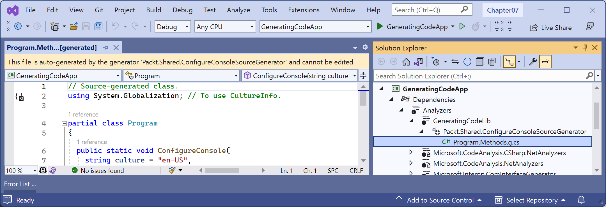
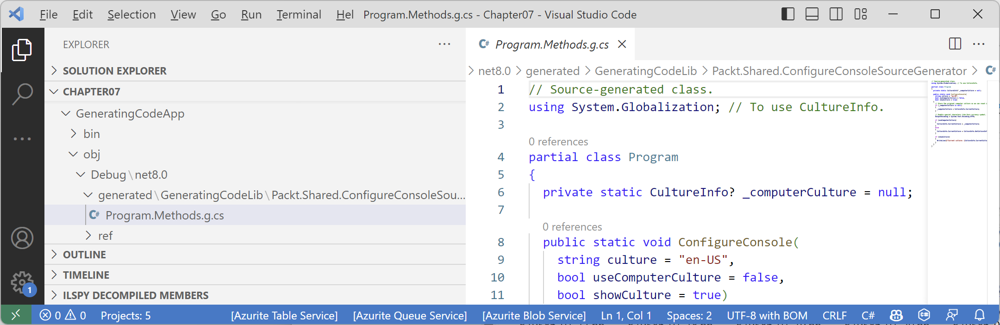

**Introducing source generators**

This online-only section is about source generators.

Source generators were introduced with C# 9 and .NET 5. They allow a programmer to get a compilation object that represents all the code being compiled, dynamically generate additional code files, and compile those too. 

Source generators are like code analyzers that can add more code to the compilation process.

- [Example source generator from Microsoft](#example-source-generator-from-microsoft)
- [What will our source generator do?](#what-will-our-source-generator-do)
- [Creating a console app that outputs culture-specific variables](#creating-a-console-app-that-outputs-culture-specific-variables)
- [Creating a source generator class library](#creating-a-source-generator-class-library)
- [Using the source generator](#using-the-source-generator)
- [Doing more with source generators](#doing-more-with-source-generators)

# Example source generator from Microsoft

An example source generator from Microsoft is the `System.Text.Json.SourceGeneration` source generator. The classic method for serializing JSON uses reflection at runtime to dynamically analyze an object model, but this is slow and cannot use native ahead-of-time (AOT) compilation. The better method uses source generators to create source code that is then compiled to give improved performance. 

> You can read more about the `System.Text.Json.SourceGeneration` source generator at the following link: https://devblogs.microsoft.com/dotnet/try-the-new-system-text-json-source-generator/

# What will our source generator do?

We will create a source generator that programmatically creates a code file that adds a `ConfigureConsole` method to the `Program` class, as shown in the following code:
```cs
// Source-generated class.
#nullable enable

using System.Globalization; // To use CultureInfo.

partial class Program
{
  private static CultureInfo? _computerCulture = null;

  public static void ConfigureConsole(
    string culture = "en-US",
    bool useComputerCulture = false,
    bool showCulture = true)
  {
    // Store the original computer culture so we can reset it later.
    if (_computerCulture is null)
    {
      _computerCulture = CultureInfo.CurrentCulture;
    }

    // Enable special characters like Euro currency symbol.
    OutputEncoding = System.Text.Encoding.UTF8;

    if (useComputerCulture)
    {
      CultureInfo.CurrentCulture = _computerCulture;
    }
    else
    {
      CultureInfo.CurrentCulture = CultureInfo.GetCultureInfo(culture);
    }

    if (showCulture)
    {
      WriteLine($"Current culture: {CultureInfo.CurrentCulture.DisplayName}.");
    }
  }
}
```

This method can then be called in the `Program.cs` file of the project that uses this source generator to control the culture, as shown in the following code:
```cs
ConfigureConsole(); // Sets current culture to US English by default.
ConfigureConsole(useComputerCulture: true); // Sets current culture to the local computer's culture.
ConfigureConsole(culture: "fr-FR"); // Sets current culture to French in France.
```

Let's see how to do this. 

# Creating a console app that outputs culture-specific variables

First, we will create a console app that outputs culture-specific variables so we can see the problem:

1.	Use your preferred code editor to add a new **Console App** / `console` project named `ConsoleApp.SourceGeneration` to the `Chapter07` solution.
2.	In `ConsoleApp.SourceGeneration.csproj`, statically and globally import the `Console` class, as shown in the following markup:
```xml
<ItemGroup>
  <Using Include="System.Console" Static="true" />
</ItemGroup>
```
3.  In `Program.cs`, delete the existing statements and then declare some variables whose formatting is affected by culture and output their values, as shown in the following code:
```cs
decimal price = 19.99M;
DateTimeOffset today = DateTimeOffset.Now;

WriteLine($"Today, {today:D}, the price is {price:C}.");
```
4.  Run the `ConsoleApp.SourceGeneration` project and note the result, as shown in the following output:
```
Today, 07 July 2023, the price is £19.99.
```

> My computer is configured to use English (British) culture which is why the currency symbol is British pounds £. When you run this console app on your computer, the date format and currency will match your local culture. This can be a problem with a book where you want the output in the book to match the output on the readers screen. But we also want to see how it would look in our own culture or a specified culture. And, by default, some command prompts and terminals do not show special symbols like the Euro currency symbol. We want to see those too.

# Creating a source generator class library

Next, we will create a class library that implements the source generator:

1.	Use your preferred code editor to add a new **Class Library** / `classlib` project named `Packt.SourceGeneration` that targets .NET Standard 2.0 to the `Chapter07` solution.

> Currently, source generators must target .NET Standard 2.0. The default C# version used for class libraries that target .NET Standard 2.0 is C# 7.3, as shown at the following link: https://docs.microsoft.com/en-us/dotnet/csharp/language-reference/configure-language-version#defaults.

2.	In the project file, set the C# language version to `12` (so that we can use `global using` statements), enable enforce extended analyzer rules, statically and globally import the `Console` class, and add the NuGet packages `Microsoft.CodeAnalysis.Analyzers` and `Microsoft.CodeAnalysis.CSharp`, as shown in the following markup:
```xml
<Project Sdk="Microsoft.NET.Sdk">

  <PropertyGroup>
    <TargetFramework>netstandard2.0</TargetFramework>

    <!--Must use C# 10 or later to support 'global using' statements.-->
    <LangVersion>12</LangVersion>

    <EnforceExtendedAnalyzerRules>true</EnforceExtendedAnalyzerRules>
    <Nullable>enable</Nullable>
  </PropertyGroup>
	
  <ItemGroup>
    <Using Include="System.Console" Static="true" />
  </ItemGroup>

  <ItemGroup>
    <PackageReference Include="Microsoft.CodeAnalysis.Analyzers" Version="3.3.4">
      <PrivateAssets>all</PrivateAssets>
      <IncludeAssets>runtime; build; native; contentfiles; analyzers; buildtransitive</IncludeAssets>
    </PackageReference>
    <PackageReference Include="Microsoft.CodeAnalysis.CSharp" Version="4.6.0" />
  </ItemGroup>

</Project>
```

3.	Build the `Packt.SourceGeneration` project to restore packages.
4.	Rename `Class1.cs` to `ProgramSourceGenerator.cs`.
5.	In `ProgramSourceGenerator.cs`, define a class that implements `ISourceGenerator` and is decorated with the `[Generator]` attribute, as shown in the following code:
```cs
// To use [Generator], ISourceGenerator, and so on.
using Microsoft.CodeAnalysis;

namespace Packt.Shared;

[Generator]
public class ProgramSourceGenerator : ISourceGenerator
{
  public void Execute(GeneratorExecutionContext execContext)
  {
    IMethodSymbol? mainMethod = execContext.Compilation
      .GetEntryPoint(execContext.CancellationToken);

    string sourceCode = $@"// Source-generated class.
#nullable enable

using System.Globalization; // To use CultureInfo.

partial class {mainMethod?.ContainingType.Name}
{{
  private static CultureInfo? _computerCulture = null;

  public static void ConfigureConsole(
    string culture = ""en-US"",
    bool useComputerCulture = false,
    bool showCulture = true)
  {{
    // Store the original computer culture so we can reset it later.
    if (_computerCulture is null)
    {{
      _computerCulture = CultureInfo.CurrentCulture;
    }}

    // Enable special characters like Euro currency symbol.
    OutputEncoding = System.Text.Encoding.UTF8;

    if (useComputerCulture)
    {{
      CultureInfo.CurrentCulture = _computerCulture;
    }}
    else
    {{
      CultureInfo.CurrentCulture = CultureInfo.GetCultureInfo(culture);
    }}

    if (showCulture)
    {{
      WriteLine($""Current culture: {{CultureInfo.CurrentCulture.DisplayName}}."");
    }}
  }}
}}
";

    string fileName = $"{mainMethod?.ContainingType.Name}.Methods.g.cs";
    execContext.AddSource(fileName, sourceCode);
  }

  public void Initialize(GeneratorInitializationContext initContext)
  {
    // This source generator does not need any initialization.
  }
}
```

> **Good Practice**: Include `.g.` or `.generated.` in the filename of source generated files. The source code should explicitly enable nullability checks in the file since we do not know if the containing project will enable nullability at the project level or not.

# Using the source generator

Finally, we will use the source generator in our console app:

1.	In `ConsoleApp.SourceGeneration.csproj`, in the `<PropertyGroup>`, add an entry to enable the generation of the code file, as shown in the following markup:
```xml
<EmitCompilerGeneratedFiles>true</EmitCompilerGeneratedFiles>
```

> Visual Studio 2022 automatically runs code analyzers so this is not necessary. Visual Studio Code does *not* automatically run code analyzers. We must add this extra entry in the project file to enable the automatic generation of the source generator file. It is fine to enable it for Visual Studio 2022 too.

> You can control the path for automatically generated code files by adding a `<CompilerGeneratedFilesOutputPath>` element.

2.	In `ConsoleApp.SourceGeneration.csproj`, add a reference to the class library project, as shown in the following markup:
```xml
<ItemGroup>
  <ProjectReference Include=
    "..\Packt.SourceGeneration\Packt.SourceGeneration.csproj"
    OutputItemType="Analyzer" ReferenceOutputAssembly="false" />
</ItemGroup>
```

3.  Build the `ConsoleApp.SourceGeneration` project.
4.  Note the auto-generated class file:
- In Visual Studio 2022, close and reopen the solution to trigger analyzers to be run, and then in **Solution Explorer**, expand the **Dependencies** | **Analyzers** | **Packt.SourceGeneration** | **Packt.Shared.ProgramSourceGenerator** nodes, and then open the `Program.Methods.g.cs` file, as shown in Figure 7B.1:
 


*Figure 7B.1: The source generated Program.Methods.g.cs file*

> **Good Practice**: Microsoft's naming convention for proejcts that implement source generators seems to be to suffix with either `.SourceGeneration` or `.Generator`. That is why I told you to use `Packt.SourceGeneration` for the class library project name.

- In Visual Studio Code, in **EXPLORER** | **CHAPTER07**, in the `obj/Debug/net8.0` folder, note the `generated` folder and its subfolder `Packt.SourceGeneration/Packt.Shared.ProgramSourceGenerator`folder, and then open the `Program.Methods.g.cs` file, as shown in *Figure 7B.2*:



*Figure 7B.2: The source generated Program.Methods.g.cs file*

6.	In `Program.cs`, at the top of the file, call the method, as shown in the following code:
```cs
ConfigureConsole();
```

7.  Run the `ConsoleApp.SourceGeneration` project, and note the result, as shown in the following output:
```
Current culture: English (United States).
Today, Friday, July 7, 2023, the price is $19.99.
```

8. Change the call to use a specific culture like French in France, as shown in the following code:
```cs
ConfigureConsole(culture: "fr-FR");
```

9.  Run the `ConsoleApp.SourceGeneration` project, and note the result, as shown in the following output:
```
Current culture: French (France).
Today, vendredi 7 juillet 2023, the price is 19,99 €.
```

10.  Change the call to use a specific culture, as shown in the following code:
```
ConfigureConsole(useComputerCulture: true);
```

11.   Run the `ConsoleApp.SourceGeneration` project, and note the result, as shown in the following output:
```
Current culture: English (United Kingdom).
Today, 07 July 2023, the price is £19.99.
```

# Doing more with source generators

Source generators are a massive topic. To learn more, use the following links:

- Source Generators design specification: https://github.com/dotnet/roslyn/blob/main/docs/features/source-generators.md
- Source Generators samples: https://github.com/dotnet/roslyn-sdk/tree/main/samples/CSharp/SourceGenerators
- Source Generators cookbook: https://github.com/dotnet/roslyn/blob/main/docs/features/source-generators.cookbook.md
