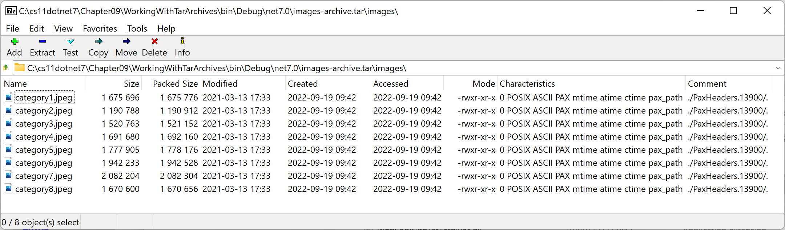

**Working with Tar archives**

- [Introducing Tar archives](#introducing-tar-archives)
- [Exploring Tar archives](#exploring-tar-archives)
- [Reading and writing Tar entries](#reading-and-writing-tar-entries)


# Introducing Tar archives

A file with the extension `.tar` has been created using the Unix-based archival application `tar` which uses the **Tape Archive (TAR)** file archiving format. A file with the extension `.tar.gz` has been created using `tar` and then compressed using the GZIP compression algorithm.

.NET 7 introduced the `System.Formats.Tar` assembly, which has APIs for reading, writing, archiving, and extracting `tar` archives.

The `TarFile` class has static public members, as shown in the following table:

Member|Description
---|---
`CreateFromDirectory`, `CreateFromDirectoryAsync`|Creates a tar stream that contains all the filesystem entries from the specified directory.
`ExtractToDirectory`, `ExtractToDirectoryAsync`|Extracts the contents of a stream that represents a Tar archive into the specified directory.
`DefaultCapacity`|Windows' `MAX_PATH` (260) is used as an arbitrary default capacity.

# Exploring Tar archives

Let's see some example code in action:
1.	Use your preferred code editor to add a new **Console App** / `console` project named `WorkingWithTarArchives` to the `Chapter09` solution.
2.	In the project file, add an element to statically and globally import the `System.Console` class.
3.	In `Program.Helpers.cs`, add a partial `Program` class with three methods to output errors, warnings, and information messages to the console in appropriate colors, as shown in the following code:
```cs
partial class Program
{
  static void WriteError(string message)
  {
    ConsoleColor previousColor = ForegroundColor;
    ForegroundColor = ConsoleColor.Red;
    WriteLine($"FAIL: {message}");
    ForegroundColor = previousColor;
  }

  static void WriteWarning(string message)
  {
    ConsoleColor previousColor = ForegroundColor;
    ForegroundColor = ConsoleColor.DarkYellow;
    WriteLine($"WARN: {message}");
    ForegroundColor = previousColor;
  }

  static void WriteInformation(string message)
  {
    ConsoleColor previousColor = ForegroundColor;
    ForegroundColor = ConsoleColor.Blue;
    WriteLine($"INFO: {message}");
    ForegroundColor = previousColor;
  }
}
```

4.	In the `WorkingWithTarArchives` project, create a folder named `images` and copy some images into it.

    - If you are using Visual Studio 2022, then select all the image files, view **Properties**, and set **Copy to Output Directory** to **Copy always**.

> You can download some images from the following link: https://github.com/markjprice/cs12dotnet8/tree/main/code/Chapter09/WorkingWithTarArchives/images.

5.	In `Program.cs`, delete the existing statements and then add statements to archive the contents of a specified folder into a Tar archive file and then extract it into a new folder, as shown in the following code:
```cs
using System.Formats.Tar; // To use TarFile.

try
{
  string current = Environment.CurrentDirectory;
  WriteInformation($"Current directory:   {current}");

  string sourceDirectory = Path.Combine(current, "images");
  string destinationDirectory = Path.Combine(current, "extracted");
  string tarFile = Path.Combine(current, "images-archive.tar");

  if (!Directory.Exists(sourceDirectory))
  {
    WriteError($"The {sourceDirectory} directory must exist. Please create it and add some files to it.");
    return;
  }

  if (File.Exists(tarFile))
  {
    // If the Tar archive file already exists then we must delete it.
    File.Delete(tarFile);
    WriteWarning($"{tarFile} already existed so it was deleted.");
  }

  WriteInformation(
    $"Archiving directory: {sourceDirectory}\n      To .tar file:        {tarFile}");

  TarFile.CreateFromDirectory(
    sourceDirectoryName: sourceDirectory,
    destinationFileName: tarFile,
    includeBaseDirectory: true);

  WriteInformation($"Does {tarFile} exist? {File.Exists(tarFile)}.");

  if (!Directory.Exists(destinationDirectory))
  {
    // If the destination directory does not exist then we must create
    // it before extracting a Tar archive to it.
    Directory.CreateDirectory(destinationDirectory);
    WriteWarning($"{destinationDirectory} did not exist so it was created.");
  }

  WriteInformation(
    $"Extracting archive:  {tarFile}\n      To directory:        {destinationDirectory}");

  TarFile.ExtractToDirectory(
    sourceFileName: tarFile,
    destinationDirectoryName: destinationDirectory,
    overwriteFiles: true);

  if (Directory.Exists(destinationDirectory))
  {
    foreach (string dir in Directory.GetDirectories(destinationDirectory))
    {
      WriteInformation(
        $"Extracted directory {dir} containing these files: " +
        string.Join(',', Directory.EnumerateFiles(dir)
          .Select(file => Path.GetFileName(file))));
    }
  }
}
catch (Exception ex)
{
  WriteError(ex.Message);
}
```

6.	Run the console app and note the messages, as shown in the following output:
```
INFO: Current directory:   C:\cs12dotnet8\Chapter09\WorkingWithTarArchives\bin\Debug\net8.0
INFO: Archiving directory: C:\cs12dotnet8\Chapter09\WorkingWithTarArchives\bin\Debug\net8.0\images
      To .tar file:        C:\cs12dotnet8\Chapter09\WorkingWithTarArchives\bin\Debug\net8.0\images-archive.tar
INFO: Does C:\cs12dotnet8\Chapter09\WorkingWithTarArchives\bin\Debug\net8.0\images-archive.tar exist? True.
WARN: C:\cs11dotnet8\Chapter09\WorkingWithTarArchives\bin\Debug\net8.0\extracted did not exist so it was created.
INFO: Extracting archive:  C:\cs12dotnet8\Chapter09\WorkingWithTarArchives\bin\Debug\net8.0\images-archive.tar
      To directory:        C:\cs12dotnet8\Chapter09\WorkingWithTarArchives\bin\Debug\net8.0\extracted
INFO: Extracted directory C:\cs12dotnet8\Chapter09\WorkingWithTarArchives\bin\Debug\net8.0\extracted\images containing these files: category1.jpeg,category2.jpeg,category3.jpeg,category4.jpeg,category5.jpeg,category6.jpeg,category7.jpeg,category8.jpeg
```

7.	If you have software that can view the contents of a Tar archive, like 7-Zip, then use it to review the contents of the `images-archive.tar` file, as shown in *Figure 9B.1*:


*Figure 9B.1: Opening a Tar archive file on Windows using 7-Zip*

> You can download and install the free and open-source 7-Zip at the following link: https://www.7-zip.org/.

# Reading and writing Tar entries

As well as the `TarFile` class, there are classes for reading and writing individual entries in a Tar archive, named `TarEntry`, `TarEntryFormat`, `TarReader`, and `TarWriter`. 

These can be combined with `GzipStream` to compress or decompress entries as they are written and read.

> You can learn more about .NET Tar support at the following link: https://learn.microsoft.com/en-us/dotnet/api/system.formats.tar.
