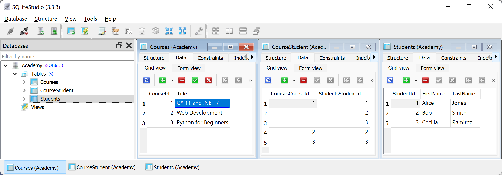

**Code First EF Core models**

- [Introducing Code First models](#introducing-code-first-models)
- [Building an example Code First console app](#building-an-example-code-first-console-app)
- [Using the models](#using-the-models)
- [Understanding migrations](#understanding-migrations)
- [Mapping inheritance hierarchies with EF Core](#mapping-inheritance-hierarchies-with-ef-core)


# Introducing Code First models

Sometimes, you will not have an existing database. Instead, you define the EF Core model as Code First, and then EF Core can generate a matching database using create and drop APIs.

> **Good Practice**: The create and drop APIs should only be used during development. Once you release the app, you do not want it to delete a production database!

For example, we might need to create an application for managing students and courses for an academy. One student can sign up to attend multiple courses. One course can be attended by multiple students. This is an example of a many-to-many relationship between students and courses.

# Building an example Code First console app

Let's model this example:

1.	Use your preferred code editor to add a new **Console App** / `console` project named `CoursesAndStudents` to the `Chapter10` solution.
2.	In the `CoursesAndStudents` project, add package references for the following packages:
    - `Microsoft.EntityFrameworkCore.Sqlite`
    - `Microsoft.EntityFrameworkCore.Design`
2.	Build the `CoursesAndStudents` project to restore packages.
3.	Add classes named `Academy.cs`, `Student.cs`, and `Course.cs`.
4.	Modify `Student.cs`, and note that it is a POCO (plain old CLR object) with no attributes decorating the class, as shown in the following code:
```cs
namespace Packt.Shared;

public class Student
{
  public int StudentId { get; set; }
  public string? FirstName { get; set; }
  public string? LastName { get; set; }
  public ICollection<Course>? Courses { get; set; }
}
```
5.	Modify `Course.cs`, and note that we have decorated the `Title` property with some attributes to provide more information to the model, as shown in the following code:
```cs
using System.ComponentModel.DataAnnotations;

namespace Packt.Shared;

public class Course
{
  public int CourseId { get; set; }

  [Required]
  [StringLength(60)] // For SQL Server.
  [Column(TypeName = "text(60)")] // For SQLite.
  public string? Title { get; set; }

  public ICollection<Student>? Students { get; set; }
}
```

> **Good Practice**: Always decorate `string` properties in an entity model with `[StringLength]` or use Fluent API to set a maximum length. The SQL statement to create the table in the database will then use, for example, `VARCHAR(60)` instead of `VARCHAR(MAX)`. For SQLite, it does not matter since it does not set any maximum lengths anyway, but most other databases like SQL Server will use it.

> **Warning!** `[StringLength(60)]` is not honored by all EF Core data providers. For example, although SQL Server honors it, SQLite does not. For SQLite, use `[Column(TypeName = "text(60)")]` instead.

6.	Modify `Academy.cs`, as shown in the following code:
```cs
using Microsoft.EntityFrameworkCore; // DbContext, DbSet<T>

namespace Packt.Shared;

public class Academy : DbContext
{
  public DbSet<Student>? Students { get; set; }
  public DbSet<Course>? Courses { get; set; }

  protected override void OnConfiguring(
    DbContextOptionsBuilder optionsBuilder)
  {
    string path = Path.Combine(
      Environment.CurrentDirectory, "Academy.db");

    string connection = $"Filename={path}";
    // string connection = @"Data Source=.;Initial Catalog=Academy;Integrated Security=true;MultipleActiveResultSets=true;";

    WriteLine($"Connection: {connection}");

    optionsBuilder.UseSqlite(connection);
    // optionsBuilder.UseSqlServer(connection);
  }

  protected override void OnModelCreating(ModelBuilder modelBuilder)
  {
    // Fluent API validation rules
    modelBuilder.Entity<Student>()
      .Property(s => s.LastName).HasMaxLength(30).IsRequired();

    // populate database with sample data
    Student alice = new() { StudentId = 1, 
      FirstName = "Alice", LastName = "Jones" };
    Student bob = new() { StudentId = 2, 
      FirstName = "Bob", LastName = "Smith" };
    Student cecilia = new() { StudentId = 3, 
      FirstName = "Cecilia", LastName = "Ramirez" };

    Course csharp = new() { CourseId = 1,
      Title = "C# 11 and .NET 7"};
    Course webdev = new() { CourseId = 2,
      Title = "Web Development" };
    Course python = new() { CourseId = 3,
        Title = "Python for Beginners" };

    modelBuilder.Entity<Student>()
      .HasData(alice, bob, cecilia);

    modelBuilder.Entity<Course>()
      .HasData(csharp, webdev, python);

    modelBuilder.Entity<Course>()
      .HasMany(c => c.Students)
      .WithMany(s => s.Courses)
      .UsingEntity(e => e.HasData(
        // all students signed up for C# course
        new { CoursesCourseId = 1, StudentsStudentId = 1 },
        new { CoursesCourseId = 1, StudentsStudentId = 2 },
        new { CoursesCourseId = 1, StudentsStudentId = 3 },
        // only Bob signed up for Web Dev
        new { CoursesCourseId = 2, StudentsStudentId = 2 },
        // only Cecilia signed up for Python
        new { CoursesCourseId = 3, StudentsStudentId = 3 }
      ));
  }
}
```

> **Good Practice**: Use an anonymous type to supply data for the intermediate table in a many-to-many relationship. The property names follow the naming convention `NavigationPropertyNamePropertyName`; for example, `Courses` is the navigation property name and `CourseId` is the property name, so `CoursesCourseId` will be the property name of the anonymous type.

# Using the models

1.	In `Program.cs`, delete the existing statements. Then, import the namespace for EF Core and working with tasks, and statically import `Console`, as shown in the following code:
```cs
using Microsoft.EntityFrameworkCore; // for GenerateCreateScript()
using Packt.Shared; // Academy
```
2.	In `Program.cs`, add statements to create an instance of the `Academy` database context and use it to delete the database if it exists, create the database from the model and output the SQL script it uses, and then enumerate the students and their courses, as shown in the following code:
```cs
using (Academy a = new())
{
  bool deleted = await a.Database.EnsureDeletedAsync();
  WriteLine($"Database deleted: {deleted}");

  bool created = await a.Database.EnsureCreatedAsync();
  WriteLine($"Database created: {created}");

  WriteLine("SQL script used to create database:");
  WriteLine(a.Database.GenerateCreateScript());

  foreach (Student s in a.Students.Include(s => s.Courses))
  {
    WriteLine("{0} {1} attends the following {2} courses:",
      s.FirstName, s.LastName, s.Courses.Count);

    foreach (Course c in s.Courses)
    {
      WriteLine($"  {c.Title}");
    }
  }
}
```
3.	Run the code, and note that the first time you run the code it will not need to delete the database because it does not exist yet, as shown in the following output:
```
Connection: Filename=C:\cs12dotnet8\Chapter10\CoursesAndStudents\bin\Debug\net8.0\Academy.db
Database deleted: False
Database created: True
SQL script used to create database:
CREATE TABLE "Courses" (
    "CourseId" INTEGER NOT NULL CONSTRAINT "PK_Courses" PRIMARY KEY AUTOINCREMENT,
    "Title" TEXT NOT NULL
);
CREATE TABLE "Students" (
    "StudentId" INTEGER NOT NULL CONSTRAINT "PK_Students" PRIMARY KEY AUTOINCREMENT,
    "FirstName" TEXT NULL,
    "LastName" TEXT NOT NULL
);
CREATE TABLE "CourseStudent" (
    "CoursesCourseId" INTEGER NOT NULL,
    "StudentsStudentId" INTEGER NOT NULL,
    CONSTRAINT "PK_CourseStudent" PRIMARY KEY ("CoursesCourseId", "StudentsStudentId"),
    CONSTRAINT "FK_CourseStudent_Courses_CoursesCourseId" FOREIGN KEY ("CoursesCourseId") REFERENCES "Courses" ("CourseId") ON DELETE CASCADE,
    CONSTRAINT "FK_CourseStudent_Students_StudentsStudentId" FOREIGN KEY ("StudentsStudentId") REFERENCES "Students" ("StudentId") ON DELETE CASCADE
);
INSERT INTO "Courses" ("CourseId", "Title")
VALUES (1, 'C# 11 and .NET 7');
INSERT INTO "Courses" ("CourseId", "Title")
VALUES (2, 'Web Development');
INSERT INTO "Courses" ("CourseId", "Title")
VALUES (3, 'Python for Beginners');
INSERT INTO "Students" ("StudentId", "FirstName", "LastName")
VALUES (1, 'Alice', 'Jones');
INSERT INTO "Students" ("StudentId", "FirstName", "LastName")
VALUES (2, 'Bob', 'Smith');
INSERT INTO "Students" ("StudentId", "FirstName", "LastName")
VALUES (3, 'Cecilia', 'Ramirez');
INSERT INTO "CourseStudent" ("CoursesCourseId", "StudentsStudentId")
VALUES (1, 1);
INSERT INTO "CourseStudent" ("CoursesCourseId", "StudentsStudentId")
VALUES (1, 2);
INSERT INTO "CourseStudent" ("CoursesCourseId", "StudentsStudentId")
VALUES (1, 3);
INSERT INTO "CourseStudent" ("CoursesCourseId", "StudentsStudentId")
VALUES (2, 2);
INSERT INTO "CourseStudent" ("CoursesCourseId", "StudentsStudentId")
VALUES (3, 3);
CREATE INDEX "IX_CourseStudent_StudentsStudentId" ON "CourseStudent" ("StudentsStudentId");

Alice Jones attends the following 1 courses:
  C# 11 and .NET 7
Bob Smith attends the following 2 courses:
  C# 11 and .NET 7
  Web Development
Cecilia Ramirez attends the following 2 courses:
  C# 11 and .NET 7
  Python for Beginners
```

Note the following:
- The `Title` column is `NOT NULL` because the model was decorated with `[Required]`.
- The `LastName` column is `NOT NULL` because the model used `IsRequired()`.
- An intermediate table named `CourseStudent` was created to hold information about which students attend which courses.

4.	Use SQLiteStudio to connect to the Academy database and view the tables, as shown in *Figure 10.7*:

 
*Figure 10.7: Viewing the Academy database tables in SQLiteStudio*

# Understanding migrations

After publishing a project that uses a database, it is likely that you will later need to change your entity data model and, therefore, the database structure. At that point, you should not use the `EnsureDeletedAsync` and `EnsureCreatedAsync` methods. 

Instead, you need to use a system that allows you to incrementally update the database schema while preserving any existing data in the database. EF Core migrations are that system.

Migrations get complex fast, so are beyond the scope of this book. You can read about them at the following link: https://docs.microsoft.com/en-us/ef/core/managing-schemas/migrations/.

# Mapping inheritance hierarchies with EF Core

Imagine that you have an inheritance hierarchy for some C# classes to store information about students and employees, both of which are types of people. All people have a name and an ID to uniquely identify them, students have a subject they are studying, and employees have a hire date, as shown in the following code:
```cs
public abstract class Person
{
  public int Id { get; set; }
  public string? Name { get; set; }
}

public class Student : Person
{
  public string? Subject { get; set; }
}

public class Employee : Person
{
  public DateTime HireDate { get; set; }
}
```

By default, EF Core will map these to a single table using the table-per-hierarchy (TPH) mapping strategy. EF Core 5 introduced support for the table-per-type (TPT) mapping strategy. EF Core 7 introduced support for the table-per-concrete-type (TPC) mapping strategy.

To learn about the TPH, TPT, and TPC mapping strategies, how they work, and code some examples, either get my companion book, *Apps and Services with .NET 8*, or read the documentation at the following link: https://learn.microsoft.com/en-us/ef/core/modeling/inheritance.
