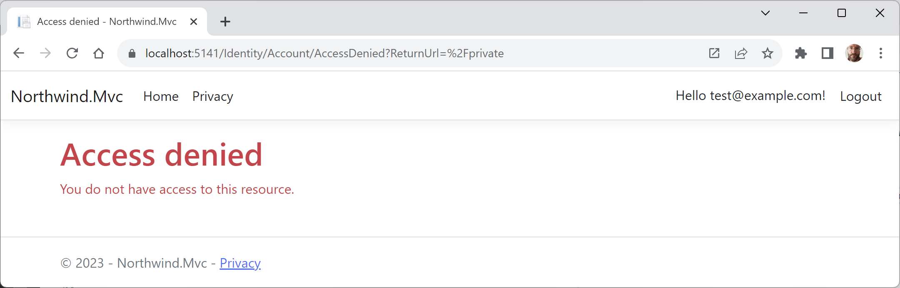

**Authorization using roles**

- [Using a filter to secure an action method](#using-a-filter-to-secure-an-action-method)
- [Enabling role management and creating a role programmatically](#enabling-role-management-and-creating-a-role-programmatically)
- [Testing the admin role](#testing-the-admin-role)

# Using a filter to secure an action method

You might want to ensure that one particular action method of a controller class can only be called by members of certain security roles. You do this by decorating the method with the `[Authorize]` attribute, as described in the following list:
- `[Authorize]`: Only allow authenticated (non-anonymous, logged-in) visitors to access this action method.
- `[Authorize(Roles = "Sales,Marketing")]`: Only allow visitors who are members of the specified role(s) to access this action method.

Let's see an example:

1.	In `HomeController.cs`, import the namespace so we can control which action methods are authorized, as shown in the following code:
```cs
using Microsoft.AspNetCore.Authorization; // To use [Authorize].
```
2.	Add an attribute to the `Privacy` method to only allow access to logged-in users who are members of a group/role named `Administrators`, as shown in the following code:
```cs
[Route("private")]
[Authorize(Roles = "Administrators")]
public IActionResult Privacy()
```
3.	Start the `Northwind.Mvc` website project using the `https` launch profile.
4.	Click **Privacy** and note that you are redirected to the log in page.
5.	Enter your email and password.
6.	Click **Log in** and note the message, **Access denied - You do not have access to this resource**, as shown in *Figure 14A.1*:


*Figure 14A.1: Access denied!*

7.	Close Chrome and shut down the web server.

# Enabling role management and creating a role programmatically

By default, role management is not enabled in an ASP.NET Core MVC project, so we must first enable it before creating roles, and then we will create a controller that will programmatically create an `Administrators` role (if it does not already exist) and assign an admin user to that role:

1.	In `Program.cs`, in the setup of ASP.NET Core Identity and its database, add a call to `AddRoles` to enable role management, as shown in the following code:
```cs
builder.Services.AddDefaultIdentity<IdentityUser>(
  options => options.SignIn.RequireConfirmedAccount = true)
  .AddRoles<IdentityRole>() // Enable role management.
  .AddEntityFrameworkStores<ApplicationDbContext>();
```

> Code: https://github.com/markjprice/cs12dotnet8/blob/main/code/PracticalApps/Northwind.Mvc/Program.cs#L24

2.	In the `Controllers` folder, add an empty controller class file named `RolesController.cs` and modify its contents, as shown in the following code, available at the following link: https://github.com/markjprice/cs12dotnet8/blob/main/code/PracticalApps/Northwind.Mvc/Controllers/RolesController.cs
```cs
using Microsoft.AspNetCore.Identity; // To use RoleManager, UserManager.
using Microsoft.AspNetCore.Mvc; // To use Controller, IActionResult.

using static System.Console;

namespace Northwind.Mvc.Controllers;

public class RolesController : Controller
{
  private string _adminRole = "Administrators";
  private string _adminUserEmail = "admin@example.com";
  private readonly RoleManager<IdentityRole> _roleManager;
  private readonly UserManager<IdentityUser> _userManager;

  public RolesController(RoleManager<IdentityRole> roleManager,
    UserManager<IdentityUser> userManager)
  {
    _roleManager = roleManager;
    _userManager = userManager;
  }

  public async Task<IActionResult> Index()
  {
    if (!(await _roleManager.RoleExistsAsync(_adminRole)))
    {
      await _roleManager.CreateAsync(new IdentityRole(_adminRole));
    }

    IdentityUser? user = await _userManager
      .FindByEmailAsync(_adminUserEmail);

    if (user is null)
    {
      user = new()
      {
        UserName = _adminUserEmail,
        Email = _adminUserEmail
      };

      IdentityResult result = await _userManager
        .CreateAsync(user, "Pa$$w0rd");

      if (result.Succeeded)
      {
        WriteLine($"User {user.UserName} created successfully.");
      }
      else
      { 
        foreach (IdentityError error in result.Errors)
        {
          WriteLine(error.Description);
        }
      }
    }

    if (!user.EmailConfirmed)
    {
      string token = await _userManager
        .GenerateEmailConfirmationTokenAsync(user);

      IdentityResult result = await _userManager
        .ConfirmEmailAsync(user, token);

      if (result.Succeeded)
      {
        WriteLine($"User {user.UserName} email confirmed successfully.");
      }
      else
      {
        foreach (IdentityError error in result.Errors)
        {
          WriteLine(error.Description);
        }
      }
    }

    if (!(await _userManager.IsInRoleAsync(user, _adminRole)))
    {
      IdentityResult result = await _userManager
        .AddToRoleAsync(user, _adminRole);

      if (result.Succeeded)
      {
        WriteLine($"User {user.UserName} added to {_adminRole} successfully.");
      }
      else
      {
        foreach (IdentityError error in result.Errors)
        {
          WriteLine(error.Description);
        }
      }
    }
    return Redirect("/");
  }
}
```
Note the following:
- Two fields for the name of the role and email of the user.
- The constructor gets and stores the registered user and role manager dependency services.
- If the `Administrators` role does not exist, we use the role manager to create it.
- We try to find a test user by its email, create it if it does not exist, and then assign the user to the `Administrators` role.
- Since the website uses DOI, we must generate an email confirmation token and use it to confirm the new users email address.
- Success messages and any errors are written out to the console.
- You will be automatically redirected to the home page.

# Testing the admin role

1.	Start the `Northwind.Mvc` website project using the `https` launch profile.
2.	Click **Privacy** and note that you are redirected to the login page.
3.	Enter your email and password. (I used `test@example.com`.)
4.	Click **Log in** and note that you are denied access as before.
5.	Click **Home**.
6.	In the address bar, manually enter `roles` as a relative URL path, as shown in the following link: https://localhost:5141/roles.
7.	View the success messages written to the console, as shown in the following output:
```
User admin@example.com created successfully.
User admin@example.com email confirmed successfully.
User admin@example.com added to Administrators successfully.
```
8.	Click **Logout**, because you must log out and log back in to load your role memberships when they are created after you have already logged in.
9.	Try accessing the **Privacy** page again, enter the email for the new admin user that was programmatically created, for example, `admin@example.com`, and their password, and then click **Log in**, and you should now have access.
10.	Close Chrome and shut down the web server.
