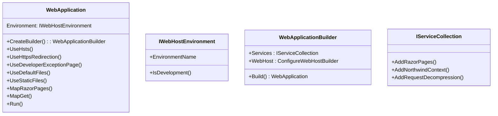

# Chapter 13 - ASP.NET Core common classes and methods



To create a web application in .NET, you create and run a `WebApplication` instance, as shown in the following code:
```cs
WebApplication app = new();
app.Run();
```
> **Warning!** In practice, you will never use code as shown in the preceding block!

You will always need to configure the web application before you run it, and the easiest way to do that is to use a design pattern called **Builder**, as shown in the following code:
```cs
WebApplicationBuilder builder = WebApplication.CreateBuilder(args);

// Configure the builder and then build the web application.

WebApplication app = builder.Build();

app.Run();
```

> The preceding code shows the types of the `builder` object (`WebApplicationBuilder`) and the `app` object (`WebApplication`). Most developers and the project templates use `var` instead which I don't like because it hides whats really happening.

```cs
var builder = WebApplication.CreateBuilder(args);

// Configure the builder and then build the web application.

var app = builder.Build();

app.Run();
```
