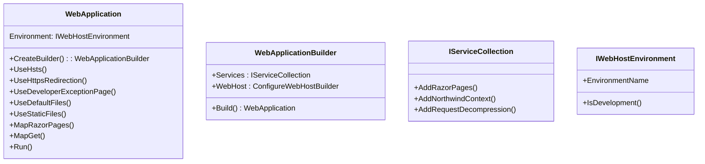

# Chapter 13 - ASP.NET Core common classes and methods

```mermaid
classDiagram
    class WebApplication {
        +CreateBuilder() : WebApplicationBuilder
        Environment: IWebHostEnvironment
        +UseHsts()
        +UseHttpsRedirection()
        +UseDeveloperExceptionPage()
        +UseDefaultFiles()
        +UseStaticFiles()
        +MapRazorPages()
        +MapGet()
        +Run()
    }
    
    class WebApplicationBuilder {
        +Build() WebApplication
        +Services : IServiceCollection
        +WebHost : ConfigureWebHostBuilder
    }

    class IServiceCollection {
        +AddRazorPages()
        +AddNorthwindContext()
        +AddRequestDecompression()
    }
    
    class IWebHostEnvironment {
        +IsDevelopment()
        +EnvironmentName
    }
```