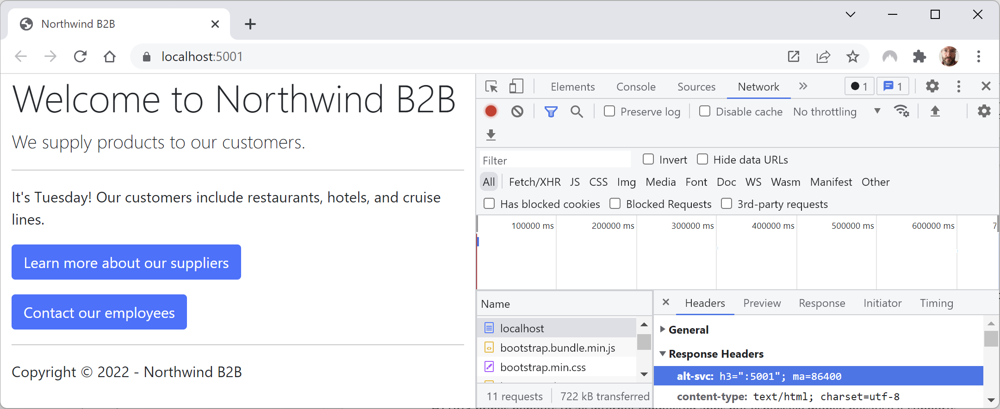

**Enabling HTTP/3 and request decompression support**

- [Introducing HTTP/3](#introducing-http3)
  - [Enabling HTTP/3 support](#enabling-http3-support)
  - [Testing if HTTP/3 is enabled](#testing-if-http3-is-enabled)
  - [HTTP/3 and self-signed certificates](#http3-and-self-signed-certificates)
    - [✅ Server-Side (ASP.NET Core)](#-server-side-aspnet-core)
    - [⚠️ Client-Side Limitations](#️-client-side-limitations)
    - [Summary](#summary)
  - [Step-by-Step Setup](#step-by-step-setup)
    - [1. Create a Self-Signed Certificate](#1-create-a-self-signed-certificate)
    - [2. Add the Certificate to Your Project](#2-add-the-certificate-to-your-project)
    - [3. Configure `Kestrel` for HTTP/3 + TLS](#3-configure-kestrel-for-http3--tls)
    - [4. Enable HTTP/3 in `appsettings.json` *(optional)*](#4-enable-http3-in-appsettingsjson-optional)
    - [5. Trust the Certificate (Localhost)](#5-trust-the-certificate-localhost)
      - [On Windows:](#on-windows)
      - [On macOS:](#on-macos)
    - [6. Check HTTP/3 Is Working](#6-check-http3-is-working)
- [Introducing request decompression](#introducing-request-decompression)
  - [Enabling request decompression support](#enabling-request-decompression-support)

# Introducing HTTP/3

**HTTP/3** uses the same request methods, like `GET` and `POST`, the same status codes, like `200` and `404`, and the same headers, but encodes them and maintains session state differently because it runs over QUIC rather than the older and less efficient Transmission Control Protocol (TCP).

At the time of writing in July 2023, HTTP/3 is supported by about 95% of tracked browsers and 26% of the top 10 million websites. Chromium-based browsers like Chrome, Edge, and Opera since 2020. It is more recently supported by Firefox and Safari on macOS and iOS (although it is disabled by default).

> **More Information**: Usage statistics of HTTP/3 for websites: https://w3techs.com/technologies/details/ce-http3 and Can I use HTTP/3? https://caniuse.com/?search=HTTP%2F3.

HTTP/3 brings benefits to all internet-connected apps, but especially mobile, because it supports connection migration using UDP with TLS built in, so the device does not need to reconnect when moving between WiFi and cellular networks. Each frame of data is encrypted separately so it no longer has the head-of-line blocking problem in HTTP/2 that happens if a TCP packet is lost and therefore all the streams are blocked until the data can be recovered.

## Enabling HTTP/3 support

.NET 8 previews enabled HTTP/3 by default so you did not need to enable it yourself. But in the release candidate, the team decided to disable it again. They did this due to a bad experience caused by some anti-virus software. Hopefully in ASP.NET Core 9 they will solve this issue and re-enable HTTP/3 by default. You can read more about this issue at the following link:
https://devblogs.microsoft.com/dotnet/asp-net-core-updates-in-dotnet-8-rc-1/#http-3-disabled-by-default

.NET 6 supported HTTP/3 as a preview feature for both clients and servers. .NET 7 delivered final full support for the following operating systems:
- Windows 11 and Windows Server 2022.
- Linux; you can install QUIC support using sudo apt install libmsquic.

If you have one of the supported operating systems listed above, let's enable HTTP/3 support in the `Northwind.Web` project:

1.	In `Program.cs`, import the namespace for working with HTTP protocols, as shown in the following code:
```cs
using Microsoft.AspNetCore.Server.Kestrel.Core; // To use HttpProtocols.
```
2.	In `Program.cs`, add statements before the call to `Build` to enable all three versions of HTTP, as shown in the following code:
```cs
builder.WebHost.ConfigureKestrel((context, options) =>
{
  options.ConfigureEndpointDefaults(listenOptions =>
  {
    listenOptions.Protocols = HttpProtocols.Http1AndHttp2AndHttp3;
    listenOptions.UseHttps(); // HTTP/3 requires secure connections.
  });
});
```
3. In the `Properties` folder, in `launchSettings.json`, make sure that the `https` entry in `applicationUrl` comes first so that it is used by default, as shown in the following markup:
```json
"https": {
  "commandName": "Project",
  "dotnetRunMessages": true,
  "launchBrowser": true,
  "applicationUrl": "https://localhost:5131;http://localhost:5130",
  "environmentVariables": {
    "ASPNETCORE_ENVIRONMENT": "Production"
  }
},
```

> **Good Practice**: You should enable more than just HTTP/3 since some browsers still do not support it or even HTTP/2.

## Testing if HTTP/3 is enabled

HTTP/3 is discovered as an upgrade from HTTP/1.1 or HTTP/2 via the `alt-svc` header. That means the first request will normally use HTTP/1.1 or HTTP/2 before switching to HTTP/3. Kestrel automatically adds the `alt-svc` header if HTTP/3 is enabled.

To determine if HTTP/3 is enabled for a website project, we must set an increased level of logging:

1.	In `appSettings.json`, add an entry to show hosting diagnostics, as shown in the following configuration:
```json
{
  "Logging": {
    "LogLevel": {
      "Default": "Information",
      "Microsoft.AspNetCore": "Warning",
      // Enable logging of HTTP version.
      "Microsoft.AspNetCore.Hosting.Diagnostics": "Information"
    }
```
2.	Start the website project using the `https` launch profile.
3.	In Chrome, view Developer tools and select the **Network** tab.
4.	Navigate to https://localhost:5131/, and note the **Response Headers** include an entry for `alt-svc` with a value of `h3` indicating Kestrel has enabled HTTP/3 support, as shown in *Figure 13B.1*:

 
*Figure 13B.1: Kestrel enabling support for HTTP/3*

5. Unfortunately, if you review the output at the command prompt or terminal, or review Chrome diagnostic tools, you will find that the connection uses HTTP/2. This is because, "Browsers don't allow self-signed certificates on HTTP/3, such as the Kestrel development certificate", as described here: https://learn.microsoft.com/en-us/aspnet/core/fundamentals/servers/kestrel/http3#localhost-testing. The official documentation does not show a work around because Microsoft decided the steps are too difficult. You can read about the issue here if you want to try the complex workaround: https://github.com/dotnet/AspNetCore.Docs/issues/23700. RTD wrote more detailed instructions that you can read here: https://github.com/markjprice/cs12dotnet8/issues/15#issuecomment-1987353759.

6.	Close Chrome and shut down the web server.

You can learn more about .NET support for HTTP/3 at the following links:
- HTTP/3 support in .NET: https://devblogs.microsoft.com/dotnet/http-3-support-in-dotnet-6/.
- .NET Networking Improvements – HTTP/3 and QUIC: https://devblogs.microsoft.com/dotnet/dotnet-6-networking-improvements/#http-3-and-quic.
- Use HTTP/3 with the ASP.NET Core Kestrel web server: https://learn.microsoft.com/en-us/aspnet/core/fundamentals/servers/kestrel/http3.

## HTTP/3 and self-signed certificates

In my book, we secured our ASP.NET Core web projects using a self-signed certificate. **HTTP/3 can work with self-signed certificates in ASP.NET Core**, but with important caveats—**particularly on the client side**. The server (ASP.NET Core) itself doesn’t care whether the certificate is self-signed or issued by a trusted CA, **as long as it’s valid and matches the domain**. The real constraint lies in **client behavior**, such as browsers or HTTP clients, which usually reject self-signed certificates unless explicitly told to trust them.

### ✅ Server-Side (ASP.NET Core)

ASP.NET Core can use **Kestrel** as its web server. As of .NET 6 and newer, Kestrel **supports HTTP/3** via QUIC, which itself requires TLS 1.3 (which is only supported by certificates with appropriate key types and ciphers).

Kestrel will happily accept **any valid TLS certificate**, including a self-signed one, as long as:

- It uses **TLS 1.3**
- It supports **ECC or RSA keys compatible with QUIC**
- It's properly loaded and bound to HTTPS

### ⚠️ Client-Side Limitations

HTTP/3 **requires encryption** (like HTTP/2), so TLS negotiation happens early. With a **self-signed certificate**, most clients (browsers, curl, .NET's `HttpClient`, etc.) will **refuse the connection unless you take steps to trust the certificate**.

Modern browsers like Chrome and Edge support HTTP/3 (over QUIC), but:

- They **strictly enforce certificate trust**
- You must **import your self-signed cert into the OS/browser trust store**
- You may need to start the browser with flags to allow HTTP/3 with self-signed certs (uncommon and not user-friendly)

You can configure `HttpClient` to skip certificate validation for testing, as shown in the following code:

```cs
SocketsHttpHandler handler = new()
{
  SslOptions = new SslClientAuthenticationOptions
  {
    RemoteCertificateValidationCallback = (sender, certificate, chain, sslPolicyErrors) => true
  }
};
handler.EnableMultipleHttp2Connections = true;
handler.AllowAutoRedirect = true;

using HttpClient client = new(handler);
var result = await client.GetAsync("https://localhost");
```

> **Warning!** This should **never** be done in production.

### Summary

| Area           | Works with Self-Signed Cert? | Notes |
|----------------|------------------------------|-------|
| Kestrel Server | ✅ Yes                        | Just configure properly |
| HTTP/3         | ✅ Yes                        | QUIC requires TLS 1.3 |
| Browsers       | ⚠️ Maybe                     | Must import and trust cert |
| `curl`         | ✅ Yes with `-k`              | Works for testing |
| `HttpClient`   | ✅ Yes with workaround        | Trust override needed |

> **More Information**: [Microsoft Docs – HTTP/3 in ASP.NET Core](https://learn.microsoft.com/en-us/aspnet/core/fundamentals/servers/kestrel/http3) and [.NET GitHub Discussions](https://github.com/dotnet/aspnetcore/issues/28044).

If you're testing locally or in a closed environment, self-signed certs are fine with some fiddling. But for anything public-facing, it's not worth the hassle—just use *Let's Encrypt* or a real CA. 

## Step-by-Step Setup

Here’s a step-by-step example of how to set up **ASP.NET Core with HTTP/3 using a self-signed certificate** on `localhost`. This is useful for testing and development.

### 1. Create a Self-Signed Certificate

Use `dotnet dev-certs` to create a certificate for `localhost` and store it in a `.pfx` file, as shown in the following command:

```bash
dotnet dev-certs https --export-path ./localhost.pfx --password password123
```

### 2. Add the Certificate to Your Project

Place the `localhost.pfx` file in your ASP.NET Core project’s root or a secure path, for example, `certs/localhost.pfx`).

### 3. Configure `Kestrel` for HTTP/3 + TLS

Edit `Program.cs` to configure Kestrel to use the certificate and enable HTTP/3 as well as older protocols, as shown in the following code:

```cs
var builder = WebApplication.CreateBuilder(args);

builder.WebHost.ConfigureKestrel(options =>
{
  options.ListenAnyIP(443, listenOptions =>
  {
    listenOptions.UseHttps("certs/localhost.pfx", "password123");
    listenOptions.Protocols = HttpProtocols.Http1AndHttp2AndHttp3;
  });
});
```

### 4. Enable HTTP/3 in `appsettings.json` *(optional)*

Alternatively, configure in `appsettings.json`, as shown in the following JSON:

```json
{
  "Kestrel": {
    "Endpoints": {
      "Https": {
        "Url": "https://localhost:443",
        "Protocols": "Http1AndHttp2AndHttp3",
        "Certificate": {
          "Path": "certs/localhost.pfx",
          "Password": "password123"
        }
      }
    }
  }
}
```

### 5. Trust the Certificate (Localhost)

#### On Windows:

- Open **Manage Computer Certificates**
- Find your cert under **Personal > Certificates**
- Right-click > All Tasks > Export if needed
- Copy it to **Trusted Root Certification Authorities**

#### On macOS:

```bash
sudo security add-trusted-cert -d -r trustRoot -k /Library/Keychains/System.keychain localhost.pfx
```

> You may need to convert `.pfx` to `.crt`/`.pem` with `openssl` first.

### 6. Check HTTP/3 Is Working

In a browser:

- Go to `https://localhost`
- Open DevTools > Network tab
- Add the “Protocol” column
- Reload the page

You should see **`h3`** (HTTP/3) as the protocol.

> **Warning!** If you see `http/2` or `http/1.1`, your browser or OS might be defaulting to a fallback due to cert or connection issues.

# Introducing request decompression

To make HTTP requests and responses more efficient, the HTTP body content can be compressed using standard algorithms like gzip, Brotli, and Deflate, and an HTTP header is added to indicate which was used.
In the past, the developer had to implement decompression before processing the body if a browser sent a compressed request. With ASP.NET Core 7 or later, middleware to do this for you is built in and just needs to be added to the pipeline.

Unfortunately, this is tricky to try out because browsers cannot initiate a compressed request. This is because the browser cannot know if the server can handle it. Compression is normally enabled by the browser sending an uncompressed request with a header informing the server what algorithms the browser understands, as shown in the following request:
```
Accept-Encoding: gzip, deflate, br, compress
```
The server can then decide to compress its response and it sets a similar header in its response if it does, as shown in the following response:
```
Content-Encoding: gzip
```

## Enabling request decompression support

We will just see how to enable the server side to receive HTTP requests with compressed body content in those rare scenarios where the browser or another client makes one:

1.	In the `Northwind.Web` project, in `Program.cs`, add statements after the call to `AddNorthwindContext` to add the request compression middleware, as shown in the following code:
```cs
builder.Services.AddRequestDecompression();
```
2.	In `Program.cs`, add statements after the call to use HTTPS redirection to use request decompression, as shown in the following code:
```cs
app.UseRequestDecompression();
```
