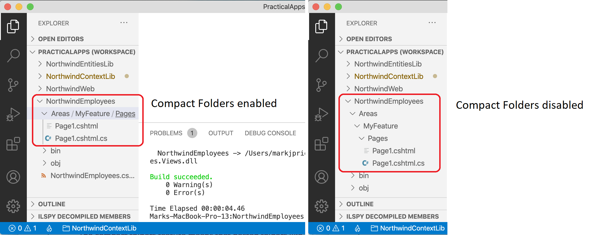
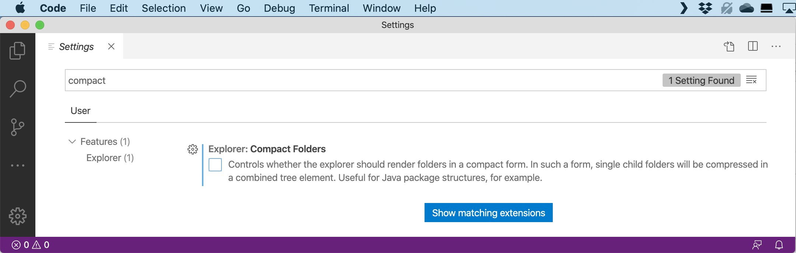
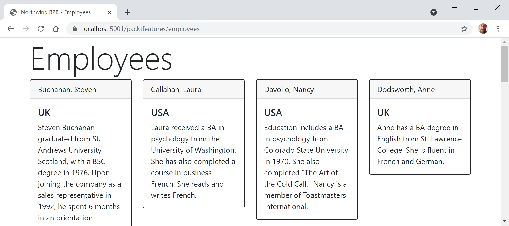

**Using Razor class libraries**

- [Introducing Razor class libraries](#introducing-razor-class-libraries)
- [Disabling compact folders for Visual Studio Code](#disabling-compact-folders-for-visual-studio-code)
- [Creating a Razor class library](#creating-a-razor-class-library)
- [Implementing a partial view to show a single employee](#implementing-a-partial-view-to-show-a-single-employee)
- [Setting the shared layout](#setting-the-shared-layout)
- [Implementing a Razor Page to show all employees](#implementing-a-razor-page-to-show-all-employees)
- [Using and testing a Razor class library](#using-and-testing-a-razor-class-library)

# Introducing Razor class libraries

Everything related to a Razor Page can be compiled into a class library for easier reuse in multiple projects. With ASP.NET Core 3 and later, this can include static files such as HTML, CSS, JavaScript libraries, and media assets such as image files. A website can either use the Razor Page's view as defined in the class library or override it.

# Disabling compact folders for Visual Studio Code

Before we implement our Razor class library, I want to explain a Visual Studio Code feature that confused some readers of a previous edition because the feature was added after publishing.

The compact folders feature means that nested folders such as `/Areas/MyFeature/Pages/` are shown in a compact form if the intermediate folders in the hierarchy do not contain files, as shown in *Figure 13A.1*:
 

*Figure 13A.1: Compact folders enabled or disabled*

If you would like to disable the Visual Studio Code compact folders feature, complete the following steps:

1.	On Windows, navigate to **File** | **Preferences** | **Settings**. On macOS, navigate to **Code** | **Preferences** | **Settings**.
2.	In the **Search settings** box, enter `compact`.
3.	Clear the **Explorer: Compact Folders** checkbox, as shown in *Figure 13A.2*:


*Figure 13A.2: Disabling compact folders for Visual Studio Code*

4.	Close the **Settings** tab.

# Creating a Razor class library

Let's create a new Razor class library:

1.	Use your preferred code editor to open the `PracticalApps` solution and then add a new project, as defined in the following list:
    - Project template: **Razor Class Library** / `razorclasslib`
    - Project file and folder: `Northwind.Razor.Employees`
    - **Support pages and views** check box: Selected. Or at the command prompt, add this switch: `-s`
    - Solution file and folder: `PracticalApps`

> `-s` is short for the `--support-pages-and-views` switch, which enables the class library to use Razor Pages and `.cshtml` file views.

2.	In the `Northwind.Razor.Employees` project, add a project reference to the `Northwind.DataContext` project for either SQLite or SQL Server and note the SDK is Microsoft.NET.Sdk.Razor, as shown highlighted in the following markup:
```xml
<Project Sdk="Microsoft.NET.Sdk.Razor">

  <PropertyGroup>
    <TargetFramework>net8.0</TargetFramework>
    <Nullable>enable</Nullable>
    <ImplicitUsings>enable</ImplicitUsings>
    <AddRazorSupportForMvc>true</AddRazorSupportForMvc>
  </PropertyGroup>

  <ItemGroup>
    <FrameworkReference Include="Microsoft.AspNetCore.App" />
  </ItemGroup>

  <!-- change Sqlite to SqlServer if you prefer -->
  <ItemGroup>
    <ProjectReference Include="..\Northwind.DataContext.Sqlite\Northwind.DataContext.Sqlite.csproj" />
  </ItemGroup>

</Project>
```

> **Warning!** The project reference must go all on one line with no line break. Also, do not mix our SQLite and SQL Server projects or you will see compiler errors. If you used SQL Server in the `Northwind.Web` project, then you must use SQL Server in the `Northwind.Razor.Employees` project as well.

3.	Build the `Northwind.Razor.Employees` project.

# Implementing a partial view to show a single employee

The `<partial>` tag helper was introduced in ASP.NET Core 2.1. A partial view is like a piece of a Razor Page. You will create one in the next few steps to render a single employee:

1.	In the `Northwind.Razor.Employees` project, expand the `Areas` folder, right-click the `MyFeature` folder, select **Rename**, enter the new name `PacktFeatures`, and press *Enter*.
2.	In the `PacktFeatures` folder, in the `Pages` folder, create a `Shared` folder.
3.	In the `Shared` folder, create a file named `_Employee.cshtml`. (The Visual Studio 2022 item template is named **Razor View - Empty**.)
4.	In `_Employee.cshtml`, add markup to output an employee using a Bootstrap card, as shown in the following markup:
```html
@model Northwind.EntityModels.Employee
<div class="card border-dark mb-3" style="max-width: 18rem;">
  <div class="card-header">@Model?.LastName, @Model?.FirstName</div>
  <div class="card-body text-dark">
    <h5 class="card-title">@Model?.Country</h5>
    <p class="card-text">@Model?.Notes</p>
  </div>
</div>
```

While reviewing the preceding markup, note the following:
- By convention, the names of partial views start with an underscore.
- If you put a partial view in the `Shared` folder, then it can be found automatically.
- The model type for this partial view is a single `Employee` entity.
- We use Bootstrap card styles to output information about each employee.

# Setting the shared layout

Next, we tell the Razor Pages in this class library to use the same shared layout as any in the main project:

1.	In the `PacktFeatures` folder, in the `Pages` subfolder, add a new file named `_ViewStart.cshtml`. (The Visual Studio item template is named **Razor View Start**. Or just copy it from the `Northwind.Web` project.)
2.	If you are using Visual Studio Code, modify its content to inform this class library that any Razor Pages should look for a layout with the same name as used in the `Northwind.Web` project, as shown in the following markup:
```cs
@{
  Layout = "_Layout";
}
```

> We do not need to create the `_Layout.cshtml` file in this class library project. It will use the one in its host project, for example, the one in the `Northwind.Web` project.

# Implementing a Razor Page to show all employees

Finally, we create a Razor Page to show a list of all employees using the partial view to render individual employee entities:

1.	In the `Pages` subfolder, rename `Page1.cshtml` to `EmployeesList.cshtml`, and, if the code-behind file is not automatically renamed, then manually rename `Page1.cshtml.cs` to `EmployeesList.cshtml.cs`.
2.	In `EmployeesList.cshtml.cs`, define a page model with an array of `Employee` entity instances loaded from the Northwind database, as shown in the following code:
```cs
using Microsoft.AspNetCore.Mvc.RazorPages; // To use PageModel.
using Northwind.EntityModels; // To use Employee, NorthwindContext.

namespace PacktFeatures.Pages;

public class EmployeesListPageModel : PageModel
{
  private NorthwindContext _db;

  public EmployeesListPageModel(NorthwindContext db)
  {
    _db = db;
  }

  public Employee[] Employees { get; set; } = null!;

  public void OnGet()
  {
    ViewData["Title"] = "Northwind B2B - Employees";

    Employees = _db.Employees.OrderBy(e => e.LastName)
      .ThenBy(e => e.FirstName).ToArray();
  }
}
```
3.	In `EmployeesList.cshtml`, add markup to render all of the employees in the page model using a partial view named `_Employee`, as shown in the following markup:
```html
@page
@using Northwind.EntityModels
@addTagHelper *, Microsoft.AspNetCore.Mvc.TagHelpers 
@model PacktFeatures.Pages.EmployeesListPageModel

<div class="row">
  <h1 class="display-2">Employees</h1>
</div>
<div class="row">
@foreach(Employee employee in Model.Employees)
{
  <div class="col-sm-3">
    <!--This will look in Pages\Shared for _Employee.cshtml
        and pass the employee model to it.-->
    <partial name="_Employee" model="employee" />
  </div>
}
</div>
```

While reviewing the preceding markup, note the following:
- We import the `Northwind.EntityModels` namespace so that we can use classes in it such as `Employee`.
- We add support for tag helpers so that we can use the `<partial>` element.
- We declare the `@model` type for this Razor Page to use the page model class that you just defined.
- We enumerate through the `Employees` in the model, outputting each one using a partial view.

# Using and testing a Razor class library

You will now reference and use the Razor class library in the website project:

1.	In the `Northwind.Web` project, add a project reference to the `Northwind.Razor.Employees` project, as shown in the following markup:
```xml
<ProjectReference Include="..\Northwind.Razor.Employees\Northwind.Razor.Employees.csproj" />
```
2.	In `Pages\index.cshtml`, add a paragraph with a link to the Packt feature employees list page after the link to the suppliers page, as shown in the following markup:
```xml
<p>
  <a class="btn btn-primary" href="packtfeatures/employeeslist">
    Contact our employees
  </a>
</p>
```
3.	Start the website using the `https` launch profile.
4.  Visit the website home page, and click the **Contact our employees** button to see the cards of employees, as shown in *Figure 13A.3*:
 

*Figure 13A.3: A list of employees from a Razor class library feature*
