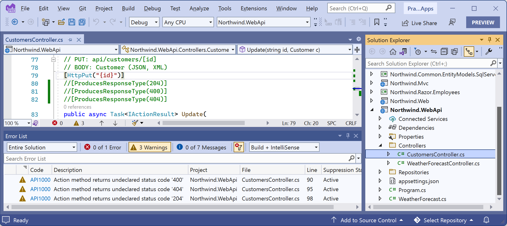
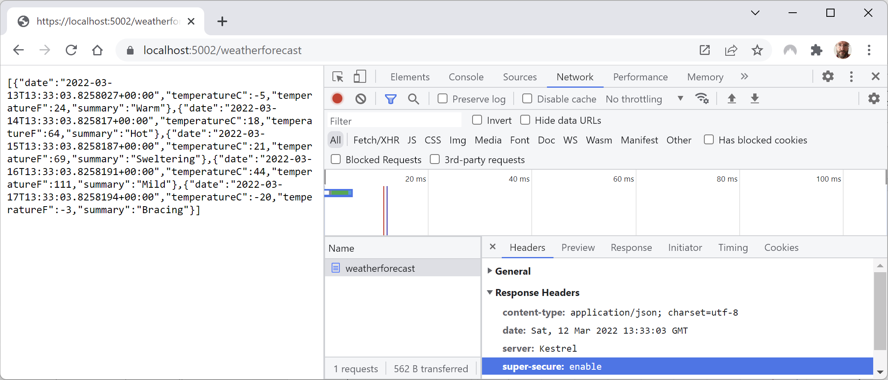

**Implementing advanced features for web services**

Now that you have seen the fundamentals of building a web service and then calling it from a client, let's look at some more advanced features.

- [Implementing a Health Check API](#implementing-a-health-check-api)
- [Implementing Open API analyzers and conventions](#implementing-open-api-analyzers-and-conventions)
- [Adding security HTTP headers](#adding-security-http-headers)
- [Enabling HTTP/3 support for HttpClient](#enabling-http3-support-for-httpclient)

# Implementing a Health Check API

There are many paid services that perform site availability tests that are basic pings, some with more advanced analysis of the HTTP response.

ASP.NET Core 2.2 and later make it easy to implement more detailed website health checks. For example, your website might be live, but is it ready? Can it retrieve data from its database?

Let's add basic health check capabilities to our web service:

1.	In the `Northwind.WebApi` project, add package references to enable Entity Framework Core database health checks, as shown in the following markup:
```xml
<PackageReference Include="AspNetCore.HealthChecks.SqlServer" Version="7.0.0" />
<PackageReference Include="Microsoft.Extensions.Diagnostics.HealthChecks.EntityFrameworkCore" Version="8.0.0" />
```

> **Warning!** `AspNetCore.HealthChecks.SqlServer` is not officially supported by Microsoft. At the time of writing version `7.0.0` was still a release candidate so you might have to use `7.0-*` until the final version is released.

2.	Build the `Northwind.WebApi` project to restore packages.
3.	In `Program.cs`, before the call to `Build`, add a statement to add health checks, including to the Northwind database context, and if you are using SQL Server instead of SQLite, as shown in the following code:
```cs
builder.Services.AddHealthChecks()
  .AddDbContextCheck<NorthwindContext>()
  // Execute SELECT 1 using the specified connection string.
  .AddSqlServer("Data Source=.;Initial Catalog=Northwind;Integrated Security=true;TrustServerCertificate=true;");
```

By default, the database context check calls EF Core's `IDatabaseCreator.CanConnectAsync` method. You can customize the method that is run by setting its name as a parameter in the `AddDbContextCheck` method.

4.	In `Program.cs`, before the call to `MapControllers`, add a statement to use basic health checks, as shown in the following code:
```cs
app.UseHealthChecks(path: "/howdoyoufeel");
```
5.	Start the `Northwind.WebApi` web service project using the `https` launch profile.
6.	Start Chrome.
7.	Navigate to https://localhost:5151/howdoyoufeel and note that the web service responds with a plain text response: `Healthy`.
8.	If you are using SQL Server, note the SQL statement that was executed to test the health of the database, as shown in the following output:
```
Level: Debug, Event Id: 20100, State: Executing DbCommand [Parameters=[], CommandType='Text', CommandTimeout='30']
SELECT 1
```
9.	Close Chrome and shut down the web server.

# Implementing Open API analyzers and conventions

In this chapter, you learned how to enable Swagger to document a web service by manually decorating a controller class with attributes.

In ASP.NET Core 2.2 or later, there are API analyzers that reflect over controller classes that have been annotated with the `[ApiController]` attribute to document them automatically. The analyzer assumes some API conventions. After installing the analyzers, controllers that have not been properly decorated should have warnings (green squiggles) and warnings when you compile the source code.

To use it, your project must enable the OpenAPI Analyzers:

1.	In the `Northwind.WebApi` project file, add the element that enables the OpenAPI Analyzers, as shown in the following markup:
```xml
<PropertyGroup>
  <TargetFramework>net8.0</TargetFramework>
  <Nullable>enable</Nullable>
  <ImplicitUsings>enable</ImplicitUsings>
  <InvariantGlobalization>false</InvariantGlobalization>
  <IncludeOpenAPIAnalyzers>true</IncludeOpenAPIAnalyzers>
</PropertyGroup>
```
2.	In `CustomersController.cs`, for the `Update` action method, comment out the three `[ProducesResponseType]` attributes, as shown in the following code:
```cs
// [ProducesResponseType(204)]
// [ProducesResponseType(400)]
// [ProducesResponseType(404)]
public async Task<IActionResult> Update(
  string id, [FromBody] Customer c)
```
3.	Note the warnings in **Error List** or **PROBLEMS**, as shown in *Figure 15A.1*:


*Figure 15A.1: Warnings from the OpenAPI Analyzers*

4.	Uncomment the three attributes to remove the warnings.

Automatic code fixes can then add the appropriate `[Produces]` and `[ProducesResponseType]` attributes, although this only currently works in Visual Studio 2022. In Visual Studio Code, you will see warnings about where the analyzer thinks you should add attributes, but you must add them yourself.

# Adding security HTTP headers

ASP.NET Core has built-in support for common security HTTP headers like HSTS. But there are many more HTTP headers that you should consider implementing.

The easiest way to add these headers is using a middleware class. First, we will create our own, and then I will point you to a GitHub repository that implements a full one.

Let's see how you could build your own middleware:

1.	In the `Northwind.WebApi` project/folder, add a new folder named `Middleware`.
2.  In the `Middleware` folder, create a file named `SecurityHeadersMiddleware.cs`.
3.  Modify its statements, as shown in the following code:
```cs
using Microsoft.Extensions.Primitives; // To use StringValues.

public class SecurityHeaders
{
  private readonly RequestDelegate next;

  public SecurityHeaders(RequestDelegate next)
  {
    this.next = next;
  }

  public Task Invoke(HttpContext context)
  {
    // Add any HTTP response headers you want here.
    context.Response.Headers.Append(
      "super-secure", new StringValues("enable"));

    return next(context);
  }
}
```
4.	In `Program.cs`, before the call to `MapControllers`, add a statement to register the middleware, as shown in the following code:
```cs
app.UseMiddleware<SecurityHeaders>();
```
5.	Start the web service project using the `https` launch profile.
6.	Start Chrome.
7.	Show Developer tools and its **Network** tab to record requests and responses.
8.	Navigate to https://localhost:5151/weatherforecast.
9.	Note the custom HTTP response header named super-secure that we added, as shown in *Figure 15A.2*:


*Figure 15A.2: Adding a custom HTTP header named super-secure*

> **Good Practice**: Instead of creating your own mechanism to add security headers, you could use Jamie Taylor's, found in the following GitHub repository: https://github.com/GaProgMan/OwaspHeaders.Core/blob/main/README.md.

# Enabling HTTP/3 support for HttpClient

In *Chapter 13, Building Websites Using ASP.NET Core Razor Pages*, you learned how to enable HTTP/3 support in the Kestrel web server. Now we will see how to enable HTTP/3 on the client side:

1.	In the `Northwind.WebApi` project/folder, in `appSettings.json`, add an entry to show hosting diagnostics, as shown in the following configuration:
```json
{
  "Logging": {
    "LogLevel": {
      "Default": "Information",
      "Microsoft.AspNetCore": "Warning",
      "Microsoft.AspNetCore.HttpLogging.HttpLoggingMiddleware": "Information",
      "Microsoft.AspNetCore.Hosting.Diagnostics": "Information"
    }
```
4.	In the `Northwind.Mvc.csproj` project file, add an element to enable HTTP/3 support, as shown in the following markup:
```xml
<ItemGroup>
  <RuntimeHostConfigurationOption Include="System.Net.SocketsHttpHandler.Http3Support" Value="true" />
</ItemGroup>
```
5.	In the `Northwind.Mvc` project, in `Program.cs`, import the namespace for setting the HTTP version, as shown in the following code:
```cs
using System.Net; // To use HttpVersion.
```
5.	In the `Northwind.Mvc` project, in `Program.cs`, add statements to the configuration of the HTTP client for the `Northwind.WebApi` service to set the default version to 3.0, and to fall back to earlier versions if HTTP/3 is not supported by the web service, as shown in the following code:
```cs
builder.Services.AddHttpClient(name: "Northwind.WebApi",
  configureClient: options =>
  {
    options.DefaultRequestVersion = HttpVersion.Version30;
    options.DefaultVersionPolicy = HttpVersionPolicy.RequestVersionOrLower;

    options.BaseAddress = new Uri("https://localhost:5151/");
    options.DefaultRequestHeaders.Accept.Add(
      new MediaTypeWithQualityHeaderValue(
      mediaType: "application/json", quality: 1.0));
  });
```
6.	Start the `Northwind.WebApi` project and confirm that the web service is listening only on port 5151, as shown in the following output:
```
info: Microsoft.Hosting.Lifetime[14]
  Now listening on: https://localhost:5151
```
7.	Start the `Northwind.Mvc` project.
8.	Start Chrome and navigate to https://localhost:5141/.
9.	On the home page, in the customer form, enter a country like `UK`, and then click **Submit**.
10.	At the command prompt or terminal for the web service listening on port 5151, note that the HTTP requests and responses are being made using HTTP/3, as shown in the following output:
```
info: Microsoft.AspNetCore.Hosting.Diagnostics[1]
      Request starting HTTP/3 GET https://localhost:5151/api/customers/?country=UK - -
```
11.	Close Chrome and shut down the two web servers.
