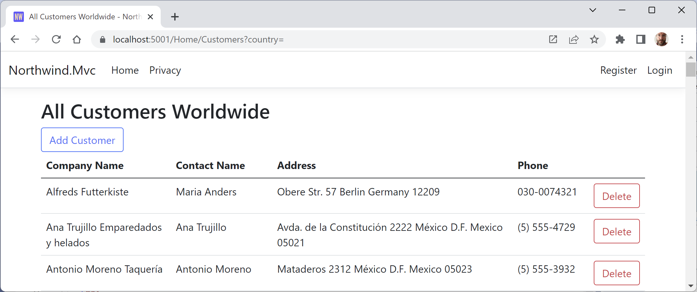
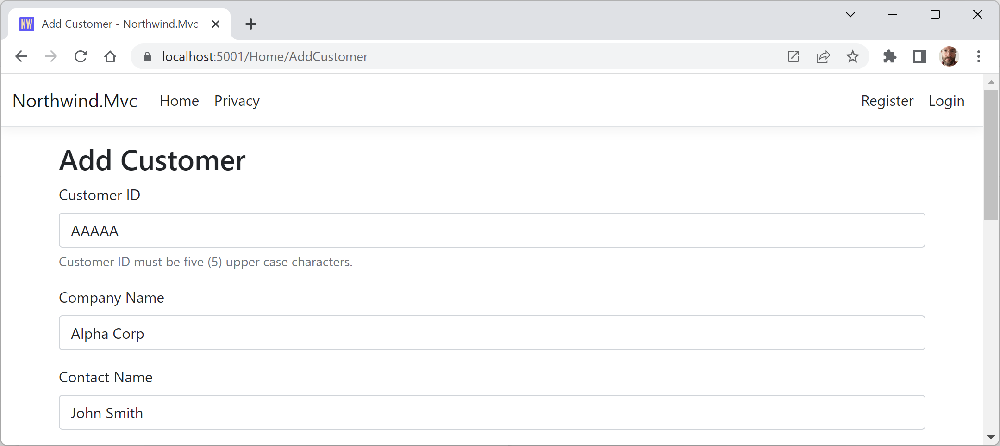
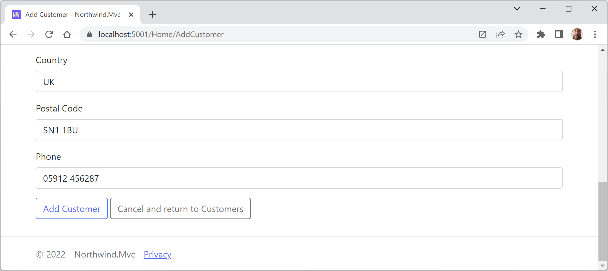
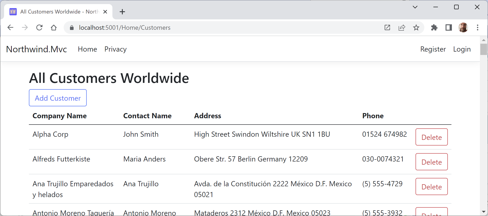
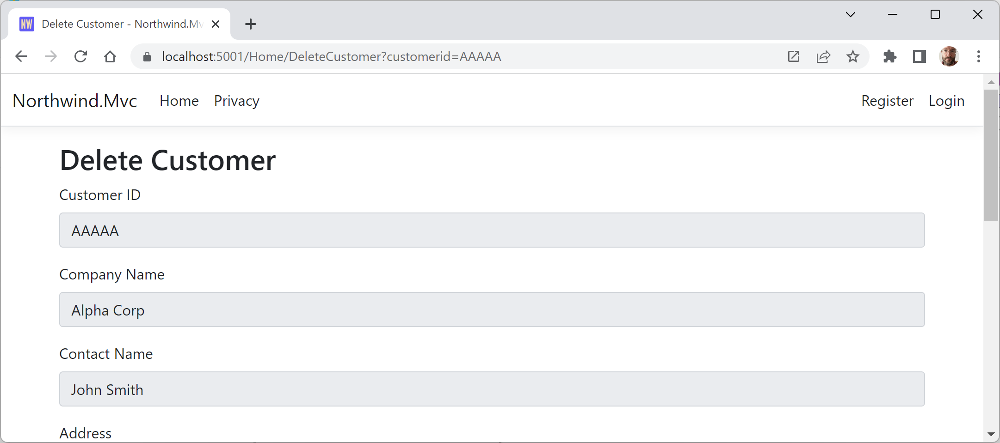
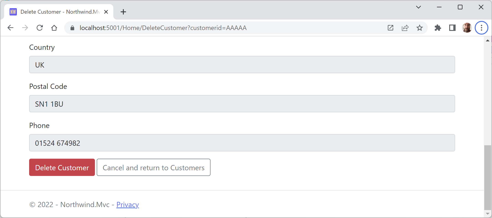

**Exercise 14.2 – Practice creating and deleting customers with HttpClient**

In this exercise, you are tasked to "extend the `Northwind.Mvc` website project to have pages where a visitor can fill in a form to create a new customer, or search for a customer and then delete them. The MVC controller should make calls to the Northwind web service to create and delete customers." 

- [At the top of the Customers.cshtml Razor view](#at-the-top-of-the-customerscshtml-razor-view)
- [In the table of customers](#in-the-table-of-customers)
  - [Table of customers with add and delete buttons](#table-of-customers-with-add-and-delete-buttons)
- [AddCustomer.cshtml Razor view](#addcustomercshtml-razor-view)
  - [Adding a customer, top of form](#adding-a-customer-top-of-form)
  - [Adding a customer, bottom of form](#adding-a-customer-bottom-of-form)
  - [Customer is added to the table](#customer-is-added-to-the-table)
- [DeleteCustomer.cshtml Razor view](#deletecustomercshtml-razor-view)
  - [Deleting a customer, top of form](#deleting-a-customer-top-of-form)
  - [Deleting a customer, bottom of form](#deleting-a-customer-bottom-of-form)

# At the top of the Customers.cshtml Razor view

The project already has a page to show customers, either all of them or only those in a specified country. To avoid work, we will use this existing functionality. We just need to add a button in the `Customers.cshtml` view to **Add Customer**, a **Delete** button in a new column for each customer in the table, and areas to output success and errors messages, as shown in the following code:

```html
@if (TempData["error-message"] is not null)
{
  <p class="alert alert-danger">Error! @TempData["error-message"]</p>
}
@if (TempData["success-message"] is not null)
{
  <p class="alert alert-success">Congratulations! @TempData["success-message"]</p>
}

<a asp-controller="Home" asp-action="AddCustomer" 
   class="btn btn-outline-primary">Add Customer</a>
```

# In the table of customers

Add a blank header column to the table:

```html
<th></th>
```

Add a new column to show the delete buttons:

```html
<td>
  <a asp-controller="Home"
     asp-action="DeleteCustomer" 
     asp-route-customerid="@c.CustomerId" 
     class="btn btn-outline-danger">Delete</a>
</td>
```

## Table of customers with add and delete buttons



A common design pattern for implementing add and delete functionality in an ASP.NET Core MVC website is to define pairs of action methods, one that responds to a `GET` request and one that responds to a `POST` request.

For add functionality:
- `GET /Home/AddCustomer`: This request means show me a page with a blank form to enter information about a new customer.
- `POST /Home/AddCustomer`: This request means perform the actual customer insert using the form data provided in the body which is an entire customer.

For delete functionality:
- `GET /Home/DeleteCustomer/{ID}`: This request means show me a page with a form loaded with an existing customer record to confirm this is the customer the will be deleted.
- `POST /Home/DeleteCustomer`: This request means perform the actual customer delete using the form data provided in the body which only needs to be the unique `customerId`.

Here is some example code that would implement this functionality:
```cs
// GET /Home/AddCustomer
public IActionResult AddCustomer()
{
  ViewData["Title"] = "Add Customer";
  return View();
}

// POST /Home/AddCustomer
// A Customer object in the request body.
[HttpPost]
public async Task<IActionResult> AddCustomer(Customer customer)
{
  HttpClient client = _clientFactory.CreateClient(
    name: "Northwind.WebApi");

  HttpResponseMessage response = await client.PostAsJsonAsync(
    requestUri: "api/customers", value: customer);

  // Optionally, get the created customer back as JSON
  // so the user can see the assigned ID, for example.
  Customer? model = await response.Content
    .ReadFromJsonAsync<Customer>();

  if (response.IsSuccessStatusCode)
  {
    TempData["success-message"] = "Customer successfully added.";
  }
  else
  {
    TempData["error-message"] = "Customer was NOT added.";
  }

  // Show the full customers list to see if it was added.
  return RedirectToAction("Customers");
}

// GET /Home/DeleteCustomer/{customerId}
public async Task<IActionResult> DeleteCustomer(string customerId)
{
  HttpClient client = _clientFactory.CreateClient(
    name: "Northwind.WebApi");

  Customer? customer = await client.GetFromJsonAsync<Customer>(
    requestUri: $"api/customers/{customerId}");

  ViewData["Title"] = "Delete Customer";

  return View(customer);
}

// POST /Home/DeleteCustomer
// A CustomerId in the request body e.g. ALFKI.
[HttpPost]
[Route("home/deletecustomer")]
// Action method name must have a different name from the GET method
// due to C# not allowing duplicate method signatures.
public async Task<IActionResult> DeleteCustomerPost(string customerId)
{
  HttpClient client = _clientFactory.CreateClient(
    name: "Northwind.WebApi");

  HttpResponseMessage response = await client.DeleteAsync(
    requestUri: $"api/customers/{customerId}");

  if (response.IsSuccessStatusCode)
  {
    TempData["success-message"] = "Customer successfully deleted.";
  }
  else
  {
    TempData["error-message"] = $"Customer {customerId} was NOT deleted.";
  }

  // Show the full customers list to see if it was deleted.
  return RedirectToAction("Customers");
}
```

# AddCustomer.cshtml Razor view

```html
@using Northwind.EntityModels
@model Customer
<h2>@ViewData["Title"]</h2>
<!--
  Show an editable form with a blank customer. Postback to the action
  method AddCustomer to perform the actual insert.
-->
<form asp-action="AddCustomer" method="post">
  <div class="mb-3">
    <label class="form-label" asp-for="CustomerId">Customer ID</label>
    <input class="form-control" asp-for="CustomerId" />
    <div class="form-text">
      Customer ID must be five (5) upper case characters.
    </div>
    <span asp-validation-for="CustomerId" class="text-danger" />
  </div>
  <div class="mb-3">
    <label class="form-label" asp-for="CompanyName">Company Name</label>
    <input class="form-control" asp-for="CompanyName" />
    <span asp-validation-for="CompanyName" class="text-danger" />
  </div>
  <div class="mb-3">
    <label class="form-label" asp-for="ContactName">Contact Name</label>
    <input class="form-control" asp-for="ContactName" />
  </div>
  <div class="mb-3">
    <label class="form-label" asp-for="Address">Address</label>
    <input class="form-control" asp-for="Address" />
  </div>
  <div class="mb-3">
    <label class="form-label" asp-for="City">City</label>
    <input class="form-control" asp-for="City" />
  </div>
  <div class="mb-3">
    <label class="form-label" asp-for="Region">Region</label>
    <input class="form-control" asp-for="Region" />
  </div>
  <div class="mb-3">
    <label class="form-label" asp-for="Country">Country</label>
    <input class="form-control" asp-for="Country" />
  </div>
  <div class="mb-3">
    <label class="form-label" asp-for="PostalCode">Postal Code</label>
    <input class="form-control" asp-for="PostalCode" />
  </div>
  <div class="mb-3">
    <label class="form-label" asp-for="Phone">Phone</label>
    <input class="form-control" asp-for="Phone" />
  </div>
  <div class="mb-3">
    <input type="submit" value="Add Customer"
           class="btn btn-outline-primary" />
    <a asp-controller="Home" asp-action="Customers" 
       class="btn btn-outline-secondary">
      Cancel and return to Customers
    </a>
    <div asp-validation-summary="All" class="text-danger" />
  </div>
</form>
@section Scripts {
  @{
    await Html.RenderPartialAsync("_ValidationScriptsPartial");
  }
}
```

## Adding a customer, top of form



## Adding a customer, bottom of form



## Customer is added to the table



# DeleteCustomer.cshtml Razor view

```html
@using Northwind.EntityModels
@model Customer
<h2>@ViewData["Title"]</h2>
<!--
  Show a readonly form of an existing customer. Postback to the action 
  method DeleteCustomer to perform the actual delete.
-->
<form asp-action="DeleteCustomer" method="post">
  <div class="mb-3">
    <label class="form-label" for="customerId">Customer ID</label>
    <input class="form-control" id="customerId" value="@Model.CustomerId" readonly />
  </div>
  <div class="mb-3">
    <label class="form-label" for="companyName">Company Name</label>
    <input class="form-control" id="companyName" value="@Model.CompanyName" readonly />
  </div>
  <div class="mb-3">
    <label class="form-label" for="contactName">Contact Name</label>
    <input class="form-control" id="contactName" value="@Model.ContactName" readonly />
  </div>
  <div class="mb-3">
    <label class="form-label" for="address">Address</label>
    <input class="form-control" id="address" value="@Model.Address" readonly />
  </div>
  <div class="mb-3">
    <label class="form-label" for="city">City</label>
    <input class="form-control" id="city" value="@Model.City" readonly />
  </div>
  <div class="mb-3">
    <label class="form-label" for="region">Region</label>
    <input class="form-control" id="region" value="@Model.Region" readonly />
  </div>
  <div class="mb-3">
    <label class="form-label" for="country">Country</label>
    <input class="form-control" id="country" value="@Model.Country" readonly />
  </div>
  <div class="mb-3">
    <label class="form-label" for="postalCode">Postal Code</label>
    <input class="form-control" id="postalCode" value="@Model.PostalCode" readonly />
  </div>
  <div class="mb-3">
    <label class="form-label" for="phone">Phone</label>
    <input class="form-control" id="phone" value="@Model.Phone" readonly />
  </div>
  <div class="mb-3">
    @Html.HiddenFor(c => c.CustomerId)
    <input type="submit" value="Delete Customer"
           class="btn btn-outline-danger" />
    <a href="customers" class="btn btn-outline-secondary">
      Cancel and return to Customers
    </a>
  </div>
</form>
```

## Deleting a customer, top of form



## Deleting a customer, bottom of form

