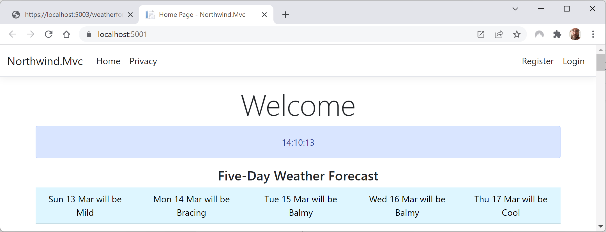
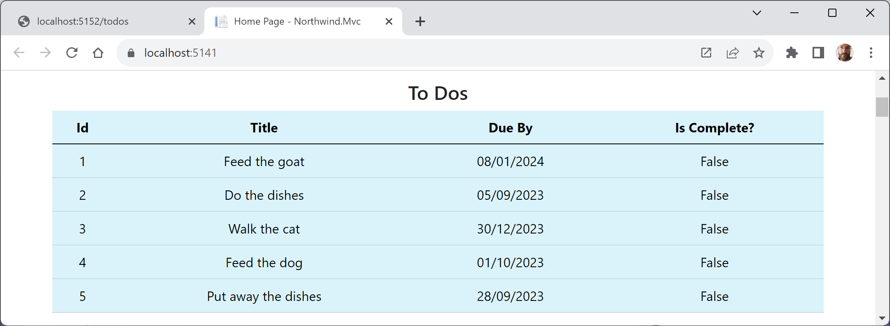

**Building web services using Minimal APIs**

For .NET 6, Microsoft put a lot of effort into adding new features to the C# 10 language and simplifying the ASP.NET Core libraries to enable the creation of web services using **Minimal APIs**. Minimal APIs are designed to enable the creation of HTTP APIs with minimum lines of code. 

Minimal APIs are introduced in this section and they are covered in more detail in my companion book, **Apps and Services with .NET 8**.

- [Native AOT for ASP.NET Core](#native-aot-for-aspnet-core)
- [Implementing a Minimal APIs web service using native AOT](#implementing-a-minimal-apis-web-service-using-native-aot)
- [Enabling JSON serialization using native AOT](#enabling-json-serialization-using-native-aot)
- [Example](#example)
- [Testing the minimal todo service](#testing-the-minimal-todo-service)
- [Adding todos to the Northwind website home page](#adding-todos-to-the-northwind-website-home-page)

# Native AOT for ASP.NET Core

Native ahead-of-time (AOT) compilation when publishing a web service reduces its startup time and its memory footprint.

.NET 7 only supported native AOT with console apps and class libraries on Windows or Linux. It did not support macOS or ASP.NET Core. 

.NET 8 is the first version to support macOS and some useful parts of ASP.NET Core.

The following ASP.NET Core features are fully supported:
- gRPC
- CORS
- HealthChecks
- HttpLogging
- Localization
- JWT Authentication
- OutputCaching
- RateLimiting
- RequestDecompression
- ResponseCaching
- ResponseCompression
- Rewrite
- StaticFiles
- WebSockets

The following ASP.NET Core features are partially supported:
- Minimal APIs

The following ASP.NET Core features are not supported (yet):
- MVC
- Blazor Server
- SignalR
- Authentication (except JWT)
- Session
- Single Page Apps (SPA)

# Implementing a Minimal APIs web service using native AOT

You implement an ASP.NET Core Minimal APIs web service by mapping an HTTP request to a lambda expression, for example, as shown in the following code:
```cs
app.MapGet("/", () => "Hello World!");
```
At runtime, ASP.NET Core uses the **RequestDelegateFactory (RDF)** class to convert your `MapX` calls into `RequestDelegate` instances. But this is dynamic code so is not compatible with native AOT.

In ASP.NET Core 8, when native AOT is enabled, the runtime use of RDF is replaced with a source generator named **Request Delegate Generator (RDG)** that performs similar work but at compile time. This makes sure the code generated is statically analyzable by the native AOT publish process.

> **More Information**: You can learn how to create your own source generator at the following link: https://github.com/markjprice/cs12dotnet8/blob/main/docs/ch07-source-generators.md

# Enabling JSON serialization using native AOT

JSON serialization with native AOT requires the use of the `System.Text.Json` source generator. All model types passed as parameters or return values must be registered with a JsonSerializerContext, as shown in the following code:
```cs
[JsonSerializable(typeof(Product)] // A single Product.
[JsonSerializable(typeof(Product[]))] // An array of Products.
public partial class MyJsonSerializerContext : JsonSerializerContext { }
```
Your custom JSON serializer context must be added to the service dependencies, as shown in the following code:
```cs
builder.Services.ConfigureHttpJsonOptions(options =>
{
  options.SerializerOptions.AddContext<MyJsonSerializerContext>();
});
```

# Example

We will now create a web service using Minimal APIs. Instead of weather forecasts, it will implement simple ToDo functionality. It will listen for `http` requests on port `5152` and only `GET` requests will be allowed. We will use the new project template introduced with .NET 8 that is optimized for native AOT publish:

1.	Use your preferred code editor to open the `PracticalApps` solution and then add a new project, as defined in the following list:
    - Project template: **ASP.NET Core Web API (native AOT)** / `webapiaot`
    - Project file and folder: `Northwind.MinimalApi`
    - Solution file and folder: `PracticalApps`
    - **Enable Docker**: Cleared.
    - **Do not use top-level statements**: Cleared.

> **Good Practice**: For faster startup time and minimal memory footprint by using native AOT publish, choose the **ASP.NET Core Web API (native AOT)** project template instead of the older **ASP.NET Core Web API** project template.

2.	Review `Program.cs`, as shown in the following code:
```cs
using System.Text.Json.Serialization;

var builder = WebApplication.CreateSlimBuilder(args);

builder.Services.ConfigureHttpJsonOptions(options =>
{
    options.SerializerOptions.TypeInfoResolverChain.Insert(0, AppJsonSerializerContext.Default);
});

var app = builder.Build();

var sampleTodos = new Todo[] {
    new(1, "Walk the dog"),
    new(2, "Do the dishes", DateOnly.FromDateTime(DateTime.Now)),
    new(3, "Do the laundry", DateOnly.FromDateTime(DateTime.Now.AddDays(1))),
    new(4, "Clean the bathroom"),
    new(5, "Clean the car", DateOnly.FromDateTime(DateTime.Now.AddDays(2)))
};

var todosApi = app.MapGroup("/todos");
todosApi.MapGet("/", () => sampleTodos);
todosApi.MapGet("/{id}", (int id) =>
    sampleTodos.FirstOrDefault(a => a.Id == id) is { } todo
        ? Results.Ok(todo)
        : Results.NotFound());

app.Run();

public record Todo(int Id, string? Title, DateOnly? DueBy = null, bool IsComplete = false);

[JsonSerializable(typeof(Todo[]))]
internal partial class AppJsonSerializerContext : JsonSerializerContext
{

}
```
Note the following:
- The call to `WebApplication.CreateSlimBuilder` is optimized for hosting a minimal API web service. For example, it does not include features like encrypted connections using `https`.
- JSON serialization is configured for HTTP requests using options to support native AOT publish using a custom `JsonSerializerContext`-derived class.
- Five sample instances of `ToDo` are created by default. Near the bottom of the file, a record named `ToDo` is defined with four properties: `Id`, `Title`, `DueBy`, and `IsComplete`.
- The call to `MapGroup` registers a group for the service relative path `/todos`.
- The subsequent call to `MapGet` registers a handler for incoming `GET` requests to the group relative path `/`. Therefore the path is `/todos/`. It returns the five sample `ToDo` instances.
- A second call to `MapGet` registers a handler for incoming `GET` requests to the group relative path `/{id}`. Therefore the path could be `/todos/3`. It returns the `ToDo` instance with that `id` value.
- There is no `Controllers` folder and there are no controller classes.

> **Good Practice**: For simple web services, avoid creating a controller class, and instead use Minimal APIs to put all the configuration and implementation in one place, `Program.cs`.

2.	In the `Properties` folder, in `launchSettings.json`, configure the `http` profile to launch the browser using port `5152` in the URL and the relative API path, as shown in the following markup:
```json
"applicationUrl": "http://localhost:5152",
```

# Testing the minimal todo service

Before creating a client for the service, let's test it:

1.	Start the `Northwind.MinimalApi` web service project using the `http` launch profile.
2.	If you are not using Visual Studio 2022, start Chrome and navigate to http://localhost:5152/todos.
3.	Note the Minimal API service should return a JSON document with five random todo objects in an array, as shown in *Figure 15B.1*:

 
*Figure 15B.1: Todos returned by the Minimal APIs web service*

4.	Close Chrome and shut down the web server.

# Adding todos to the Northwind website home page

Finally, let's add an HTTP client to the Northwind website so that it can call the todo service and show todos on the home page:

1.	In the `Northwind.Mvc` project, in the `Models` folder, add a class file named `Todo.cs`, as shown in the following code:
```cs
namespace Northwind.Mvc.Models;

public record ToDo(int Id, string? Title, DateOnly? DueBy, bool IsComplete);
```
2.	In `Program.cs`, before the call to `Build`, add a statement to configure an HTTP client to call the minimal service on port `5152`, as shown in the following code:
```cs
builder.Services.AddHttpClient(name: "Northwind.MinimalApi",
  configureClient: options =>
  {
    options.BaseAddress = new Uri("http://localhost:5152/");
    options.DefaultRequestHeaders.Accept.Add(
      new MediaTypeWithQualityHeaderValue(
      "application/json", 1.0));
  });
```
3.	In `HomeController.cs`, in the `Index` action method, before the call to `View`, add statements to get and use an HTTP client to call the todo service to get todos and store them in `ViewData`, as shown in the following code:
```cs
try
{
  HttpClient client = _clientFactory.CreateClient(
    name: "Northwind.MinimalApi");

  HttpRequestMessage request = new(
    method: HttpMethod.Get, requestUri: "todos");

  HttpResponseMessage response = await client.SendAsync(request);

  ViewData["todos"] = await response.Content
    .ReadFromJsonAsync<ToDo[]>();
}
catch (Exception ex)
{
  _logger.LogWarning(
    $"The Minimal.WebApi service is not responding. Exception: {ex.Message}");

  ViewData["todos"] = Enumerable.Empty<ToDo>().ToArray();
}
```
4.	In `Views/Home`, in `Index.cshtml`, in the top code block, get the todos from the `ViewData` dictionary, as shown in the following markup:
```cs
@{
  ViewData["Title"] = "Home Page";
  string currentItem = "";
  ToDo[]? todos = ViewData["todos"] as ToDo[];
}
```
5.	In the first `<div>`, after rendering the current time, add markup to enumerate the todos unless there aren't any, and render them in a table, as shown in the following markup:
```html
<p>
  <h4>To Dos</h4>
  @if ((todos is null) || (!todos.Any()))
  {
    <p>No to dos found.</p>
  }
  else
  {
  <table class="table table-info">
      <thead>
        <tr>
          <th>Id</th>
          <th>Title</th>
          <th>Due By</th>
          <th>Is Complete?</th>
        </tr>
      </thead>
      <tbody>
        @foreach (ToDo todo in todos)
        {
        <tr>
          <td>@todo.Id</td>
          <td>@todo.Title</td>
          <td>@todo.DueBy</td>
          <td>@todo.IsComplete</td>
        </tr>
        }
      </tbody>
  </table>
  }
</p>
```
6.	Start the `Northwind.MinimalApi` web service project using the `http` launch profile.
7.	Start the `Northwind.Mvc` website project using the `https` launch profile.
8.	Navigate to https://localhost:5141/ to see the MVC website and note the todos on the home page, as shown in *Figure 15B.2*:

 
*Figure 15B.2: Todos on the home page of the Northwind website*

9.	In the command prompt or terminal for the MVC website, note the info messages that indicate a request was sent to the Minimal APIs web service `/todos` endpoint in about 83 ms, as shown in the following output:
```
info: System.Net.Http.HttpClient.Northwind.MinimalApi.LogicalHandler[100]
      Start processing HTTP request GET http://localhost:5152/todos
info: System.Net.Http.HttpClient.Northwind.MinimalApi.ClientHandler[100]
      Sending HTTP request GET https://localhost:5152/todos
info: System.Net.Http.HttpClient.Northwind.MinimalApi.ClientHandler[101]
      Received HTTP response headers after 76.8963ms - 200
info: System.Net.Http.HttpClient.Northwind.MinimalApi.LogicalHandler[101]
      End processing HTTP request after 82.9515ms – 200
```
10.	Stop the `Northwind.MinimalApi` service, refresh the browser, and note that after a few seconds the MVC website home page appears without weather forecasts because the web service is not responding.
11.	Close Chrome and shut down the web server.
