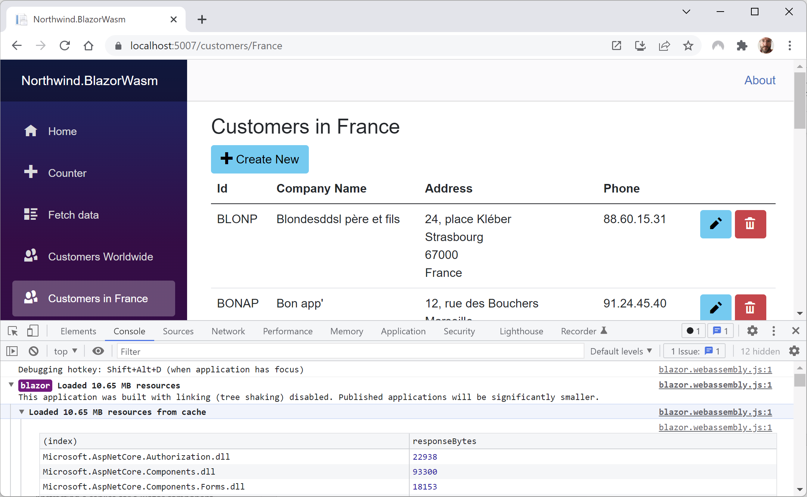
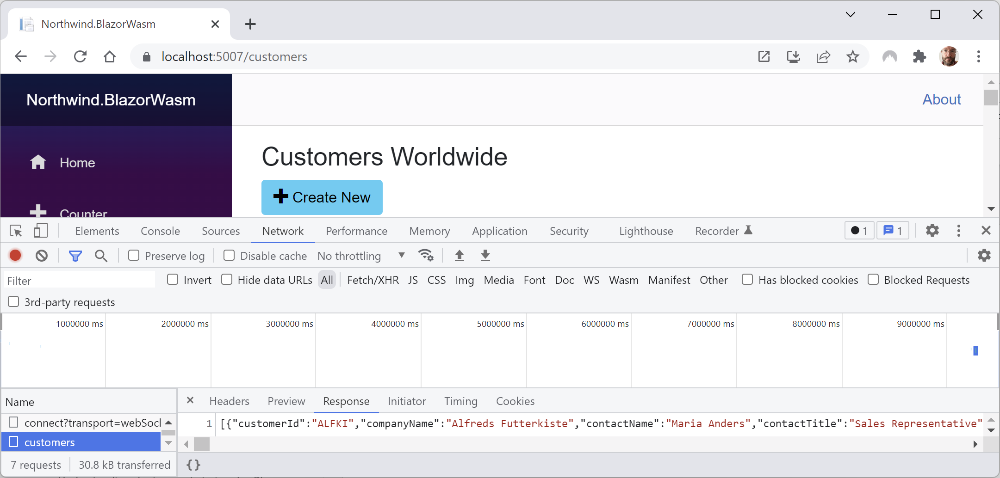
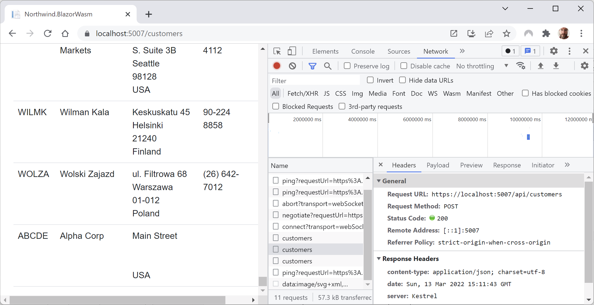

**Enabling client-side execution using WebAssembly**

Now we will implement similar functionality that runs in the browser using WebAssembly so that you can clearly see the key differences.

- [Abstracting the service](#abstracting-the-service)
- [Creating a client-side Blazor components project](#creating-a-client-side-blazor-components-project)
- [Creating a client-side service implementation](#creating-a-client-side-service-implementation)
- [Enabling client-side interactions in the host project](#enabling-client-side-interactions-in-the-host-project)
- [Testing the WebAssembly components and service](#testing-the-webassembly-components-and-service)


# Abstracting the service

Since we abstracted the local dependency service in the `INorthwindService` interface, we will be able to reuse all the components and that interface, as well as the entity model classes. The only part that will need to be rewritten is the implementation of the class. Instead of directly calling the `NorthwindContext` class, it will call a customer Web API controller on the server side, as shown in *Figure 16.5*:

 
*Figure 16.5: Comparing implementations using RenderModeServer and RenderModeClient*

# Creating a client-side Blazor components project

First, we need to create a separate project for the Blazor WebAssembly components:

1.	Use your preferred code editor to add a new project, as defined in the following list:
    - Project template: **Blazor WebAssembly App Empty** / `blazorwasm-empty`
    - Solution file and folder: `PracticalApps`
    - Project file and folder: `Northwind.Blazor.Wasm`
2.	In Visual Studio 2022, choose the following options:
    - **Configure for HTTPS**: Selected.
    - **Progressive Web Application**: Cleared.
3.	In the `Northwind.Blazor.Wasm.csproj` project file, make changes as shown in the following list, and as shown in the following markup:
    - Add entries to configure no `launchSettings.json` and default static web assets.
    - Remove the package reference for `Microsoft.AspNetCore.Components.WebAssembly.DevServer` because this project will not host the Blazor components.
    - Add a package reference for `Microsoft.Extensions.Http` so we can call a Web API service easily.
    - Add a project references to the Northwind entity models and services libraries.
```xml
<Project Sdk="Microsoft.NET.Sdk.BlazorWebAssembly">

  <PropertyGroup>
    <TargetFramework>net8.0</TargetFramework>
    <ImplicitUsings>enable</ImplicitUsings>
    <Nullable>enable</Nullable>
    <NoDefaultLaunchSettingsFile>true</NoDefaultLaunchSettingsFile>
    <StaticWebAssetProjectMode>Default</StaticWebAssetProjectMode>
  </PropertyGroup>

  <ItemGroup>
    <PackageReference Version="8.0.0"
      Include="Microsoft.AspNetCore.Components.WebAssembly" />
    <PackageReference Version="8.0.0"
      Include="Microsoft.Extensions.Http" />
  </ItemGroup>

  <ItemGroup>
    <!-- change Sqlite to SqlServer if you prefer -->
    <ProjectReference Include="..\Northwind.EntityModels.Sqlite\
Northwind.EntityModels.Sqlite.csproj" />
    <ProjectReference Include="..\Northwind.Blazor.Services\
Northwind.Blazor.Services.csproj" />
  </ItemGroup>

</Project>
```
3.	In the `Northwind.Blazor.Wasm` project, delete the following folders and files that are not needed because we will use the `Northwind.Blazor` project as the Blazor web project host:
    - The `Properties` folder and the `launchSettings.json` file in it.
    - The `App.razor` and `MainLayout.razor` files.
4.	In `Program.cs`, simplify the statements to the minimum needed for a Blazor WebAssembly project, as shown in the following code:
```cs
using Microsoft.AspNetCore.Components.WebAssembly.Hosting;
using Northwind.Blazor.Services;

var builder = WebAssemblyHostBuilder.CreateDefault(args);

await builder.Build().RunAsync();
```
5.	Build the `Northwind.Blazor.Wasm` project.

# Creating a client-side service implementation

Next, we need a web service that the client app can call to get and manage customers. You must have completed *Chapter 15, Building and Consuming Web Services*, so you have a customers service in the `Northwind.WebApi` service project that you will use:

1.	In the `Northwind.Blazor.Wasm` project, create a folder named `Services`.
2.	In the `Services` folder, add a new file named `NorthwindServiceClientSide.cs`, and modify its contents to implement the `INorthwindService` interface by using an `HttpClient` to call the customers service, as shown in the following code:
```cs
using Northwind.EntityModels; // To use Customer.
using System.Net.Http.Json; // To use GetFromJsonAsync.

namespace Northwind.Blazor.Services;

public class NorthwindServiceClientSide : INorthwindService
{
  private readonly IHttpClientFactory _clientFactory;

  public NorthwindServiceClientSide(
    IHttpClientFactory httpClientFactory)
  {
    _clientFactory = httpClientFactory;
  }

  public Task<List<Customer>> GetCustomersAsync()
  {
    HttpClient client = _clientFactory.CreateClient(
      name: "Northwind.WebApi");

    return client.GetFromJsonAsync
      <List<Customer>>("api/customers")!;
  }

  public Task<List<Customer>> GetCustomersAsync(string country)
  {
    HttpClient client = _clientFactory.CreateClient(
      name: "Northwind.WebApi");

    return client.GetFromJsonAsync
      <List<Customer>>($"api/customers/in/{country}")!;
  }

  public Task<Customer?> GetCustomerAsync(string id)
  {
    HttpClient client = _clientFactory.CreateClient(
      name: "Northwind.WebApi");

    return client.GetFromJsonAsync
      <Customer>($"api/customers/{id}");
  }

  public async Task<Customer>
    CreateCustomerAsync (Customer c)
  {
    HttpClient client = _clientFactory.CreateClient(
      name: "Northwind.WebApi");

    HttpResponseMessage response = await 
      client.PostAsJsonAsync("api/customers", c);

    return (await response.Content
      .ReadFromJsonAsync<Customer>())!;
  }

  public async Task<Customer> UpdateCustomerAsync(Customer c)
  {
    HttpClient client = _clientFactory.CreateClient(
      name: "Northwind.WebApi");

    HttpResponseMessage response = await 
      client.PutAsJsonAsync("api/customers", c);

    return (await response.Content
      .ReadFromJsonAsync<Customer>())!;
  }

  public async Task DeleteCustomerAsync(string id)
  {
    HttpClient client = _clientFactory.CreateClient(
      name: "Northwind.WebApi");

    HttpResponseMessage response = await     
      client.DeleteAsync($"api/customers/{id}");
  }
}
```
3.	In the `Northwind.Blazor.Wasm` project, in `Program.cs`, import the namespace for setting a media type header value, as shown in the following code:
```cs
using System.Net.Http.Headers; // To use MediaTypeWithQualityHeaderValue.
```
4.	In `Program.cs`, before calling the `Build` method, add a statement to enable `HttpClientFactory` with a named client to make calls to the Northwind Web API service using HTTPS on port 5151 and request JSON as the default response format, as shown in the following code:
```cs
builder.Services.AddHttpClient(name: "Northwind.WebApi",
  configureClient: options =>
  {
    options.BaseAddress = new Uri("https://localhost:5151/");
    options.DefaultRequestHeaders.Accept.Add(
      new MediaTypeWithQualityHeaderValue(
      mediaType: "application/json", quality: 1.0));
  });
```

5.	In `Program.cs`, before the call to `Build`, modify the statement to register the Northwind dependency service and set up an HTTP client factory, as shown in the following code:
```cs
builder.Services.AddTransient<INorthwindService,
  NorthwindServiceClientSide>();
```

# Enabling client-side interactions in the host project

By default, client-side interactions are disabled. We will switch the pages to use client-side interactions:

1.	In the `Northwind.Blazor.csproj` project file, add a package reference for `Microsoft.AspNetCore.Components.WebAssembly.Server`, and add a project reference to the `Northwind.Blazor.Wasm` project, as shown in the following markup:
```xml
<Project Sdk="Microsoft.NET.Sdk.Web">

  <PropertyGroup>
    <TargetFramework>net8.0</TargetFramework>
    <Nullable>enable</Nullable>
    <ImplicitUsings>enable</ImplicitUsings>
  </PropertyGroup>

  <ItemGroup>
    <PackageReference Version="8.0.0" Include=
      "Microsoft.AspNetCore.Components.WebAssembly.Server" />
  </ItemGroup>

  <ItemGroup>
    <!-- change Sqlite to SqlServer if you prefer -->
    <ProjectReference Include="..\Northwind.DataContext.Sqlite\
Northwind.DataContext.Sqlite.csproj" />
    <ProjectReference Include="..\Northwind.Blazor.Services\
Northwind.Blazor.Services.csproj" />
    <ProjectReference Include="..\Northwind.Blazor.Wasm\
Northwind.Blazor.Wasm.csproj" />
  </ItemGroup>

  <ItemGroup>
    <Using Include="Northwind.EntityModels" />
  </ItemGroup>

</Project>
```

2.	In `Program.cs`, at the end of the statement that adds Razor components, add a call to a method to enable client-side interactivity, as shown in the following code:
```cs
builder.Services.AddRazorComponents()
  .AddInteractiveServerComponents()
  .AddInteractiveWebAssemblyComponents();
```
3.	In `Program.cs`, at the end of the statement that maps Razor components, add a call to a method to enable server-side interactivity, as shown highlighted in the following code:
```cs
app.MapRazorComponents<App>()
  .AddInteractiveServerRenderMode()
  .AddInteractiveWebAssemblyRenderMode();
```
4.	In the `Components\Pages` folder, in `CreateCustomers.razor`, at the top of the file, modify the declaration to enable client-side rendering, as shown in the following code:
```cs
@rendermode RenderMode.InteractiveWebAssembly
```
5.	In the `Components\Pages` folder, in `EditCustomers.razor`, at the top of the file, modify the declaration to enable client-side rendering, as shown in the following code:
```cs
@rendermode RenderMode.InteractiveWebAssembly
```
6.	In the Components\Pages folder, in DeleteCustomers.razor, at the top of the file, modify the declaration to enable client-side rendering, as shown in the following code:
```cs
@rendermode RenderMode.InteractiveWebAssembly
```

# Testing the WebAssembly components and service

Now we can start the Web API service project and call it from the Blazor project to test if the components work with the abstracted Northwind service that calls the customers service:

1.	Start the `Northwind.WebApi` web service project using the https launch profile.
2.	Start the `Northwind.Blazor` project using the `https` launch profile.
3.	Start Chrome, show **Developer Tools**, and select the **Network** tab.
4.	Navigate to https://localhost:5161/.
5.	Select the **Console** tab and note that Blazor WebAssembly has loaded .NET assemblies into the browser cache and that they take about 10.65 MB of space, as shown in *Figure 16.7*:

 
*Figure 16.7: Blazor WebAssembly loading .NET assemblies into the browser cache*

6.	Select the **Network** tab.
7.	In the left navigation menu, click **Customers Worldwide** and note the HTTP GET request customers with the JSON response containing all customers, as shown in *Figure 16.8*:

 
*Figure 16.8: The HTTP GET request with the JSON response containing all customers*

8.	Click the **+ Create New** button, complete the form, and click **Add Customer** to add a new customer as before, and note the HTTP POST request made, as shown in *Figure 16.9*:
 
 
*Figure 16.9: The HTTP POST request for creating a new customer*

9.	Repeat the steps as before to edit and then delete the newly created customer and note the requests in the **Network** list.
10.	Close Chrome and shut down the web server.
