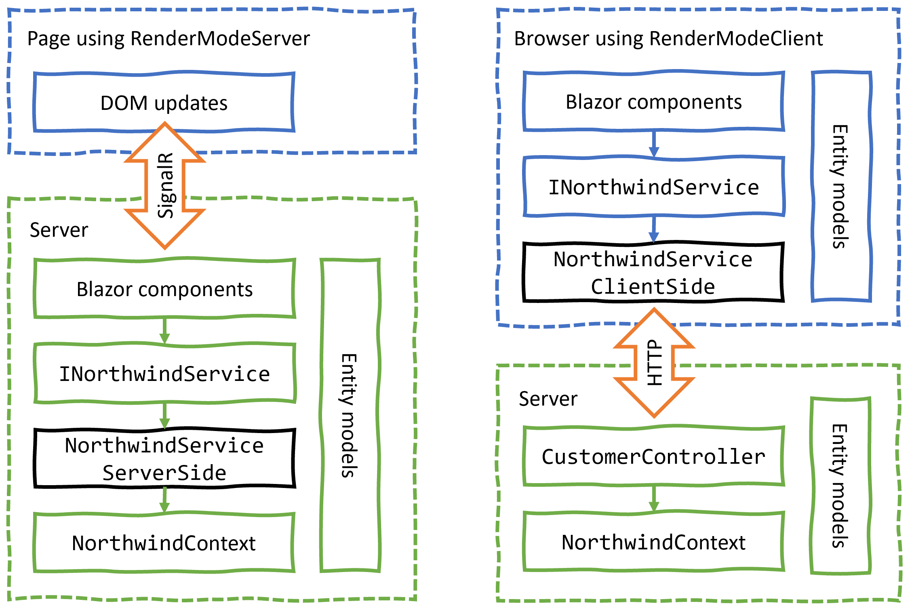
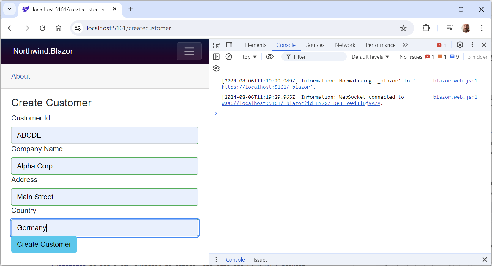
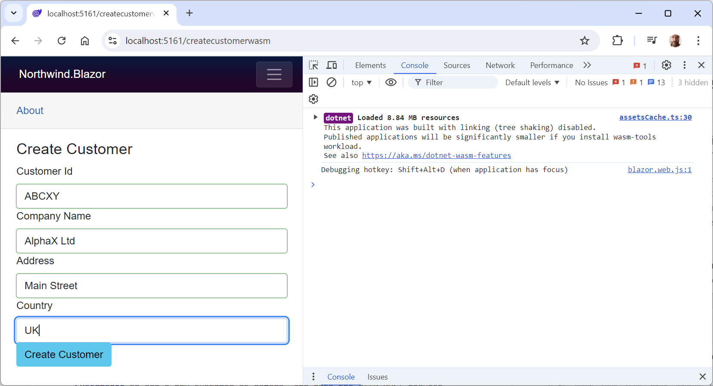

**Enabling client-side execution using WebAssembly**

Now we will implement similar functionality that runs in the browser using WebAssembly so that you can clearly see the key differences.

- [Failed to start platform and other errors](#failed-to-start-platform-and-other-errors)
- [Projects and port numbers](#projects-and-port-numbers)
- [Abstracting the service](#abstracting-the-service)
- [Creating a client-side Blazor components project](#creating-a-client-side-blazor-components-project)
- [Creating a client-side service implementation](#creating-a-client-side-service-implementation)
- [Enabling client-side interactions in the host project](#enabling-client-side-interactions-in-the-host-project)
- [Disabling CORS for the web service](#disabling-cors-for-the-web-service)
- [Testing the WebAssembly components and service](#testing-the-webassembly-components-and-service)
- [Switching to the WebAssembly component](#switching-to-the-webassembly-component)

# Failed to start platform and other errors

Blazor is a rapidly evolving platform and web development is messy at the best of times. Throw in Visual Studio temporary files, and you get odd errors occuring. The following are some tips that often help resolve issues:
- If you are using a preview of .NET or Visual Studio, try using an older or newer version.
- Clear Chrome caches:
  - Show `Developer Tools`, press and hold the **Reload** button, and select `Empty cache and hard reload`.
  - In `Developer Tools`, in `Storage`, right-click `Cache storage` and select `Delete`.
- Force a package refresh in Visual Studio:
    1. Cut the `<PackageReference>` elements from the `.csproj` project file. (Keep a copy.)
    2. Save the `.csproj` project file and then wait for the references to update in Visual Studio.
    3. Paste the `<PackageReference>` elements back into the `.csproj` project file.
    4. Clean the project.
    5. Rebuild the project.

> **More Information**: Thanks to [Paul Marangoni](https://github.com/pmarangoni) for raising issues with the Blazor WebAssembly section and suggesting this link: https://github.com/dotnet/aspnetcore/issues/50755.

# Projects and port numbers

As a reminder, here are the projects and the port numbers they are configure to use to host on `localhost`:

Project|https|http
---|---|---
`Northwind.WebApi`|5151|5150
`Northwind.Blazor`|5161|5160

# Abstracting the service

Since we abstracted the local dependency service in the `INorthwindService` interface, we will be able to reuse all the components and that interface, as well as the entity model classes. The only part that will need to be rewritten is the implementation of the class. Instead of directly calling the `NorthwindContext` class, it will call a customer Web API controller on the server side, as shown in *Figure 16.5*:

 
*Figure 16.5: Comparing implementations using RenderModeServer and RenderModeClient*

# Creating a client-side Blazor components project

First, we need to create a separate project for the Blazor WebAssembly components:

1.	Use your preferred code editor to add a new project, as defined in the following list:
    - Project template: **Blazor WebAssembly Standalone App** / `blazorwasm`
    - Solution file and folder: `PracticalApps`
    - Project file and folder: `Northwind.Blazor.Wasm`
2.	In Visual Studio 2022, choose the following options:
    - **Framework**: **.NET 8.0 (Long Term Support)**.
    - **Configure for HTTPS**: Selected.
    - **Progressive Web Application**: Cleared.
    - **Include sample pages**: Cleared.
    - **Do not use top-level statements**: Cleared.
3.	In the `Northwind.Blazor.Wasm.csproj` project file, make changes as shown in the following list, and as shown in the following markup:
    - Add entries to configure no `launchSettings.json` and default static web assets.
    - Remove the package reference for `Microsoft.AspNetCore.Components.WebAssembly.DevServer` because this project will not host the Blazor components.
    - Add a project references to the Northwind entity models and services libraries.
```xml
<Project Sdk="Microsoft.NET.Sdk.BlazorWebAssembly">

  <PropertyGroup>
    <TargetFramework>net8.0</TargetFramework>
    <ImplicitUsings>enable</ImplicitUsings>
    <Nullable>enable</Nullable>

    <!-- Configure no launchSettings.json. -->
    <NoDefaultLaunchSettingsFile>true</NoDefaultLaunchSettingsFile>
    <StaticWebAssetProjectMode>Default</StaticWebAssetProjectMode>
  </PropertyGroup>

  <ItemGroup>
    <PackageReference Version="8.0.7"
      Include="Microsoft.AspNetCore.Components.WebAssembly" />
  </ItemGroup>

  <ItemGroup>
    <!-- change Sqlite to SqlServer if you prefer -->
    <ProjectReference Include="..\Northwind.EntityModels.Sqlite\
Northwind.EntityModels.Sqlite.csproj" />
    <ProjectReference Include="..\Northwind.Blazor.Services\
Northwind.Blazor.Services.csproj" />
  </ItemGroup>

</Project>
```
3.	In the `Northwind.Blazor.Wasm` project, delete the following folders and files that are not needed because we will use the `Northwind.Blazor` project as the Blazor web project host:
    - The `Properties` folder and the `launchSettings.json` file in it because the WebAssembly components will be hosted in the `Northwind.Blazor` project that has its own launch settings configuration.
    - The `wwwroot` folder and its contents because the WebAssembly components will be hosted in the `Northwind.Blazor` project that has its own `wwwroot` folder for static assets.
    - The `App.razor` and `MainLayout.razor` files because the WebAssembly components will be hosted in the `Northwind.Blazor` project that has its own routes configuration and layout files.
    - The `Pages\Home.razor` file because we already have a Blazor component registered for the `/` route in the `Northwind.Blazor` project.
4.	In `Program.cs`, simplify the statements to the minimum needed for a Blazor WebAssembly project, as shown in the following code:
```cs
using Microsoft.AspNetCore.Components.WebAssembly.Hosting;

var builder = WebAssemblyHostBuilder.CreateDefault(args);

await builder.Build().RunAsync();
```
5.	Build the `Northwind.Blazor.Wasm` project.

# Creating a client-side service implementation

Next, we need a web service that the client app can call to get and manage customers. You must have completed *Chapter 14, Building and Consuming Web Services*, so you have a customers service in the `Northwind.WebApi` service project that you will use:

1.	In the `Northwind.Blazor.Wasm` project, create a folder named `Services`.
2.	In the `Services` folder, add a new file named `NorthwindServiceClientSide.cs`, and modify its contents to implement the `INorthwindService` interface by using an `HttpClient` to call the customers service, as shown in the following code:
```cs
using Northwind.EntityModels; // To use Customer.
using System.Net.Http.Json; // To use GetFromJsonAsync.

namespace Northwind.Blazor.Services;

public class NorthwindServiceClientSide : INorthwindService
{
  private readonly HttpClient _http;

  public NorthwindServiceClientSide(HttpClient httpClient)
  {
    _http = httpClient;
  }

  public Task<List<Customer>> GetCustomersAsync()
  {
    return _http.GetFromJsonAsync
      <List<Customer>>("api/customers")!;
  }

  public Task<List<Customer>> GetCustomersAsync(string country)
  {
    return _http.GetFromJsonAsync
      <List<Customer>>($"api/customers/in/{country}")!;
  }

  public Task<Customer?> GetCustomerAsync(string id)
  {
    return _http.GetFromJsonAsync
      <Customer>($"api/customers/{id}");
  }

  public async Task<Customer>
    CreateCustomerAsync(Customer c)
  {
    HttpResponseMessage response = await
      _http.PostAsJsonAsync("api/customers", c);

    return (await response.Content
      .ReadFromJsonAsync<Customer>())!;
  }

  public async Task<Customer> UpdateCustomerAsync(Customer c)
  {
    HttpResponseMessage response = await
      _http.PutAsJsonAsync("api/customers", c);

    return (await response.Content
      .ReadFromJsonAsync<Customer>())!;
  }

  public async Task DeleteCustomerAsync(string id)
  {
    HttpResponseMessage response = await
      _http.DeleteAsync($"api/customers/{id}");
  }
}
```
3.	In the `Northwind.Blazor.Wasm` project, in `Program.cs`, import the namespace for your Northwind service, as shown in the following code:
```cs
using Northwind.Blazor.Services; // To use INorthwindService and implementations.
```
4.	In `Program.cs`, before calling the `Build` method, add statements to enable `HttpClient` to make calls to the Northwind Web API service using HTTPS on port 5151, and register the Northwind dependency service, as shown in the following code:
```cs
builder.Services.AddScoped(sp => new HttpClient
{
  BaseAddress = new Uri("https://localhost:5151/")
});

builder.Services.AddTransient<INorthwindService,
  NorthwindServiceClientSide>();
```
5.  In `_Imports.razor`, add a statement to import the namespaces for your dependency services and data model entities, as shown in the following code:
```cs
@using Northwind.Blazor.Services @* To use INorthwindService. *@
@using Northwind.EntityModels @* To use Northwind entities. *@
```
6.  Copy the following files from the `Northwind.Blazor` project to the `Northwind.Blazor.Wasm` project's `Pages` folder:
    - `Components\CustomerDetail.razor`
    - `Components\Pages\CreateCustomer.razor`
    - `Components\Pages\DeleteCustomer.razor`
    - `Components\Pages\EditCustomer.razor`
7.	In the `Pages` folder, in `CreateCustomer.razor`, modify the declaration to enable client-side rendering and the route registration to add `wasm` to the end of the path, as shown in the following code:
```cs
@rendermode RenderMode.InteractiveWebAssembly
@page "/createcustomerwasm"
```
8.	In the `Pages` folder, in `EditCustomer.razor`, modify the declaration to enable client-side rendering and the route registration to add `wasm` to the end of the path, as shown in the following code:
```cs
@rendermode RenderMode.InteractiveWebAssembly
@page "/editcustomerwasm/{customerid}"
```
9.	In the `Components\Pages` folder, in `DeleteCustomer.razor`, modify the declaration to enable client-side rendering and the route registration to add `wasm` to the end of the path, as shown in the following code:
```cs
@rendermode RenderMode.InteractiveWebAssembly
@page "/deletecustomerwasm/{customerid}"
```

> **Warning!** Since we have duplicates of these three Blazor components, we must differentitate the WebAssembly versions from the server-side versions by having different route paths.

# Enabling client-side interactions in the host project

By default, client-side interactions are disabled. We will enable the page components to use the client-side interaction versions:

1.	In the `Northwind.Blazor.csproj` project file, add a project reference to the `Northwind.Blazor.Wasm` project, as shown in the following markup:
```xml
  <ItemGroup>
    ...
    <ProjectReference Include="..\Northwind.Blazor.Wasm\Northwind.Blazor.Wasm.csproj" />
  </ItemGroup>
```

2.	In `Program.cs`, at the end of the statement that adds Razor components, add a call to a method to enable client-side interactivity, as shown in the following code:
```cs
builder.Services.AddRazorComponents()
  .AddInteractiveServerComponents()
  .AddInteractiveWebAssemblyComponents();
```
3.	In `Program.cs`, at the end of the statement that maps Razor components, add a call to a method to enable client-side render mode, and add a reference to any class in the `Northwind.Blazor.Wasm` project to enable the host project to scan that assembly for Blazor components, as shown highlighted in the following code:
```cs
app.MapRazorComponents<App>()
  .AddInteractiveServerRenderMode()
  .AddInteractiveWebAssemblyRenderMode()
  .AddAdditionalAssemblies(typeof(Northwind.Blazor.Wasm._Imports).Assembly);
```

> **Good Practice**: Since almost all Blazor WebAssembly projects will have an `_Imports.razor` file that will compile into an `_Imports` class, it is a convention to reference that class.

4.  In `Components\Routes.razor`, add a reference to any class in the `Northwind.Blazor.Wasm` project to enable the host project to scan that assembly for Blazor components with page route handlers defined, as shown in the following code:
```xml
<Router AppAssembly="typeof(Program).Assembly" 
  AdditionalAssemblies="new[] { typeof(Northwind.Blazor.Wasm._Imports).Assembly }">
```

# Disabling CORS for the web service

CORS is a security feature of web browsers that will prevent our Blazor WebAssembly components from making HTTP requests to our web service because they are hosted on different ports.

1.	In the `Northwind.WebApi` project, in `Program.cs`, at the top of the file after the namespace imports, declare a `string` constant for the name of a CORS policy, as shown in the following code:
```cs
const string corsPolicyName = "allowWasmClient";
```
2.	In `Program.cs`, before the call to `Build`, add CORS and configure a policy to allow HTTP calls from clients with different port numbers from the web service itself, as shown in the following code:
```cs
builder.Services.AddCors(options =>
{
  options.AddPolicy(name: corsPolicyName,
    policy =>
    {
      // Allow HTTP calls from the Blazor Web App project.
      policy.AllowAnyHeader();
      policy.WithOrigins("https://localhost:5161",
        "http://localhost:5160");
    });
});
```
3.	In `Program.cs`, after the call to `UseHttpsRedirection`, enable CORS with the named policy, as shown in the following code:
```cs
app.UseCors(corsPolicyName);
```

# Testing the WebAssembly components and service

Now we can start the Web API service project and call it from the Blazor project to test if the components work with the abstracted Northwind service that calls the customers service:

1.	Start the `Northwind.WebApi` web service project using the `https` launch profile.
2.  Start Chrome and navigate to https://localhost:5151/api/customers, and note that a JSON document is returned containing customers.
3.	Start the `Northwind.Blazor` project using the `https` launch profile.
4.	Navigate to https://localhost:5161/.
5.	In the left navigation menu, click **Customers Worldwide**.
6.	In Chrome, show **Developer Tools**, and select the **Console** tab.
7.	Click the **+ Create New** button, and note that a WebSocket connection is established, as shown in *Figure 16.9*:

 
*Figure 16.9: Creating a new customer using the server-side component*

8.  Complete the form, and click the **Add Customer** button.
9.  Go to the bottom of the table of customers and note that the customer was successfully added using the server-side interactive Blazor component.
10.	Close Chrome and shut down the web servers.

# Switching to the WebAssembly component

1.  In the `Northwind.Blazor` project, in the `Components\Pages` folder, in `Customers.razor`, in the `<a>` element that becomes a button to **Create New** customer, add `wasm` to the end of the route path, as shown in the following code:
```html
<a class="btn btn-info" href="createcustomerwasm">
```
2.  Save the changes.
3.  Start the `Northwind.WebApi` web service project using the `https` launch profile.
4.  Start the `Northwind.Blazor` project using the `https` launch profile.
5.  Navigate to https://localhost:5161/.
6.  In the left navigation menu, click **Customers Worldwide**.
7.  In Chrome, show **Developer Tools**, and select the **Console** tab.
8.  Click the **+ Create New** button, and note that Blazor WebAssembly has loaded .NET assemblies into the browser cache and that they take about 10.65 MB of space, as shown in *Figure 16.10*:

 
*Figure 16.10: Creating a new customer using the client-side component*

9. In **Developer Tools**, select the **Network** tab.
10.  Complete the form, and click the **Add Customer** button.
11.  On the **Network** tab, select the second **customers** request, and note that it is a `POST` that succeeds so it returns a `201` status code, as shown in *Figure 16.10*:

 
*Figure 16.11: POST request from the client-side component*

11  Go to the bottom of the table of customers and note that the customer was successfully added using the client-side interactive Blazor component.
12.	Close Chrome and shut down the web servers.
