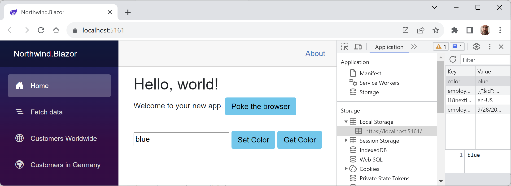
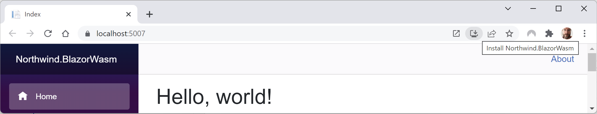
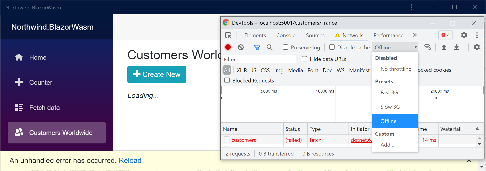
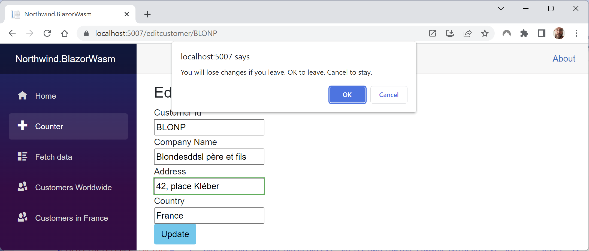

**Enhancing Blazor apps**

There are common ways to improve Blazor WebAssembly apps. We'll look at some of the most popular ones now.

- [Interop with JavaScript](#interop-with-javascript)
- [Enabling Blazor WebAssembly AOT](#enabling-blazor-webassembly-aot)
- [Exploring Progressive Web App support](#exploring-progressive-web-app-support)
- [Implementing offline support for PWAs](#implementing-offline-support-for-pwas)
- [Understanding the browser compatibility analyzer for Blazor WebAssembly](#understanding-the-browser-compatibility-analyzer-for-blazor-webassembly)
- [Enabling location change event handling](#enabling-location-change-event-handling)
- [Libraries of Blazor components](#libraries-of-blazor-components)

# Interop with JavaScript

By default, Blazor components do not have access to browser capabilities like local storage, geolocation, and media capture, or any JavaScript libraries like React or Vue. If you need to interact with them, you can use **JavaScript Interop**.

Let's see an example that uses the browser window's alert box and local storage that can persist up to 5 MB of data per visitor indefinitely:

1.	In the `Northwind.Blazor` project, in the `wwwroot` folder, add a folder named `scripts`.
2.	In the `scripts` folder, add a file named `interop.js`, and then modify its contents to define some functions to show an alert message, and to set and get a color in local storage, as shown in the following code:
```js
function messageBox(message) {
  window.alert(message);
}

function setColorInStorage() {
  if (typeof (Storage) !== "undefined") {
    localStorage.setItem("color", 
      document.getElementById("colorBox").value);
  }
}

function getColorFromStorage() {
  if (typeof (Storage) !== "undefined") {
    document.getElementById("colorBox").value = 
      localStorage.getItem("color");
  }
}
```
3.	In `App.razor`, after the script element that adds Blazor support, add a script element that references the JavaScript file that you just created, as shown in the following code:
```html
<script src="scripts/interop.js"></script>
```
4.	In the `Pages` folder, in `Home.razor`, set the render mode to server and add a button and a code block that uses the Blazor JavaScript runtime dependency service to call a JavaScript function, as shown in the following code:
```cs
@rendermode RenderMode.InteractiveServer
```
```html
<button type="button" class="btn btn-info" @onclick="AlertBrowser">
  Poke the browser</button>
<hr />
<input id="colorBox" />
<button type="button" class="btn btn-info" @onclick="SetColor">
  Set Color</button>
<button type="button" class="btn btn-info" @onclick="GetColor">
  Get Color</button>
```
```cs
@code {
  [Inject]
  public IJSRuntime JSRuntime { get; set; } = null!;

  public async Task AlertBrowser()
  {
    await JSRuntime.InvokeVoidAsync(
      "messageBox", "Blazor poking the browser");
  }

  public async Task SetColor()
  {
    await JSRuntime.InvokeVoidAsync("setColorInStorage");
  }

  public async Task GetColor()
  {
    await JSRuntime.InvokeVoidAsync("getColorFromStorage");
  }
}
```
5.	Start the `Northwind.Blazor` project.
6.	Start Chrome and navigate to https://localhost:5161/.
7.	On the home page, in the textbox, enter `red` and then click the **Set Color** button.
8.	Show **Developer Tools**, select the **Application** tab, expand **Local Storage**, select https://localhost:5161, and note the key-value pair `color-red`, as shown in *Figure 16A.3*:

 
*Figure 16A.3: Storing a color in browser local storage using JavaScript Interop*

9.	Close Chrome and shut down the web server.
10.	Start the `Northwind.Blazor` project.
11.	Start Chrome and navigate to https://localhost:5161/.
12.	On the home page, click the **Get Color** button and note that the value `red` is shown in the textbox, retrieved from local storage between visitor sessions.
13.	Click the **Poke the browser** button and note the message that appears.
14.	Close Chrome and shut down the web server.

# Enabling Blazor WebAssembly AOT

By default, the .NET runtime used by Blazor WebAssembly is doing IL interpretation using an interpreter written in WebAssembly. Unlike other .NET apps, it does not use a just-in-time (JIT) compiler, so the performance of CPU-intensive workloads is lower than you might hope for.

In .NET 6 and later, Microsoft added support for ahead-of-time (AOT) compilation, but you must explicitly opt-in because although it can dramatically improve runtime performance, AOT compilation can take several minutes on small projects like the ones in this book and potentially much longer for larger projects. The size of the compiled app is also larger than without AOT—typically twice the size. The decision to use AOT is therefore based on a balance of increased compile and browser download times with potentially much faster runtimes.

AOT was the top requested feature in a Microsoft survey, and the lack of AOT was cited as a primary reason why some developers had not yet adopted .NET for developing single-page applications (SPAs).

Let's install the additional required workload for Blazor AOT named **.NET WebAssembly build tools** and then enable AOT for our Blazor project:

1.	In the command prompt or terminal with admin rights, install the Blazor AOT workload, as shown in the following command:
```
dotnet workload install wasm-tools
```
2.	Note the messages, as shown in the following partial output:
```
...
Installing pack Microsoft.NET.Runtime.MonoAOTCompiler.Task version 8.0.0...
Installing pack Microsoft.NETCore.App.Runtime.AOT.Cross.browser-wasm version 8.0.0...
Successfully installed workload(s) wasm-tools.
```
3.	Modify the `Northwind.Blazor` project file to enable AOT, as shown highlighted in the following markup:
```xml
<PropertyGroup>
  <TargetFramework>net8.0</TargetFramework>
  ...
  <RunAOTCompilation>true</RunAOTCompilation>
</PropertyGroup>
```
4.	Publish the `Northwind.Blazor` project, as shown in the following command:
```
dotnet publish -c Release
```

> **Be patient.** Wait for the process to finish. The process can take at least 20 minutes even on a modern multi-core CPU.

5.	Note that more than 70 assemblies have AOT applied, as shown in the following partial output:
```
  Northwind.BlazorWasm.Shared -> C:\cs12dotnet8\PracticalApps\Northwind.BlazorWasm\Shared\bin\Release\net8.0\Northwind.BlazorWasm.Shared.dll
  Northwind.EntityModels.Sqlite -> C:\cs12dotnet8\PracticalApps\Northwind.EntityModels.Sqlite\bin\Release\net8.0\Northwind.EntityModels.Sqlite.dll
  Northwind.BlazorWasm.Client -> C:\cs12dotnet8\PracticalApps\Northwind.BlazorWasm\Client\bin\Release\net8.0\Northwind.BlazorWasm.Client.dll
  Northwind.BlazorWasm.Client (Blazor output) -> C:\cs12dotnet8\PracticalApps\Northwind.BlazorWasm\Client\bin\Release\net8.0\wwwroot
  Optimizing assemblies for size may change the behavior of the app. Be sure to test after publishing. See: https://aka.ms/dotnet-illink
  Optimizing assemblies for size. This process might take a while.
  Northwind.EntityModels.Sqlite -> C:\cs12dotnet8\PracticalApps\Northwind.EntityModels.Sqlite\bin\Release\net8.0\Northwind.EntityModels.Sqlite.dll
  Northwind.BlazorWasm.Shared -> C:\cs12dotnet8\PracticalApps\Northwind.BlazorWasm\Shared\bin\Release\net8.0\Northwind.BlazorWasm.Shared.dll
  Optimizing assemblies for size may change the behavior of the app. Be sure to test after publishing. See: https://aka.ms/dotnet-illink
  AOT'ing 73 assemblies
  [1/72] System.ComponentModel.dll -> System.ComponentModel.dll.bc
  ...
  [72/72] Microsoft.EntityFrameworkCore.Abstractions.dll -> Microsoft.EntityFrameworkCore.Abstractions.dll.bc
  Compiling native assets with emcc with -Oz. This may take a while ...
  [1/3] pinvoke.c -> pinvoke.o [took 0.78s]
  [2/3] corebindings.c -> corebindings.o [took 0.98s]
  [3/3] driver.c -> driver.o [took 1.15s]
  Compiling assembly bitcode files with -O2 ...
  [1/72] System.ComponentModel.dll.bc -> System.ComponentModel.dll.o [took 2.61s]
  ...
  Linking with emcc. This may take a while ...
  ...
  Optimizing dotnet.wasm ...
  Compressing Blazor WebAssembly publish artifacts. This may take a while...
```
6.	Navigate to the `Northwind.Blazor\bin\release\net8.0\publish` folder and note the increased size of the downloaded files.

Without AOT, the downloaded Blazor WebAssembly app took up about 10.65 MB of space. With AOT, it takes about 95.9 MB. This increase in size will affect a website visitor's experience.

> **Good Practice**: The use of AOT is a balance between a larger initial download (and therefore slower start) and faster potential execution after that. Depending on the specifics of your app, AOT might not be worth it.

# Exploring Progressive Web App support

**Progressive Web App (PWA)** support in Blazor WebAssembly projects means that the web app gains the following benefits:
- It acts as a normal web page until the visitor explicitly decides to progress to a full app experience, with better integrations with native platform features like notifications, full access to the filesystem, and so on.
- After the app is installed, it can be launched from the OS's start menu or desktop.
- It visually appears in its own app window instead of a browser tab.
- It works offline.
- It automatically updates.

Let's see PWA support in action:
1.	Start the `Northwind.Blazor` project.
2.	Start Chrome and navigate to https://localhost:5161/.
3.	In Chrome, in the address bar on the right, click the icon with the tooltip **Install Northwind.Blazor**, as shown in *Figure 16A.1*:


*Figure 16A.1: Installing Northwind.BlazorWasm as an app*

4.	Click the **Install** button.
5.	Close the app window and close Chrome.
6.	Launch the `Northwind.Blazor` app from your Windows Start menu or macOS Launchpad and note that it has a full app experience. Search for northwind if it does not appear in the recent apps list.
7.	On the right of the title bar, click the three dots menu and note that you can uninstall the app, but do not do so yet.
8.	Navigate to **Developer Tools**. On Windows, you can press *F12* or *Ctrl* + *Shift* + *I*. On macOS, you can press *Cmd* + *Shift* + *I*.
9.	Select the **Network** tab and then, in the **Throttling** dropdown, select the **Offline** preset.
10.	In the left navigation menu, click **Home** and then click **Customers Worldwide**, and note the failure to load any customers and the error message at the bottom of the app window, as shown in *Figure 16A.2*:


*Figure 16A.2: Failure to load any customers when the network is offline*

11.	In **Developer Tools**, set **Throttling** back to **Disabled: No throttling**.
12.	Click the **Reload** link in the yellow error bar at the bottom of the app and note that functionality returns.
13.	You could now uninstall the PWA app or just close it.

# Implementing offline support for PWAs

We could improve the experience by caching HTTP GET responses from the Web API service locally, storing new, modified, or deleted customers locally, and then synchronizing with the server later by making the stored HTTP requests once network connectivity is restored. But that takes a lot of effort to implement well, so it is beyond the scope of the .NET 8 editions of my books. I do plan to add coverage of offline support in the third edition of my book, *Apps and Services with .NET 10*, planned to be published in November 2025, if enough readers tell me they want that.

# Understanding the browser compatibility analyzer for Blazor WebAssembly

With .NET 6 and later, Microsoft has unified the .NET library for all workloads. However, although, in theory, this means that a Blazor WebAssembly app has full access to all .NET APIs, in practice, it runs inside a browser sandbox so there are limitations. If you call an unsupported API, this will throw a `PlatformNotSupportedException`.

To be forewarned about unsupported APIs, you can add a platform compatibility analyzer that will warn you when your code uses APIs that are not supported by browsers.

**Blazor WebAssembly App** and **Razor Class Library** project templates automatically enable browser compatibility checks.

To manually activate browser compatibility checks, for example, in a **Class Library** project, add an entry to the project file, as shown in the following markup:
```xml
<ItemGroup>
  <SupportedPlatform Include="browser" />
</ItemGroup>
```

Microsoft decorates unsupported APIs, as shown in the following code:
```cs
[UnsupportedOSPlatform("browser")]
public void DoSomethingOutsideTheBrowserSandbox()
{
  ...
}
```

> **Good Practice**: If you create libraries that should not be used in Blazor WebAssembly apps, then you should decorate your APIs in the same way.

# Enabling location change event handling

ASP.NET Core 7 introduced support for handling location-changing events within Blazor apps. You can use this to warn users about unsaved data changes when the user performs a page component navigation.

You register a location-changing event handler with the `NavigationManager` service using the `RegisterLocationChangingHandler` method. Your handler can then choose to either automatically save the changes or cancel the navigation.

> *Warning!* Your handler code only executes during navigation within your Blazor app. If you need to handle navigating away from the app, then you must use JavaScript.

Even easier is the use of the `NavigationLock` component that you can put in a component, and it has an event that you can easily handle to prevent navigation. It also has an extra option named `ConfirmExternalNavigation` that will prevent external navigation using some JavaScript.

Let's prevent the visitor from navigating away from the `EditCustomer` page component if they have made changes that are unsaved:

1.	In the `Northwind.Blazor` project, in the `Components` folder, in `CustomerDetail.razor`, add statements to execute event handlers when text is input into any of the four textboxes, and to set a parameter named `HasChanges`, as shown highlighted in the following partial markup:
```html
<EditForm Model="@Customer" OnValidSubmit="@OnValidSubmit">
...
        <InputText @bind-Value="@Customer.CustomerId" 
                   @oninput="OnInputCustomerId" />
...
        <InputText @bind-Value="@Customer.CompanyName" 
                   @oninput="OnInputCompanyName" />
...
        <InputText @bind-Value="@Customer.Address" 
                   @oninput="OnInputAddress" />
...
        <InputText @bind-Value="@Customer.Country" 
                   @oninput="OnInputCountry" />
...
</EditForm>
```
```cs
@code {
...
  [Parameter]
  public bool HasChanges { get; set; } = false;

  private void OnInputCustomerId(ChangeEventArgs args)
  {
    if (Customer.CustomerId != args.Value?.ToString()) HasChanges = true;
  }

  private void OnInputCompanyName(ChangeEventArgs args)
  {
    if (Customer.CompanyName != args.Value?.ToString()) HasChanges = true;
  }

  private void OnInputAddress(ChangeEventArgs args)
  {
    if (Customer.Address != args.Value?.ToString()) HasChanges = true;
  }

  private void OnInputCountry(ChangeEventArgs args)
  {
    if (Customer.Country != args.Value?.ToString()) HasChanges = true;
  }

  public void ClearChanges()
  {
    HasChanges = false;
  }
}
```
2.	In the `Pages` folder, in `EditCustomer.razor`, add statements to prevent navigation away from the page if the customer has changes, as shown highlighted in the following markup:
```html
@page "/editcustomer/{customerid}" 
@inject INorthwindService service 
@inject NavigationManager navigation
@inject IJSRuntime jsRuntime

<h3>Edit Customer</h3>

<CustomerDetail ButtonText="Update"
                Customer="@customer" 
                @ref="customerDetail"
                OnValidSubmit="@Update" />

<NavigationLock OnBeforeInternalNavigation="ConfirmNavigation" 
                ConfirmExternalNavigation />
```
```cs
@code {
...
  private CustomerDetail? customerDetail;

  async Task ConfirmNavigation(LocationChangingContext context)
  {
    if (customerDetail is null) return;

    if (customerDetail.HasChanges)
    {
      bool leave = await jsRuntime.InvokeAsync<bool>(
        "window.confirm",
        "You will lose changes if you leave. OK to leave. Cancel to stay.");

      if (leave)
      {
        customerDetail.ClearChanges();
      }
      else
      {
        context.PreventNavigation();
      }
    }
  }
}
```
3.	Start the `Northwind.Blazor` project.
4.	Start Chrome and navigate to https://localhost:5161/.
5.	Select **Customers in France**, and then in the **BLONP** row, click the **Edit** button.
6.	Click in any textbox but do not make any changes.
7.	Click **Update** and note that you are not prevented from navigating to it.
8.	Select **Customers in France**, and then in the **BLONP** row, click the **Edit** button.
9.	Change the **Address** to `42, place Kléber`.
10.	Click **Update** and note that you are prevented from navigating to it, as shown in *Figure 16A.4*:

 
*Figure 16A.4: Preventing a visitor from navigating away when there are unsaved changes*

11.	Click **OK** to leave.
12.	Select **Customers in France**, and then in the **BLONP** row, click the **Edit** button.
13.	Note that you lost the previous change.
14.	Change the **Address** to `24, place Kléba`.
15.	Click **Update** and note that you are prevented from navigating to it.
16.	Click **Cancel** to stay.
17.	Click **Update**.
18.	Click **Update** and note that you are prevented from navigating to it.
19.	Click **OK** to leave.
20.	Select **Customers in France**, and then in the **BLONP** row, note that your change was saved.

# Libraries of Blazor components

There are many libraries of Blazor components. Paid component libraries are from companies like Telerik, DevExpress, and Syncfusion. Open-source Blazor component libraries include the following:
- Radzen Blazor Components: https://blazor.radzen.com/
- Awesome Open Source Blazor Projects: https://awesomeopensource.com/projects/blazor
