**Using JetBrains Rider**

In this article, I provide detailed step-by-step instuctions for using Rider for topics like creating a solution with multiple projects and using debugging tools.

> **Since October 2024, Rider is now free for non-commercial use!** You can learn more about this at the following link: https://blog.jetbrains.com/blog/2024/10/24/webstorm-and-rider-are-now-free-for-non-commercial-use/.

- [Chapter 1 - Hello, C#! Welcome, .NET!](#chapter-1---hello-c-welcome-net)
  - [Downloading and installing Rider and Toolbox App](#downloading-and-installing-rider-and-toolbox-app)
  - [Managing multiple projects using Rider](#managing-multiple-projects-using-rider)
  - [Writing code using Rider](#writing-code-using-rider)
  - [Compiling and running code using Rider](#compiling-and-running-code-using-rider)
  - [Understanding the compiler-generated folders and files](#understanding-the-compiler-generated-folders-and-files)
  - [Understanding top-level programs](#understanding-top-level-programs)
  - [Requirements for top-level programs](#requirements-for-top-level-programs)
  - [Implicitly imported namespaces](#implicitly-imported-namespaces)
  - [Revealing the hidden code by throwing an exception](#revealing-the-hidden-code-by-throwing-an-exception)
  - [Revealing the namespace for the Program class](#revealing-the-namespace-for-the-program-class)
  - [Adding a second project using Rider](#adding-a-second-project-using-rider)
- [Chapter 2 - Speaking C#](#chapter-2---speaking-c)
  - [Passing arguments to a console app](#passing-arguments-to-a-console-app)


# Chapter 1 - Hello, C#! Welcome, .NET!

## Downloading and installing Rider and Toolbox App

According to the Stackoveflow Survey 2021, about 20% of professional C# and .NET developers use Rider in their day-to-day development work. Rider is cross-platform so you can install and run it on Windows, macOS, and varieties of Linux. You can use an evaluation license key for a free 30-day trial. 

JetBrains also offers a Toolbox App to manage your IDEs the easy way. It's free. It is especially useful for Linux users because Rider does not update through `apt` like normal Linux programs. It also gives you access to Early Access Programs for software like JetBrains Fleet, a next-generation code editor.

If you have not already installed it, let's do so now:

1. Download the latest version of Rider from the following link: https://www.jetbrains.com/rider/download/, as shown in *Figure 1.1*:

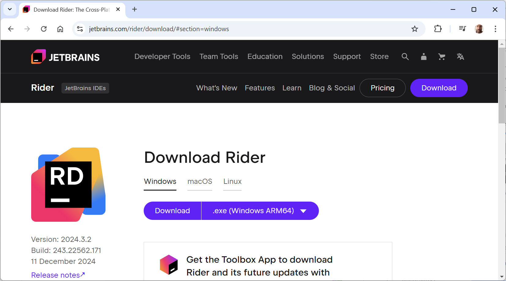
*Figure 1.1: Download Rider*

> If you're on Ubuntu 16.04 or later, you can install Rider from the command promptor terminal, as shown in the following command: `sudo snap install rider --classic`

2. Run the installer.
3. Download the latest version of JetBrains Toolbox App from the following link: https://www.jetbrains.com/toolbox-app/.
4. Run the installer.

## Managing multiple projects using Rider

Rider uses the same concept of a solution that Visual Studio does. A solution file (`.sln`) allows you to open and manage multiple projects simultaneously. We will use a solution to manage the two projects that you will create in this chapter.

## Writing code using Rider

Let's get started writing code!

1.	Start **Rider**.
2.	In the **Welcome to JetBrains Rider** window, click the **New Solution** button, as shown in *Figure 1.2*:

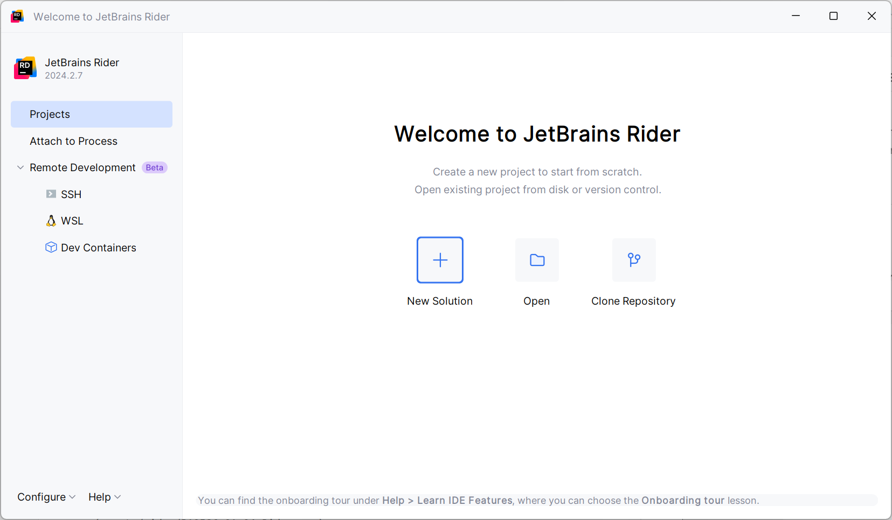
*Figure 1.2: Welcome to JetBrains Rider dialog box with the New Solution button*

3.	In the **New Solution** dialog, in the left-side list of project templates, select **Console**, and set additional names and options as shown in *Figure 1.3*:
    - **Solution name**: `Chapter01`
    - **Project name**: `HelloCS`
    - **Solution directory**: `C:\cs12dotnet8` or `C:\Users\<user>\RiderProjects`
    - **Target framework**: `net8.0` from **SDK 8.0**
    - **Language**: C#
    - **Docker Support**: Cleared

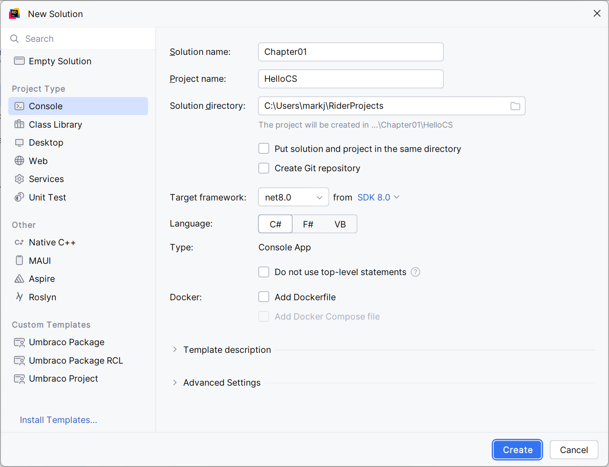
*Figure 1.3: Configuring names and options for a Console project template*

4.	Click **Create**.
5.	If code is not shown, then in the **Explorer** pane, in its **Solution** view, double-click to open the file named `Program.cs`, and note the code, as shown in *Figure 1.4*:

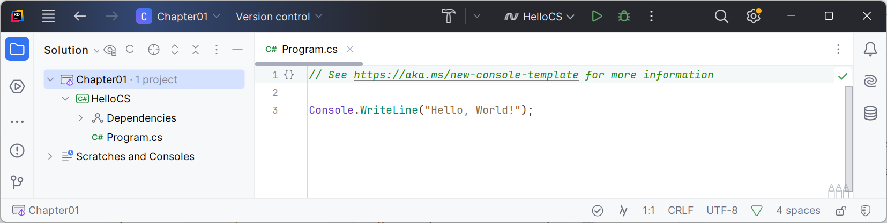 
*Figure 1.4: Editing Program.cs in Rider*

6.	In `Program.cs`, note the code consists of only a comment and a single statement. This is because it uses the top-level program feature introduced in C# 9, as shown in the following code:
```cs
// See https://aka.ms/new-console-template for more information
Console.WriteLine("Hello, World!");
```

> As the comment in the code says, you can read more about this template at the following link: https://aka.ms/new-console-template.

7.	In `Program.cs`, modify line 9 so that the text that is being written to the console says, `Hello, C#!`.

## Compiling and running code using Rider

The next task is to compile and run the code.

1.	In **Rider**, navigate to **Run** | **Run 'HelloCS'**, as shown in *Figure 1.5*:

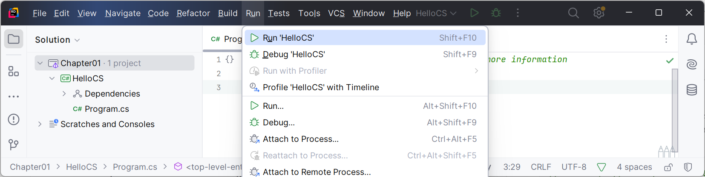 
*Figure 1.5: Editing Program.cs in Rider*

2.	The output in the **Run** pane will show the result of running your application, as shown in *Figure 1.6*:

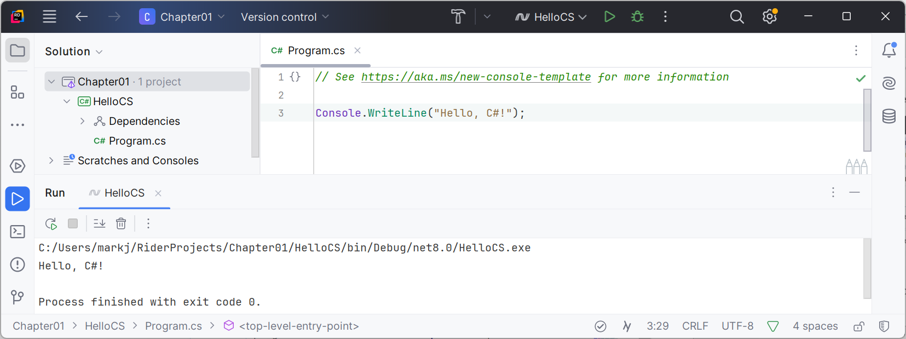
*Figure 1.6: Output of the console application in the Run pane*

3.	Select the `HelloCS` project and then in the **Explorer** pane's toolbar, toggle on the **Show All Files** button, and note the compiler-generated `bin` and `obj` folders are visible, as shown in *Figure 1.7*:

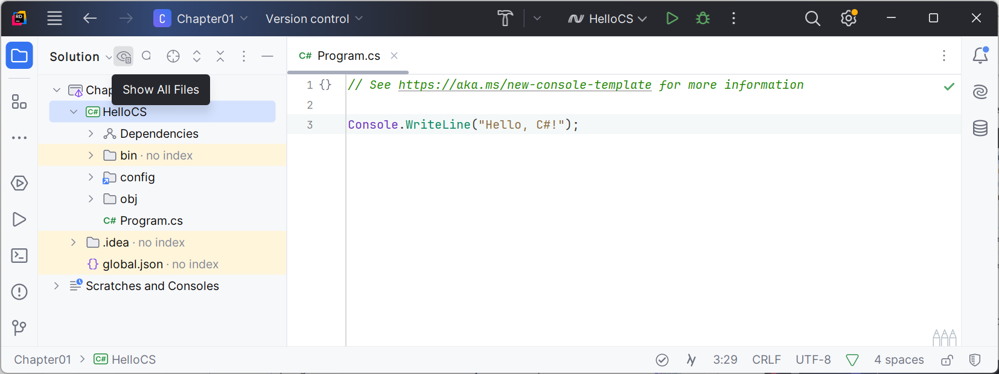
*Figure 1.7: Showing the compiler-generated folders and files*

## Understanding the compiler-generated folders and files

Two compiler-generated folders were created, named `obj` and `bin`. You do not need to look inside these folders or understand their files yet. Just be aware that the compiler needs to create temporary folders and files to do its work. You could delete these folders and their files, and they can be recreated later. Developers often do this to "clean" a project. Rider even has a command on the **Build** menu named **Clean Solution** that deletes some of these temporary files for you. 

- The `obj` folder contains one compiled object file for each source code file. These objects haven't been linked together into a final executable yet. 
- The `bin` folder contains the binary executable for the application or class library. We will look at this in more detail in *Chapter 7, Packaging and Distributing .NET Types*.

## Understanding top-level programs

If you have seen older .NET projects before then you might have expected more code, even just to output a simple message. This project has minimal statements because some of the required code is written for you by the compiler when you target .NET 6 or later. 

If you had created the project with .NET SDK 5.0 or earlier, or if you had used Visual Studio or the `dotnet new` command with options to use the older style, then the `Program.cs` file would have more statements, as shown in the following code:
```cs
using System;

namespace HelloCS
{
  class Program
  {
    static void Main(string[] args)
    {
      Console.WriteLine("Hello, World!");
    }
  }
}
```

During compilation with .NET SDK 6 or later, all the boilerplate code to define the `Program` class and its `Main` method is generated and wrapped around the statements you write.

This uses a feature introduced in .NET 5 called top-level programs, but it was not until .NET 6 that Microsoft updated the project template for console apps to use it by default.

> **Warning!** One functional difference is that the auto-generated code does not define a namespace, so the `Program` class is implicitly defined in a `null` namespace with no name instead of a namespace that matches the name of the project.

## Requirements for top-level programs

Key points to remember about top-level programs include the following:
- There can be only one file like this in a project.
- Any `using` statements must go at the top of the file.
- If you declare any classes or other types, they must go at the bottom of the file.
- Although you should name the method `Main` if you explicitly define it, the method is named `<Main>$` when created by the compiler.

## Implicitly imported namespaces

A `using System;` statement at the top of a C# class file imports the `System` namespace. This enables the `Console.WriteLine` statement to work. Why do we not have to import it in our project? 

The trick is that we *do* still need to import the `System` namespace, but it is now done for us using a combination of features introduced in C# 10 and .NET 6. Let's see how:

1.	In the **Explorer**, **Solution**, expand the `obj` folder, expand the `Debug` folder, expand the `net8.0` folder, and open the file named `HelloCS.GlobalUsings.g.cs`.
2.	Note that this file is automatically created by the compiler for projects that target .NET 6 or later, and that it uses a feature introduced in C# 10 called **global namespace imports** that imports some commonly used namespaces like `System` for use in all code files, as shown in the following code:
```cs
// <autogenerated />
global using global::System;
global using global::System.Collections.Generic;
global using global::System.IO;
global using global::System.Linq;
global using global::System.Net.Http;
global using global::System.Threading;
global using global::System.Threading.Tasks;
```

3.	In the **Explorer**, **Solution** pane, click the **Show All Files** button to hide the `bin` and `obj` folders. 

I will explain more about the implicit imports feature in the next chapter. For now, just note that a significant change that happened between .NET 5 and .NET 6 is that many of the project templates, like the one for console apps, use new SDK and language features to hide what is really happening.

## Revealing the hidden code by throwing an exception

Now let's discover how the hidden code has been written:

1.	In `Program.cs`, after the statement that outputs the message, add a statement to throw a new exception, as shown in the following code:
```cs
throw new Exception();
```

2.	Navigate to **Run** | **Run HelloCS**. (Do not start the project with debugging or the exception will be caught by the debugger!)
3.	The output in the console window will show the result of running your application, including that a hidden `Program` class was defined by the compiler with a method named `<Main>$` that has a parameter named `args` for passing in arguments, as shown in *Figure 1.8*:

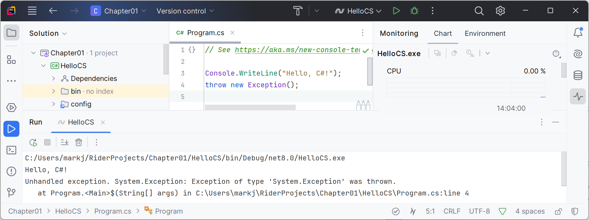
*Figure 1.8: Throwing an exception to reveal the hidden `Program.<Main>$` method*

## Revealing the namespace for the Program class

Now, let's discover what namespace the `Program` class has been defined within:

1.	In `Program.cs`, after the statement that outputs the message, add statements to get the name of the namespace of the `Program` class, and then write it to the console, as shown in the following code:
```cs
string name = typeof(Program).Namespace ?? "None!";
Console.WriteLine($"Namespace: {name}");
```

> `??` is the null-coalescing operator. The first statement means, "if the namespace of `Program` is `null` then return `None!` otherwise return the name." You will see more explanations of these keywords and operators throughout the book.

2.	In Rider, navigate to **Run** | **Run HelloCS**.
3.	The output in the console window will show the result of running your application, including that the hidden `Program` class was defined without a namespace, as shown in the following output:
```
Namespace: None!
```

## Adding a second project using Rider

Let's add a second project to our solution to explore top-level programs.

1. In the **Explorer** pane, right-click the solution named `Chapter01` and navigate to **Add** | **New Project**, as shown in *Figure 1.9*:

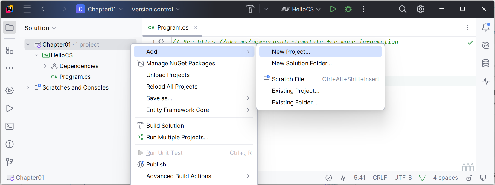
*Figure 1.9: Adding a new project to the solution*

2.	In the **New Project** dialog, select **Console**, and complete the project information:
    - **Project name**: `AboutMyEnvironment`
    - **Do not use top-level statements**: Selected
    - Other options: leave as they are, as shown in *Figure 1.10*:

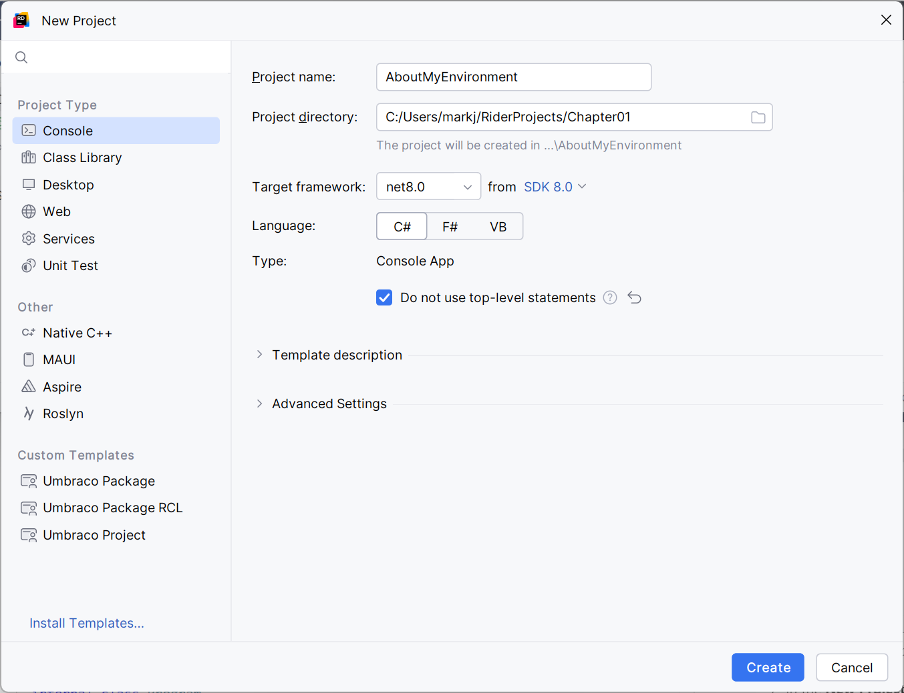
*Figure 1.10: Adding a new project using legacy style Program class*

3. Click **Create**.
4. In `Program.cs`, note the template code with the older style that explictly defines a `Program` class with a `Main` method, as shown in the following code:
```cs
namespace AboutMyEnvironment;

class Program
{ 
  static void Main(string[] args)
  {
    Console.WriteLine("Hello, World!");
  }
}
```

4.	In `Program.cs`, in the `Main` method, delete the existing `Console.WriteLine` statement and then add statements to output the current directory, the version of the operating system, and the namespace of the `Program` class, as shown in the following code:
```cs
Console.WriteLine(Environment.CurrentDirectory);
Console.WriteLine(Environment.OSVersion.VersionString);
Console.WriteLine("Namespace: {0}", typeof(Program).Namespace);
```

5.	Navigate to **Run** | **Run...***, select **AboutMyEnvironment**, and note the result, as shown the following output and in *Figure 1.11*:
```
C:\Users\markj\RiderProjects\Chapter01\AboutMyEnvironment\bin\Debug\net8.0
Microsoft Windows NT 10.0.26100.0
Namespace: AboutMyEnvironment
```

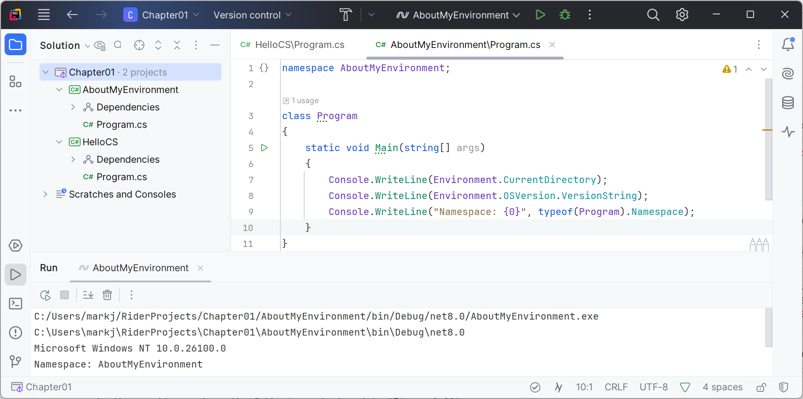
*Figure 1.11: Running a top-level program in a Rider solution with two projects on Windows*

# Chapter 2 - Speaking C#

## Passing arguments to a console app

1. Right-click the `Arguments` project. 
2. In the popup menu, select **More Run/Debug** | **Modify Run Configuration...**.
3. In the **Program arguments** box, enter the following arguments: `firstarg second-arg third:arg "fourth arg"`, as shown in *Figure 1.12*:
 
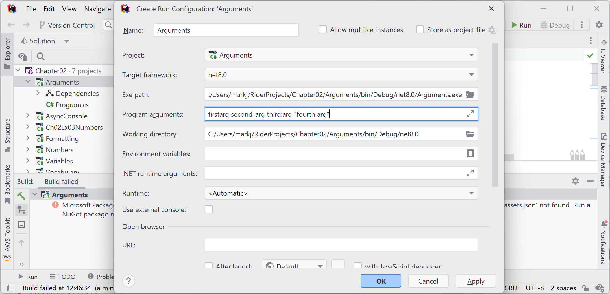
*Figure 1.12: Setting arguments for a console app in Rider*

1. Click **Apply**, then click **OK**.
2. Run the console app.
