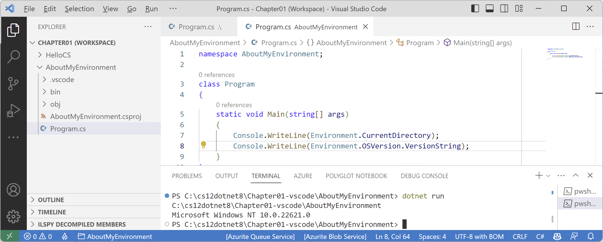

**Using Visual Studio Code**

In this article, I provide detailed step-by-step instuctions for using Visual Studio Code for topics like creating a solution with multiple projects and using debugging tools.

- [Chapter 1](#chapter-1)
  - [Building console apps using Visual Studio Code](#building-console-apps-using-visual-studio-code)
  - [Managing multiple projects using Visual Studio Code](#managing-multiple-projects-using-visual-studio-code)
    - [Writing code using Visual Studio Code](#writing-code-using-visual-studio-code)
  - [Compiling and running code using the dotnet CLI](#compiling-and-running-code-using-the-dotnet-cli)
  - [Adding a second project using Visual Studio Code](#adding-a-second-project-using-visual-studio-code)
- [Chapter 4](#chapter-4)
- [Chapter 7 - Packaging and Distributing .NET Types](#chapter-7---packaging-and-distributing-net-types)
  - [Decompiling using the ILSpy extension for Visual Studio Code](#decompiling-using-the-ilspy-extension-for-visual-studio-code)

# Chapter 1

## Building console apps using Visual Studio Code

The goal of this section is to showcase how to build a console app using Visual Studio Code and the `dotnet` command-line interface (CLI).

If you never want to try Visual Studio Code, then please feel free to skip this section, and then continue with the *Reviewing the folders and files for projects* section.

Both the instructions and screenshots in this section are for Windows, but the same actions will work with Visual Studio Code on the macOS and Linux variants.

The main differences will be native command-line actions such as deleting a file: both the command and the path are likely to be different on Windows or macOS and Linux. Luckily, the `dotnet` CLI tool itself and its commands are identical on all platforms.

## Managing multiple projects using Visual Studio Code

Visual Studio Code has a concept named a workspace that allows you to open and manage multiple projects simultaneously. We will use a workspace to manage the two projects that you will create in this chapter.

### Writing code using Visual Studio Code

Let's get started writing code!

1. Start Visual Studio Code.
2. Make sure that you do not have any open files, folders, or workspaces.
3. Navigate to **File** | **Save Workspace As…**.
4. In the dialog box, navigate to your `C:` drive on Windows, your user folder on macOS (mine is named `markjprice`), or any directory or drive in which you want to save your projects.
5. Click the **New Folder** button and name the folder `cs12dotnet8`. (If you completed the section for Visual Studio 2022, then this folder will already exist.)
6. In the `cs12dotnet8` folder, create a new folder named `Chapter01-vscode`.
7. In the `Chapter01-vscode` folder, save the workspace as `Chapter01.code-workspace`.
8. Navigate to **File** | **Add Folder to Workspace…** or click the **Add Folder** button.
9. In the `Chapter01-vscode` folder, create a new folder named `HelloCS`.
10. Select the `HelloCS` folder and click the **Add** button.
11. When you see the dialog asking if you trust the authors of the files in this folder, click **Yes**, as shown in *Figure 1.11*:


*Figure 1.11: Trusting a folder in Visual Studio Code*

12.  Under the menu bar, note the blue bar that explains **Restricted Mode**, and click **Manage**.
13.  In the **Workspace Trust** tab, click the **Trust** button, as shown in *Figure 1.12*:


*Figure 1.12: Trusting a workspace in Visual Studio Code*

When working with Visual Studio Code in the future, if some features seem to be broken, it might be because your workspace or folder is in restricted mode. You can scroll down the **Workspace Trust** window and manually manage which folders and workspaces you currently trust.

14. Close the **Workspace Trust** tab.
15. Navigate to **View** | **Terminal**.
16. In **TERMINAL**, make sure that you are in the `HelloCS` folder, and then use the `dotnet` CLI to create a new console app, as shown in the following command:
```
dotnet new console
```
> The `dotnet new console` command targets your latest .NET SDK version by default. To target a different version, use the `-f` switch to specify a target framework, as shown in the following command: `dotnet new console -f net6.0`

17. You will see that the `dotnet` command-line tool creates a new console app project for you in the current folder, and the **EXPLORER** window shows the two files created, `HelloCS.csproj` and `Program.cs`, and the `obj` folder, as shown in *Figure 1.13*:

 
*Figure 1.13: The EXPLORER window will show that two files and a folder have been created*

> By default, the name of the project will match the folder name. The `dotnet new console` command created a project file named `HelloCS.csproj` in the `HelloCS` folder. If you want to create a folder and project simultaneously, then you can use the `-o` switch. For example, if you are in the `Chapter01-vscode` folder and you want to create a subfolder and project named `HelloCS`, then you enter the following command: `dotnet new console -o HelloCS`.

1. In **EXPLORER**, click on the file named `Program.cs` to open it in the editor window. The first time that you do this, Visual Studio Code may have to download and install C# dependencies like OmniSharp, .NET Core Debugger, and Razor Language Server, if it did not do this when you installed the C# extension or if they need updating. Visual Studio Code will show progress in the **Output** window and eventually the message `Finished`, as shown in the following output:
```
Installing C# dependencies...
Platform: win32, x86_64
Downloading package 'OmniSharp for Windows (.NET 4.6 / x64)' (36150 KB).................... Done!
Validating download...
Integrity Check succeeded.
Installing package 'OmniSharp for Windows (.NET 4.6 / x64)'
Downloading package '.NET Core Debugger (Windows / x64)' (45048 KB).................... Done!
Validating download...
Integrity Check succeeded.
Installing package '.NET Core Debugger (Windows / x64)'
Downloading package 'Razor Language Server (Windows / x64)' (52344 KB).................... Done!
Installing package 'Razor Language Server (Windows / x64)'
Finished
```

> The preceding output is from Visual Studio Code on Windows. When run on macOS or Linux, the output will look slightly different, but the equivalent components for your operating system will be downloaded and installed.

2. Folders named `obj` and `bin` will have been created and when you see a notification saying that required assets are missing, click **Yes**, as shown *in Figure 1.14*:

 
*Figure 1.14: Warning message to add required build and debug assets*

3. If the notification disappears before you can interact with it, then you can click the bell icon in the far-right corner of the status bar to show it again.
4. After a few seconds, another folder named `.vscode` will be created with some files that are used by Visual Studio Code to provide features like IntelliSense during debugging, which you will learn more about in *Chapter 4, Writing, Debugging, and Testing Functions*.
5. In `Program.cs`, modify line 2 so that the text that is being written to the console says `Hello, C#!`

> **Good Practice**: Navigate to **File** | **Auto Save**. This toggle will save the annoyance of remembering to save before rebuilding your application each time.

## Compiling and running code using the dotnet CLI

The next task is to compile and run the code:

1.	Navigate to **View** | **Terminal** and enter the following command:
```
dotnet run
```
2. The output in the **TERMINAL** window will show the result of running your application, as shown in *Figure 1.15*:

 
*Figure 1.15: The output of running your first console app*

3. In `Program.cs`, after the statement that outputs the message, add a statement to throw a new exception, as shown in the following code:
```cs
throw new Exception();
```
4.	Navigate to **View** | **Terminal** and enter the following command:
```
dotnet run
```
5. In **TERMINAL**, you can press the up and down arrows to loop through previous commands and then press the left and right arrows to edit the command before pressing *Enter* to run them.
6. The output in the **TERMINAL** window will show the result of running your application, including that a hidden `Program` class was defined by the compiler with a method named `<Main>$` that has a parameter named `args` for passing in arguments, as shown in the following output:
```
Hello, C#!
   at Program.<Main>$(String[] args) in C:\cs12dotnet8\Chapter01-vscode\HelloCS\Program.cs:line 3
```

## Adding a second project using Visual Studio Code

Let's add a second project to our workspace to explore how to work with multiple projects:
1.	In Visual Studio Code, navigate to **File** | **Add Folder to Workspace…**.
2. In the `Chapter01-vscode` folder, use the **New Folder** button to create a new folder named `AboutMyEnvironment`, select it, and click **Add**.
3. When asked if you trust the folder, click **Yes**.
4. Navigate to **Terminal** | **New Terminal**, and in the drop-down list that appears, select `AboutMyEnvironment`. 

> Alternatively, in **EXPLORER**, right-click the `AboutMyEnvironment` folder and then select **Open in Integrated Terminal**.

5. In **TERMINAL**, confirm that you are in the `AboutMyEnvironment` folder, and then enter the command to create a new console app using the older style with an explicitly defined namespace, `Program` class, and `Main` method, as shown in the following command:
```
dotnet new console --use-program-main
```

> **Good Practice**: When using workspaces, be careful when entering commands in **TERMINAL**. Be sure that you are in the correct folder before entering potentially destructive commands! That is why I got you to create a new terminal for `AboutMyEnvironment` before issuing the command to create a new console app.

6. Navigate to **View** | **Command Palette**.
7. Enter `omni`, and then, in the drop-down list that appears, select **OmniSharp: Select Project**.
8. In the drop-down list of two projects, select the `AboutMyEnvironment` project, and when prompted, click **Yes** to add required assets to debug.

> **Good Practice**: To enable debugging and other useful features, like code formatting and Go To Definition, you must tell OmniSharp which project you are actively working on in Visual Studio Code. You can quickly toggle active projects by clicking the project/folder to the right of the flame icon on the left side of the status bar.


9. In **EXPLORER**, in the `AboutMyEnvironment` folder, select `Program.cs` and then change the existing statement to output the current directory and the operating system version string, as shown in the following code:
```cs
Console.WriteLine(Environment.CurrentDirectory);
Console.WriteLine(Environment.OSVersion.VersionString);
```

10. In **TERMINAL**, enter the command to run a program, as shown in the following command:
```
dotnet run
```

11. Note the output in the **TERMINAL** window, as shown in the following output and in *Figure 1.16*:
```
C:\cs12dotnet8\Chapter01-vscode\AboutMyEnvironment
Microsoft Windows NT 10.0.22621.0
```


*Figure 1.16: Running a console app in a Visual Studio Code workspace with two projects*

When using Visual Studio Code, or more accurately, the dotnet CLI, to run a console app, it executes the app from the `<projectname>` folder. When using Visual Studio 2022 for Windows, it executes the app from the `<projectname>\bin\Debug\net8.0` folder. It will be important to remember this when we work with the filesystem in later chapters. 

If you were to run the program on macOS Big Sur, the environment operating system would be different, as shown in the following output:
```
Unix 11.2.3
```

# Chapter 4

# Chapter 7 - Packaging and Distributing .NET Types

## Decompiling using the ILSpy extension for Visual Studio Code

A similar capability is available cross-platform as an extension for Visual Studio Code.

1.	If you have not already installed the ILSpy .NET Decompiler extension for Visual Studio Code, then search for it and install it now.
2.	On macOS or Linux the extension has a dependency on Mono so you will also need to install Mono from the following link: https://www.mono-project.com/download/stable/.
3.	In Visual Studio Code, navigate to **View** | **Command Palette…**.
4.	Type `ilspy` and then select **ILSpy: Pick assembly from file system**.
5.	Navigate to the following folder:
`cs11dotnet7/Chapter07/DotNetEverywhere/bin/Release/net7.0/linux-x64`
6.	Select the `System.IO.FileSystem.dll` assembly and click **Select assembly**. Nothing will appear to happen, but you can confirm that ILSpy is working by viewing the **Output** window, selecting **ILSpy Extension** in the dropdown list, and seeing the processing, as shown in Figure 7.6:

*Figure 7.6: ILSpy extension output when selecting an assembly to decompile*

7.	In **EXPLORER**, expand **ILSPY DECOMPILED MEMBERS**, select the assembly, and close the **Output** window.
8.	
9.	Click the **Output language** button, select **IL**, and note the edit window now shows assembly attributes using C# code and external DLL and assembly references using IL code, as shown in *Figure 7.7*:

*Figure 7.7: Expanding ILSPY DECOMPILED MEMBERS*

10.	In the IL code on the right side, note the reference to the `System.Runtime` assembly, including the version number, as shown in the following code:
```
.module extern libSystem.Native
.assembly extern System.Runtime
{
  .publickeytoken = (
    b0 3f 5f 7f 11 d5 0a 3a
  )
  .ver 6:0:0:0
}
.module extern lib
```
`System.Native` means this assembly makes function calls to Linux system APIs as you would expect from code that interacts with the filesystem. If we had decompiled the Windows equivalent of this assembly, it would use `.module extern kernel32.dll` instead, which is a Win32 API.

11.	In **EXPLORER**, in **ILSPY DECOMPILED MEMBERS**, expand the assembly, expand the `System.IO` namespace, select `Directory`, and note the two edit windows that open showing the decompiled `Directory` class using C# code on the left and IL code on the right, as shown in *Figure 7.8*:
 
*Figure 7.8: The decompiled Directory class in C# and IL code*

12.	Compare the C# source code for the `GetParent` method, shown in the following code:
```cs
public static DirectoryInfo? GetParent(string path)
{
  if (path == null)
  {
    throw new ArgumentNullException("path");
  }
  if (path.Length == 0)
  {
    throw new ArgumentException(SR.Argument_PathEmpty, "path");
  }
  string fullPath = Path.GetFullPath(path);
  string directoryName = Path.GetDirectoryName(fullPath);
  if (directoryName == null)
  {
    return null;
  }
  return new DirectoryInfo(directoryName);
}
```
13.	With the equivalent IL source code of the `GetParent` method, as shown in the following code:
```
.method /* 06000067 */ public hidebysig static 
  class System.IO.DirectoryInfo GetParent (
    string path
  ) cil managed
{
  .param [0]
    .custom instance void System.Runtime.CompilerServices
    .NullableAttribute::.ctor(uint8) = ( 
      01 00 02 00 00
    )
  // Method begins at RVA 0x62d4
  // Code size 64 (0x40)
  .maxstack 2
  .locals /* 1100000E */ (
    [0] string,
    [1] string
  )
  IL_0000: ldarg.0
  IL_0001: brtrue.s IL_000e
  IL_0003: ldstr "path" /* 700005CB */
  IL_0008: newobj instance void [System.Runtime]
    System.ArgumentNullException::.ctor(string) /* 0A000035 */
  IL_000d: throw
  IL_000e: ldarg.0
  IL_000f: callvirt instance int32 [System.Runtime]
    System.String::get_Length() /* 0A000022 */
  IL_0014: brtrue.s IL_0026
  IL_0016: call string System.SR::get_Argument_PathEmpty() /* 0600004C */
  IL_001b: ldstr "path" /* 700005CB */
  IL_0020: newobj instance void [System.Runtime]
    System.ArgumentException::.ctor(string, string) /* 0A000036 */
  IL_0025: throw IL_0026: ldarg.0
  IL_0027: call string [System.Runtime.Extensions]
    System.IO.Path::GetFullPath(string) /* 0A000037 */
  IL_002c: stloc.0 IL_002d: ldloc.0
  IL_002e: call string [System.Runtime.Extensions]
    System.IO.Path::GetDirectoryName(string) /* 0A000038 */
  IL_0033: stloc.1
  IL_0034: ldloc.1
  IL_0035: brtrue.s IL_0039 IL_0037: ldnull
  IL_0038: ret IL_0039: ldloc.1
  IL_003a: newobj instance void 
    System.IO.DirectoryInfo::.ctor(string) /* 06000097 */
  IL_003f: ret
} // end of method Directory::GetParent
```
> **Good Practice**: The IL code is not especially useful unless you get very advanced with C# and .NET development when knowing how the C# compiler translates your source code into IL code can be important. The much more useful edit windows contain the equivalent C# source code written by Microsoft experts. You can learn a lot of good practices from seeing how professionals implement types. For example, the `GetParent` method shows how to check arguments for `null` and other argument exceptions.
14.	Close the edit windows without saving changes.
15.	In **EXPLORER**, in **ILSPY DECOMPILED MEMBERS**, right-click the assembly and choose **Unload Assembly**.
