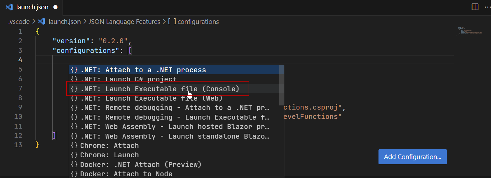
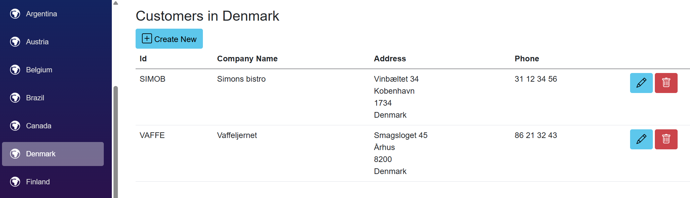

**Errata** (60 items)

If you find any mistakes, then please [raise an issue in this repository](https://github.com/markjprice/cs12dotnet8/issues) or email me at markjprice (at) gmail.com.

- [Page 5 - Choosing the appropriate tool and application type for learning](#page-5---choosing-the-appropriate-tool-and-application-type-for-learning)
- [Page 10 - Installing other extensions](#page-10---installing-other-extensions)
- [Page 15 - Understanding .NET runtime and .NET SDK versions](#page-15---understanding-net-runtime-and-net-sdk-versions)
- [Page 43 - Configuring inline aka inlay hints](#page-43---configuring-inline-aka-inlay-hints)
- [Page 50 - Exercise 1.2 – Practice C# anywhere with a browser](#page-50---exercise-12--practice-c-anywhere-with-a-browser)
- [Page 51 - Exercise 1.5 – Explore themes of modern .NET](#page-51---exercise-15--explore-themes-of-modern-net)
- [Page 54 - Understanding C# standards](#page-54---understanding-c-standards)
- [Page 58 - Showing the compiler version](#page-58---showing-the-compiler-version)
- [Page 65 - Comparing programming languages to human languages](#page-65---comparing-programming-languages-to-human-languages)
- [Page 87 - Comparing double and decimal types](#page-87---comparing-double-and-decimal-types)
- [Page 95 - Displaying output to the user](#page-95---displaying-output-to-the-user)
- [Page 110 - Handling platforms that do not support an API](#page-110---handling-platforms-that-do-not-support-an-api)
- [Page 124 - Exploring bitwise and binary shift operators](#page-124---exploring-bitwise-and-binary-shift-operators)
- [Page 149 - How negative numbers are represented in binary](#page-149---how-negative-numbers-are-represented-in-binary)
- [Page 162 - Throwing overflow exceptions with the checked statement](#page-162---throwing-overflow-exceptions-with-the-checked-statement)
- [Page 196 - Using the Visual Studio Code integrated terminal during debugging](#page-196---using-the-visual-studio-code-integrated-terminal-during-debugging)
- [Page 225 - Where to catch exceptions](#page-225---where-to-catch-exceptions)
- [Page 241 - Inheriting from System.Object](#page-241---inheriting-from-systemobject)
- [Page 261 - Passing optional parameters](#page-261---passing-optional-parameters)
- [Page 265 - Controlling how parameters are passed](#page-265---controlling-how-parameters-are-passed)
- [Page 295 - Setting up a class library and console application](#page-295---setting-up-a-class-library-and-console-application)
- [Page 296 - Implementing functionality using methods](#page-296---implementing-functionality-using-methods)
- [Page 305 - Working with non-generic types](#page-305---working-with-non-generic-types)
- [Page 316 - Comparing objects when sorting](#page-316---comparing-objects-when-sorting)
- [Page 324 - How reference and value types are stored in memory](#page-324---how-reference-and-value-types-are-stored-in-memory)
- [Page 324 - How reference and value types are stored in memory](#page-324---how-reference-and-value-types-are-stored-in-memory-1)
- [Page 330 - Defining struct types](#page-330---defining-struct-types)
- [Page 331 - Defining record struct types](#page-331---defining-record-struct-types)
- [Page 344 - Inheriting from classes](#page-344---inheriting-from-classes)
- [Page 361 - Comparing inheritance and implementation](#page-361---comparing-inheritance-and-implementation)
- [Page 375 - Revealing the location of a type](#page-375---revealing-the-location-of-a-type)
- [Page 383 - Creating a console app to publish](#page-383---creating-a-console-app-to-publish)
- [Page 386 - Publishing a self-contained app](#page-386---publishing-a-self-contained-app)
- [Page 388 - Publishing a single-file app](#page-388---publishing-a-single-file-app)
- [Page 394 - Publishing a native AOT project](#page-394---publishing-a-native-aot-project)
- [Page 399 - Decompiling using the ILSpy extension for Visual Studio 2022](#page-399---decompiling-using-the-ilspy-extension-for-visual-studio-2022)
- [Page 400 - Viewing source links with Visual Studio 2022](#page-400---viewing-source-links-with-visual-studio-2022)
- [Page 421 - Generating GUIDs](#page-421---generating-guids)
- [Page 430 - Regular expression performance improvements](#page-430---regular-expression-performance-improvements)
- [Page 430 - Understanding the syntax of a regular expression](#page-430---understanding-the-syntax-of-a-regular-expression)
- [Page 468 - Managing directories, Managing files](#page-468---managing-directories-managing-files)
- [Page 509 - Expanding, setting, and getting an environment variables](#page-509---expanding-setting-and-getting-an-environment-variables)
- [Page 522 - Using the lightweight ADO.NET database providers](#page-522---using-the-lightweight-adonet-database-providers)
- [Page 538 - Scaffolding models using an existing database](#page-538---scaffolding-models-using-an-existing-database)
- [Page 548 - Getting the generated SQL](#page-548---getting-the-generated-sql)
- [Page 553 - Getting a single entity](#page-553---getting-a-single-entity)
- [Page 553 and 554 - Getting a single entity](#page-553-and-554---getting-a-single-entity)
- [Page 574 - More efficient updates and deletes](#page-574---more-efficient-updates-and-deletes)
- [Page 616 - Be careful with Count!](#page-616---be-careful-with-count)
- [Page 641 - Customizing the model and defining an extension method](#page-641---customizing-the-model-and-defining-an-extension-method)
- [Page 656 - Creating an empty ASP.NET Core project](#page-656---creating-an-empty-aspnet-core-project)
- [Page 684 - Defining a form to insert a new supplier](#page-684---defining-a-form-to-insert-a-new-supplier)
- [Page 694 - Exercise 13.3 – Enabling HTTP/3 and request decompression support](#page-694---exercise-133--enabling-http3-and-request-decompression-support)
- [Page 711 - Creating data repositories with caching for entities](#page-711---creating-data-repositories-with-caching-for-entities)
- [Page 714 - Route constraints](#page-714---route-constraints)
- [Page 753 - Reviewing Blazor routing, layouts, and navigation](#page-753---reviewing-blazor-routing-layouts-and-navigation)
- [Page 761 - Using Bootstrap icons](#page-761---using-bootstrap-icons)
- [Page 771 - Building a customer detail component](#page-771---building-a-customer-detail-component)
- [Page 778 - Exercise 15.3 – Practice by creating a country navigation item](#page-778---exercise-153--practice-by-creating-a-country-navigation-item)
- [Appendix - Page 1 - Exercise 1.1 – Test your knowledge](#appendix---page-1---exercise-11--test-your-knowledge)

# Page 5 - Choosing the appropriate tool and application type for learning

> Thanks to [s3ba-b](https://github.com/s3ba-b) for raising [this issue on November 3, 2024](https://github.com/markjprice/cs12dotnet8/issues/74).

The last sentence says, "Then, in Chapters 12 to 16, you will build websites, services, and web browser apps." It should have said, "Then, in Chapters 12 to 15, you will build websites, web browser apps, and web services."

# Page 10 - Installing other extensions

> Thanks to [Muhammad Faisal Siddiqui](https://github.com/devcloud-ops) for raising [this issue on November 20, 2023](https://github.com/markjprice/cs12dotnet8/issues/3).

At the time of publishing, the Polyglot Notebooks extension has a dependency on .NET 7. The extension will soon be updated to use .NET 8 but for now you must install .NET 7 SDK. Hopefully the team will also update the extension to use the **.NET Install Tool** that ensures a correct version of a required .NET SDK is installed so users do not have to manually install it.

> Note: The .NET Interactive team targetted .NET 8 two days after this issue was raised: https://github.com/dotnet/interactive/pull/3336.

> Support for LTS only: When .NET 9 is released in November 2024, Interactive .NET and Polyglot Notebooks will upgrade to it. If you are limited to only LTS releases, "As a workaround, you can install older versions of Polyglot Notebooks that use previous .NET versions and turn off automatic updates in VS Code.": https://github.com/dotnet/interactive/issues/3355.

# Page 15 - Understanding .NET runtime and .NET SDK versions

> Thanks to a reader who contacted my publisher Packt on November 16, 2023 about this issue.

I wrote, ".NET SDK versioning does not follow semantic versioning. The major and minor version numbers are tied to the runtime version it is matched with. The patch number follows a convention that indicates 
the major and minor versions of the SDK."

But the patch number is not created from the major and minor versions of the SDK. It is created from the minor and patch versions of the SDK.

I should have written, ".NET SDK versioning does not follow semantic versioning. The major and minor version numbers are tied to the runtime version it is matched with. The third number follows a convention that indicates the minor and patch versions of the SDK. The third number starts at `100` for the initial version (equivalent to `0.0` for minor and patch number). The first digit increments with minor increments, and the other two digits increment with patch increments."

# Page 43 - Configuring inline aka inlay hints

> Thanks to [TheFumblebee](https://github.com/TheFumblebee) for raising [this issue on November 30, 2023](https://github.com/markjprice/cs12dotnet8/issues/5).

In the bullet for Visual Studio 2022, I wrote the label for the check box was **Display inline parameter hint names**. I should have written **Display inline parameter name hints**.

# Page 50 - Exercise 1.2 – Practice C# anywhere with a browser

> Thanks to MrBiteyFace in the book's Discord channel for raising this issue.

In this exercise, I wrote "You can start coding online at any of the following links: **Visual Studio Code for Web**: https://vscode.dev/".

Although **Visual Studio Code for Web** does support some extensions, it does not support the C# extension. If you edit a `.cs` file then you will not have IntelliSense to help you. It also does not support running and debugging C# code. 

In the next edition, I will remove this bullet or change it to **GitHub Codespaces** (i.e. Visual Studio Code hosted in a cloud-based virtual machine) instead.

# Page 51 - Exercise 1.5 – Explore themes of modern .NET

> Thanks to [Emre Duman](https://github.com/Emopusta) who raised this [issue on March 11, 2024](https://github.com/markjprice/cs12dotnet8/issues/25).

Microsoft appears to have stopped paying for the domain used by the following link: https://themesof.net/. In the next edition, I will remove this exercise. 

# Page 54 - Understanding C# standards

> Thanks to [mark23344](https://github.com/mark23344) who raised this [issue on May 10, 2024](https://github.com/markjprice/cs12dotnet8/issues/36).

In the note box, I put a link to the C# specifications: https://learn.microsoft.com/en-us/dotnet/csharp/language-reference/specifications. But Microsoft changed the link without an automatic redirect so that link now returns a 404. 

The new link is: https://learn.microsoft.com/en-us/dotnet/csharp/specification/.

# Page 58 - Showing the compiler version

In Step 3, the code should have been styled as `Code` (monospace black-on-light-gray text) instead of `Command Line` (monospace white-on-black).

# Page 65 - Comparing programming languages to human languages

> Thanks to [zaynchoudry](https://github.com/zaynchoudry) who raised this [issue on April 14, 2024](https://github.com/markjprice/cs12dotnet8/issues/34).

I wrote, "this YouTube video shows a demonstration of an Arabic programming language: https://youtu.be/dkO8cdwf6v8."

That video has been removed. An alternative is available at the following link: https://www.youtube.com/watch?v=EwYIZBL4sAU.

# Page 87 - Comparing double and decimal types

> Thanks to Yousef Imran who raised this issue via email on December 15, 2023.

At the top of page 87, I end the section describing a few special values associated with real numbers that are available as constants in the `float` and `double` types. I wrote, "`NaN` represents not-a-number (for example, the result of dividing by zero)," but that sentence is missing a "zero". It should be, "`NaN` represents not-a-number (for example, the result of dividing zero by zero),". In the next edition I will fix this mistake. 

> Please also note a [related improvement](https://github.com/markjprice/cs12dotnet8/blob/main/docs/errata/improvements.md#page-87---comparing-double-and-decimal-types).

# Page 95 - Displaying output to the user

> Thanks to SilentSolace in the book's Discord channel for raising this issue on December 18, 2023.

I wrote, "If you want to write three letters to the console without carriage returns after them, then call the `Write` method, as shown in the following code:"
```cs
Write("A");
Write("B");
Write("C");
```

But I neglected to prefix the method calls with `Console.` so how does this work?

On page 102, in the section titled "Simplifying the usage of the console", I show how to avoid needing to prefix those method calls with `Console.` by adding a statement to statically import the `System.Console` class, as shown in the following code:
```cs
using static System.Console;
```

But seven pages earlier I show code without the prefix without an explanation why that works! 

In the next edition, I will show the full code, as shown in the following code:
```cs
Console.Write("A");
Console.Write("B");
Console.Write("C");
```

And the same for the second code block:
```cs
Console.WriteLine("A");
Console.WriteLine("B");
Console.WriteLine("C");
```

# Page 110 - Handling platforms that do not support an API

> Thanks to [rmantel23](https://github.com/rmantel23) for raising [this issue on June 4, 2024](https://github.com/markjprice/cs12dotnet8/issues/43).

At the top of page 110, I wrote, "Another way to handle differences in operating systems is to use the `OperatingSystem` class in the
`System` namespace, as shown in the following code:"
```cs
if (OperatingSystem.IsWindows())
{
  // Execute code that only works on Windows.
}
else if (OperatingSystem.IsWindowsVersionAtLeast(major: 10))
{
  // Execute code that only works on Windows 10 or later.
}
else if (OperatingSystem.IsIOSVersionAtLeast(major: 14, minor: 5))
{
  // Execute code that only works on iOS 14.5 or later.
}
else if (OperatingSystem.IsBrowser())
{
  // Execute code that only works in the browser with Blazor.
}
```

But the `if (OperatingSystem.IsWindows())` branch will always execute if the OS is Windows, and therefore the `else if (OperatingSystem.IsWindowsVersionAtLeast(major: 10))` branch will never execute! 

In the next edition I will fix the logic error, as shown in the following code:
```cs
if (OperatingSystem.IsWindowsVersionAtLeast(major: 10))
{
  // Execute code that only works on Windows 10 or later.
}
else if (OperatingSystem.IsWindows())
{
  // Execute code that only works on earlier versions of Windows.
}
else if (OperatingSystem.IsIOSVersionAtLeast(major: 14, minor: 5))
{
  // Execute code that only works on iOS 14.5 or later.
}
else if (OperatingSystem.IsBrowser())
{
  // Execute code that only works in the browser with Blazor.
}
```

# Page 124 - Exploring bitwise and binary shift operators

> Thanks to [Vlad Alexandru Meici](https://github.com/vladmeici) for raising [this issue on January 19, 2024](https://github.com/markjprice/cs12dotnet8/issues/13).

In Step 3, I refer to variables `a` and `b`, "In `Program.cs`, add statements to output the results of applying the left-shift operator to move
the bits of the variable `a` by three columns, multiplying `a` by 8, and right-shifting the bits of the variable `b` by one column, ...". 

I should have written `x` and `y`.

In the last paragraph, I wrote, "The `3` result is because the 1 bits in `b` were shifted one column into the 2-and 1-bit columns."

I should have written, "The `3` result is because the 1 bits in `y` were shifted one column into the 2-and 1-bit columns."

# Page 149 - How negative numbers are represented in binary

> Thanks to [Mahmoud Elnagar](https://github.com/m-ngr) for raising [this issue on May 26, 2024](https://github.com/markjprice/cs12dotnet8/issues/38).

In Step 3, I wrote, "Note that all the positive binary number representations start with 0 and all the negative binary number representations start with 1. The decimal value -1 is represented by all ones in binary. That is why when you have an integer too large to fit in a 32-bit integer, it becomes -1."

As Mahmoud says, it's not always the case that the result of this type of casting is -1. When casting from a wider integer data type to a narrower integer data type, the most significant extra bits gets truncated and the least significant bits represents the result of the casting. For example:
```cs
long x = 0b_101000101010001100100111010100101010;
int y = (int) x;

Console.WriteLine($"{x,38:B38} = {x}");
Console.WriteLine($"{y,38:B32} = {y}");
```

The result:
```
00101000101010001100100111010100101010 = 43657622826
      00101010001100100111010100101010 = 707949866
```

# Page 162 - Throwing overflow exceptions with the checked statement

> Thanks to [Justin Treher](https://github.com/jtreher) for raising [this issue on January 3, 2025](https://github.com/markjprice/cs13net9/issues/7).

In Step 3, I wrote, "let’s get the compiler to warn us about the overflow by wrapping the statements using a `checked` statement block", but it is not the compiler that warns us, it is the runtime that detects the overflow and throws the exception. In the next edition I will replace "compiler" with "runtime".

# Page 196 - Using the Visual Studio Code integrated terminal during debugging

> Thanks to **kingace9371** for asking a question about this, and to **rene** for providing the answer in the book's Discord channel.

In Step 7, I wrote, "In the `launch.json` file editor, click the **Add Configuration...** button, and then select **.NET: Launch .NET Core Console App**"

The name of this option is now called **.NET: Launch Executable file (Console)**, as shown in the following figure:



# Page 225 - Where to catch exceptions

> Thanks to Michael Smith for emailing me about this typo on May 22, 2024.

I wrote, "You might know that calling an exception could throw one or more types of exception, ..."

It should be, "You might know that calling a function could throw one or more types of exception, ..."

# Page 241 - Inheriting from System.Object

> Thanks to [Emre Duman](https://github.com/Emopusta) for raising [this issue on June 21, 2024](https://github.com/markjprice/cs12dotnet8/issues/57).

I wrote, "note that the class is in a .NET Standard 2.0 class library assembly and has a method named `ToString`, as shown in Figure 5.1:" but the screenshot cannot show the `ToString` method because it is too far down the class code file.

In the next edition, I will remove the text, "and has a method named `ToString`". After the figure, I will add a paragraph, "If you scroll down the class code file, note that the `Object` class has a method named `ToString`."

# Page 261 - Passing optional parameters

> Thanks to [Vlad Alexandru Meici](https://github.com/vladmeici) for raising [this issue on March 18, 2024](https://github.com/markjprice/cs12dotnet8/issues/28).

In Step 1, the method signature has an extra space between `command` and `=`, as shown in the following code:
```cs
public string OptionalParameters(string command  = "Run!",
```

Although extra whitespace has no effect on the compiler, in the next edition, I will remove the extra space, as shown in the following code:
```cs
public string OptionalParameters(string command = "Run!",
```

# Page 265 - Controlling how parameters are passed

> Thanks to [Stanislav Svystovych](https://github.com/ssvyst) for raising [this issue on June 4, 2024](https://github.com/markjprice/cs12dotnet8/issues/42).

In Step 4, I wrote, "In `Program.cs`, add statements to declare some more variables, including an `out` parameter named `f` declared inline, ..."

The variable name is `h` not `f`, so this should be, "In `Program.cs`, add statements to declare some more variables, including an `out` parameter named `h` declared inline, ..."

# Page 295 - Setting up a class library and console application

> Thanks to [rmantel23](https://github.com/rmantel23) for raising [this issue on June 14, 2024](https://github.com/markjprice/cs12dotnet8/issues/48).

In Step 6, I defined a region for properties and meant to define three properties, but although the first two members are properties, the third is missing its getter and setter, as shown in the following code:
```cs
public List<Person> Children = new();
```

It should be as follows:
```cs
public List<Person> Children { get; set; } = new();
```

# Page 296 - Implementing functionality using methods

> Thanks to [rmantel23](https://github.com/rmantel23) for raising [this issue on June 14, 2024](https://github.com/markjprice/cs12dotnet8/issues/50).

In Step 1, I wrote "add properties", but I defined a field, as shown in the following code:
```cs
public List<Person> Spouses = new();
```

It should be as follows:
```cs
public List<Person> Spouses { get; set; } = new();
```

# Page 305 - Working with non-generic types

> Thanks to [rmantel23](https://github.com/rmantel23) for raising [this issue on June 14, 2024](https://github.com/markjprice/cs12dotnet8/issues/51).

After the four steps, I wrote a paragraph, "Although the code works, there is potential for mistakes because literally any type can be used for the
key or value. If another developer used your variable named and expected all the items to be a certain type, ..."

In the second sentence, I failed to name the variable. The sentence should be: "If another developer used your variable named `lookupObject` and expected all the items to be a certain type, ..." Or I might just delete the word "named". Either would make the sentence less confusing.

# Page 316 - Comparing objects when sorting

> Thanks to **Obs** in the Discord channel for this book for raising this issue on October 10, 2024.

In Step 5, I wrote, "In `Person.cs`, after inheriting from `object`, add a comma and enter `IComparable<Person?>`, as highlighted in the following code:
```cs
public class Person : IComparable<Person?>
```

That instruction was written for an earlier edition where the `Person` class explicitly inherited from `object`. For example, `Person : object`. 

In the next edition, I will change Step 5 to be, "In `Person.cs`, add code to say that `Person` implements the `IComparable<Person?>` interface, ..."

> Thanks to **Ashish** in the Discord channel for this book for raising this issue.

In Step 9, the final `else` statement will never execute because the logic of the `if` and `else if` clauses mean it will only execute when `this` (the current object instance) is `null`. In that scenario, the method could not execute anyway since the object wouldn't exist! When I wrote the `if` statement, I exhaustively covered all combinations of `null` and `not null` for `other` and `this`, but one of those combinations could never in practice happen. 

In the next edition, I will add a comment for the following code from the `CompareTo` method:
```cs
else
{
  position = 0; // this and other are at same position.
}
```

And I will add a comment in the code explaining why it is not needed. I have already done this in the code solution here:
https://github.com/markjprice/cs12dotnet8/blob/main/code/Chapter06/PacktLibrary/Person.cs#L196

# Page 324 - How reference and value types are stored in memory

> Thanks to [rmantel23](https://github.com/rmantel23) for raising [this issue on June 17, 2024](https://github.com/markjprice/cs12dotnet8/issues/53).

In the code, I used `TimeSpace.Zero`. It should be `TimeSpan.Zero`.

# Page 324 - How reference and value types are stored in memory

> Thanks to [Steven Wu](https://github.com/ZhuohengWu) for raising [this issue on January 5, 2025](https://github.com/markjprice/cs12dotnet8/issues/82).

In the code, I used `System.Drawing.Point location = new(x: 4, y: 5);`. 

It should be `System.Drawing.Point location = new(x: 3, y: 5);` to match *Figure 6.1* (or the figure could be changed to match the code).

# Page 330 - Defining struct types

> Thanks to a reader who emailed Packt about this issue.

In Step 7, two statements include a close round bracket before the last double-quote that should be removed, as shown in the following code:
```cs
WriteLine($"dv1.Equals(dv5): {dv1.Equals(dv5)}");
WriteLine($"dv1 == dv5: {dv1 == dv5}");
```
The output on page 331 showed the extra close round brackets, as shown in the following output:
```
dv1.Equals(dv5): True)
dv1 == dv5: True)
```
Once the brackets are removed from the two statements, the output is correct, as shown in the following output:
```
dv1.Equals(dv5): True
dv1 == dv5: True
```

# Page 331 - Defining record struct types

> Thanks to [Vlad Alexandru Meici](https://github.com/vladmeici) for raising [this issue on November 23, 2024](https://github.com/markjprice/cs12dotnet8/issues/76).

In Step 1, I wrote, "In the `DisplacementVector` type, add the `record` keyword, as highlighted in the following code:"
```cs
public record struct DisplacementVector(int X, int Y);
```

The statement should not end with `(int X, int Y);` Although this syntax is correct, there is a lot more code in the type as currently defined. That statement should be:
```cs
public record struct DisplacementVector
```

# Page 344 - Inheriting from classes

> Thanks to [rmantel23](https://github.com/rmantel23) for raising [this issue on June 18, 2024](https://github.com/markjprice/cs12dotnet8/issues/54).

In Step 3, the following code statment includes an extra close-parenthesis: `TimeSpan.Zero))`. It should be: `TimeSpan.Zero)`.

> The code was already correct in the GitHub repository, as shown in the following code: https://github.com/markjprice/cs12dotnet8/blob/main/code/Chapter06/PeopleApp/Program.cs#L191

# Page 361 - Comparing inheritance and implementation

> Thanks to Blix in this book's Discord channel for pointing out this typo.

For the first sentence, I wrote, "For me, the terms inherit and implement are different, and in the early days of C# and .NET you could
strictly apply them to classes and interfaces respectfully."

In the next edition, I will correct the word "respectfully" to "respectively", as explained at the following link: https://www.merriam-webster.com/grammar/respectively-vs-respectfully.

# Page 375 - Revealing the location of a type

> Thanks to [rmantel23](https://github.com/rmantel23) for raising [this issue on June 20, 2024](https://github.com/markjprice/cs12dotnet8/issues/55).

In Step 1, I wrote, "In the search box, enter `navigation in source`." This should be, "In the search box, enter `navigation to source`." to match the check box label so it gets highlighted in the user interface.

# Page 383 - Creating a console app to publish

> Thanks to `mdj._` in the book's Discord channel for raising this issue on December 18, 2023.

In Step 5, I tell the reader to "add the runtime identifiers (RIDs) to target five operating systems" including Windows 10 or later. The legacy RID was `win10-x64` but in .NET 8 RC1 this changed to `win-x64`. The RID for MacOS/OS X also changed. From the documentation, "Starting with .NET 8, the default behavior of the .NET SDK and runtime is to only consider non-version-specific and non-distro-specific RIDs."

The book lists the RIDs as shown in the following markup:
```xml
<RuntimeIdentifiers>
  win10-x64;osx-x64;osx.11.0-arm64;linux-x64;linux-arm64
</RuntimeIdentifiers>
```

The RIDs should be as shown in the following markup:
```xml
<RuntimeIdentifiers>
  win-x64;osx-x64;osx-arm64;linux-x64;linux-arm64
</RuntimeIdentifiers>
```

In the next edition, as well as fixing the RID values, I will link to the official documentation so that readers can confirm the current valid values. For example, for known RIDs: https://learn.microsoft.com/en-us/dotnet/core/rid-catalog#known-rids.

# Page 386 - Publishing a self-contained app

> Thanks to `mdj._` in the book's Discord channel for raising this issue on December 18, 2023.

Related to the [previous issue](#page-383---creating-a-console-app-to-publish), in Step 2, I tell the reader to "Enter a command to build and publish the self-contained release version of the console application for Windows 10". But the command uses the legacy RID value `win10-x64`, as shown in the following command:
```
dotnet publish -c Release -r win10-x64 --self-contained
```

The command should be:
```
dotnet publish -c Release -r win-x64 --self-contained
```

Any other references to `win10-x64`, like the folder name, should also be changed to `win-x64`.

Similarly, in Step 4, the command `dotnet publish -c Release -r osx.11.0-arm64 --self-contained` should be:
```
dotnet publish -c Release -r osx-arm64 --self-contained
```

I have updated the **Command Lines** summary file to use the new valid RIDs: https://github.com/markjprice/cs12dotnet8/blob/main/docs/command-lines.md#page-386---publishing-a-self-contained-app

# Page 388 - Publishing a single-file app

> Thanks to [Vlad Alexandru Meici](https://github.com/vladmeici) for raising [this issue on December 8, 2024](https://github.com/markjprice/cs12dotnet8/issues/77).

In the two command lines, I used `/p` to set a project property when I should have used `-p`. The complete command is:
```
dotnet publish -r win10-x64 -c Release --no-self-contained -p:PublishSingleFile=true
```

# Page 394 - Publishing a native AOT project

> Thanks to [Nathan Wolfe](https://github.com/scotswolfie) for raising [this issue on January 14, 2025](https://github.com/markjprice/cs12dotnet8/issues/83).

I wrote, "A console app that functions correctly during development when the code is untrimmed and JIT-compiled could still fail once you publish it using native AOT because then the code is trimmed and JIT-compiled and, therefore, it is a different code with different behavior."

But I mistakenly repeated "JIT-compiled" when I meant "AOT-compiled". 

I should have written, "A console app that functions correctly during development when the code is untrimmed and JIT-compiled could still fail once you publish it using native AOT because then the code is trimmed and AOT-compiled and, therefore, it is a different code with different behavior."

# Page 399 - Decompiling using the ILSpy extension for Visual Studio 2022

> Thanks to **rene** in the book's Discord channel for raising this issue.

At the end of the **Good Practice** box, I wrote, "What it doesn’t do is check if the sequence is an array and then use the `Length` property. If you have an array of any type, avoid `Count()` in favor of the `Length` property."

The `System.Array` class implements `ICollection`, and in particular it implements its `Count` property by returning the `Length` property. In the next edition, I have replaced those two incorrect sentences with corrected information, as shown at the following link:

https://github.com/markjprice/cs13net9/blob/main/docs/ch07-decompiling.md#decompiling-using-the-ilspy-extension-for-visual-studio

# Page 400 - Viewing source links with Visual Studio 2022

> Thanks to [rmantel23](https://github.com/rmantel23) for raising [this issue on June 20, 2024](https://github.com/markjprice/cs12dotnet8/issues/55).

In Step 1, I wrote, "In the search box, enter `navigation in source`." This should be, "In the search box, enter `navigation to source`." to match the check box label so it gets highlighted in the user interface.

# Page 421 - Generating GUIDs

> Thanks to [Cem Kaya](https://github.com/cmkaya) for raising this issue on [March 20, 2024](https://github.com/markjprice/cs12dotnet8/issues/31).

In Step 1, I wrote, "In `Program.cs`, add statements to access the shared `Random` instance, and then call its methods
to generate random numbers, as shown in the following code:" 

This should have been, "In `Program.cs`, add statements to output the value of an empty `Guid`, generate a new random `Guid` and then output its value, and finally output each individual byte of the random `Guid` value, as shown in the following code:".

# Page 430 - Regular expression performance improvements

> Thanks to [rmantel23](https://github.com/rmantel23) for raising [this issue on July 11, 2024](https://github.com/markjprice/cs12dotnet8/issues/61).

I wrote, "The .NET types for working with regular expressions are used throughout the .NET platform and many of the apps built with it. As such, they have a significant impact on performance. But until now, they have not received much optimization attention from Microsoft."

The last sentence was written for an earlier edition and not updated. In the next edition, I will update it to say, "But until .NET 5, they had not received much optimization attention from Microsoft."

# Page 430 - Understanding the syntax of a regular expression

> Thanks to **rene** in the book's Discord channel for raising this issue.

In *Table 8.6*, the entry for `{,3}` is wrong. That is not a valid range and so it actually matches the exact string `{,3}`! To match "Up to three", you should use `{0,3}` or `{1,3}` depending on whether you want to accept zero or one as the lowest value. I will fix this in the 10th edition.

# Page 468 - Managing directories, Managing files

> Thanks to [Vlad Alexandru Meici](https://github.com/vladmeici) for raising [this issue on December 31, 2024](https://github.com/markjprice/cs12dotnet8/issues/80).

After prompting the user to press any key to delete the directory or file, the code should have an extra statement to output a new line otherwise the next text written to the console will appear immediately at the end of the "Press any key..." text.

This has been fixed in the code solutions here:
https://github.com/markjprice/cs12dotnet8/commit/81edf105ad5ae9a18bec32abe4b07342805e95bc

# Page 509 - Expanding, setting, and getting an environment variables

> Thanks to `rene` in the book's Discord channel for raising this issue on January 13, 2025.

In Step 5, I wrote, "get an environment variable named `MY_PASSWORD` at all three potential scope levels". But the environment variable is named `MY_SECRET`. 

Also, it would be more logical to order the reading of the environment variables: process, user, and then machine, as shown in the following code:
```cs
string secret_key = "MY_SECRET";

string? secret = GetEnvironmentVariable(secret_key,
  EnvironmentVariableTarget.Process);
WriteLine($"Process - {secret_key}: {secret}");

secret = GetEnvironmentVariable(secret_key,
  EnvironmentVariableTarget.User);
WriteLine($"User -    {secret_key}: {secret}");

secret = GetEnvironmentVariable(secret_key,
  EnvironmentVariableTarget.Machine);
WriteLine($"Machine - {secret_key}: {secret}");
```

Now the environment variables are rendered in alphabetical order, as shown in the following output:
```
Process - MY_SECRET: Alpha
User -    MY_SECRET: Beta
Machine - MY_SECRET: Gamma
```

# Page 522 - Using the lightweight ADO.NET database providers

> Thanks to `blix11` in the book's Discord channel for raising this issue.

In the fourth paragraph I wrote, "The EF Core database providers for SQLite and SQL Server are built on top of the ADO.NET libraries, so EF Core is always inherently slower than ADO.NET. Furthermore, ADO.NET can be used independently
for better performance because the EF Core database providers are “closer to the metal.”"

The second sentence is confusing or just wrong, and I probably meant to write, "Furthermore, ADO.NET can be used independently which will give better performance because the ADO.NET database providers are “closer to the metal.”". But even then the sentence doesn't add much so in the next edition I will remove that sentence.

# Page 538 - Scaffolding models using an existing database

> Thanks to [rmantel23](https://github.com/rmantel23) for raising [this issue on September 4, 2024](https://github.com/markjprice/cs12dotnet8/issues/66).

In the fourth bullet for the notes about the code, I wrote, "The `CategoryId` property is decorated with the `[Key]` attribute to indicate that it is the
primary key for this entity. The data type for this property is `int` for SQL Server and `long` for SQLite. We did not do this because we followed the naming primary key convention."

The second sentence is the wrong way round. It should say, "The data type for this property is `int` for SQLite and `long` for SQL Server." I will fix this in the next edition.

# Page 548 - Getting the generated SQL

> Thanks to `Ashish` in the book's Discord channel for raising this issue.

In Step 1, I wrote, "In the `FilteredIncludes` method" and in the GitHub solution code I do the same thing. Originally this was so that later you could see what happens when you run that method. But I'm not sure if this is necessary now because in the next section I get the reader to enable logging of SQL queries globally. It's also confusing because it happens to use a variable named `categories` so a reader might think I meant to add the statement to the `QueryCategories` method but this is not necessary. For the next edition, I might just remove this step. 

In Step 3, I wrote, "Run the code, enter a minimum value for units in stock, like `99`, and view the result," but the output shows I entered `95`. In the next edition I will change the text to also say `95`.

# Page 553 - Getting a single entity

> Thanks to `Ashish` in the book's Discord channel for raising this issue.

In Step 3, I show output of the logged SQL which includes `WHERE NOT ("p"."Discontinued") AND "p"."ProductId" > @__id_0`. But I do not tell the reader to add a global filter that would add the `NOT ("p"."Discontinued")` clause to the `WHERE` until the **Defining global filters** section on page 557.

In the next edition, I will edit the output to remove this SQL clause, as shown in the following output:
```
Enter a product ID: 1
Connection: Data Source=C:\cs12dotnet8\Chapter10\WorkingWithEFCore\bin\
Debug\net8.0\Northwind.db
dbug: 9/17/2023 18:04:14.210 RelationalEventId.CommandExecuting[20100]
(Microsoft.EntityFrameworkCore.Database.Command)
    Executing DbCommand [Parameters=[@__id_0='1'], CommandType='Text',
CommandTimeout='30']
    SELECT "p"."ProductId", "p"."CategoryId", "p"."UnitPrice",
"p"."Discontinued", "p"."ProductName", "p"."UnitsInStock"
    FROM "Products" AS "p"
    WHERE "p"."ProductId" > @__id_0
    LIMIT 1
Info > First: Chang
dbug: 9/17/2023 18:04:14.286 RelationalEventId.CommandExecuting[20100]
(Microsoft.EntityFrameworkCore.Database.Command)
    Executing DbCommand [Parameters=[@__id_0='1'], CommandType='Text',
CommandTimeout='30']
    SELECT "p"."ProductId", "p"."CategoryId", "p"."UnitPrice",
"p"."Discontinued", "p"."ProductName", "p"."UnitsInStock"
    FROM "Products" AS "p"
    WHERE "p"."ProductId" > @__id_0
    LIMIT 2
Info > Single: Chang
```

# Page 553 and 554 - Getting a single entity

> Thanks to [es-moises](https://github.com/es-moises) for raising [this issue on January 22, 2025](https://github.com/markjprice/cs12dotnet8/issues/84).

In Step 3, the output in two places shows part of the `WHERE` clause as `"p"."ProductId" > @__id_0` but both should be `"p"."ProductId" = @__id_0`.

# Page 574 - More efficient updates and deletes

> Thanks to **rene** in the book's Discord channel for raising this issue.

I wrote, "To update all products that are not discontinued to increase their unit price by 10% due to inflation,
use the following code:"
```cs
await db.Products
  .Where(product => !product.Discontinued)
  .ExecuteUpdateAsync(s => s.SetProperty(
    p => p.UnitPrice, // Selects the property to update.
    p => p.UnitPrice * 0.1)); // Sets the value to update it to.
```

But the code multiples the `UnitPrice` by `0.1` (a reduction of 90%!) intead of by `1.1` (an increase of 10%). I will fix this in the next edition.

# Page 616 - Be careful with Count!

> Thanks to Clint Mayers who submitted this issue via email.

I showed a code teaser by Amichai Mantinband, a software engineer at Microsoft, as shown in the following code:
```cs
IEnumerable<Task> tasks = Enumerable.Range(0, 2)
  .Select(_ => Task.Run(() => Console.WriteLine("*")));

await Task.WhenAll(tasks);
Console.WriteLine($"{tasks.Count()} stars!");
```

But I mistakenly used `WriteLine` methods when they should have been `Write` methods, as shown in the following code:
```cs
IEnumerable<Task> tasks = Enumerable.Range(0, 2)
  .Select(_ => Task.Run(() => Console.Write("*")));

await Task.WhenAll(tasks);
Console.Write($"{tasks.Count()} stars!");
```

# Page 641 - Customizing the model and defining an extension method

> Thanks to swissbobo in the book's Discord channel for raising this issue.

In Step 4, in the `AddNorthwindContext` method, Word's autocorrect changed an `o` into an `O` in `Options.UseSqlite`, as shown in the following code:
```cs
services.AddDbContext<NorthwindContext>(options =>
{
  // Data Source is the modern equivalent of Filename.
  Options.UseSqlite($"Data Source={path}");

  options.LogTo(NorthwindContextLogger.WriteLine,
    new[] { Microsoft.EntityFrameworkCore
      .Diagnostics.RelationalEventId.CommandExecuting });
}
```

The correct code is shown here:
```cs
services.AddDbContext<NorthwindContext>(options =>
{
  // Data Source is the modern equivalent of Filename.
  options.UseSqlite($"Data Source={path}");

  options.LogTo(NorthwindContextLogger.WriteLine,
    new[] { Microsoft.EntityFrameworkCore
      .Diagnostics.RelationalEventId.CommandExecuting });
}
```

This is only a problem in the source code in the print book and PDF, not in the GitHub repository, as shown in the following statement: https://github.com/markjprice/cs12dotnet8/blob/de8310d8aaf82510a759e196566d111c4c839c57/code/PracticalApps/Northwind.DataContext.Sqlite/NorthwindContextExtensions.cs#L33

# Page 656 - Creating an empty ASP.NET Core project

> Thanks to **rene** in the Discord channel for this book for raising this issue on February 6, 2025.

In Step 1, I describe the options when creating a new ASP.NET Core project. The option that used to be labelled **Enable Docker** is now labelled **Enable container support**. And the new option labelled **Enlist in .NET Aspire orchestration** should be cleared.

# Page 684 - Defining a form to insert a new supplier

> Thanks to [zhangjinshan1990](https://github.com/zhangjinshan1990) for raising this [issue on May 18, 2024](https://github.com/markjprice/cs10dotnet6/issues/128) in the C# 10 and .NET 6 repository.

In Step 2, you bind HTML three `<input>` elements to properties of `Supplier`, as shown in the following markup:
```xml
<form method="POST">
  <div>
    <input asp-for="Supplier.CompanyName"
            placeholder="Company Name" />
  </div>
  <div>
    <input asp-for="Supplier.Country"
            placeholder="Country" />
  </div>
  <div>
    <input asp-for="Supplier.Phone"
            placeholder="Phone" />
  </div>
  <input type="submit" />
</form>
```

But you will see three `null` compiler warnings, as shown in the following output:
```
Warning (active) CS8602	Dereference of a possibly null reference. Northwind.Web C:\cs12dotnet8\PracticalApps\Northwind.Web\Pages\Suppliers.cshtml 34
Warning (active) CS8602	Dereference of a possibly null reference. Northwind.Web C:\cs12dotnet8\PracticalApps\Northwind.Web\Pages\Suppliers.cshtml 38
Warning (active) CS8602	Dereference of a possibly null reference. Northwind.Web C:\cs12dotnet8\PracticalApps\Northwind.Web\Pages\Suppliers.cshtml 42
```

To prevent this, in the Razor Page code-behind file, you should make the `Supplier` property non-nullable (by removing the `?` from `Supplier?`), and then add a statement in the constructor to initialize the `Supplier` property to a new instance to avoid runtime errors and to remove the compiler error about this, as shown in the following code:
```cs
// Disallow nulls to avoid null warnings in the view.
[BindProperty]
public Supplier Supplier { get; set; }

public SuppliersModel(NorthwindContext db)
{
  _db = db;

  // Initialize the Supplier property to avoid compile error 
  // and potential errors at runtime.
  Supplier = new();
}
```

> **Warning!** If you just set the `Supplier` property to `= null!;` to remove the compiler error, then runtime errors could still occur whenever the property actually is `null`.

# Page 694 - Exercise 13.3 – Enabling HTTP/3 and request decompression support

> Thanks to [Phil Edmunds](https://github.com/Pip1987) for raising this [issue on January 20, 2024](https://github.com/markjprice/cs12dotnet8/issues/15) and to [RTD](https://github.com/RTDMakler) for discovering why Kestrel adds the HTTP/3 header but Chrome does not show it using HTTP/3 and a link to a work around on March 10, 2024. 

This exercise is about enabling HTTP/3 and testing it. The following online page has step-by-step instructions with a localhost-hosted website: 
https://github.com/markjprice/cs12dotnet8/blob/main/docs/ch13-enabling-http3.md

Unfortunately, "Browsers don't allow self-signed certificates on HTTP/3, such as the Kestrel development certificate", as described here: https://learn.microsoft.com/en-us/aspnet/core/fundamentals/servers/kestrel/http3#localhost-testing

The official documentation does not show a work around because Microsoft decided the steps are too difficult. You can read about the issue here if you want to try the complex workaround: https://github.com/dotnet/AspNetCore.Docs/issues/23700. RTD wrote more detailed instructions that you can read here: https://github.com/markjprice/cs12dotnet8/issues/15#issuecomment-1987353759.

In the next edition, I will add a note about this and remove the step-by-step instructions to try to test it. 

# Page 711 - Creating data repositories with caching for entities

> Thanks to **rene** in the book's Discord channel for raising this issue.

In Step 8, in the `RetrieveAllAsync` method, at the end of the `return` statement I mistakenly typed a `.` (dot), as shown in the following code:
```cs
return _db.Customers.ToArrayAsync();.
```

The code should be:
```cs
return _db.Customers.ToArrayAsync();
```

# Page 714 - Route constraints

At the top of the page, I wrote, "Use colons to separate multiple constraints, as shown in the following example:"
```cs
[Route("employees/{years:int:minlength(3)}")]
public Employees[] GetLoyalEmployees(int years)
```

But `minlength` is for checking the minimum length of a `string`, not the size of an `int`. The example should be as shown in the following code:
```cs
[Route("employees/{years:int:min(3)}")]
public Employees[] GetLoyalEmployees(int years)
```

# Page 753 - Reviewing Blazor routing, layouts, and navigation

In Step 6, I wrote that there are three menu items. There are only two. And in the markup, the icon class names should end with `-nav-menu`, for example, `bi-house-door-fill-nav-menu` not `bi-house-door-fill`.

# Page 761 - Using Bootstrap icons

In Step 1, I showed the CSS for the Bootstrap icons, but the icon class names should end with `-nav-menu`, as shown in the following markup:
```css
.bi-house-door-fill-nav-menu {
    background-image: url("data:image/svg+xml,...");
}

.bi-plus-square-fill-nav-menu {
    background-image: url("data:image/svg+xml,...");
}

.bi-list-nested-nav-menu {
    background-image: url("data:image/svg+xml,...");
}
```

In Step 3, I wrote, "In the **Search Bootstrap Icons** box, enter `globe`, and note that six globe icons are found." 

There are two input boxes on the web page, one labelled **Search Icons** and one labelled **Filter Icons**. You should enter `globe` in the **Filter Icons** box.

# Page 771 - Building a customer detail component

> Thanks to [Paul Marangoni](https://github.com/pmarangoni) for raising this [issue on June 28, 2024](https://github.com/markjprice/cs12dotnet8/issues/58)

In Step 2, the markup uses the Bootstrap 4 class named `form-group`. But the Blazor project template uses Bootstrap 5.1, as shown at the following link: https://github.com/markjprice/cs12dotnet8/blob/main/code/PracticalApps/Northwind.Blazor/wwwroot/bootstrap/bootstrap.min.css

In Bootstrap 5 and later, the `form-group` class has been removed and replaced with more simplified and flexible form controls. Instead of `form-group`, you can simply use the `<div>` element without any special class. Bootstrap 5 focuses on utility classes for spacing and layout. Labels and inputs should use the `form-label` and `form-control` classes respectively. For horizontal forms, Bootstrap 5.3 has new classes like `row` and `col` for layout. Use spacing utilities like `mb-3` for margin-bottom to add spacing between form elements.

In the next edition, I will update the markup, as shown in the following code:
```html
<EditForm Model="@Customer" OnValidSubmit="@OnValidSubmit">
  <DataAnnotationsValidator />
  <div>
    <label class="form-label">Customer Id</label>
    <div>
      <InputText class="form-control" @bind-Value="@Customer.CustomerId" />
      <ValidationMessage For="@(() => Customer.CustomerId)" />
    </div>
  </div>
  <div>
    <label class="form-label">Company Name</label>
    <div>
      <InputText class="form-control" @bind-Value="@Customer.CompanyName" />
      <ValidationMessage For="@(() => Customer.CompanyName)" />
    </div>
  </div>
  <div>
    <label class="form-label">Address</label>
    <div>
      <InputText class="form-control" @bind-Value="@Customer.Address" />
      <ValidationMessage For="@(() => Customer.Address)" />
    </div>
  </div>
  <div>
    <label class="form-label">Country</label>
    <div>
      <InputText class="form-control" @bind-Value="@Customer.Country" />
      <ValidationMessage For="@(() => Customer.Country)" />
    </div>
  </div>
  <button class="form-control" type="submit" class="btn btn-@ButtonStyle">@ButtonText</button>
</EditForm>
```

# Page 778 - Exercise 15.3 – Practice by creating a country navigation item

> Thanks to [es-moises](https://github.com/es-moises) for raising this [issue on April 4, 2025](https://github.com/markjprice/cs12dotnet8/issues/99) and this [issue on April 4, 2025](https://github.com/markjprice/cs12dotnet8/issues/100)

In Step 1, I wrote, "In the `Northwind.Blazor` project, in `INorthwindService.cs`" but that file is in the `Northwind.Blazor.Services` project.

In Step 3, I told the reader to implement the server-side service, but I did not tell the reader to implement the client-side service, which is needed if the reader completed the BlazorWasm optional project. The method implementation in `NorthwindServiceClientSide.cs` would be something like the following code:
```cs
public List<string?> GetCountries()
{
  return _http.GetFromJsonAsync<List<string?>>("api/countries")!.Result!;
}
```

This will need to call a new controller class in the `Northwind.WebApi` service project, `CountriesController.cs`, as shown in the following code:
```cs
// To use [Route], [ApiController], ControllerBase and so on.
using Microsoft.AspNetCore.Mvc;
using Northwind.EntityModels; // To use Customer.

namespace Northwind.WebApi.Controllers;

// Base address: api/countries
[Route("api/[controller]")]
[ApiController]
public class CountriesController : ControllerBase
{
  private readonly NorthwindContext _db;

  // Constructor injects repository registered in Program.cs.
  public CountriesController(NorthwindContext db)
  {
    _db = db;
  }

  // GET: api/countries
  // this will always return a list of strings (but it might be empty)
  [HttpGet]
  [ProducesResponseType(200, Type = typeof(IEnumerable<string?>))]
  public IEnumerable<string?> GetCountries()
  {
    return _db.Customers.Select(customer => customer.Country).Distinct();
  }
}
```

In Step 3, I told the reader to use a Bootstrap icon `oi oi-people` but that has not been defined. You can learn how to define Bootstrap icons on page 761 in the section, *Using Bootstrap icons*. Or reuse the `bi bi-globe-europe-africa` class that we applied to the manually defined menu for Germany, as shown in the following screenshot:



# Appendix - Page 1 - Exercise 1.1 – Test your knowledge

> Thanks to Ikarmus in the book's Discord channel for raising this issue.

In question 1, I wrote "Interactive Development Environment (IDE)". This should be "Integrated Development Environment (IDE)".
