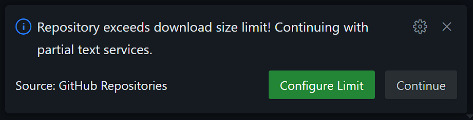
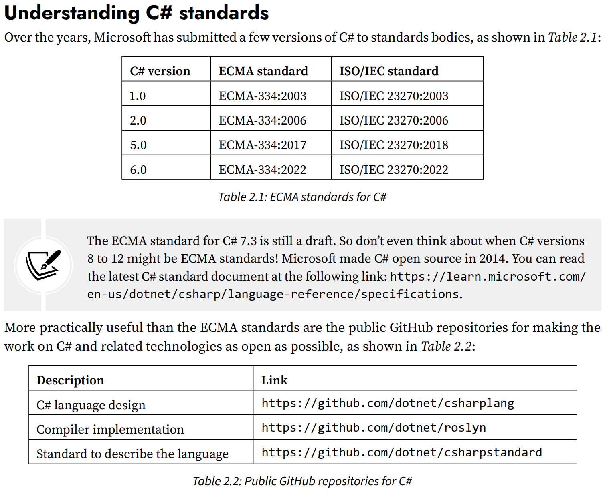
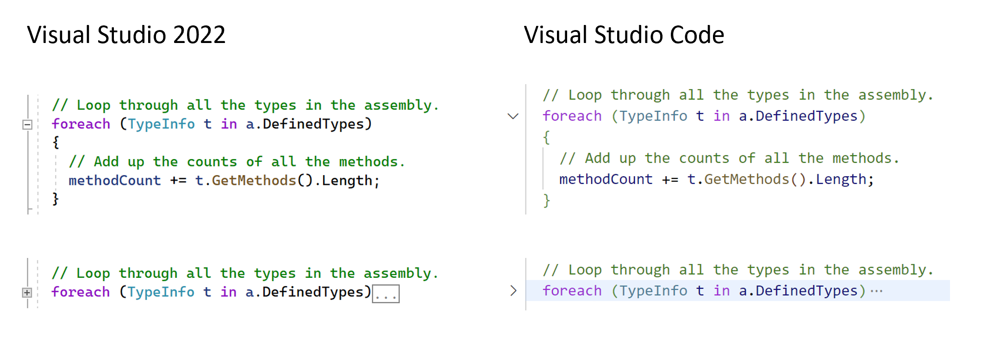
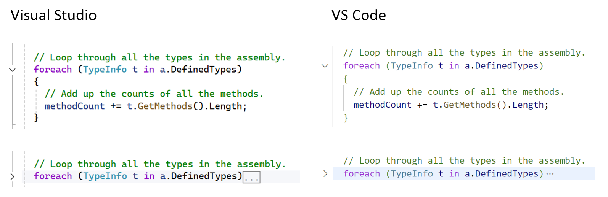
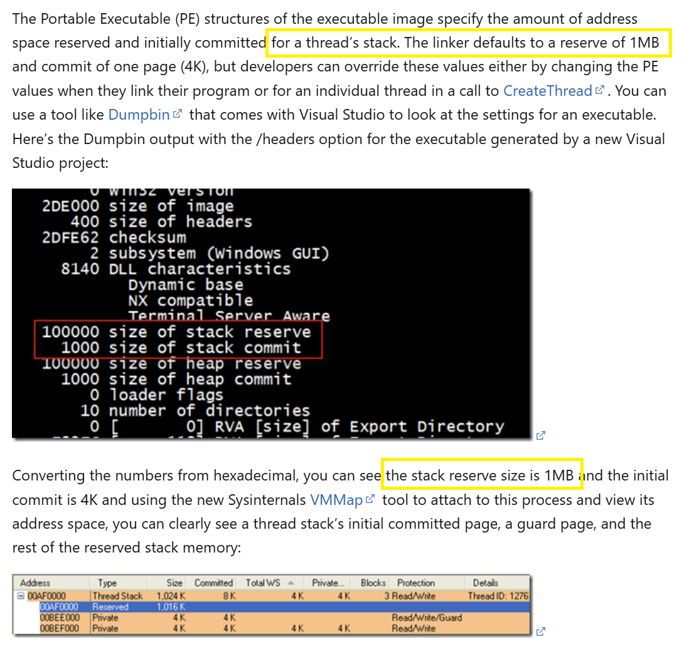
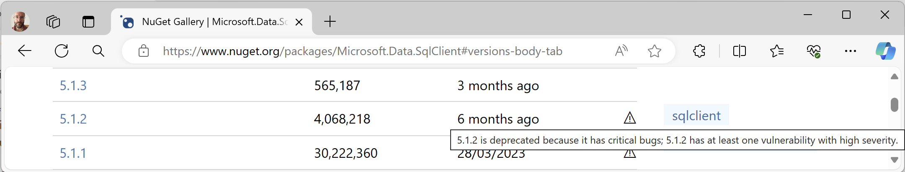
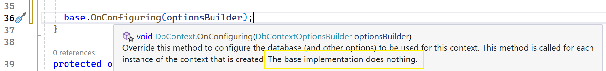

**Improvements** (72 items)

If you have suggestions for improvements, then please [raise an issue in this repository](https://github.com/markjprice/cs12dotnet8/issues) or email me at markjprice (at) gmail.com.

- [Page 2 - Getting code solutions for this book](#page-2---getting-code-solutions-for-this-book)
- [Page 4 - Setting up your development environment](#page-4---setting-up-your-development-environment)
- [Page 15 - Listing and removing versions of .NET](#page-15---listing-and-removing-versions-of-net)
- [Page 16 - Understanding intermediate language](#page-16---understanding-intermediate-language)
- [Page 54 - Understanding C# standards](#page-54---understanding-c-standards)
- [Page 62 - Blocks](#page-62---blocks)
- [Page 64 - Formatting code using white space](#page-64---formatting-code-using-white-space)
- [Page 64 - Understanding C# vocabulary](#page-64---understanding-c-vocabulary)
- [Page 79 - Raw interpolated string literals](#page-79---raw-interpolated-string-literals)
- [Page 83 - Storing real numbers](#page-83---storing-real-numbers)
- [Page 87 - Comparing double and decimal types](#page-87---comparing-double-and-decimal-types)
- [Page 89 - Storing dynamic types, Page 91 - Inferring the type of a local variable](#page-89---storing-dynamic-types-page-91---inferring-the-type-of-a-local-variable)
- [Page 93 - Using target-typed new to instantiate objects](#page-93---using-target-typed-new-to-instantiate-objects)
  - [What does `new` do?](#what-does-new-do)
- [Page 96 - Formatting using numbered positional arguments \& Formatting using interpolated strings](#page-96---formatting-using-numbered-positional-arguments--formatting-using-interpolated-strings)
- [Page 99 - Custom number formatting](#page-99---custom-number-formatting)
- [Page 101 - Getting text input from the user, and Page 120 - Null-coalescing operators](#page-101---getting-text-input-from-the-user-and-page-120---null-coalescing-operators)
- [Page 127 - Pattern matching with the if statement](#page-127---pattern-matching-with-the-if-statement)
- [Page 130 - Adding a new item to a project using Visual Studio 2022](#page-130---adding-a-new-item-to-a-project-using-visual-studio-2022)
- [Page 131 - Pattern matching with the switch statement](#page-131---pattern-matching-with-the-switch-statement)
- [Page 132 - Pattern matching with the switch statement](#page-132---pattern-matching-with-the-switch-statement)
- [Page 144 - List pattern matching with arrays](#page-144---list-pattern-matching-with-arrays)
- [Page 171 - What is automatically generated for a local function?](#page-171---what-is-automatically-generated-for-a-local-function)
- [Page 206 - Configuring trace listeners](#page-206---configuring-trace-listeners)
- [Page 223 - Understanding the call stack](#page-223---understanding-the-call-stack)
- [Page 236 - Understanding members](#page-236---understanding-members)
- [Page 247 - Storing multiple values using an enum type](#page-247---storing-multiple-values-using-an-enum-type)
- [Page 248 - Storing multiple values using an enum type](#page-248---storing-multiple-values-using-an-enum-type)
- [Page 251 - Making a field static](#page-251---making-a-field-static)
- [Page 254 - Requiring fields to be set during instantiation](#page-254---requiring-fields-to-be-set-during-instantiation)
- [Page 278 - Defining indexers](#page-278---defining-indexers)
- [Page 289 - Defining a primary constructor for a class](#page-289---defining-a-primary-constructor-for-a-class)
- [Page 296 - Static methods and overloading operators](#page-296---static-methods-and-overloading-operators)
- [Page 297 - Implementing functionality using methods](#page-297---implementing-functionality-using-methods)
- [Page 299 - Implementing functionality using methods](#page-299---implementing-functionality-using-methods)
- [Page 310 - Defining and handling delegates](#page-310---defining-and-handling-delegates)
- [Page 323 - Understanding stack and heap memory](#page-323---understanding-stack-and-heap-memory)
- [Page 347 - Overriding members](#page-347---overriding-members)
- [Page 353 - Using is to check a type](#page-353---using-is-to-check-a-type)
- [Page 358 - Using extension methods to reuse functionality](#page-358---using-extension-methods-to-reuse-functionality)
- [Page 369 - Understanding .NET components](#page-369---understanding-net-components)
- [Page 383 - Creating a console app to publish](#page-383---creating-a-console-app-to-publish)
- [Page 413 - Exercise 7.1 – Test your knowledge](#page-413---exercise-71--test-your-knowledge)
- [Page 426 - Comparing string values](#page-426---comparing-string-values)
- [Page 432 - Splitting a complex comma-separated string](#page-432---splitting-a-complex-comma-separated-string)
- [Page 457 - Initializing collections using collection expressions](#page-457---initializing-collections-using-collection-expressions)
  - [Using the spread element](#using-the-spread-element)
  - [Collection expression limitations](#collection-expression-limitations)
- [Page 460 - Identifying ranges with the Range type](#page-460---identifying-ranges-with-the-range-type)
- [Page 461 - Exercise 8.1 – Test your knowledge](#page-461---exercise-81--test-your-knowledge)
- [Page 477 - Building a stream pipeline](#page-477---building-a-stream-pipeline)
- [Page 484 - Compressing streams](#page-484---compressing-streams)
- [Page 493 - Serializing as XML](#page-493---serializing-as-xml)
- [Page 506 - Reading all environment variables](#page-506---reading-all-environment-variables)
- [Page 517 - Using SQL Server or other SQL systems](#page-517---using-sql-server-or-other-sql-systems)
- [Page 519 - Creating the Northwind sample database for SQLite](#page-519---creating-the-northwind-sample-database-for-sqlite)
- [Page 520 - If you are using Visual Studio 2022](#page-520---if-you-are-using-visual-studio-2022)
- [Page 524 - Defining the Northwind database context class](#page-524---defining-the-northwind-database-context-class)
- [Page 535 - Scaffolding models using an existing database](#page-535---scaffolding-models-using-an-existing-database)
- [Page 541 - Querying EF Core models](#page-541---querying-ef-core-models)
- [Page 556 - Generating a random number in queries](#page-556---generating-a-random-number-in-queries)
- [Page 564 - Controlling the tracking of entities](#page-564---controlling-the-tracking-of-entities)
- [Page 568 - Inserting entities, Page 573 - More efficient updates and deletes](#page-568---inserting-entities-page-573---more-efficient-updates-and-deletes)
- [Page 570 - Inserting entities](#page-570---inserting-entities)
- [Page 583 - Building LINQ expressions with the Enumerable class](#page-583---building-linq-expressions-with-the-enumerable-class)
- [Page 598 - Creating a console app for exploring LINQ to Entities](#page-598---creating-a-console-app-for-exploring-linq-to-entities)
- [Page 634 - Creating the Northwind database](#page-634---creating-the-northwind-database)
- [Page 634 - Creating a class library for entity models using SQLite](#page-634---creating-a-class-library-for-entity-models-using-sqlite)
- [Page 638 - Creating a class library for a database context using SQLite](#page-638---creating-a-class-library-for-a-database-context-using-sqlite)
- [Page 640 - Customizing the model and defining an extension method](#page-640---customizing-the-model-and-defining-an-extension-method)
- [Page 711 - Creating data repositories with caching for entities](#page-711---creating-data-repositories-with-caching-for-entities)
- [Page 726 - Making other requests using HTTP/REST tools](#page-726---making-other-requests-using-httprest-tools)
- [Page 727 - Understanding Swagger](#page-727---understanding-swagger)
- [Page 732 - Enabling HTTP logging](#page-732---enabling-http-logging)
- [Page 764 - Abstracting a service for a Blazor component](#page-764---abstracting-a-service-for-a-blazor-component)
- [Appendix - Exercise 3.1 – Test your knowledge](#appendix---exercise-31--test-your-knowledge)

# Page 2 - Getting code solutions for this book

When you access a repository using **GitHub Codespaces** (aka https://github.dev/) then the **GitHub Repositories** extension will attempt to download the repository's index. By default, the maximum size can be up to 50MB but the repository exceeds this limit, so you will be shown the following warning message:



You can ignore this warning and click **Continue** because you are only using GitHub Codespaces to view the code in the repository.

# Page 4 - Setting up your development environment

> Thanks to **Ashish** for asking a question in the Discord channel that prompted this improvement.

In this section, I explain what code editors and other tools you typically use to work on .NET project. Most readers use Visual Studio 2022, which is a large and complex tool that can do many things. But for .NET developers, it likes to give its own mechanism to do as much as possible, and a developer can easily think that Visual Studio is the only way to do things. It is just a tool that does work for you that you could do manually. It just shows you a view onto what is really happening in the files you're working on. You could literally just use a plain text editor to manually edit all project files and then use the `dotnet` command-line interface to do all your .NET work. So in the next edition I will add a few paragraphs about this. 

# Page 15 - Listing and removing versions of .NET

> Thanks to [s3ba-b](https://github.com/s3ba-b) who raised this [issue on November 5, 2024](https://github.com/markjprice/cs12dotnet8/issues/75).

In the first paragraph I wrote, ".NET runtime updates are compatible with a major version such as 8.x, and updated releases of the .NET SDK maintain the ability to build applications that target previous versions of the runtime, which enables the safe removal of older versions."

This could be clearer, so in the 10th edition*, I will write soemthing like: 

"All future versions of the .NET 10 runtime are compatible with its major version. For example, if a project targets `net10.0`, then you can upgrade the .NET runtime to future versions like `10.0.1`, `10.0.2`, and so on. In fact, you *must* upgrade the .NET runtime every month to maintain support."

"All future versions of the .NET SDK maintain the ability to build projects that target previous versions of the runtime. For example, if a project targets `net10.0` and you initially build it using .NET SDK `10.0.100`, then you can upgrade the .NET SDK to future bug fix versions like `10.0.101` or a major version like `11.0.100`, and that SDK can still build the project for the older targetted version. This means that you can safely remove all older versions of any .NET SDKs like `8.0.100`, `9.0.100`, or `10.0.100`, after you've installed a .NET SDK 11 or later. You will still be able to build all your old projects that target those older versions."

*It is too late to make this improvement in the 9th edition. 

# Page 16 - Understanding intermediate language

I wrote, "The C# compiler (named Roslyn) used by the dotnet CLI tool converts your C# source code into intermediate language (IL) code and stores the IL in an assembly (a DLL or EXE file). IL code statements are like assembly language instructions, which are executed by .NET’s virtual machine, known as CoreCLR."

In the next edition, I will add extra text at the end of the sentence, "...known as CoreCLR, the newer name for the **Common Language Runtime (CLR)** in modern .NET. The legacy .NET Framework has a CLR that is Windows-only, and modern .NET has ones for each OS, like Windows, MacOS, and Linux. These days they are all commonly referred to as CLRs."

# Page 54 - Understanding C# standards

To make the point that C# is not just a proprietary Microsoft technology, I included a small table of C# versions that have been submitted to standards bodies showing the ECMA and ISO/IEC standard codes. This also highlights a limitation of standards bodies that it takes so long to get a standard approved, since the latest C# version approved is version 6.0 in 2022 despite the most recent version of C# being version 12 in 2023. 

But someone gave the book a one-star Amazon review and cited this table as the only specific example of an "awful lot of nonsense". 

Obviously I strongly disagree with his review, and so do the 81% of readers who rate my book five-stars! 

But I am responsive to all readers, and this particular table is undeniably the least useful table in the book. In the next edition, I will remove *Table 2.1*, as shown in the following figure:



# Page 62 - Blocks

> Thanks to [Donald Maisey](https://github.com/donaldmaisey) who raised this [issue on September 19, 2024](https://github.com/markjprice/cs12dotnet8/issues/70).

In *Figure 2.2*, I show screenshots of how Visual Studio and VS Code present collapsable blocks of statements, as shown in the following figure:



Recent versions of Visual Studio have changed from the `[+]` and `[-]` icons to arrow head icons, as shown in the following figure:



The new screenshot will be used in the ninth edition.

# Page 64 - Formatting code using white space

In this section, I show code examples of white space.

I wrote, "The following four statements are all equivalent:"
```cs
int sum = 1 + 2; // Most developers would prefer this format.

int
sum=1+
2; // One statement over three lines.

int        sum=    1     +2;int sum=1+2; // Two statements on one line.
```

Since all four statements are all equivalent, they all have the same variable name, and therefore cannot be all declared in the same code block. 

Unless a step-by-step instruction tells the reader to enter code, all code examples are written to be read and understood, not entered into a code editor. Code examples should be considered to be "snippets" that are not guaranteed to compile without changes or additional statements.

In the next edition, I will explicitly say that, and explain that if the reader does decide to enter the code, they would (of course) need to rename the variables. 

# Page 64 - Understanding C# vocabulary

> Thanks to **Ashish** in the Discord channel for this book for asking a question about this that prompted this improvement.

In the list of C# keywords, I include `this`. In the next edition, I will add a note that this is used in multiple ways, including (1) to refer to the current instance of an object, (2) to call a constructor on the current object instance, and (3) to define an indexer. Later in the book, examples of all three will be covered.

# Page 79 - Raw interpolated string literals

> Thanks to [Robin](https://github.com/centpede) who raised this [issue on December 11, 2023](https://github.com/markjprice/cs12dotnet8/issues/6).

At the bottom of page 79, I show some code that will output some JSON.

```cs
var person = new { FirstName = "Alice", Age = 56 };

string json = $$"""
              {
                "first_name": "{{person.FirstName}}",
                "age": {{person.Age}},
                "calculation": "{{{ 1 + 2 }}}"
              }
              """;

Console.WriteLine(json);
```
It produces the following output:
```
{
  "first_name": "Alice",
  "age": 56,
  "calculation": "{3}"
}
```
Note the braces `{}` around the `3`. This is intentional. In this example, the JSON document must generate a `calculation` that contains braces. To show this, the code uses three braces: the first open brace will output as literal character The next two braces will be interpreted as the beginning of an expression. The first two close braces will be interpreted as the end of an expression. The last close brace will be a literal character.

If the code only used two braces then those are treated as a delimiter for the express `1 + 2` and do not appear in the output:
```cs
var person = new { FirstName = "Alice", Age = 56 };

string json = $$"""
              {
                "first_name": "{{person.FirstName}}",
                "age": {{person.Age}},
                "calculation": "{{ 1 + 2 }}"
              }
              """;

Console.WriteLine(json);
```
Now it produces the following output:
```
{
  "first_name": "Alice",
  "age": 56,
  "calculation": "3"
}
```
In the next edition, I will add this extra explanation.

# Page 83 - Storing real numbers

In this section, I wrote about "how a computer represents the number `12.75` in binary notation." I also wrote, "So, `12.75` in decimal is `00001100.1100` in binary."

On page 85, I wrote, "To represent `0.1` in binary, the computer stores 1 in the 1/16 column, 1 in the 1/32 column, 1 in the 1/256 column, 1 in the 1/512 column, and so on. The number `0.1` in decimal is `0.00011001100110011…` in binary, repeating forever:"

But a reader got confused when I used the word "decimal" between the concept of decimal notation and the `decimal` type. Note that when referring to the `decimal` type I use a `monospace` "code" font.

In future editions, I will add the word "notation" after words like "decimal" and "binary" to clarify when I am refering to a notation or numbering system.

So, on page 83, I will write, "So, `12.75` in decimal notation is `00001100.1100` in binary notation." 

On page 85, I will write, "To represent `0.1` in binary notation, the computer stores 1 in the 1/16 column, 1 in the 1/32 column, 1 in the 1/256 column, 1 in the 1/512 column, and so on. The number `0.1` in decimal notation is `0.00011001100110011…` in binary notation, repeating forever:"

I will also change the *Figure 2.7* caption to say, "Figure 2.7: Number 0.1 in decimal notation repeating forever in binary notation"

# Page 87 - Comparing double and decimal types

> Thanks to Yousef Imran who raised this issue via email on December 15, 2023.

At the top of page 87, I end the section describing a few special values associated with real numbers that are available as constants in the `float` and `double` types. But I do not show any example code. 

In the next edition, I will add an example to show the values and how they can be generated using expressions, as shown in the following code:
```cs
#region Special float and double values

Console.WriteLine($"double.Epsilon: {double.Epsilon}");
Console.WriteLine($"double.Epsilon to 324 decimal places: {double.Epsilon:N324}");
Console.WriteLine($"double.Epsilon to 330 decimal places: {double.Epsilon:N330}");

const int col1 = 37; // First column width.
const int col2 = 6; // Second column width.
string line = new string('-', col1 + col2 + 3);

Console.WriteLine(line);
Console.WriteLine($"{"Expression",-col1} | {"Value",col2}");
Console.WriteLine(line);
Console.WriteLine($"{"double.NaN",-col1} | {double.NaN,col2}");
Console.WriteLine($"{"double.PositiveInfinity",-col1} | {double.PositiveInfinity,col2}");
Console.WriteLine($"{"double.NegativeInfinity",-col1} | {double.NegativeInfinity,col2}");
Console.WriteLine(line);
Console.WriteLine($"{"0.0 / 0.0",-col1} | {0.0 / 0.0,col2}");
Console.WriteLine($"{"3.0 / 0.0",-col1} | {3.0 / 0.0,col2}");
Console.WriteLine($"{"-3.0 / 0.0",-col1} | {-3.0 / 0.0,col2}");
Console.WriteLine($"{"3.0 / 0.0 == double.PositiveInfinity",-col1} | {3.0 / 0.0 == double.PositiveInfinity,col2}");
Console.WriteLine($"{"-3.0 / 0.0 == double.NegativeInfinity",-col1} | {-3.0 / 0.0 == double.NegativeInfinity,col2}");
Console.WriteLine($"{"0.0 / 3.0",-col1} | {0.0 / 3.0,col2}");
Console.WriteLine($"{"0.0 / -3.0",-col1} | {0.0 / -3.0,col2}");
Console.WriteLine(line);

#endregion
```

When you run the code the results are as shown in the following output:
```
double.Epsilon: 5E-324
double.Epsilon to 324 decimal places: 0.000000000000000000000000000000000000000000000000000000000000000000000000000000000000000000000000000000000000000000000000000000000000000000000000000000000000000000000000000000000000000000000000000000000000000000000000000000000000000000000000000000000000000000000000000000000000000000000000000000000000000000000000000000000005
double.Epsilon to 330 decimal places: 0.000000000000000000000000000000000000000000000000000000000000000000000000000000000000000000000000000000000000000000000000000000000000000000000000000000000000000000000000000000000000000000000000000000000000000000000000000000000000000000000000000000000000000000000000000000000000000000000000000000000000000000000000000000000004940656
----------------------------------------------
Expression                            |  Value
----------------------------------------------
double.NaN                            |    NaN
double.PositiveInfinity               |      8
double.NegativeInfinity               |     -8
----------------------------------------------
0.0 / 0.0                             |    NaN
3.0 / 0.0                             |      8
-3.0 / 0.0                            |     -8
3.0 / 0.0 == double.PositiveInfinity  |   True
-3.0 / 0.0 == double.NegativeInfinity |   True
0.0 / 3.0                             |      0
0.0 / -3.0                            |     -0
----------------------------------------------
```
Note the following: 

- `NaN` outputs as `NaN`. It can be generated from an expression of zero divided by zero.
- `PositiveInfinity` value outputs as an `8` which looks like an infinity symbol on its side. It can be generated from an expression of any positive real number divided by zero.
- `NegativeInfinity` value outputs as a `-8` which looks like an infinity symbol on its side with a negative sign before it. It can be generated from an expression of any negative real number divided by zero.
- Zero divided by any positive real number is zero.
- Zero divided by any negative real number is negative zero.
- `Epsilon` is slightly less than `5E-324` represented using scientific notation: https://en.wikipedia.org/wiki/Scientific_notation.

# Page 89 - Storing dynamic types, Page 91 - Inferring the type of a local variable

> Thanks to **Ashish** in the Discord channel who raised this issue.

In the next edition, I will add a note to compare `var` with `dynamic`. For example:

> Note that `var` is converted to the actual type by the compiler when you build a project. A variable declared using `var` has a specific, known, fixed data type. This is different from `dynamic` which the compiler does not change. It remains a `System.Dynamic` type that can reference any object of any data type. The actual type is only checked at runtime, so that's when an exception might be thrown if you access a member on it that does not exist.

# Page 93 - Using target-typed new to instantiate objects

> Thanks to **paoloszef** for asking a question in the Discord channel that prompted this improvement.

There have been a few examples of using the C# `new` keyword before this section, but it hasn't been explicitly explained. In the next edition, I will add a new section before this one.

## What does `new` do?

The C# `new` keyword is used to allocate and/or initialize memory. To understand when you need to use `new`, you need to know a bit more about types. 

> Value and reference types and their relationship to memory are explained in more detail in *Chapter 6, Implementing Interfaces and Inheriting Classes*, so I am only introducing the minimum explanation for now.

There are two categories of type: value types and reference types. 

**Value types** are simple and do not need to use the `new` keyword to explicitly allocate memory. But value types *can* use the `new` keyword to initialize their value. This is useful when there is no way to use a literal to set the value. 

**Reference types** are more complex and need to use the `new` keyword to explicitly allocate memory. At the same time, they can use the `new` keyword to initialize their state.

For example, when you declare variables, space is only allocated in memory for value types like `int` and `DateTime` but not for reference types like `Person`.

Consider the following code that declares some local variables:
```cs
/* Value types have memory allocated on the stack automatically. */

short age; // Allocates 2 bytes of memory on the stack to store a System.Int16 value.
long population; // Allocates 8 bytes of memory on the stack to store a System.Int64 value.
DateTime birthdate; // Allocates 8 bytes of memory on the stack to store a System.DateTime value.
Point location; // Allocate 8 bytes of memory on the stack to store a System.Drawing.Point value.

/* Reference types will only have memory allocated on the heap when new is used (but they automatically have some memory allocated on the stack to store information about themselves including the memory address of where they are on the heap). */

Person bob; // Allocates memory in the stack that can point to a Person object in the heap. Initially, bob will have the value null.
```
Note the following about the preceding code:
- `age` has a value of `0` and 2 bytes of memory have been allocated in stack memory.
- `population` has a value of `0` and 8 bytes of memory have been allocated in stack memory.
- `birthdate` has a value of `0001-01-01` and 8 bytes of memory have been allocated in stack memory.
- `location` has a value of `0, 0` and 8 bytes of memory have been allocated in stack memory.
- `bob` has a value of `null` and 4 bytes of memory have been allocated in stack memory. No heap memory has been allocated for the object.

Now lets see when we might choose to use `new`:
```cs
age = 45; // Initialize this variable to 45 using a literal value.
population = 68_000_000; // Initialize this variable to 68 million using a literal value.
birthdate = new(1995, 2, 23); // Initialize this variable to February 23, 1995. C# does not support literal values for date/time values so we must use new.
location = new(10, 20); // Initialize the X and Y coordinates of this value type.
bob = new(); // Allocate memory on the heap to store a Person. Any state will have default values. bob is no longer null.
bob = new("Bob", "Smith", 45); // Allocate memory on the heap to store a Person and initialize state. bob is no longer null.

// Older syntax with explicit types
birthdate = new DateTime(1995, 2, 23); // Initialize this variable to February 23, 1995.
location = new Point(10, 20); // Initialize the X and Y coordinates of this value type.
bob = new Person(); // Allocate memory on the heap to store a Person. bob is no longer null.
bob = new Person("Bob", "Smith", 45); // Allocate memory on the heap to store a Person and initialize state. bob is no longer null.
```
Note the following about the preceding code:
- `age`, `population`, `birthdate`, and `location` have already had memory allocated for them on the stack. We only need to use `new` to initialize their values if we want them to be different from their defaults.
- `bob` must use `new` to allocate heap memory for the object. The `=` assignment stores the memory address of that allocated memory on the stack. Reference types like `Person` often have multiple constructors that are called by `new`. A default constructor assigns default values to any state in the object. A constructor with arguments can assign other values to any state in the object.

> Constructors are covered in more detail in *Chapter 5, Building Your Own Types with Object-Oriented Programming*, so I have only introduced the minimum explanation for now.

# Page 96 - Formatting using numbered positional arguments & Formatting using interpolated strings

> Thanks to [Robin](https://github.com/centpede) who raised this [issue on December 15, 2023](https://github.com/markjprice/cs12dotnet8/issues/7).

In Step 1, you create a new project named `Formatting`. In Step 2, you write code to define some variables and output them formatted using positional arguments, as shown in the following code:
```cs
int numberOfApples = 12;
decimal pricePerApple = 0.35M;

Console.WriteLine(
  format: "{0} apples cost {1:C}",
  arg0: numberOfApples,
  arg1: pricePerApple * numberOfApples);
...
```

In the next section, you write code to output the variables formatted using string interpolation, as shown in the following code:
```cs
// The following statement must be all on one line when using C# 10
// or earlier. If using C# 11 or later, we can include a line break
// in the middle of an expression but not in the string text.
Console.WriteLine($"{numberOfApples} apples cost {pricePerApple
  * numberOfApples:C}");
```

Then you run the code and view the result, as shown in the following partial output:
```
12 apples cost £4.20
```

The output includes culture-dependent formatting like currency symbols. The output shown is when run on my computer in the United Kingdom so the currency symbol is `£`. Most readers are in the United States so they see a dollar `$` symbol. A small fraction of readers are in Europe so they see a `?` instead of the Euro currency symbol because by default the output encoding for the console does not support that special symbol.

In *Chapter 4, Writing, Debugging, and Testing Functions*, on page 179, I tell the reader to write a function to control this formatting named `ConfigureConsole`, as shown in the following code:
```cs
static void ConfigureConsole(string culture = "en-US",
  bool useComputerCulture = false)
{
  // To enable Unicode characters like Euro symbol in the console.
  OutputEncoding = System.Text.Encoding.UTF8;

  if (!useComputerCulture)
  {
    CultureInfo.CurrentCulture = CultureInfo.GetCultureInfo(culture);
  }
  WriteLine($"CurrentCulture: {CultureInfo.CurrentCulture.DisplayName}");
}
```

The issue is when to introduce how to control culture and enable special characters. 

In the next edition, in *Chapter 2*, I will add a step to get the reader to set the current culture to US English so that everyone sees exactly the same output, as shown in the following code:
```cs
using System.Globalization; // To use CultureInfo.

// Set current culture to US English so that all readers 
// see the same output as shown in the book.
CultureInfo.CurrentCulture = CultureInfo.GetCultureInfo("en-US");
```
And I will change the output to show dollars, of course.

I will also add a note to tell readers that in *Chapter 4* they will learn how to write a function to control the culture so that they can see (1) US English by default, (2) local computer culture, (3) a specified culture. Hopefully this improvement will be the best of all worlds.

# Page 99 - Custom number formatting

> Thanks to [servbot007](https://github.com/servbot007) who raised [an issue on May 10, 2024](https://github.com/markjprice/cs12dotnet8/issues/37) that caused me to add this improvement.

In the next edition, I will add an example of outputting the same argument with different formats, as shown in the following code:
```cs
decimal value = 0.325M;
WriteLine("Currency: {0:C}, Percentage: {0:0.0%}", value);
```

I will also add the diagram from the issue comments.

# Page 101 - Getting text input from the user, and Page 120 - Null-coalescing operators

> Thanks to [rmantel23](https://github.com/rmantel23) for raising [this issue on June 4, 2024](https://github.com/markjprice/cs12dotnet8/issues/44).

In both of these sections, I show example code that calls the `ReadLine` method of the `Console` class. This method declares that it could return a `string` value or a `null` value (`string?`). 

In the next edition, on page 120 I will change the method name to `GetAuthorName` and I will add a little bit more explanation. For example:

The `ReadLine` method reads the next line of input from the standard input stream. If the user presses *Enter* without typing anything, `ReadLine` will return an empty `string`, not `null`. In typical console apps, `ReadLine` returns `null` only if the end-of-stream (EOF) is reached. This is not something that can usually be achieved by user input in a standard console environment since EOF is typically signaled by the console being closed or redirected input being fully consumed.

In the context of the following code:
```cs
string? authorName = ReadLine(); // Prompt user to enter an author name.
```

Here are the conditions under which `authorName` might be `null`:
- If the standard input stream is redirected and reaches EOF.
- If you are testing in an environment where you can simulate EOF, like some development environments or automated testing setups.

However, under normal user input conditions, `null` will "never" be returned.

To avoid confusion, in the next edition, I will change the code to the following:
```cs
string? authorName = GetAuthorName(); // A custom method.
```

# Page 127 - Pattern matching with the if statement

I will rewrite this section to emphasise that the statement does two things: (a) checks the type and (b) assigns if true, and include that the scope of the variable is the `if` statement. I will also note that I will use this technique in later chapters so keep this in mind. See also [Using is to check a type](#page-353---using-is-to-check-a-type).

# Page 130 - Adding a new item to a project using Visual Studio 2022

> Thanks to `Obs` in the book's Discord channel for raising this issue.

"I must admit I was a bit confused on page 130. The topic suddenly jumped from Switch statement to how to add an item in VS 2022 out of nowhere.
On page 131 I see it's probably some extra info for step 1 in that excercise. 
All good, but that bit seems a bit out of place imho."

`Obs` is correct. This section is included at this point in the book because it is the first time that the reader needs to add a new item to a project. In the next edition, I will add an introductory sentence explaining that, and that the `switch` content continues after this short section.

# Page 131 - Pattern matching with the switch statement

> Thanks to Yousef Imran who raised this issue via email.

In Step 2, I tell the reader to create an `Spider` class with a field named `IsPoisonous`. The field would be better named `IsVenomous` because poison is a thing that you consume and venom is transmitted by an animal bite. One way to remember the difference is that the villain from Spider-man is named Venom instead of Poison.

In the next edition, I will change the field name to `IsVenomous`.

# Page 132 - Pattern matching with the switch statement

> Thanks to Ashish Gupta who raised these issues via email on April 2, 2024.

In Step 2, I define an `Animal` class, as shown in the following code:
```cs
class Animal // This is the base type for all animals.
{
  public string? Name;
  public DateTime Born;
  public byte Legs;
}
```
Since this section is about pattern matching, not the most common way to define a class with fields, it is not important how the data types are declared. The `Name` has been declared nullable and the other two properties are not. You could make the `Name` not-nullable and make the other two nullable and the pattern matching example is unaffected. 

In Step 3, I wrote a `switch` statement with the `default` in the middle of the set of branches. This was deliberate to show that the compiler will accept this but I added a comment to explain that the compiler will always move it to the end of the set of branches for you. In the next edition, I will add a note to emphasize that I did this deliberately to show that you can, but good practice would be to explicitly move the `default` to the end.

# Page 144 - List pattern matching with arrays

> Thanks to Ashish Gupta who raised this issue via email on April 2, 2024.

In Step 1, I wrote a function that is implemented with a lambda and a `switch` expression. But this syntax has not been properly introduced yet. In the next edition, I will add a note to refer forwards to *Chapter 4 - Writing, Debugging, and Testing Functions*, in section *Using lambdas in function implementations* on page 187 for more information. For example: "In C# 6, Microsoft added support for **expression-bodied function members**. We will look at an example of this now. In C#, lambdas are the use of the `=>` character to indicate a return value from a function."

> Thanks to [Vlad Alexandru Meici](https://github.com/vladmeici) who raised this [issue on January 20, 2024](https://github.com/markjprice/cs12dotnet8/issues/14).

On page 446, I have a note about C# allowing trailing commas, "The trailing commas after the third item is added to the dictionary are optional and the compiler will not complain about them. This is convenient so that you can change the order of the three items without having to delete and add commas in the right places."

But that is not the first time in the book that I use trailing commas. On page 144, I wrote a switch expression that uses a trailing comma, as shown in the following code:
```cs
static string CheckSwitch(int[] values) => values switch
{
  [] => "Empty array",
  [1, 2, _, 10] => "Contains 1, 2, any single number, 10.",
  [1, 2, .., 10] => "Contains 1, 2, any range including empty, 10.",
  [1, 2] => "Contains 1 then 2.",
  [int item1, int item2, int item3] => $"Contains {item1} then {item2} then {item3}.",
  [0, _] => "Starts with 0, then one other number.",
  [0, ..] => "Starts with 0, then any range of numbers.",
  [2, .. int[] others] => $"Starts with 2, then {others.Length} more numbers.",
  [..] => "Any items in any order.", // <-- Note the trailing comma for easier re-ordering.
};
```

Most languages, including C#, allow the code style of trailing commas. When multiple items are separated by the comma, for example, when declaring an anonymous object, an array, collection initializers, enums, and switch expressions, C# allows you to have the trailing comma after the last item. This makes it easy to rearrange the order without having to keep adding and removing commas.

Here is the discussion about allowing trailing commas for switch expressions back in 2018: dotnet/csharplang#2098

Even JSON serializers have an option to allow this because it is so common to use.
https://learn.microsoft.com/en-us/dotnet/api/system.text.json.jsonserializeroptions.allowtrailingcommas

In the next edition, I will move the note earlier in the book to when I first use the technique on page 144, and I will add the comment above to all instances where I use it.

> I also use this technique on page 281 as noted by [rmantel23](https://github.com/rmantel23) so I will note it there too. 

# Page 171 - What is automatically generated for a local function?

> Thanks to `johnr_79886` in the Discord channel for this book for asking a question about this that prompted this improvement item.

I wrote, "The compiler automatically generates a `Program` class with a `<Main>$` function, then moves your statements and function inside the `<Main>$` method, which makes the function local, and renames the function, as shown in the following code:"
```cs
using static System.Console;

partial class Program
{
  static void <Main>$(String[] args)
  {
    WriteLine("* Top-level functions example");

    <<Main>$>g__WhatsMyNamespace|0_0(); // Call the function.

    void <<Main>$>g__WhatsMyNamespace|0_0() // Define a local function.
    {
      WriteLine("Namespace of Program class: {0}",
        arg0: typeof(Program).Namespace ?? "null");
    }
  }
}
```
In the next edition, I will add a note explaining why there is no source code file for this code, as shown in the following note:

> **Note**: If it were the .NET SDK or some other tool that generated this code, then the code would need to be in a source code file that the compiler would then find in the filesystem and compile it. Because this code is generated by the compiler itself, there is no need for a source code file. The only way to discover what the compiler does is to use a decompiler on the assembly and reverse engineer the original code. You can also throw exceptions in the functions and methods to see some of the information like I showed in Chapter 1.

# Page 206 - Configuring trace listeners

> Thanks to **zheliya** in the Discord channel for raising this issue and discovering why their file was being locked.

In Steps 3 to 6, you run a console app project twice, and each time a file named `log.txt` is written to. If you get a security exception thrown the second time the app tries to write to the log file, then it could be due to anti-virus software. For example, Avast has a monitor that activates as soon as a new file is created and scans it for viruses. This can temporarily lock the file. 
```
System.UnauthorizedAccessException: Access to the path 'C:\Users\<username>\Desktop\log.txt' is denied.
```

# Page 223 - Understanding the call stack

In Step 5, I wrote, "In the `CallStackExceptionHandling` console app project, add a reference to the `CallStackExceptionHandlingLib` class library project, as shown in the following markup:
```xml
<ItemGroup>
  <ProjectReference Include="..\CallStackExceptionHandlingLib\CallStackExceptionHandlingLib.csproj" />
</ItemGroup>
```

You can also see this in the solution project here:
https://github.com/markjprice/cs12dotnet8/blob/main/code/Chapter04/CallStackExceptionHandling/CallStackExceptionHandling.csproj

But some readers do the opposite, i.e. try to reference the console app in the class library project, or they try to edit a "generated" file instead of the proper project file. In the next edition, I will change the text to say, "In the `CallStackExceptionHandling.csproj` console app project file," and I will add a warning box below Step 5:

> **Warning!** Make sure that you add the project reference in the `CallStackExceptionHandling.csproj` file. Do not edit the `CallStackExceptionHandling.csproj.nuget.g.props` file because this is a file that is "generated" (that's what the ".g." in its name means). Every time you build the project this and other ".g." files are recreated so any changes will be lost. Also, do not add a project reference to the `CallStackExceptionHandling` console app project in the `CallStackExceptionHandlingLib.csproj` file. You can only reference class library projects. You cannot reference console app projects.

# Page 236 - Understanding members

> Thanks to [rmantel23](https://github.com/rmantel23) who raised [this issue on June 11, 2024](https://github.com/markjprice/cs12dotnet8/issues/46).

In the second bullet about fields, I wrote, "**Read-only**: The data cannot change after the class is instantiated, but the data can be calculated or loaded from an external source at the time of instantiation. For example, `DateTime.UnixEpoch` is January 1, 1970."

The readonly field `DateTime.UnixEpoch` was introduced with .NET Standard 2.1 and .NET Core 2.1, so if the reader tries to use this field in the .NET Standard 2.0 class library named `PacktLibraryNetStandard2`, it won't be available. 

In the next edition, I will add some different examples and explain this limitation: "`String.Empty` is `""`, `Guid.Empty` is a GUID with all zeros, `TimeSpan.Zero` is a time interval of zero, `DateTime.MinValue` is `00:00:00.0000000 UTC, January 1, 0001` in the Gregorian calendar, and `Path.DirectorySeparatorChar` is `\` on Windows. `DateTime.UnixEpoch` is `00:00:00.0000000 UTC, January 1, 1970` in the Gregorian calendar but this field was introduced after .NET Standard 2.0 so you won't be able to try it in your current class library."

In the first bullet point about fields, I wrote, "**Constant**: The data never changes. The compiler literally copies the data into any code that reads it. For example, `byte.MaxValue` is always `255`."

In the next edition, I will add more text, "Constants must be set to a literal value. Literal values can only be a `string` defined with `""`, a `char` defined with single quotes, a Boolean like `true` or `false`, or a number like `3`, `3L`, `3.0`, `3.0F`, or `3.0M`. Non-literal values are not supported so you cannot have a constant date/time value."

> On page 251, in the section titled, *Making a field constant*, I wrote, "If the value of a field will never ever change, you can use the `const` keyword and assign a literal value at compile time." On page 252, in the **Good Practice** box, I wrote, "Constants are not always the best choice for two important reasons: the value must be known at compile time, and it must be expressible as a literal string, Boolean, or number value." But it's best if I repeat the information that constants can only be a literal value earlier in the chapter.

# Page 247 - Storing multiple values using an enum type

First, note that this section is about storing multiple values using an `enum` type. It's about `enum` types decorated with the `[Flags]` attribute that use bitwise operations to efficiently store those multiple values. It is not about non-`[Flags]` `enum` types.

In the code example, we have defined an `enum` for the *Wonders of the Ancient World*, so it only needs seven combinable values (and `0` for `None`).

At the bottom of the page, I wrote, "Normally, an `enum` type uses an `int` variable internally, but since we don’t need values that big,
we can reduce memory requirements by 75%, that is, 1 byte per value instead of 4 bytes, by telling it to use a `byte` variable."

And on the next page, I wrote a **Good Practice** note:

> **Good Practice**: Use the `enum` values to store combinations of discrete options. Derive an `enum` type from `byte` if there are up to eight options, from `ushort` if there are up to 16 options, from `uint` if there are up to 32 options, and from `ulong` if there are up to 64 options.

Note that I did not say, "Turn All Your Enums Into Bytes Now!"

I didn't say that because that would be bad advice.

On March 18, 2024, Nick Chapsas posted a YouTube video titled, [“Turn All Your Enums Into Bytes Now!” | Code Cop #014](https://www.youtube.com/watch?v=1gWzE9SIGkQ). This caused some readers some confusion, because they thought that Nick's advice contradicted mine, so let's dig into it.

> **TL;DR**: Nick's complaint does not conflict with what I wrote in my book. But I will add some clarifying content to the next edition.

The original designers of the C# language spent effort on implementing the ability for `enum` types to derive from other integers than just the default `int`. For example, you can use fewer bytes by using a positive integer like `byte` or `ushort`, or the same or more bytes by using a positive integer like `uint` or `ulong`. They implemented this feature because sometimes a .NET developer will need this capability. 

I think it is important that my readers know that they can do it when necessary. Microsoft official guidance states, "Even though you can change this underlying type, it is not necessary or recommended for most scenarios. No significant performance gain is achieved by using a data type that is smaller than `Int32`." 

This point is worth making, so one improvement I will make in the next edition is to add this Microsoft guidance as a note. 

Let's see some real world examples of when you would need to change an `enum` from deriving from `int` to deriving from another integer type, taken from the comments under Nick's video:
- You want to *increase* the size of the integer to store more than 16 options in a flag `enum`. This was mentioned in my good practice note since I listed all the integer types, highlighting that the larger ones would allow you to store more bitwise flag options. The default `int` only allows 16 options: 0, 1, 2, 4, 8, 16, 32, 64, 128, 256, 512, 1024, 2048, 4096, 8192, and 16384. Changing to `uint` would double the number of choices to 32 without using any more space in memory. Changing to `ulong` would give 64 options. Changing to `ushort` would allow the same 16 options in half the bytes.
- You need to transfer data as a binary stream via a serial connection to an embedded device and you must carefully follow the protocol, or you are defining your own serial messaging protocol and you want to reduce the packet size to make best use of your available bandwidth.
- You have SQL tables with millions of records where some of the columns are `enum` values. Settings those columns to `tinyint` with a matching `enum : byte` property in the C# entity class can make indexes perform better by being smaller and reducing the number of page reads from disk. Some developers will work on systems that are 30 or more years old with spinning metal disks. Not everyone is deploying to a modern 64-bit OS with modern hardware.
- You need to reduce the size of a `struct` because it will be created 100,000 times per second on resource-constrained hardware.
- You have game code that is set to use `byte` and `short` because you have millions of them in contiguous arrays for the game's data. You would gain a fair bit of performance doing this especially from a cache point of view.
- You have a messaging system that marshals message `struct` types and sends them over legacy hardware with very low bandwidth. In some `struct` types, if the fields are marshalled as `Int32` and message frequency is high then it slows down. These fields are used in combination to represent some state. You could optimize and drastically reduce the size by representing each state as a single `byte` under one `enum` and use bitwise operations to combine the states together using bit masking.

Some developers get pleasure from implementing micro-optimizations. Most are probably aware that those optimizations are mostly pointless, but why spoil their fun if the code isn't harmful? Why get so angry that some developers like to do it? No one is forcing you to do it too. 

For those developers who object to changing any `enum` from `int` to some other integer, there is a compiler code analysis warning. If enabled, it will trigger if you set an `enum` to anything other than `int`: "CA1028: Enum storage should be Int32." This warning is not enabled by default because Microsoft knows that there are legitimate reasons why a developer might need to use it.

So why would a popular and respected .NET YouTuber like Nick post a video with provocative statements like "it's irredeemable on every single level"? I don't know, but I can speculate. I think it's about the attention economy.

Nick Chapsas is a .NET influencer who posts YouTube videos that contribute to the .NET community and promote his training courses on [Dometrain](https://dometrain.com/). His courses are excellent and his [YouTube videos](https://www.youtube.com/@nickchapsas) help us all to keep our .NET skills sharp and up-to-date. I recommend that all my readers subscribe to his YouTube channel. Although I've never met Nick, he seems like a great guy and I'd like to meet him one day.

Nick posts on LinkedIn with his YouTube videos embedded almost daily. Anyone who is active on LinkedIn and follows a few profiles in the .NET community will have seen C# and .NET "Tip" posts. Some are good, some are okay, and some are bad. The bad ones are annoying for all of us, to say the least. But especially so for influencers like Nick who need to post regularly to promote their businesses. Nick's posts compete for attention not only with other worthy .NET influencers like Pavle Davitković, Milan Jovanović, Nick Cosentino, Dave Callan, and Andrew Lock, but also with a growing number of less-experienced and less-knowledgeable influencers (and probably bots) posting poor content.

I can imagine thinking, "Why not make a video where I can rant about these poor quality tips and AI-generated comments? What tip is easy-to-explain its badness and recently annoyed me?" The particular LinkedIn post Nick chose is titled, **"C# Tip! Convert enums to byte"**. This is a perfect example of a bad tip and therefore a good choice for a video in Nick's *Code Cop* series.

A YouTube video with the title, "Turn All Your Enums Into Bytes Now!" is deliberately provocative because it is designed to increase engagement for the video (and sell more Dometrain courses).

Unfortunately the video caused confusion to at least one of my readers because the issues involved are nuanced and getting attention these days requires strident unsubtlety.

In my book, I tell readers:
- That they can change the derived integer type for an `enum`.
- That doing so can save space (I say nothing about performance).
- That if you are using an `enum` decorated with `[Flags]` to store multiple flags, then "Derive an `enum` type from `byte` if there are up to eight options, from `ushort` if there are up to 16 options, from `uint` if there are up to 32 options, and from `ulong` if there are up to 64 options." 

I do *not* say to convert all enums into bytes.

I will end this with a quote from one of the commenters on Nick's video: "I swear with every Code Cop video Nick becomes more and more insane" ;-)

Finally, a reminder that all my readers would benefit from Nick's videos and courses. You can get the courses here: [Dometrain](https://dometrain.com/).

# Page 248 - Storing multiple values using an enum type

In the **Good Practice** box, I will list the integer types that an `enum` is allowed to inherit from: `Byte`, `SByte`, `Int16`, `Int32`, `Int64`, `UInt16`, `UInt32`, `UInt64`. The new integer types `Int128` and `UInt128` are not supported.

# Page 251 - Making a field static

> Thanks **Ashish** in the book's Discord channel for making a suggestion about this that prompted this improvement.

At the end of this section, I wrote, "Fields are not the only members that can be static. Constructors, methods, properties, and other members can also be static."

In the next edition, I will add a note to say something like, "static methods operate on classes and an object is not needed for them." I will also tell the reader that static methods are covered in Chapter 6.

# Page 254 - Requiring fields to be set during instantiation

> Thanks **Ashish** in the book's Discord channel for asking a question about this that prompted this improvement.

In Step 5, I wrote, "Build the `PeopleApp` project to compile its referenced dependencies and copy the class library `.dll` to the local `bin` folder." This sentence is confusing because some readers think that they need to copy the file. You do not need to copy the file; building the project does the compiling and copying.

In the next edition, I will write, "Build the `PeopleApp` project. This will compile its referenced dependencies and copy the class library `.dll` to the correct subdirectory in the local `bin` folder."

# Page 278 - Defining indexers

> Thanks to **Ashish** in the Discord channel for this book for asking a question about this that prompted this improvement.

In this section, I describe what an indexer is and show example code for how to define one. But it can still be a tricky concept to grasp, so in the next edition, I will add more explanation. For example:

`sam[0].Name` calls the indexer aka `this` on the `Person` class because `[]` are the symbols that call an indexer. `sam.Children[0].Name` calls the indexer on the collection named `Children` which is a `List<Person>` . We have implemented the indexer on `Person` to do the same thing so we can use a shorter syntax.

It's similar with `string` values. If I have `string name = "Mark";`, imagine that it has a property named `Characters` that is a `List<char>`. I could use `name.Characters[0]` to return the `M`. But since `string` has an indexer defined, I can do the same with `string[0]`.

Most types do not define an indexer. It's just a way to define a property that is called using `[]` instead of a name. It can actually do anything you want. But it *should* be used to define a array/collection style getter/setter. If your type doesn't need that, it doesn't need an indexer.

For any type you define, just imagine another developer using your type. What would they expect the indexer to do? For example, what if you get the first index, as shown in the following code:
```cs
Car car = new("Ford");
var thing1 = car[0]; // What type is thing1? What is its value?

Database db = new("Commerce");
var thing2 = db[0]; // What type is thing2? What is its value?

string name = "Mark";
var thing3 = name[0]; // thing3 is a char. Its value is "M".

List<int> numbers = new() { 27, 95, 13 };
var thing4 = numbers[0]; // thing4 is an int. Its value is 27.
```

I will also add a note about the use of the `this` keyword to define the indexer. It is not to be confused with the use of the `this` keyword to refer to the current instance of an object.

# Page 289 - Defining a primary constructor for a class

> Thanks to **Ashish** in the Discord channel for this book for making a suggestion about this that prompted this improvement.

In Step 6, the code uses the `this` keyword to call the constructor with two parameters. In the next edition, I will add a note to explain this.

# Page 296 - Static methods and overloading operators

> Thanks **Ashish** in the book's Discord channel for making a suggestion about this that prompted this improvement.

I wrote, "This section is specifically about methods that apply to two instances of the same type. It is not about the more general case of methods that apply to zero, one, or more than two instances." But I don't remind readers about the different nature of instance and static methods.

In the next edition, I will add a note to say something like, "static methods operate on classes and an object is not needed for them."

# Page 297 - Implementing functionality using methods

> Thanks to **Ashish** in the Discord channel for this book for making a suggestion about this that prompted this improvement.

In Step 2, the code uses the `this` keyword to pass a reference for the current object to the `Marry` method. In the next edition, I will add a note to explain this.

# Page 299 - Implementing functionality using methods

> Thanks to **Ashish** in the Discord channel for this book for making a suggestion about this that prompted this improvement.

In the last bullet at the bottom of the page, I wrote, "It is a convention to use a different method name for related static and instance methods, for example, `Compare(x, y)` for the static method name and `x.CompareTo(y)` for the instance method name." But this is not always true.

In the next edition, I will change the statement to, "It is a convention to use a different method name for related static and instance methods, but not to the extent that you would fail to match standard English usage. So that could mean naming both methods the same, as in the example of `Marry(x, y)` for the static method name and `x.Marry(y)` for the instance method name. More commonly, it would mean using a different method name, for example, `Procreate(x, y)` for the static method name and `x.ProcreateWith(y)` for the instance method name, or `Compare(x, y)` for the static method name and `x.CompareTo(y)` for the instance method name."

# Page 310 - Defining and handling delegates

> Thanks to **Ashish** in the Discord channel for this book for making a suggestion about this that prompted this improvement.

In Step 1, the code uses `EventArgs.Empty` and the note shows the `Invoke` method. In the next edition, I will explain these two in the text before we dive into the code. For example:

Some types provide "empty" values for when you need an instance but it doesn't need to have any particular value. For example:
- `string.Empty` is an empty string value `""`. It is better to use `string.Empty` than `""` because every time you use `""` the compiler must instantiate a new empty string instance. You can think of `string.Empty` as a global single instance of an empty string. Sharing it is more efficient than creating your own new instances every time you need to reference an empty string value.
- `EventArgs.Empty` is an empty `EventArgs` value. Use it when you must conform to the built-in event delegates that require an `EventArgs` instance to be passed as a parameter but it doesn't need any particular value because it won't be read or used in the method anyway.

```cs
// The built-in event delegate has two parameters that must be passed in.
public delegate void EventHandler(object? sender, EventArgs e);
```

If you have a delegate defined, as shown in the following code:
```cs
public EventHandler? Shout; // This field could be null.
```

Then there are multiple ways to call the delegate, as shown in the following code examples:
1. Use its variable name: 
```cs
Shout(this, EventArgs.Empty);`
```
2. Use the `Invoke` method to call it synchronously: 
```cs
Shout.Invoke(this, EventArgs.Empty);`
```
3. Use the `BeginInvoke` method to call it asynchronously, without a callback function or any state:
```cs
IAsyncResult result = Shout.BeginInvoke(this, EventArgs.Empty, null, null);
```

> The `BeginInvoke` method is beyond the scope of this book but I include it so that you know it exists.

Delegates and their method handlers have a potentially many-to-many relationship. One delegate can have one method handler. But one delegate can have many method handlers (you do this when you hook up `Shout` to both `Harry_Shout` and `Harry_Shout_2`). And many delegates can reference one method handler. Or any combination of these. 

In Step 3, we define a method to handle the event when it is raised, as shown in the following code:
```cs
private static void Harry_Shout(object? sender, EventArgs e)
```

In the next edition, I will add more explanation to say that you can have as many methods as you like, named whatever you like, as long as the method signature matches the delegate signature. This means you could have 50 `Person` instances, each with their own method, or have one method that they all share. The methods can be declared at any level that makes sense for the scenario and matches the access levels set (like `protected`, `private`, `public` and so on). One of the key benefits of delegates and events is loose binding between components so maximum flexibility is desired.

In Windows desktop development, imagine that you have three buttons, `AddButton`, `SaveButton`, and `DeleteButton`. Each button has very different functionality. You would create three methods to handle their `Click` events, named: `AddButton_Click`, `SaveButton_Click`, and `DeleteButton_Click`. Each would have different implementation code. 

But now imagine you have 26 buttons, `AButton`, `BButton`, `CButton`, and so on up to `ZButton`. Each button has the same functionality: to filter a list of people by the first letter of their name. You would create one method to handle their `Click` events, named: `AtoZButtons_Click`. This method would have implementation code that would use the `sender` parameter to know which button was clicked, but otherwise would be the same for all the buttons.

Also in Step 3, the `sender` is checked to make sure it is a `Person` instance *and if it is* then it is assigned to a local variable named `p`, as shown in the following code:
```cs
// If sender is not a Person, then do nothing
if (sender is not Person p) return;
WriteLine($"{p.Name} is this angry: {p.AngerLevel}.");
```

But the first statement does two things at once, which needs more explanation. In the next edition, I will add the following:

The parameter named `sender` is of type `object`. This means we cannot just say `sender.Name` or `sender.AngerLevel`. We need to cast `sender` to a local variable that is explicitly defined as `Person`. We also need to check that `sender` actually *is* a `Person`. 

We can do both things at once in a single expression: `sender is not Person p`. This expression will either return `true` if `sender` is not a `Person`, and hence the statement executes `return`. Or the expression returns `false` if `sender` is a `Person`, *and* sender will be stored in the local variable named `p` which is of type `Person`. After that, we can use expressions like `p.Name` and `p.AngerLevel`.

I will also add to the comment, as shown in the following code:
```cs
// If sender is not a Person, then do nothing and return; else assign sender to p.
```

# Page 323 - Understanding stack and heap memory

At the start of the third paragraph, I wrote, "On Windows, for ARM64, x86, and x64 machines, the default stack size is 1 MB." 

This sentence is correct. 

Mark Russinovich is a Microsoft expert and he wrote a deep dive article about memory and threads that is worth reading. You can find it at the following link:
https://learn.microsoft.com/en-us/archive/blogs/markrussinovich/pushing-the-limits-of-windows-processes-and-threads

Here are some relevant highlights:



Note that the 1MB limit is a default and that "developers can override these values". The .NET team decided to override the default so that .NET apps have 1.5 MB of stack memory, but this was a "completely accidental change", as you can read about in the following comment to a GitHub issue in the .NET repository: https://github.com/dotnet/runtime/issues/96347#issuecomment-1871528297

"Prior to this change, we have been using the Windows native toolset default before that is 1MB."

If this issue might affect your projects, I recommend reading the following issue: [Migration from .NET Framework 4.7.2 to .NET 8 results in StackOverflowException due to reduced stack size](https://github.com/dotnet/runtime/issues/96347).

# Page 347 - Overriding members

In the next edition, I will add explanation about how some code editors like Visual Studio will automatically add a call to the base class member when you override a member. To decide if you need to keep the call or not, view the tooltip or definition of the member. For example, later in the book you will override a method of the `DbContext` class named `OnConfiguring`. If you hover over the method name, its tooltip tells you "The base implementation does nothing." If you **Go To Definition** (*F12*) of the method, you will see that it does nothing, as shown in the following code:
```cs
protected internal virtual void OnConfiguring(DbContextOptionsBuilder optionsBuilder)
{
}
```

The method exists in the base class only so that subclasses can override it and then EF Core can call your code when it needs to configure the data context. It would be a waste for your overridden method implementation to call the base implementation.

# Page 353 - Using is to check a type

> Thanks to **Ashish** for asking a question about this in the book's Discord channel that prompted this improvement.

In Step 1, I tell the reader to wrap the explicit cast statement in an `if` statement to check the type of an object using the `is` keyword, as shown in the following code:
```cs
if (aliceInPerson is Employee)
{
  WriteLine($"{nameof(aliceInPerson)} is an Employee.");
```

In the next edition, I will add a note to remind the reader that this technique was covered earlier in the book in Chapter 3 on page 127, in the section titled: [Pattern matching with the if statement](#page-127---pattern-matching-with-the-if-statement).

# Page 358 - Using extension methods to reuse functionality

In the next edition, I will add a new section explaining method chaining aka fluent style using extension methods.

# Page 369 - Understanding .NET components

> Thanks to Saeed Fathi who emailed this suggestion to me on December 6, 2023.

I used the term "CoreFX" which is an old term for what is now better known as `dotnet/runtime`. In future editions, I will remove that term.

# Page 383 - Creating a console app to publish

> Thanks to Gökhan Kırhan aka `_drhack` for asking a question about this in a Discord channel that prompted this improvement.

The build process can take a long time because the book tells you to add five runtime identifiers even though we only later review the compiled outputs of two of them. 

As well as the [breaking change with the allowed names for targets](https://github.com/markjprice/cs12dotnet8/blob/main/docs/errata/errata.md#page-383---creating-a-console-app-to-publish) that means you must also change the [commands that you enter at the command prompt or terminal](https://github.com/markjprice/cs12dotnet8/blob/main/docs/errata/errata.md#page-386---publishing-a-self-contained-app), in the next edition, I will reduce the suggested runtime identifiers from five to two, as shown in the following markup:
```xml
<RuntimeIdentifiers>
  win-x64;linux-x64
</RuntimeIdentifiers>
```

# Page 413 - Exercise 7.1 – Test your knowledge

> Thanks to [rmantel23](https://github.com/rmantel23) for raising [this issue on June 20, 2024](https://github.com/markjprice/cs12dotnet8/issues/56).

Questions 5, 9 and 10 are about porting. In earlier editions, the information about porting was in the print book, but with the 8th edition the reader won't be able to answer these questions without first reading the online-only section about porting which is in the later Exercise 7.3.

In my *Tools and Skills for .NET 8* book I have standardized the ordering of the **Practicing and exploring** sections so that online material and exercises go before the questions. I will use this same standardized ordering in future editions of all my other books too. 

I will also move those three questions to the end of the online porting section and I will write three new questions for the ninth edition print book.

# Page 426 - Comparing string values

> Thanks to **f6a4** in the book's Discord channel for suggesting this improvement.

In the introduction to this section, I describe the theory of comparing string values and how they are culture-dependent, including examples from Swedish and German like the word for *street*, `Straße` and `Strasse`. 

In Step 2, the reader enters code to compare two string values: `Mark` and `MARK`, both exact comparison and case-insensitive. 

In the next edition, I will add code to compare two string values in German culture: `Straße` and `Strasse`, both exact comparison and case-insensitive, as shown in the following code:
```cs
// German string comparisons

CultureInfo.CurrentCulture = CultureInfo.GetCultureInfo("de-DE");

text1 = "Strasse";
text2 = "Straße";

WriteLine($"text1: {text1}, text2: {text2}");

WriteLine("Compare: {0}.", string.Compare(text1, text2, 
  CultureInfo.CurrentCulture, CompareOptions.IgnoreNonSpace));

WriteLine("Compare (IgnoreCase, IgnoreNonSpace): {0}.",
  string.Compare(text1, text2, CultureInfo.CurrentCulture, 
  CompareOptions.IgnoreNonSpace | CompareOptions.IgnoreCase));

WriteLine("Compare (InvariantCultureIgnoreCase): {0}.",
  string.Compare(text1, text2,
  StringComparison.InvariantCultureIgnoreCase));
```

I have also added this example to the current edition solution code here:
https://github.com/markjprice/cs12dotnet8/blob/0ee475706186d2c82fdb836837783aed3a4d4fd0/code/Chapter08/WorkingWithText/Program.cs#L78

# Page 432 - Splitting a complex comma-separated string

> Thanks to **Chip** who sent an email about this issue on December 13, 2024.

In Step 1, I wrote, "Add statements to store a complex comma-separated string variable", and in the code there is a statement to sets that variable to a CSV string, as shown in the following code:
```cs
string films = """
"Monsters, Inc.","I, Tonya","Lock, Stock and Two Smoking Barrels"
""";
```

But at least one reader added extra spaces after the commas between the double-quoted movie titles, as shown in the following code:
```cs
string films = """
"Monsters, Inc.", "I, Tonya", "Lock, Stock and Two Smoking Barrels"
extra spaces ----^ ----------^
```
Doing this means the variable contains comma-and-space-separated values instead of purely comma-separated values. The regular expression was written to process only literally CSV values with no whitespace. (There is no formal standard for CSV so different systems will have different ways of handling it. Many CSV processors reject data with extra whitespace as malformed input.)

In the next edition, I will add a warning note about this:

> **Warning!** Do not add extra spaces between the comma-separated values. The regular expression is written to handle generally-accepted valid CSV, not comma-and-space-separated values.

Alternatively, you could change the regular expression to handle comma-and-space-separated values, as shown in the following code:
```cs
[StringSyntax(StringSyntaxAttribute.Regex)]
private const string CommaSeparatorText =
  @"(?:^|,)\s*(?=[^\"]|(\")?)\"?\s*((?(1)(?:[^""]|\\"")*|[^,\"]*))\s*\"?(?=,|$)");
```

> **Warning!** The preceding regular expression was provided by a reader so treat it with caution.

# Page 457 - Initializing collections using collection expressions

In this section, I introduce the use of collection expressions to initialize collections. A related feature is the `..` spread element. In the next edition, I will add a section about it, as shown below.

## Using the spread element

> Microsoft official documentation uses both **spread element** and **spread operator** to refer to the same language feature. I prefer *element* because it is used in collection expressions to represent an element within the defined collection.

The spread element `..` can be prefixed before any expression that can be enumerated to evaluate it in a collection expression. For example, any type that can be enumerated using `foreach`, like an array or collection, can be evaluated using the spread element. The use of the spread element `..` in a collection expression replaces its argument with the elements from that collection. You can combine spread elements with individual elements in a collection expression.

For example:
```cs
int[] row0 = [1, 2, 3];
int[] row1 = [4, 5];
int[] row2 = [6, 7, 8, 9];

// Use the spread element to combine the three arrays and an integer into one array.
int[] combinedRows = [..row0, ..row1, ..row2, 10];

foreach (int number in combinedRows)
{
  Console.Write($"{number}, ");
}
```

The output would be:
```
1, 2, 3, 4, 5, 6, 7, 8, 9, 10,
```

> **More Information**: You can learn more about the spread element at the following link: https://learn.microsoft.com/en-us/dotnet/csharp/language-reference/operators/collection-expressions#spread-element.

## Collection expression limitations

Collection expressions do not work with all collections. For example, they do not work with dictionaries or multi-dimensional arrays. The documenation lists the types that a collection expression can be converted to: https://learn.microsoft.com/en-us/dotnet/csharp/language-reference/proposals/csharp-12.0/collection-expressions#conversions.

> **Warning!** Be careful not to confuse the spread element `..` that must be applied before an enumerable expression, with the range operator `..` that is used to define a `Range`. There is a discussion about the design decision around the spread element at the following link: https://learn.microsoft.com/en-us/dotnet/csharp/language-reference/proposals/csharp-12.0/collection-expressions#drawbacks.

# Page 460 - Identifying ranges with the Range type

In this section, I introduce ways to define a `Range`, including the range operator `..` available in C# 8 or later, as shown in the following code:
```cs
Range r3 = 3..7; // Using C# 8.0 or later syntax.
Range r5 = 3..; // From index 3 to last index.
Range r7 = ..3; // From index 0 to index 3.
```

In the next edition, I will add a note to warn the reader that the spread element `..` looks the same but means something different and refer back to it in a  new section explaining the spread element. 

# Page 461 - Exercise 8.1 – Test your knowledge

In question 10, I ask, "How could you check that a web service is available before calling it?" But the section about networking is not covered until *Exercise 8.4 – Working with network resources* on page 462. In all future books, including the ninth edition, I have reorganized these sections to make sure that the questions always come after any online materials and practice exercises.

# Page 477 - Building a stream pipeline

> Thanks to **Pampua84** in the book's Discord channel for making this suggestion.

In this short section, I wrote, "It is very common to combine a helper like `StreamWriter` and multiple function streams like `CryptoStream` and `GZipStream` with a storage stream like `FileStream` into a pipeline, as shown in *Figure 9.4*:"


In the next edition, I will add a note to say something like the following, taken from [an article by Stephen Toub](https://learn.microsoft.com/en-us/archive/msdn-magazine/2008/february/net-matters-stream-pipeline): "Good encryption will generate relatively uncompressible data. If you switch the order of the operations so that you first compress and then encrypt, not only should you end up with a smaller file, but the encryption will most likely take less time as it'll be operating on less data."

I will also update *Figure 9.4* to swap the order of `CryptoStream` and `GZipStream` so that `GZipStream` compresses the text before `CryptoStream` encrypts.

# Page 484 - Compressing streams

> Thanks to [DrAvriLev](https://github.com/DrAvriLev) who raised this [issue on November 26, 2023](https://github.com/markjprice/cs12dotnet8/issues/4).

In Step 2, on page 485, I use a `using` statement without braces to ensure that the `decompressor` object has its `Dispose` method called. This can look confusing because I did not specify braces around the start and end of its scope.

In the 9th edition, I will add more code and explanations to multiple related sections of the book, as described below.

**Page 333 - Ensuring that Dispose is called**

In this section, I show how to use a `using` block to ensure that the `Dispose` method is called at the end of the scope, as shown in the following code:

```cs
using (ObjectWithUnmanagedResources thing = new())
{
  // Code that uses thing.
}
```

In the 9th edition, I will add a second example, using simplified syntax without braces, as shown in the following code:
```cs
using ObjectWithUnmanagedResources thing = new();

// Code that uses thing.

// Dispose called at the end of the container scope e.g. method.
```

I will explain that because there is no explicit block defined by braces, an implicit block is defined that ends at the end of the containing scope, and give an expanded code example. I will add a link to the following documentation: https://learn.microsoft.com/en-us/dotnet/csharp/language-reference/proposals/csharp-8.0/using and https://learn.microsoft.com/en-us/dotnet/csharp/language-reference/language-specification/statements#1314-the-using-statement

At the end of the section, I wrote, "You will see practical examples of releasing unmanaged resources with `IDisposable`, `using` statements,
and `try...finally` blocks in *Chapter 9, Working with Files, Streams, and Serialization*." I will also add a note about the simplied syntax to Chapter 9.

**Page 483 - Simplifying disposal by using the using statement**

In this section, I show how to use a `using` block to ensure that the `Dispose` method is called at the end of the scope, and then I wrote, "You can even simplify the code further by not explicitly specifying the braces and indentation for the `using` statements, as shown in the following code:"

```cs
using FileStream file2 = File.OpenWrite(Path.Combine(path, "file2.txt"));

using StreamWriter writer2 = new(file2);

try
{
  writer2.WriteLine("Welcome, .NET!");
}
catch(Exception ex)
{
  WriteLine($"{ex.GetType()} says {ex.Message}");
}
```

In the 9th edition, I will add an expanded code example and explain how the end of the scope is determined.

**Page 484 - Compressing streams**

Somewhat ironically, in the code that uses the `decompressor` object, it does not use the simplified `using` syntax. Instead, it uses the fact that `using` blocks can omit their braces for a single "statement", just like `if` statements. Remember that `if` statements can have explicit braces even if only one statement is executed within the block, as shown in the following code:
```cs
if (c = 1)
{
  // Execute a single statement.
}

if (c = 1)
  // Execute a single statement.
```

```cs
using (someObject)
{
  // Execute a single statement.
}

using (someObject)
  // Execute a single statement.
```

In the following code, `using (XmlReader reader = XmlReader.Create(decompressor))` and the entire `while (reader.Read()) { ... }` block are equivalent to single statements, so we can remove the braces and the code works as expected:
```cs
    using (decompressor)

    using (XmlReader reader = XmlReader.Create(decompressor))

      while (reader.Read())
      {
        // Check if we are on an element node named callsign.
        if ((reader.NodeType == XmlNodeType.Element)
          && (reader.Name == "callsign"))
        {
          reader.Read(); // Move to the text inside element.
          WriteLine($"{reader.Value}"); // Read its value.
        }

        // Alternative syntax with property pattern matching:
        // if (reader is { NodeType: XmlNodeType.Element,
        //   Name: "callsign" })
      }
```

I will also explain why I did not use the simplified syntax with the `compressor` object (to dispose of it earlier).

# Page 493 - Serializing as XML

> Thanks to [Robin Bastian](https://github.com/centpede) for raising this issue on [January 12, 2024](https://github.com/markjprice/cs12dotnet8/issues/11).

In Step 2, I wrote, "In the project file, add elements to statically and globally import the `System.Console`, `System.Environment`, and `System.IO.Path` classes."

Some readers do not notice that they need to statically import `System.Environment` so in the next edition I will write, "In the project file, add elements to statically and globally import the `System.Console` (to use `ForegroundColor` and `WriteLine`), `System.Environment` (to use `CurrentDirectory`), and `System.IO.Path` classes (to use `Combine`, `GetFileName`, and `GetDirectoryName`)."

# Page 506 - Reading all environment variables

> Thanks to [DJ Mann](bluewolf_78) in the book's Discord channel for raising this issue and suggesting the code to handle it.

In Step 4, the code in the `DictionaryToTable` method assumes that the keys and values in the dictionary do not contain any special characters recognized by Spectre tables like the following:
```
GUESTFISH_PS1 - \[\e[1;32m\]><fs>\[\e[0;31m\] 
GUESTFISH_RESTORE - \e[0m
GUESTFISH_INIT - \e[1;34m
GUESTFISH_OUTPUT - \e[0m
```

To handle entries like these, you can try the following code:
```cs
foreach (string key in dictionary.Keys)
{
    // Some env var values are being interpreted as markup
    try
    {
        table.AddRow(key, dictionary[key]!.ToString()!);
    }
    catch (Exception ex)
    {
        table.AddRow(key, ex.Message);
        WriteLine($"{key} - {dictionary[key]}");
    }
}
```

# Page 517 - Using SQL Server or other SQL systems

> Thanks to [BoredNumb](https://github.com/BoredNumb) for raising this [issue on April 10, 2024](https://github.com/markjprice/cs12dotnet8/issues/33).

In the online instructions, I say to "add package references to the EF Core data provider for SQL Server and the ADO.NET Provider for SQL Server, and globally and statically import the `System.Console` class for all C# files, as shown in the following markup:"
```xml
<ItemGroup>
  <Using Include="System.Console" Static="true" />
</ItemGroup>

<ItemGroup>
  <PackageReference Version="5.1.1" Include="Microsoft.Data.SqlClient" />
  <PackageReference Version="8.0.0" Include="Microsoft.EntityFrameworkCore.SqlServer" />
</ItemGroup>
```

But Microsoft discovered a vulnerability in versions `5.1.1`, `5.1.2`, and earlier. You should always use the most recent version of packages to make sure that any bugs have been fixed. 

You can check for the most recent package versions at the following links: https://www.nuget.org/packages/Microsoft.Data.SqlClient#versions-body-tab and https://www.nuget.org/packages/Microsoft.EntityFrameworkCore.SqlServer/#versions-body-tab. 

If you do so, then you will notice the warning about a vulnerability with the packages up to early January 2024. Since January 9, 2024 the vulnerability has been fixed with versions `4.0.5`, `5.1.3`, and `5.2.0-preview5.24024.3`, as shown in the following screenshot:



# Page 519 - Creating the Northwind sample database for SQLite

> Thanks to **kingace9371** in the Discord channel for asking about this which prompted this improvement.

In Step 4, I wrote, "Enter the command to execute the SQL script using SQLite to create the `Northwind.db` database, as shown here:"
```
sqlite3 Northwind.db -init Northwind4SQLite.sql
```

In Step 5, I show the successful output, "Be patient because this command might take a while to create the database structure. Eventually,
you will see the SQLite command prompt, as shown in the following output:"
```
-- Loading resources from Northwind4SQLite.sql
SQLite version 3.42.0 2023-05-16 12:36:15
Enter ".help" for usage hints.
sqlite>
```

Some readers either do not have the SQL script in the current directory, or enter the wrong filename, or otherwise use the wrong path, and get the following error message:
```
cannot open: "Northwind4SQLite.sql"
```

In the next edition, as well as showing the expected correct output, I will show the preceding error message so that reader's know that they need to fix the path to the SQL script.

# Page 520 - If you are using Visual Studio 2022

> Thanks to **Ashish** in the Discord channel for asking about this which prompted this improvement.

In this section I wrote, "If you are using Visual Studio Code and the `dotnet run` command, the compiled application executes in the `WorkingWithEFCore` folder, allowing it to locate the database file stored therein. But if you are using Visual Studio 2022, or JetBrains Rider, then the compiled application executes in the
`WorkingWithEFCore\bin\Debug\net8.0` folder, so it will not find the database file because it is not in that directory."

Then I give instructions to use Visual Studio's **Properties** window to set the `Northwind.db` file to **Copy to Output Directory** if the file is newer. In Step 3, I tell the reader to view the project file and note the changes made, as shown in the following markup:
```xml
<ItemGroup>
  <None Update="Northwind.db">
    <CopyToOutputDirectory>PreserveNewest</CopyToOutputDirectory>
  </None>
</ItemGroup>
```

In the next edition, I will add a note to explicitly say that you could have made those changes to the project file manually. In fact, *any* change made to the project file by *any* tool can also be made manually just by editing the XML. Tools like the **Properties** window just read the files in a project and show an alternative view. This is why in Chapter 1 I stressed using multiple code editors when learning .NET. If you only use Visual Studio, you start to think that Visual Studio *is* .NET development. It is not. 

The real .NET development is the contents of the source code files like `.cs` and project files `.csproj` which are then compiled by the command-line interface `dotnet`. Any other tool you use is just an additional layer on top of that. 

Interestingly, a future feature in .NET that Microsoft is actively looking at are "implicit project files". This would mean having a folder that contains only one or more `.cs` files and the `.csproj` file would not need to exist because it's content could be implied using defaults, e.g. default to the current SDK and its target .NET version and so on. But it gets complicated so I think it's unlikely for this year. 

# Page 524 - Defining the Northwind database context class

> Thanks to **Ashish** in the Discord channel for suggesting this improvement.

In Step 4, I wrote, "In `NorthwindDb.cs`, import the main namespace for EF Core, define a class named `Northwind` (**Typo!** The class name should be `NorthwindDb`, not `Northwind`.), and make the class inherit from `DbContext`. Then, in an `OnConfiguring` method, configure the options builder to use SQLite with an appropriate database connection string, as shown in the following code:"
```cs
using Microsoft.EntityFrameworkCore; // To use DbContext and so on.

namespace Northwind.EntityModels;

// This manages interactions with the Northwind database.
public class NorthwindDb : DbContext
{
  protected override void OnConfiguring(
    DbContextOptionsBuilder optionsBuilder)
  {
    string databaseFile = "Northwind.db";
    string path = Path.Combine(
      Environment.CurrentDirectory, databaseFile);

    string connectionString = $"Data Source={path}";
    WriteLine($"Connection: {connectionString}");
    optionsBuilder.UseSqlite(connectionString);
  }
}
```

In the next edition, I will warn the reader that when you override a method from a base class like `OnConfiguring`, some code editors like Visual Studio add a call to the base class implementation automatically for you. Although this is generally good practice, it is unncecessary in this case because the base implementation does nothing, as shown in the screenshot below. 



You should delete the statement to make your code match the code in the book. The same applies later in the book when you override the `OnModelCreating` method.

I will also add a note to page 280 which is the first time that I tell the reader to override a method, and to page 347 when I go into more detail about overriding the `ToString` method. I will explain the behavior of some code editors and discuss why they do it and how you should decide to keep it or not. 

# Page 535 - Scaffolding models using an existing database

> Thanks to [BoredNumb](https://github.com/BoredNumb) for raising this [issue on April 11, 2024](https://github.com/markjprice/cs12dotnet8/issues/33).

The instructions in this section apply to any data provider not just SQLite. Some readers who choose to use SQL Server do not realize this, so in the next edition, I will add a note to explicitly say that whatever data provider you use, you will need to add a reference to the `Microsoft.EntityFrameworkCore.Design` package.

This section has numbered steps that span too many pages. On page 537, I will end the numbered steps after Step 5. I will renumber Step 6 to Step 1, and add a new section title: **Reviewing the generated code**

# Page 541 - Querying EF Core models

> Thanks to **swissbobo** in this book's Discord channel for asking a question that prompted this improvement.

At the start of this section, I wrote, "Now that we have a model that maps to the Northwind database and two of its tables, we can write some simple LINQ queries to fetch data. You will learn much more about writing LINQ queries in *Chapter 11, Querying and Manipulating Data Using LINQ*. For now, just write the code and view the results:"

Instead of just warning that the reader will learn more about LINQ queries in the next chapter, it would probably be better for the reader if some of the key behaviors of LINQ are made at various points throughout this section. In the next edition, I will make the following improvements...

On page 541, I will add the following note:

> **LINQ to Entities** (aka **LINQ to EF Core**) is a LINQ provider that converts a LINQ query into SQL to execute against the database. You can write a LINQ query built up over many C# statements. You can discover the equivalent SQL statement without executing the query against the database by calling `ToQueryString`. This is known as **deferred execution**. Only when the query is enumerated using `foreach`, or you call a method like `ToArray` or `ToList` on the LINQ query, will you trigger executing the query against the database and the results are returned to your code. This is known as **materialization**.

On page 545, in the code, I will add some comments, as shown in the following code:
```cs
// This is a query definition. Nothing has executed against the database.
IQueryable<Category>? categories = db.Categories?
  .Include(c => c.Products.Where(p => p.Stock >= stock));

// You could call any of the following LINQ methods and nothing will be executed against the database:
// Where, GroupBy, Select, SelectMany, OfType, OrderBy, ThenBy, Join, GroupJoin, Take, Skip, Reverse.
// Usually, methods that return IEnumerable or IQueryable support deferred execution.
// Usually, methods that return a single value do not support deferred execution.

if (categories is null || !categories.Any())
{
  Fail("No categories found.");
  return;
}

// Enumerating the query converts it to SQL and executes it against the database.
foreach (Category c in categories)
```

On page 548, in the code for step 1, I will add some comments, as shown in the following code:
```cs
// Calling ToQueryString does not execute against the database. 
// LINQ to Entities just converts the LINQ query to an SQL statement.
Info($"ToQueryString: {categories.ToQueryString()}");
```

> **Warning!** The `ToQueryString` can only work on objects that implement `IQueryable`. This means that if you write a LINQ query using deferred methods like `Where`, `GroupBy`, `Select`, `OrderBy`, `Join`, `Take`, `Skip`, `Reverse` and so on then `ToQueryString` can show you the SQL before you run the query. But methods that return a non-`IQueryable` value and immediately execute the query, like a single scalar result like `Count()` or `First()`, do not support `ToQueryString`. 

On page 549, I will add a note:

> **Warning!** Enabling of logging for EF Core shows all of the SQL commands that are actually executed against the database. `ToQueryString` does *not* execute against the database.

On page 553, in the code for step 1, I will add some comments, as shown in the following code:
```cs
// This query is not deferred because the First method does not return IEnumerable or IQueryable.
// The LINQ query is immediately converted to SQL and executed to fetch the first product.
Product? product = db.Products?
  .First(product => product.ProductId == id);
```

On page 553, before step 2, I will add a note:

> LINQ methods that fetch a single entity (`First`, `FirstOrDefault`, `Single`, `SingleOrDefault`, `ElementAt`, `ElementAtOrDefault`) or return a single scalar value or entity like the aggregate methods (`Count`, `Sum`, `Max`, `Min`, `Average`, `All`, `Any`, and so on) are not deferred. When using the LINQ to Entities provider, any LINQ query that ends with a call to one of these methods is immediately converted to a SQL statement and executed against the database.

# Page 556 - Generating a random number in queries

> Thanks to [rmantel23](https://github.com/rmantel23) for raising [this issue on September 5, 2024](https://github.com/markjprice/cs12dotnet8/issues/67).

EF Core 6 introduced a useful function, EF.Functions.Random, that maps to a database function returning a pseudo-random number between 0 and 1, exclusive. 

I wrote an artificial code example that relies on the `ProductId` values being between 1 and 77 so that we can use the random function to select a random number in that range and return a single product. But in the next section, we write a global function that "removes" discontinued products, so if the random function happens to select one of those products, it fails.

The problem is that the example is not realistic. When you really need to have complete control over the SQL statement that executes, it is better to write it yourself rather than tie yourself in knots trying to write a LINQ query that will get translated by your data provider in the way you want. 

In the next edition, I will remove the silly code example from this section and add a new section about executing SQL statements directly. This will be much more practical and useful for readers.

# Page 564 - Controlling the tracking of entities

> Thanks to [rmantel23](https://github.com/rmantel23) for raising [this issue on September 5, 2024](https://github.com/markjprice/cs12dotnet8/issues/68).

I used a SQL Server code example to show the use of the `UseQueryTrackingBehavior` method, as shown in the following code:
```cs
protected override void OnConfiguring(DbContextOptionsBuilder optionsBuilder)
{
  optionsBuilder.UseSqlServer(connectionString)
    .UseQueryTrackingBehavior(QueryTrackingBehavior.NoTracking);
}
```

It does not matter which data provider you are using since the `UseQueryTrackingBehavior` method is an EF Core client-side feature and therefore works the same way with all of them. But since all the print book code examples use SQLite, in the next edition I will show this example using SQLite, as shown in the following code:
```cs
protected override void OnConfiguring(DbContextOptionsBuilder optionsBuilder)
{
  optionsBuilder.UseSqlite(connectionString)
    .UseQueryTrackingBehavior(QueryTrackingBehavior.NoTracking);
}
```

# Page 568 - Inserting entities, Page 573 - More efficient updates and deletes

> Thanks to **Obs** in the book's Discord channel for suggesting this improvement.

In Step 3, I tell you to "add a method named `AddProduct`" that will insert a new product row in the `Products` table. The key statement calls the `Add` method on the `Products` property, as shown in the following code:
```cs
EntityEntry<Product> entity = db.Products.Add(p);
```

In the next edition, I will add a comment and an alternative statement, as shown in the following code:
```cs
// Alternatively, call Add<Product> on the data context.
// EntityEntry<Product> entity = db.Add(p);
```

Later, on page 573, I summarize how to add, update, and delete entities, and I wrote, "To insert data, create a new instance of an entity class and then pass it as an argument to the `Add` method of the appropriate collection, for example, `db.Products.Add(product)`."

In the next edition, I will extend this and write, "or directly on the data context, for example, `db.Add(product)`. The `Add<T>` method is generic so it knows what type of entity is being added and therefore which table to add it to."

# Page 570 - Inserting entities

> Thanks to [es-moises](https://github.com/es-moises) for raising [this issue on January 28, 2025](https://github.com/markjprice/cs12dotnet8/issues/86).

In Step 5, I show the output from inserting a new product using the SQLite data provider, as shown in the following output:
```
State: Added, ProductId: 0
dbug: 05/03/2022 14:21:37.818 RelationalEventId.CommandExecuting[20100]
(Microsoft.EntityFrameworkCore.Database.Command)
Executing DbCommand [Parameters=[@p0='6', @p1='500' (Nullable =
true), @p2='False', @p3='Bob's Burgers' (Nullable = false) (Size = 13), @
p4=NULL (DbType = Int16)], CommandType='Text', CommandTimeout='30']
      INSERT INTO "Products" ("CategoryId", "UnitPrice", "Discontinued",
"ProductName", "UnitsInStock")
      VALUES (@p0, @p1, @p2, @p3, @p4);
      SELECT "ProductId"
      FROM "Products"
      WHERE changes() = 1 AND "rowid" = last_insert_rowid();
State: Unchanged, ProductId: 78
Add product successful with ID: 78.
| Id | Product Name | Cost | Stock | Disc. |
| 001 | Chai | $18.00 | 39 | False |
| 002 | Chang | $19.00 | 17 | False |
...
| 078 | Bob's Burgers | $500.00 | 72 | False |
```

As you can see from the output, it was executed on 05/03/2022. Since then, the EF Core SQLite team may have improved the generated SQL, or if you use a different EF Core data provider, then the generated SQL could be different, for example, as shown in the following SQL:
```sql
INSERT INTO "Products" ("CategoryId", "UnitPrice", "Discontinued",
"ProductName", "UnitsInStock")
VALUES (@p0, @p1, @p2, @p3, @p4);
RETURNING "ProductId";
```

In the next edition, I will add a note that the SQL could be different for multiple reasons.

# Page 583 - Building LINQ expressions with the Enumerable class

> Thanks to **Ashish** for raising this issue in the Discord channel for this book.

In the **Good Practice** box, I wrote, "Methods that start with `As`, like `AsEnumerable`, cast the sequence". But `AsEnumerable` is the only method that starts with `As`. In the next edition, I will change this to, "The `AsEnumerable` method casts the sequence".

*Table 11.1: LINQ extension methods* is missing `AsEnumerable`, `DefaultIfEmpty`, `SequenceEqual`, `SkipLast`, and `TakeLast`. In the next edition, I will add them. I will also split the table of LINQ methods into deferred and non-deferred methods. 

Method(s)|Description
---|---
`AsEnumerable`|Returns the input sequence typed as `IEnumerable<T>`. This is useful when the type has its own implementation of any of the LINQ extension methods like `Where` and you want to call the standard LINQ `Where` method instead.
`DefaultIfEmpty`|Returns the elements of an `IEnumerable<T>`, or a default valued singleton collection if the sequence is empty. For example, if the sequence is an empty `IEnumerable<int>`, it will return an `IEnumerable<int>` containing a single item `0`.
`SequenceEqual`|Returns `true` or `false` depending on whether two sequences are equal according to an equality comparer.
`SkipLast`|Returns a new enumerable collection that contains the elements from source with the last count elements of the source collection omitted.
`TakeLast`|Returns a new enumerable collection that contains the last count elements from source.

# Page 598 - Creating a console app for exploring LINQ to Entities

> Thanks to **Nigel Booth** for raising this issue in a LinkedIn post for one of my books.

In Step 3, I wrote, "In the LinqWithEFCore project, add a package reference to the EF Core provider for SQLite
and/or SQL Server, as shown in the following markup:"
```xml
<ItemGroup>
  <!--To use SQLite-->
  <PackageReference Version="8.0.0" Include="Microsoft.EntityFrameworkCore.Sqlite" />
  <!--To use SQL Server-->
  <PackageReference Version="8.0.0" Include="Microsoft.EntityFrameworkCore.SqlServer" />
  <PackageReference Version="5.1.1" Include="Microsoft.Data.SqlClient" />
</ItemGroup>
```

The `Microsoft.Data.SqlClient` package version `5.1.1` has a security vulnerability so you will get warnings. You should either update the version to `5.2.2` or later, or delete the reference entirely since the package is a dependency of EF Core and therefore will be referenced already. You should also update the EF Core packages to the latest version. So, use the following markup:
```xml
<ItemGroup>
  <!--To use SQLite-->
  <PackageReference Version="8.0.11" Include="Microsoft.EntityFrameworkCore.Sqlite" />
  <!--To use SQL Server-->
  <PackageReference Version="8.0.11" Include="Microsoft.EntityFrameworkCore.SqlServer" />
</ItemGroup>
```

# Page 634 - Creating the Northwind database

> Thanks to [Paul Marangoni](https://github.com/pmarangoni) for raising this [issue on May 30, 2024](https://github.com/markjprice/cs12dotnet8/issues/40).

I wrote, "The script files for creating the Northwind database for SQLite and SQL Server are different. The script
for SQL Server creates 13 tables as well as related views and stored procedures. The script for SQLite
is a simplified version that only creates 10 tables because SQLite does not support as many features.
The main projects in this book only need those 10 tables so you can complete every task in this book
with either database."

One of the differences is that the SQLite script creates an `EmployeeTerritory` table but the SQL Server one does not. This causes a difference in how the EF Core model is represented. It would be better if they were more similar and simplified. In the next edition, I will likely remove `EmployeeTerritory` table from the SQLite script and any others that I do not use in my demonstrations in the book. I might also simplify the script for SQL Server too so that they match better.

# Page 634 - Creating a class library for entity models using SQLite

> Thanks to **Ashish** in the Discord channel for suggesting this improvement.

I wrote a **Good Practice** explaining that, "You should create a separate class library project for your entity data models. This allows easier sharing between backend web servers and frontend desktop, mobile, and Blazor clients."

In the next edition, I will expand this note to say, "You should create a separate class library project for your entity data models from the class library for your data context. This allows easier sharing of the entity models between backend web servers and frontend desktop, mobile, and Blazor clients, while only the backend needs to reference the data context class library."

# Page 638 - Creating a class library for a database context using SQLite

In Step 9, the code has a statement, `NorthwindContextLogger.WriteLine($"Database path: {path}");`, that should append the database path to the text file log on your desktop. But if the file is locked by another process, this will fail. In the GitHub repository code, I have wrapped the statement in a `try-catch` block to prevent this issue, as shown in the following code:

```cs
try
{
  NorthwindContextLogger.WriteLine($"Database path: {path}");
}
catch (Exception ex)
{
  WriteLine(ex.Message);
}
```

# Page 640 - Customizing the model and defining an extension method

> Thanks to **Ashish** in the Discord channel for having an issue that made me add this improvement.

In Step 3, I tell the reader to review the code written by the EF Core tool, for example:
```cs
modelBuilder.Entity<Order>(entity =>
{
  entity.Property(e => e.Freight).HasDefaultValueSql("0");
});
```
The `dotnet-ef` tool has been updated to change the way the code is generated. And some readers write the code themselves and then mistakenly call the `HasDefaultValue()` instead of the `HasDefaultValueSql()` method because it comes first in the IntelliSense list of choices. Using the `HasDefaultValue()` method will cause a runtime error later when you run unit tests because the client attempts to set a `double` value on a `decimal` property (we improve the model by manually changing the property data type to better support money values).

In the next edition, I will add a note to explain the difference between the two methods, as follows:
- Use `HasDefaultValue()` when you need a constant, static value as a default for a column, and the value does not depend on any conditions or need to be dynamically calculated at the time of insertion. This constant value is set at the model level and is used by EF Core to insert into the database if no other value is provided. For the equivalent to the above example, you would use: `entity.Property(e => e.Freight).HasDefaultValue(0M);` because `0M` uses the `decimal` suffix `M`. Think of it as setting a default value on the client-side.
- Use `HasDefaultValueSql()` when the default value should be calculated by the database at the time of insertion, especially if it involves SQL functions or dynamic data that the database should evaluate. The default is a string `"0"` because it will be added to the SQL statement, as shown: `CREATE TABLE "Orders" (
... "Freight" "money" NULL CONSTRAINT "DF_Orders_Freight" DEFAULT (0), ... );`. Think of this as configuring the database to set a default value on the server-side.

# Page 711 - Creating data repositories with caching for entities

In Step 7, I wrote, "Implement the `Create` method, as shown in the following code:"
```cs
public async Task<Customer?> CreateAsync(Customer c)
{
  c.CustomerId = c.CustomerId.ToUpper(); // Normalize to uppercase.

  // Add to database using EF Core.
  EntityEntry<Customer> added =
    await _db.Customers.AddAsync(c);
  
  int affected = await _db.SaveChangesAsync();
  if (affected == 1)
  {
    // If saved to database then store in cache.
    _memoryCache.Set(c.CustomerId, c, _cacheEntryOptions);
    return c;
  }
  return null;
}
```

The return value of the EF Core `DbSet<Customer>.AddAsync` method is an `EntityEntry<Customer>`. The code stores this in a local vaariable named `added` but we do not do anything with it. We could simplify the code by not defining and setting the `added` variable, as shown in the following code:
```cs
public async Task<Customer?> CreateAsync(Customer c)
{
  c.CustomerId = c.CustomerId.ToUpper(); // Normalize to uppercase.

  // Add to database using EF Core.
  await _db.Customers.AddAsync(c);
  
  int affected = await _db.SaveChangesAsync();
  if (affected == 1)
  {
    // If saved to database then store in cache.
    _memoryCache.Set(c.CustomerId, c, _cacheEntryOptions);
    return c;
  }
  return null;
}
```

A reason you might want the local variable is to discover database-assigned values like an identifier. But the `Customers` table uses a five-character text value for its primary key column that must be supplied by client code before adding to the database so it's not necessary in this scenario.

But instead of the `Customers` table, if we were adding a new entity to the `Shippers` table which has an auto-incrementing integer primary key column (or any other database-assigned value like a GUID or calculated value), then you could use the local `added` variable to read that assigned value, as shown in the following code:
```cs
public async Task<Shipper?> CreateAsync(Shipper s)
{
  // Add to database using EF Core.
  EntityEntry<Shipper> added = await _db.Shippers.AddAsync(s);

  int affected = await _db.SaveChangesAsync();
  if (affected == 1)
  {
    // If saved to database then store in cache.
    _memoryCache.Set(s.ShipperId, s, _cacheEntryOptions);

    // You can also read any database-assigned values.
    int assignedShipperId = added.Entity.ShipperId;

    return s;
  }
  return null;
}

```

In the next edition, I will add some information about this, similar to the preceding explanation. 

> **More Information**: You can learn more at the following link: https://learn.microsoft.com/en-us/ef/core/change-tracking/entity-entries.

# Page 726 - Making other requests using HTTP/REST tools

> Thanks to **kingace9371**/`kingace9371` in the Discord channel for asking a question about this on April 15, 2025 that prompted this improvement.

In Steps 1 and 2, I tell the reader to send a request to the web service to insert a new customer, as shown in the following code:
```
### Configure a variable for the web service base address.
@base_address = https://localhost:5151/api/customers/

### Make a POST request to the base address.
POST {{base_address}}
Content-Type: application/json
{
  "customerID": "ABCXY",
  "companyName": "ABC Corp",
  "contactName": "John Smith",
  "contactTitle": "Sir",
  "address": "Main Street",
  "city": "New York",
  "region": "NY",
  "postalCode": "90210",
  "country": "USA",
  "phone": "(123) 555-1234"
}
```

If a reader has already sent this request then they will get an exception on subsequent sent requests: `UNIQUE constraint failed: Customers.CustomerId`. This error means they are trying to insert a new customer with a `CustomerId` value that is already in use by an existing customer. In the next edition I will add a warning about this and tell the reader to change the `ABCXY` to a value that does not already exist in the table if they see this exception. Or delete the existing customer.

# Page 727 - Understanding Swagger

The ASP.NET Core team has decided to remove the dependency on the Swashbuckle package (Swagger) in .NET 9, as described in the following link:
https://github.com/dotnet/aspnetcore/issues/54599

In the next edition, I will move the sections about Swagger online to the GitHub repository, add the extra step to show how to manually add a package reference and configure it manually, and add a note to explain why the ASP.NET Core team removed it.

Other references to Swagger will also be removed, for example, on pages 705, 723.

# Page 732 - Enabling HTTP logging

I will add a new section about configuring logging, including how to avoid the compiler warning when adding **Event Log** logging.

```cs
var builder = Host.CreateApplicationBuilder();
```

You can then use various ways to enable logging to the Windows-only **Event Log**:
```cs
// Option 1
builder.Services.AddLogging(logging =>
{
  logging.AddEventLog();
});

// Option 2
builder.Host.ConfigureLogging(logging =>
{
  logging.AddEventLog();
});

// Option 3: .NET 6 or later. Concise and recommended by Microsoft.
builder.Logging.AddEventLog();
```

To avoid compiler warning `CA1416`, you can import the following namespace:
```cs
using System.Runtime.InteropServices; // To use RuntimeInformation.
```

And then check that you're running on Windows before calling `AddEventLog`:
```cs
if (RuntimeInformation.IsOSPlatform(OSPlatform.Windows))
{
  // Call the AddEventLog method.
}
```

# Page 764 - Abstracting a service for a Blazor component

> Thanks to **rene**/`rene510` in the Discord channel for asking a question about this on February 16, 2025.

In this section, the reader will implement a data repository service that can create, update, and delete customers. This works if the reader creates a new customer, then updates that customer, and then deletes that customer, because that customer does not have any related data. But if the reader runs the project and attempts to delete a customer that has related orders (for example, any of the customers that are in the original database), then an exception is thrown because of a referential integrity constraint defined by a foreign key in the table.

In the next edition, I will add some explanation of this and warn the reader not to try to delete a customer that has related orders. I will also note that they could implement cascading deletes by deleting related orders before deleting a customer (but you would also need to delete all the related order details rows too). So to simplify the example we just throw an exception and fail to delete the customer.

# Appendix - Exercise 3.1 – Test your knowledge

> Thanks to **rene**/`rene510` in the Discord channel for asking a question about this.

In Question 2, "What happens when you divide a double variable by 0?", in my suggested answer I wrote, "The `double` type contains a special value of `Infinity`. Instances of floating-point numbers can have the special values of `NaN` (not a number) or, in the case of dividing by `0`, either `PositiveInfinity` or `NegativeInfinity`."

In the next edition, I will add that those special values output as `8` and `-8`.
