# Using a Raspberry Pi 400 with Ubuntu Desktop 64-bit

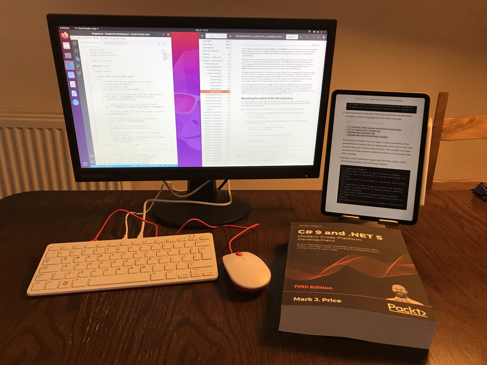

## Easy As Pi
[Raspberry Pi 400](https://www.raspberrypi.org/blog/raspberry-pi-400-the-70-desktop-pc/) was launched on 2 November 2020. The Raspberry Pi has been around for ages but this is the first time it has been embedded in a keyboard. A desktop PC for $70? Yes, please!


I am more into tinkering with software than hardware. I want the hardware side of things to be as simple as possible so I ordered the $99 model with all the useful extras like power adapter, mouse, and HDMI cable. All I needed to add was a monitor so I also bought a cheap Lenovo LCD.

## About the OS
Raspberry Pi OS is the official supported operating system but it is 32-bit even though the CPU is a quad-core Cortex-A72 (ARM v8) 64-bit SoC @ 1.8GHz and 4GB of RAM.

In this article I explain how to set up Ubuntu Desktop 64-bit. If you would rather just use the default 32-bit OS then I wrote an [article](../raspberry-pi-os32/README.md) about how to do that.

## Creating a boot disk using Raspberry Pi Imager

You will need a microSD card reader/writer and a microSD card with at least 8GB capacity. For example, I used an Atolla adapter and a 32GB SanDisk card, as shown in the following photos:

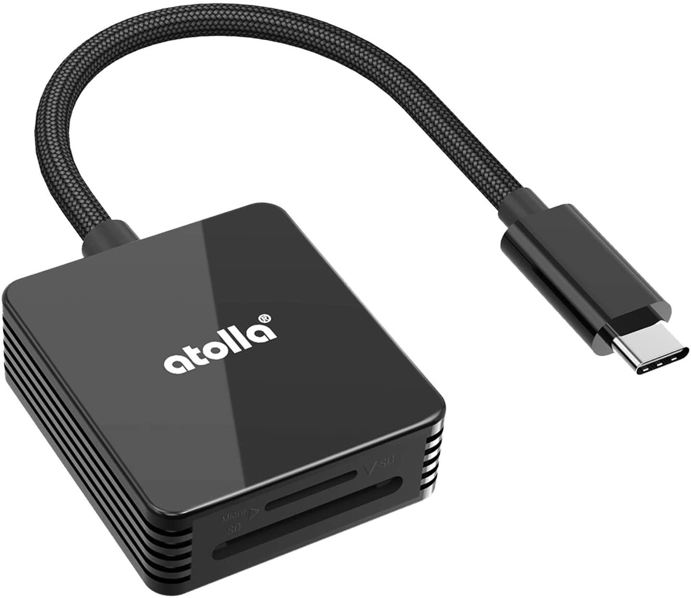
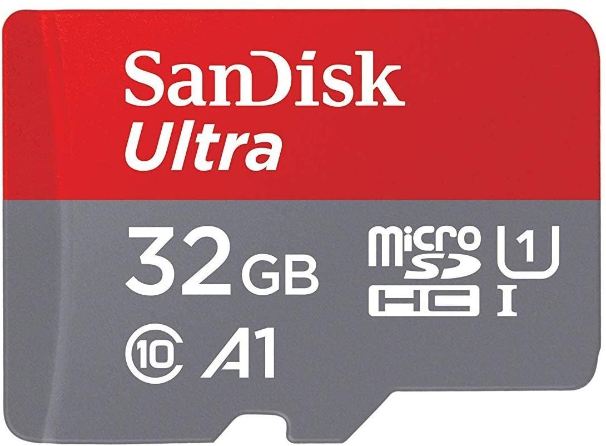

Warning! These steps will wipe everything on the microSD card.

1. Start your favorite browser on your computer. I used my 13-inch MacBook Pro.
2. Navigate to https://www.raspberrypi.org/software/
3. Download and install Raspberry Pi Imager. You can read [more about this tool](https://www.raspberrypi.org/blog/raspberry-pi-imager-imaging-utility/) on the Raspberry Pi website.
4. Put the SD card you'll use with your Raspberry Pi into the reader and run Raspberry Pi Imager.
5. In Raspberry Pi Imager, select the operating system that you want to use. I chose `Ubuntu Desktop 20.10 (RPi 4/400)`, as shown in the following screenshot:

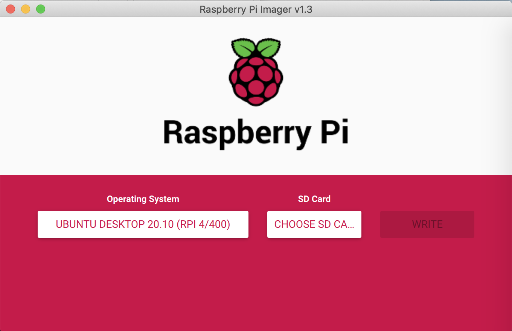

Note: If you'd prefer to set up an Ubuntu Server rather than Desktop and connect to it remotely, then Ubuntu has a good [guide](https://ubuntu.com/tutorials/how-to-install-ubuntu-on-your-raspberry-pi).

6. Select the SD card.
7. Click the `Write` button.
8. When the writing has finished you will see a success message, as shown in the following screenshot:

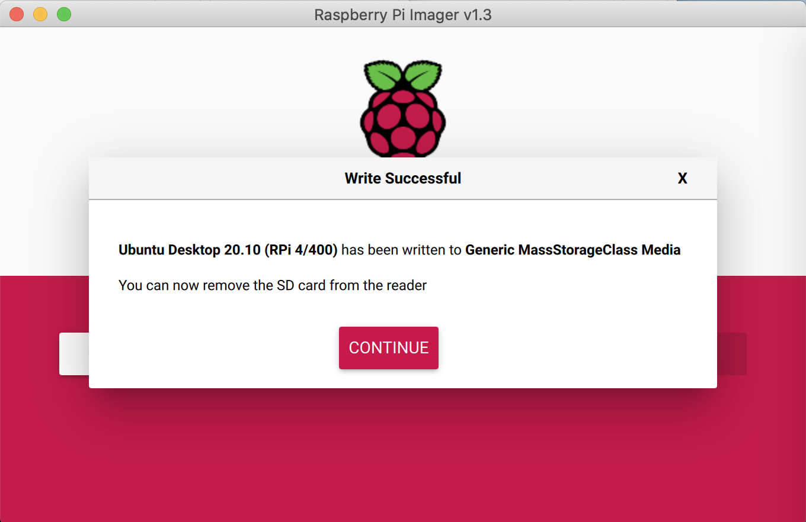

9. Click `Continue`.
10. Close the Raspberry Pi Imager app.

## Booting into Groovy Gorilla
Groovy Gorilla is the current version of Ubuntu and we are going to use the version created specfically for the Raspberry Pi.


1. Insert the microSD card into your Raspberry Pi.
2. Make sure you have a monitor and keyboard and mouse attached before powering up.
3. Step through the first-run steps, including selecting a language, keyboard layout, and timezone.
4. Enter a username and password.
5. View the Welcome page and see the desktop.

## Downloading .NET 5 SDK and Visual Studio Code

1. Start Firefox. This is the default browser on Ubuntu.
2. Navigate to https://dotnet.microsoft.com/download/dotnet/5.0
3. In the **Build apps - SDK** column, in the **Linux** row and **Binaries** column, click **Arm64**, as shown in the following screenshot:

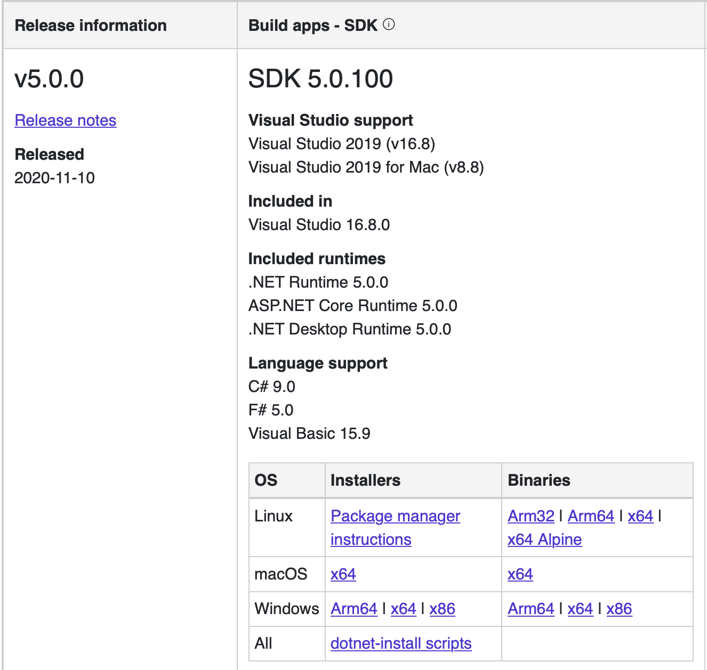

4. Navigate to https://code.visualstudio.com/download
5. Underneath the main icons for Linux, in the **.deb** row, click the **ARM 64** button, as shown in the following screenshot:

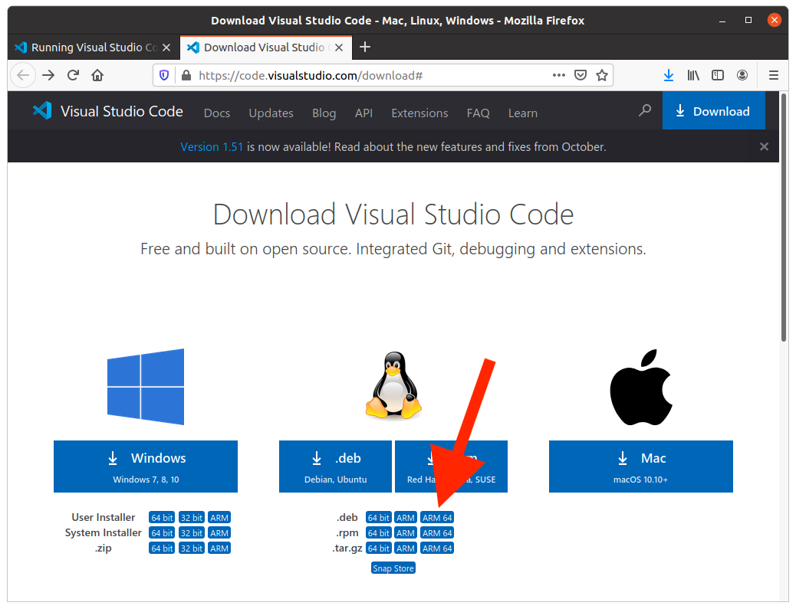

6. View your `Downloads` folder and check that you have the two files, as shown in the following screenshot:

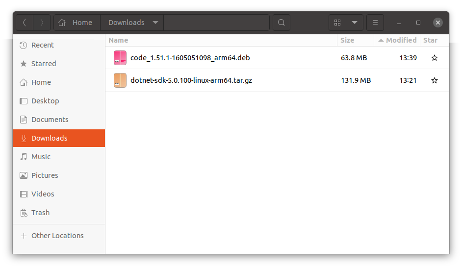

## Installing .NET 5 SDK and Visual Studio Code

1. Start **Files**.
2. In your `Home` folder, make a new folder to store the .NET SDK named `dotnet`.
3. Start **Terminal**.
4. Change to the `Downloads` folder, as shown in the following command:
```
cd Downloads
```
5. Extract the .NET SDK into the `dotnet` folder, as shown in the following command:
```
sudo tar -zxf dotnet-sdk-5.0.100-linux-arm64.tar.gz -C ~/dotnet
```

Note: If you are new to `tar`, `z` means use gzip format, `x` means extract, `f` means work with a file. You might want to add `v` which means verbose, so you can see the contents as they get extracted. The `-C` flag means change to the specified folder to extract into.

6. Change to the `dotnet` folder, as shown in the following commands:
```
cd ..
cd dotnet
```
7. Show system and .NET information, as shown in the following command:
```
dotnet --info
```
8. Review the results, as shown in the following output:
```
mark@ubuntu-pi:~/dotnet$ dotnet --info
.NET SDK (reflecting any global.json):
 Version:   5.0.100
 Commit:    5044b93829

Runtime Environment:
 OS Name:     ubuntu
 OS Version:  20.10
 OS Platform: Linux
 RID:         ubuntu.20.10-arm64
 Base Path:   /home/mark/dotnet/sdk/5.0.100/

Host (useful for support):
  Version: 5.0.0
  Commit:  cf258a14b7

.NET SDKs installed:
  5.0.100 [/home/mark/dotnet/sdk]

.NET runtimes installed:
  Microsoft.AspNetCore.App 5.0.0 [/home/mark/dotnet/shared/Microsoft.AspNetCore.App]
  Microsoft.NETCore.App 5.0.0 [/home/mark/dotnet/shared/Microsoft.NETCore.App]

To install additional .NET runtimes or SDKs:
  https://aka.ms/dotnet-download
```
9. Double-click the `code_1.51.xxxx.deb` file.
10. Click the `Install` button, as shown in the following screenshot:

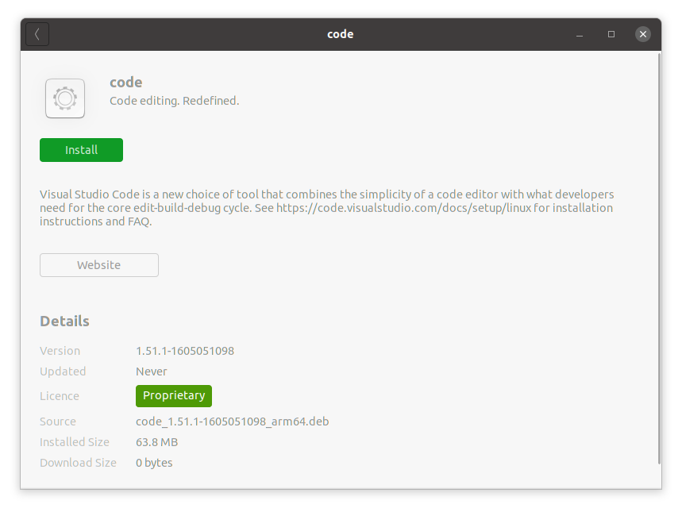

11. Wait for it to install.

## Configure paths to .NET SDK

1. Edit your profile, as shown in the following commands:
```
cd ~
sudo nano .profile
```
2. At the bottom of your existing profile, add entries to define environment variables, as shown in the following commands:
```
# set .NET SDK path
export DOTNET_ROOT=$HOME/dotnet
export PATH=$PATH:$HOME/dotnet
```
3. Save your changes.
4. Restart Terminal. You should now be able to enter the `dotnet` command in any folder. For example, enter `dotnet --version` to see the version number of the .NET SDK.

## Running Visual Studio Code

1. At the bottom of the *dash*, click the **Show Applications** icon.
2. In the **Type to search** box, enter `code`.
3. Click **Visual Studio Code**, wait for it to start, and then navigate to **Help** | **About**, as shown in the following screenshot:

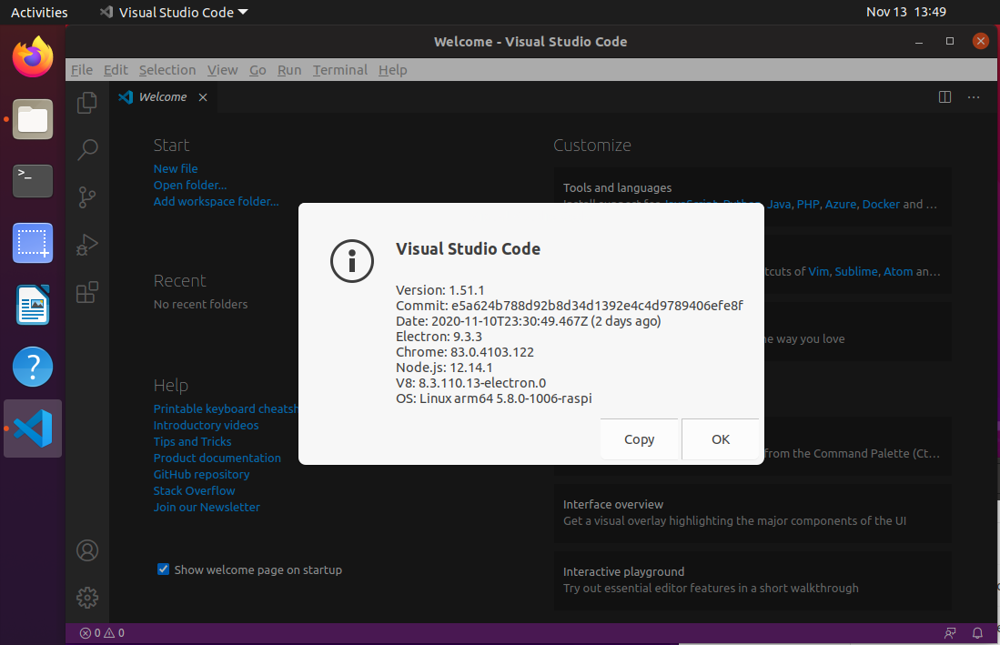

4. In the *dash*, right-click **Visual Studio Code** and choose **Add to Favorities**.
5. Follow the book instructions to install extensions including the C# extension.
6. Write some code and note that the language syntax is color formatted although you will not get IntelliSense help as you type (see the Limitations section below), and see it run in the Terminal window of Visual Studio Code, as shown in the following screenshot:

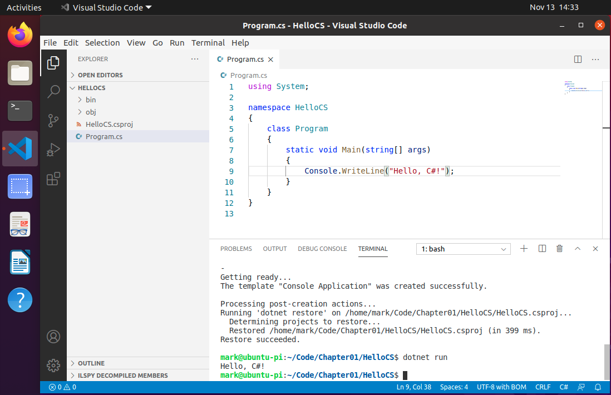

6. Follow the book instructions to clone the book's GitHub repository so that you have solutions for all coding tasks and exercises, as shown in the following screenshot:

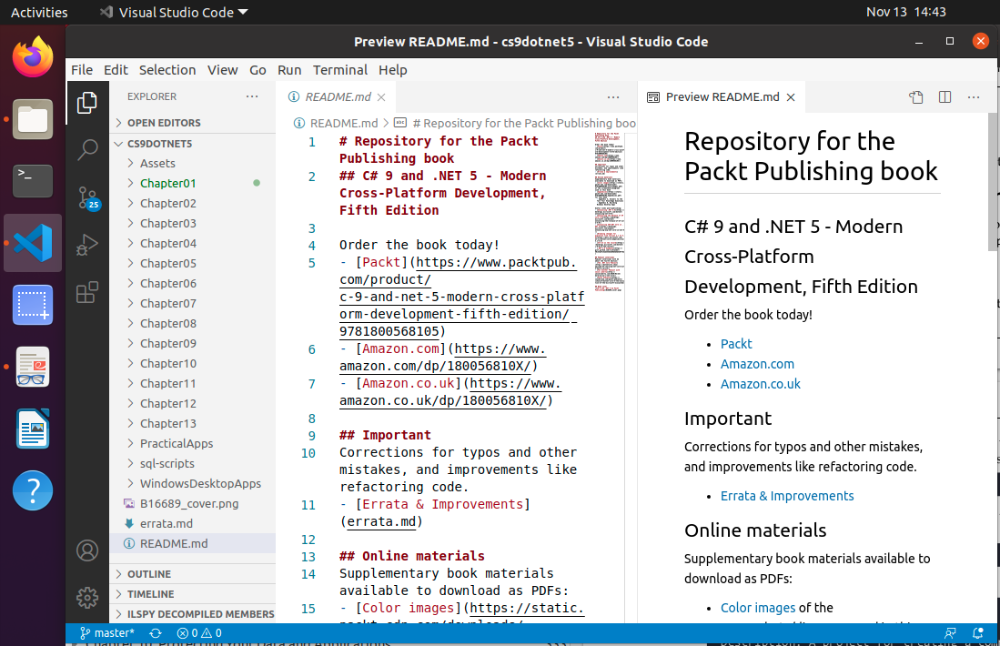

## Limitations

Currently the C# extension cannot provide IntelliSense as you type. This is because it uses the OmniSharp language service and that is not (yet) compatible with ARM. 

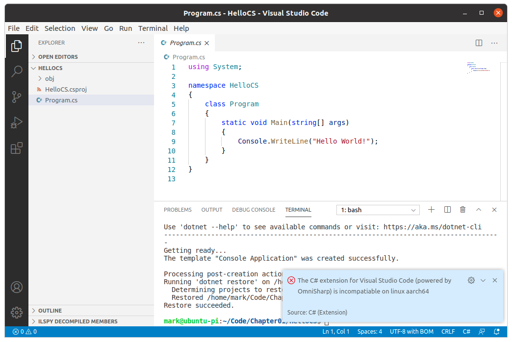

This means that as you type code, you won't get any help with suggestions. But *real* programmers don't need IntelliSense, right? ;-)

Sadly, you also won't be able to use debugging tools or get help from the MSBuild project extension either, as shown in the following screenshot:

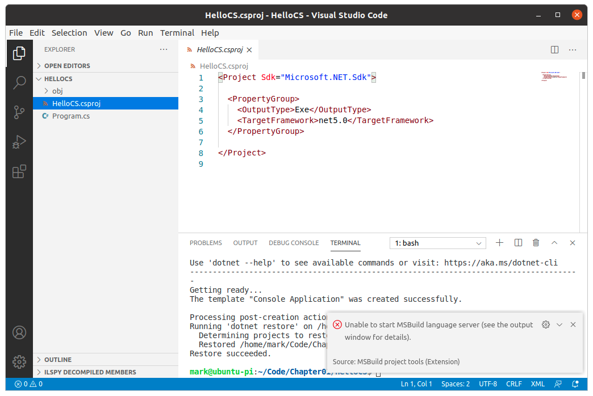

I will update this section as support is added.