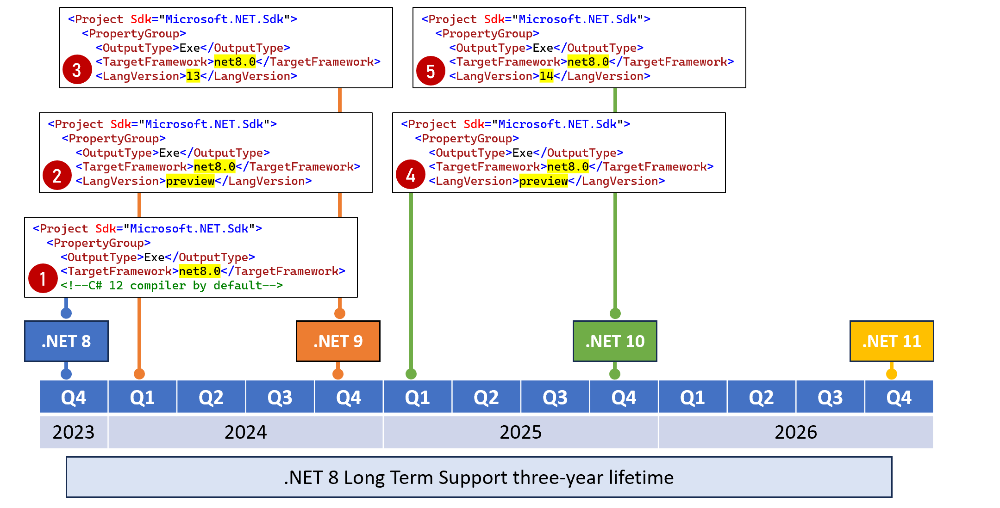

**Information for Technical Reviewers**

If you are a Technical Reviewer for this book, then you will find useful information on this page.

- [Installing previews](#installing-previews)
- [Updating workloads](#updating-workloads)
- [dotnet ef tool](#dotnet-ef-tool)
- [Word document files](#word-document-files)
  - [Links in the Word documents](#links-in-the-word-documents)
  - [Please add comments about anything you think of](#please-add-comments-about-anything-you-think-of)
- [Operating systems and code editors](#operating-systems-and-code-editors)
- [Lifetime of .NET 8 and the book](#lifetime-of-net-8-and-the-book)


# Installing previews

Microsoft releases official previews of .NET 8 on [Patch Tuesday](https://en.wikipedia.org/wiki/Patch_Tuesday) each month or one week later. I maintain a list of [.NET 8 preview releases](https://github.com/markjprice/cs11dotnet7/blob/main/docs/dotnet8.md) in the GitHub repo for the 7th edition.

- [Download .NET 8 Previews](https://dotnet.microsoft.com/en-us/download/dotnet/8.0)

# Updating workloads

After downloading and installing a .NET 8 preview, remember to update your workloads, as shown in the following command:
```
dotnet workload update
```

You can then list the workloads to check they have all been updated, as shown in the following command:
```
dotnet workload list
```

# dotnet ef tool

Make sure you are using the latest EF Core command-line tool. 

For example, to upgrade to the latest released version:
```
C:\>dotnet tool update --global dotnet-ef
Tool 'dotnet-ef' was successfully updated from version '7.0.0' to version '7.0.3'.
```

To upgrade to the latest .NET 8 preview version:
```
C:\>dotnet tool update --global dotnet-ef --version 8.0-*
Tool 'dotnet-ef' was successfully updated from version '7.0.3' to version '8.0.0-preview.1.23111.4'.
```

# Word document files

I will add a comment to the top of each Word document for a chapter that specifies the version of .NET 8 preview that I used. You can either use exactly the same version or a newer version but be aware that there may be differences in behavior. This could be temporary (new bugs are sometimes added and later removed) or permanent so it is always useful to add a comment about any unexpected behavior that you experience. 

## Links in the Word documents

Please do check that the links work and go to the correct place. Initially in the Word document they are not clickable so you will have to copy and paste them. They become clickable once the review and edit process is complete and the final PDF is created. 

Some links will not be available until later in the process, for example, a link to the color figure PDF or a link to the Discord channel for the book.

If you find any "live" links then please let me know so that I can right-click them and choose **Remove Hyperlink**.

## Please add comments about anything you think of

One of the challenges as an author is predicting how a reader will interpret the content. If any content produces any unexpected positive or negative feelings like confusion, annoyance, puzzlement, happiness, excitement, joy, curiosity, and so on, then please do add even a brief comment. If you feel it, at least some others likely will too. I would much rather read "too many" comments than "too few". Curiosity is a good one to discover related topics that could be added in future editions. If you feel, "I want to know more about that!" then please let me know.

# Operating systems and code editors

Inevitably there will be differences in .NET on different operating systems. Historically about 70% of readers use Visual Studio 2022 on Windows so that is the code editor and OS that I use while writing preliminary drafts (PDs) from May to July. 

I often do not test on macOS with Visual Studio Code until final drafts (FDs) with Release Candidates 1 and 2 in September (RC1) and October (RC2). 

I may not test on Linux at all, so if you're willing to, that'd be awesome! Luckily, developers who choose Linux or a non-Microsoft code editor are much more likely to enjoy figuring things out on their own anyway.

# Lifetime of .NET 8 and the book

.NET 8 will release in November 2023. It will reach end-of-life in November 2026. I want to enable readers to pick up the book and use it to learn at any point during those three years so the book needs to be written with that in mind. 

For example, I write the step-by-step instructions in the PDs today as if they are to be read after November 2023. For example, .NET packages references like `Microsoft.EntityFramework.SqlServer` are `8.0.0` instead of `8.0.0-preview.5.23303.2` and so on. 

Although the book is written for .NET 8, I'd like the reader to know how to use later versions that will be released during .NET 8's lifetime, as shown in the following table:

|Time Period|Description|
|---|---|
|November 2023 to February 2024|A third of potential readers will consume the book in the first three months of .NET 8's lifetime. They will download and use .NET SDK 8.0.100 GA or a monthly patch release like 8.0.101.|
|February 2024 to October 2024|A reader might want to use .NET 9 previews.|
|November 2024 to November 2025|A reader might want to use .NET SDK 9.0.100 GA. Some readers might buy and read the ninth edition for .NET 9 but many will skip the ninth edition if they bought the eighth which is fair enough. They will be able to read the eighth edition to learn 99% of what they want, and read the official Microsoft documentation for [What's New in .NET 9](https://learn.microsoft.com/en-us/dotnet/core/whats-new/dotnet-9) for the new features.|
|February 2025 to October 2025|A reader might want to use .NET 10 previews.|
|From November 2025|A reader might want to use .NET SDK 10.0.100 GA. But hopefully the reader would buy and read the tenth edition for .NET 10 instead. They can also read the official Microsoft documentation for [What's New in .NET 10](https://learn.microsoft.com/en-us/dotnet/core/whats-new/dotnet-10) for the new features.|

I plan to add notes throughout the book when relevant to help the readers who want to use previews and release versions of .NET 9 and .NET 10 to be successful with those versions too. (Although the book won't cover their new features, obviously!)

For example, in Chapter 7, I explain how a reader can target .NET 8 throughout it's lifetime while still installing future .NET SDKs and benefiting from compiler improvements in the C# 13 and 14 languages, as shown in *Figure 7.2*:


*Figure 7.2: Targeting .NET 8 and using newer C# compilers*

You can easily continue to target the .NET 8 runtime while installing and using future C# compilers, as shown in the following list:
1.	**November 2023**: Install .NET SDK 8.0.100 and use it to build projects that target .NET 8 and use the C# 12 compiler by default. Every month, update to .NET 8 SDK patches on the development computer and update to .NET 8 runtime patches on any deployment computers.
2.	**February 2024**: Optionally, install .NET SDK 9 Preview 1 to explore new C# language and .NET library features. Note that you won't be able to use new library features while targeting .NET 8. Previews are released monthly between February and October each year. Read the monthly announcement blog posts to find out about the new features in that preview.
3.	**November 2024**: Install .NET SDK 9.0.100 and use it to build projects that continue to target .NET 8 and use the C# 13 compiler for its new features. You will be using a fully supported SDK and fully supported runtime. You can also use new features in EF Core 9 because it will continue to target .NET 8.
4.	**February 2025**: Optionally, install .NET 10 previews to explore new C# language and .NET library features. Start planning if any new library and ASP.NET Core features in .NET 9 and .NET 10 can be applied to your .NET 8 projects when you are ready to migrate.
5.	**November 2025**: Install .NET 10.0.100 SDK and use it to build projects that target .NET 8 and use the C# 14 compiler. Migrate your .NET 8 projects to .NET 10 since it is an LTS release. You have until November 2026 to complete the migration when .NET 8 reaches end-of-life.
