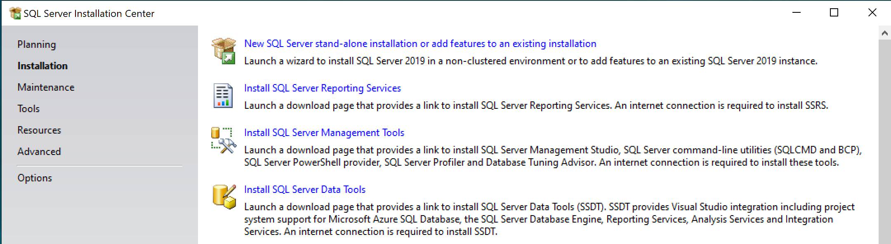
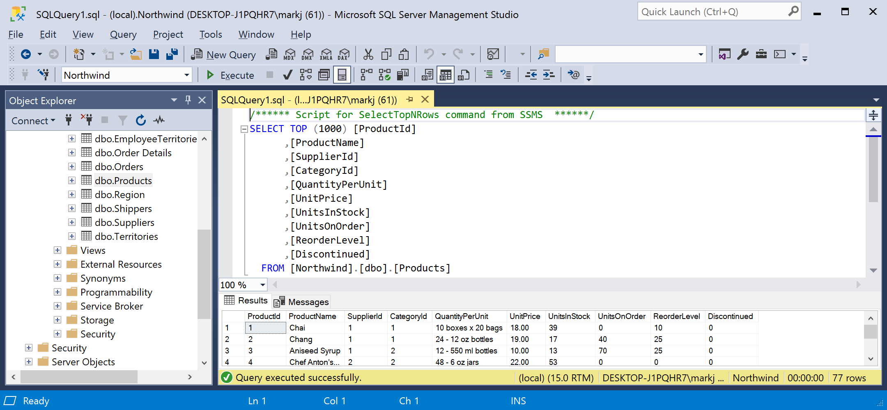
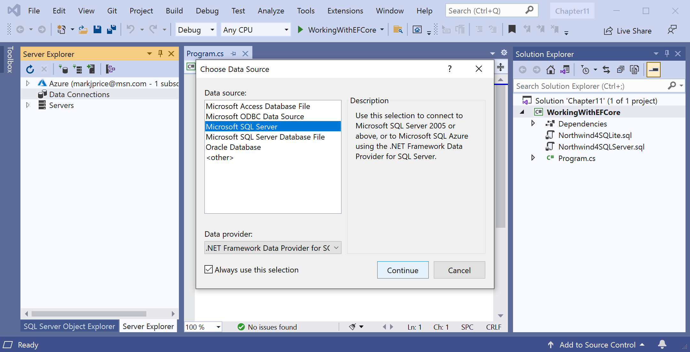
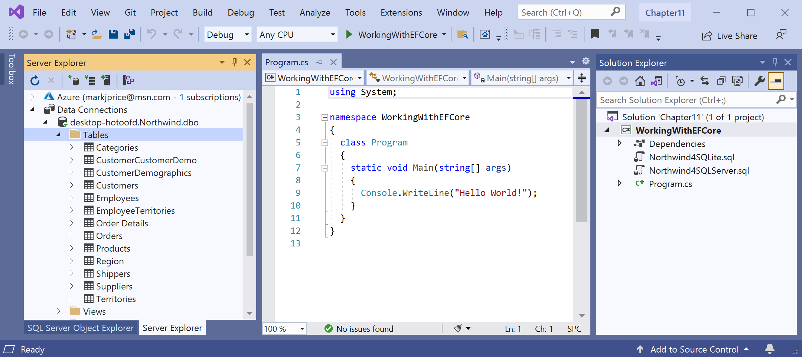
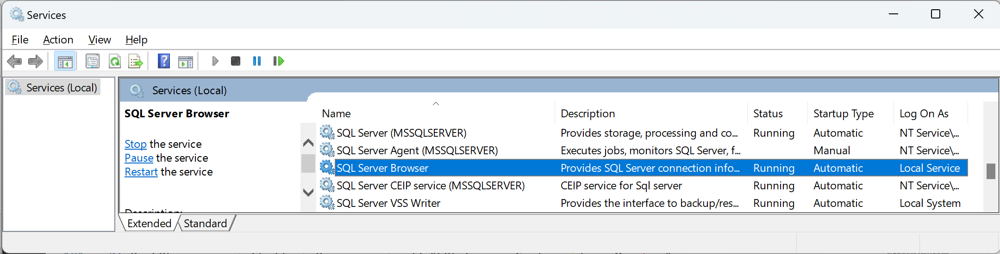
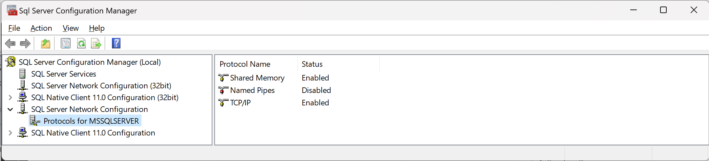
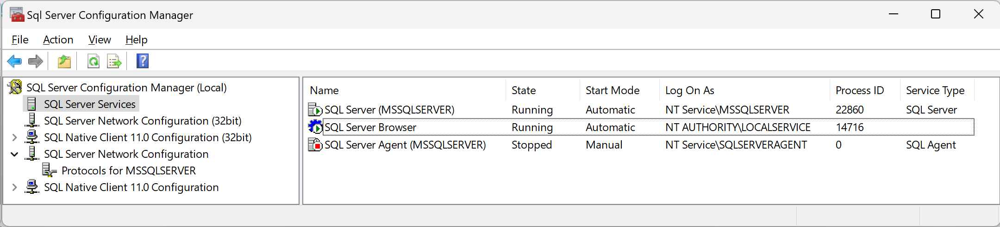
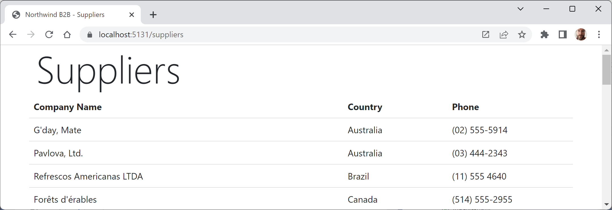

**Using SQL Server for Windows**

- [Chapter 10 - Working with Data Using Entity Framework Core](#chapter-10---working-with-data-using-entity-framework-core)
  - [Introducing SQL Server for Windows](#introducing-sql-server-for-windows)
  - [Downloading and installing SQL Server](#downloading-and-installing-sql-server)
  - [SQL Server databases](#sql-server-databases)
  - [SQL Server objects](#sql-server-objects)
  - [Creating the Northwind sample database for SQL Server](#creating-the-northwind-sample-database-for-sql-server)
  - [Managing the Northwind sample database with Server Explorer](#managing-the-northwind-sample-database-with-server-explorer)
  - [Connecting to a SQL Server database](#connecting-to-a-sql-server-database)
  - [Data source aka server name](#data-source-aka-server-name)
  - [Encrypting communication](#encrypting-communication)
  - [Configuring a remote SQL Server](#configuring-a-remote-sql-server)
  - [Defining the Northwind database context class](#defining-the-northwind-database-context-class)
  - [Scaffolding models using an existing database](#scaffolding-models-using-an-existing-database)
- [Chapter 12 - Introducing Web Development Using ASP.NET Core](#chapter-12---introducing-web-development-using-aspnet-core)
  - [Creating a class library for entity models using SQL Server](#creating-a-class-library-for-entity-models-using-sql-server)
  - [Creating a class library for a database context using SQL Server](#creating-a-class-library-for-a-database-context-using-sql-server)
- [Chapter 13 - Building Websites Using ASP.NET Core Razor Pages](#chapter-13---building-websites-using-aspnet-core-razor-pages)
  - [Setting the user and password for SQL Server authentication](#setting-the-user-and-password-for-sql-server-authentication)
  - [Configuring Entity Framework Core as a service](#configuring-entity-framework-core-as-a-service)

# Chapter 10 - Working with Data Using Entity Framework Core

## Introducing SQL Server for Windows

Microsoft offers various editions of its popular and capable SQL Server product 
for Windows, Linux, and Docker containers. We will use a free version that can 
run standalone, known as SQL Server Developer Edition. You can also use the 
Express edition or the free SQL Server LocalDB edition that can be installed 
with Visual Studio for Windows.

> If you do not have Windows, then you can use a version of SQL Server that runs in a Linux container on Docker. To find out how, please read the page about [Azure SQL Edge](https://github.com/markjprice/apps-services-net8/blob/main/docs/ch02-sql-edge.md) from the companion book, *Apps and Services with .NET 8*.

## Downloading and installing SQL Server

You can download SQL Server editions from the following link:
https://www.microsoft.com/en-us/sql-server/sql-server-downloads

1.	Download the **Developer** edition.
2.	Run the installer.
3.	Select the **Custom** installation type.
4.	Select a folder for the installation files and then click **Install**.
5.	Wait for the 1.5 GB of installer files to download. While you wait you can read about [SQL Server databases](#sql-server-databases) and [SQL Server objects](#sql-server-objects).
6.	In **SQL Server Installation Center**, click **Installation**, and then click **New SQL Server stand-alone installation or add features to an existing installation**, as shown in *Figure 10.1*:


*Figure 10.1: Installation using SQL Server Installation Center*

7.	Select **Developer** as the free edition and then click **Next**.
8.	Accept the license terms and then click **Next**.
9.	Review the install rules, fix any issues, and then click **Next**.
10.	In **Feature Selection**, select **Database Engine Services**, and then click **Next**.
11.	In **Instance Configuration**, select **Default instance**, and then click **Next**. If you already have a default instance configured, then you could create a named instance, perhaps called **csdotnetbook**.
12.	In **Server Configuration**, note the **SQL Server Database Engine** is configured to start automatically. Set the **SQL Server Browser** to start automatically, and then click **Next**.
13.	In **Database Engine Configuration**, on the **Server Configuration** tab, set **Authentication Mode** to **Mixed**, set the **sa** account password to a strong password, click **Add Current User**, and then click **Next**.
14.	In **Ready to Install**, review the actions that will be taken, and then click **Install**.
15.	In **Complete**, note the successful actions taken, and then click **Close**.
16.	In **SQL Server Installation Center**, in **Installation**, click **Install SQL Server Management Tools**.
17.	In the browser window, click to download the latest version of SSMS.
18.	Run the installer and click **Install**.
19.	When the installer has finished, click **Restart** if needed or **Close**.

## SQL Server databases

When you work with SQL Server it can be useful to know that as well as a **user database** like `Northwind`, there are **system databases** like `master`. Never delete a system database! A fresh SQL Server installation will have four system databases created, as shown in the following list:

- `master`: This system database contains meta data about all the other databases. Avoid adding your own objects to this database.
- `model`: This system database is a template for new user databases. If you add objects to the `model` and then create a new database, it will have all the same objects in it.
- `msdb`: This system database contains data used by **SQL Server Agent** for jobs and alerts.
- `tempdb`: This system database is reset automatically on restart. You can create objects like tables in it knowing they will be dropped automatically when you disconnect.

> **More Information**: You can learn more about system databases at the following link: https://learn.microsoft.com/en-us/sql/relational-databases/databases/system-databases.

## SQL Server objects

Objects in SQL Server have up to four parts to their unique address: `<server>.<database>.<schema>.<object>`. Like a folder structure, how much of this address is needed to identify an object depends on context. If you are in a database, then you only need `<schema>.<object>`.

- `<server>`: The name or IP address including port number of the computer server. Use `.` or `localhost` or `127.0.0.1` for the local computer. Use a remote computer's network name or address. Azure SQL Edge will be listening on port `1433` using TCP by default, so to connect to it in Docker on your local computer would be `tcp:127.0.0.1,1433`.
- `<database>`: The name of a database. For example, a system database like `master` or `tempdb`, or a user database like `Northwind`.
- `<schema>`: The name of a schema. Historically, this used to be the name of a user who owns a set of objects. The default user was named `dbo` meaning **database owner**. But Microsoft changed the definition to schema and kept that legacy name. If you do not specify a schema when you create a new object in a database then it will put it in the `dbo` schema by default. You can define your own schemas with whatever name you want so they are a bit like a namespace in C#.
- `<object>`: The name of an object. For example, the `Customers` table or the `GetExpensiveProducts` stored procedure. Database tools group objects by type but they are not identified by type in their address. Therefore you cannot have a table and stored procedure or any other object with the same name.

> **More Information**: You can learn more about database identifiers at the following link: https://learn.microsoft.com/en-us/sql/relational-databases/databases/database-identifiers.

## Creating the Northwind sample database for SQL Server

Now we can run a database script to create the Northwind sample database:

1.	If you have not previously downloaded or cloned the GitHub repository for this book, then do so now using the following link: https://github.com/markjprice/cs12dotnet8/.
2.	Copy the script to create the Northwind database for SQL Server from the following path in your local Git repository: `/sql-scripts/Northwind4SQLServer.sql` into the `WorkingWithEFCore` folder.
3.	Start **SQL Server Management Studio**.
4.	In the **Connect to Server** dialog, for **Server name**, enter `.` (a dot) meaning the local computer name, and then click **Connect**. If you had to create a named instance, like `csdotnetbook`, then enter `.\csdotnetbook`
5.	Navigate to **File** | **Open** | **File...**.
6.	Browse to select the `Northwind4SQLServer.sql` file and then click **Open**.
7.	In the toolbar, click **Execute**, and note the the **Command(s) completed successfully** message.
8.	In **Object Explorer**, expand the **Northwind** database, and then expand **Tables**.
9.	Right-click **Products**, click **Select Top 1000 Rows**, and note the returned results, as shown in *Figure 10.2*:


*Figure 10.2: The Products table in SQL Server Management Studio*

10.	In the **Object Explorer** toolbar, click the **Disconnect** button.
11.	Exit SQL Server Management Studio.

## Managing the Northwind sample database with Server Explorer

We did not have to use **SQL Server Management Studio** to execute the database script. We can also use tools in **Visual Studio 2022** including the **SQL Server Object Explorer** and **Server Explorer**:

1.	In Visual Studio 2022, choose **View** | **Server Explorer**.
2.	In the **Server Explorer** window, right-click **Data Connections** and choose **Add Connection...**.
3.	If you see the **Choose Data Source** dialog, as shown in *Figure 10.3*, then select **Microsoft SQL Server** and then click **Continue**:


*Figure 10.3: Choosing SQL Server as the data source*

4.	In the **Add Connection** dialog, enter the server name as `.`, enter the database name as `Northwind`, and then click **OK**.
5.	In **Server Explorer**, expand the data connection and its tables. You should see 13 tables, including the **Categories** and **Products** tables, as shown in *Figure 10.4*:


*Figure 10.4: 13 tables in Northwind database*

6.	Right-click the **Products** table, choose **Show Table Data**, and note the 77 rows of products are returned.
7.	To see the details of the **Products** table columns and types, right-click **Products** and choose **Open Table Definition**, or double-click the table in **Server Explorer**.

## Connecting to a SQL Server database

To connect to an SQL Server database, we need to know multiple pieces of information, as shown in the following list:
- The name of the server (and the instance if it has one).
- The name of the database.
- Security information, such as username and password, or if we should pass the currently logged-on user's credentials automatically.

We specify this information in a **connection string**.

For backward compatibility, there are multiple possible keywords we can use in an SQL Server connection string for the various parameters, as shown in the following list:
- `Data Source` or `server` or `addr`: These keywords are the name of the server (and an optional instance). You can use a dot `.` to mean the local server. For Azure SQL Edge in Docker, you should specify the localhost IP address on port 1433 which will be `tcp:127.0.0.1,1433` by default. For Azure SQL Database in the cloud, you should specify the remote domain address on port 1433 which will be `tcp:<server>.database.windows.net,1433` where `<server>` is your unique SQL server resource name, for example, `apps-services-book`.
- `Initial Catalog` or `database`: These keywords are the name of the database.
- `Integrated Security` or `trusted_connection`: These keywords are set to `true` or `SSPI` to pass the thread's current Windows user credentials.
- `User ID` and `Password`: These keywords should be set if you are using SQL Server Authentication aka SQL Login. You often use these with Azure SQL Edge and Azure SQL Database.
- `Encrypt`: This keyword enables SSL/TLS encryption of the transmitted data if set to `true`. Default is `false`. On a local computer it will use the local developer certificate to encrypt so this must be trusted.
- `TrustServerCertificate`: This keyword enables trusting the local certificate if set to `true`.
- `MultipleActiveResultSets`: This keyword is set to `true` to enable a single connection to be used to work with multiple tables simultaneously to improve efficiency. It is used for lazy loading rows from related tables.

> **Good Practice**: Never store a password or other sensitive values in your source code. Get those values from an environment variable or a secret management system like [Secret Manager](https://learn.microsoft.com/en-us/aspnet/core/security/app-secrets) for local development secrets or [Azure Key Vault](https://learn.microsoft.com/en-us/azure/key-vault/general/overview) for cloud and production secrets.

## Data source aka server name

As described in the list above, when you write code to connect to an SQL Server database, you need to know its server name. The server name depends on the edition and version of SQL Server that you will connect to, as shown in the following table:


SQL Server edition|Server name \ Instance name
---|---
LocalDB 2012|`(localdb)\v11.0`
LocalDB 2016 or later|`(localdb)\mssqllocaldb`
Express|`.\sqlexpress`
Full/Developer (default instance)|`.`
Full/Developer (named instance)|`.\csdotnetbook`
Azure SQL Database in the cloud|`tcp:<server_name>.database.windows.net,1433`
Azure SQL Edge in a local Docker container|`tcp:127.0.0.1,1433`

> **Good Practice**: Use a dot `.` as shorthand for the local computer name. Remember that server names for SQL Server are made of two parts: the name of the computer and the name of an SQL Server instance. You provide instance names during custom installation.

## Encrypting communication

If you get the error, `The certificate chain was issued by an authority that is not trusted.`, then it is because the connection to the SQL Server database is trying to encrypt the transmission using the local development server certificate but the OS and therefore the app does not (yet) trust it.

You have three choices to fix this issue:

1. Add the following to the database connection string to make the local development server certicate trusted for this connection:
```
TrustServerCertificate=true;
```
1. Add the following to the database connection string to disable encryption so it does not *need* to trust the certificate for this connection:
```
Encrypt=false;
```
1. Run the following at the command prompt to trust the certificate for all .NET apps in future:
```
dotnet dev-certs https --trust
```

## Configuring a remote SQL Server

If you are using a remote SQL Server, i.e. SQL Server is not installed on your local computer but instead on a computer that you are connected to over a network, then there are a few more settings are required. 

For example, you must make sure that the Windows service named **SQL Server Browser** is running, you must enable a communication protocol that supports networks like TCP/IP (Shared Memory is enabled by default but only works on a local SQL Server), and you must enable the server's firewall to allow connections over port 1433 for TCP and UDP.

Let's do that:

1. In Windows, click the Start button, type `services` and press *Enter* to open the **Services** window, then double-click the entry for **SQL Server Browser**, and set the **Startup type** to **Automatic**, as shown in *Figure 9.6*:


*Figure 9.6: Set SQL Server Browser in Services to start automatically*

SQL Server Configuration Manager is a tool to manage the services associated with SQL Server, to configure the network protocols used by SQL Server, and to manage the network connectivity configuration from SQL Server client computers. 

> **More Information**: SQL Server Configuration Manager, https://learn.microsoft.com/en-us/sql/relational-databases/sql-server-configuration-manager

Copy the path to the version of SQL Server Configuration Manager you have installed from the following list:

- SQL Server 2022: `C:\Windows\SysWOW64\SQLServerManager16.msc`
- SQL Server 2019: `C:\Windows\SysWOW64\SQLServerManager15.msc`
- SQL Server 2017: `C:\Windows\SysWOW64\SQLServerManager14.msc`
- SQL Server 2016: `C:\Windows\SysWOW64\SQLServerManager13.msc`

1. In Windows, activate the Start button, paste the path, and press *Enter* to open the plug-in via Microsoft Management Console (MMC). You will be prompted to run it using Administrator access rights.
2. Expand **SQL Server Network Configuration** and then select **Protocols for MSSQLSERVER**.


*Figure 9.7: Managing Protocols for MSSQLSERVER*

3. Double-click **TCP/IP**, and in the **TCP/IP Properties** dialog box, set **Enabled** to **true** and click **OK**. 
4. Select **SQL Server Services**.


*Figure 9.8: Managing SQL Server Services*

5. Right-click **SQL Server (MSSQLSERVER)** and select **Restart**.
6. Right-click **SQL Server Browser** and select **Restart**.
7.  Configure Windows firewall on SQL server, new incoming rules:
    - Allow TCP 1433 (only for private, if server is in the same network).
    - Allow UDP 1434 (only for private, if server is in the same network)

> Remember that the server name for the remote connection will be `<remote_server_name>\<sql_instance_name>`.

## Defining the Northwind database context class

1.	In the `WorkingWithEFCore` project, add package references to the EF Core data provider for SQL Server and the ADO.NET Provider for SQL Server, and globally and statically import the `System.Console` class for all C# files, as shown in the following markup:
```xml
<ItemGroup>
  <Using Include="System.Console" Static="true" />
</ItemGroup>

<ItemGroup>
  <PackageReference Version="5.2.0" Include="Microsoft.Data.SqlClient" />
  <PackageReference Version="8.0.4" Include="Microsoft.EntityFrameworkCore.SqlServer" />
</ItemGroup>
```

> You can check for the most recent package versions at the following links: https://www.nuget.org/packages/Microsoft.Data.SqlClient#versions-body-tab and https://www.nuget.org/packages/Microsoft.EntityFrameworkCore.SqlServer/#versions-body-tab.

2.	Build the `WorkingWithEFCore` project to restore packages.
3.	Add a new class file named `NorthwindDb.cs`.
4.	In `NorthwindDb.cs`, define a class named `NorthwindDb`, import the main namespace for EF Core, make the class inherit from `DbContext`, and in an `OnConfiguring` method, configure the options builder to use SQL Server, as shown in the following code:
```cs
using Microsoft.Data.SqlClient; // To use SqlConnectionStringBuilder.
using Microsoft.EntityFrameworkCore; // To use DbContext and so on.

namespace Northwind.EntityModels;

// This manages the connection to the database.
public class NorthwindDb : DbContext
{
  protected override void OnConfiguring(
    DbContextOptionsBuilder optionsBuilder)
  {
    SqlConnectionStringBuilder builder = new();

    builder.DataSource = "."; // "ServerName\InstanceName" e.g. @".\sqlexpress"
    builder.InitialCatalog = "Northwind";
    builder.Encrypt = true;
    builder.TrustServerCertificate = true;
    builder.MultipleActiveResultSets = true;
    builder.ConnectTimeout = 3; // Because we want to fail fast. Default is 15 seconds.

    // If using Windows Integrated authentication.
    builder.IntegratedSecurity = true;

    // If using SQL Server authentication.
    // builder.UserId = Environment.GetEnvironmentVariable("MY_SQL_USR");
    // builder.Password = Environment.GetEnvironmentVariable("MY_SQL_PWD");

    string? connectionString = builder.ConnectionString;
    WriteLine($"Connection: {connectionString}");
    optionsBuilder.UseSqlServer(connectionString);
  }
}
```

> The `Data Source` can have many different values, as shown in the [Data source aka server name](#data-source-aka-server-name) section.

> **Good Practice**: Do NOT define the two environment variables using a `launchSettings.json` file unless you exclude that file from your GitHub repository! It is safer to define the two environment variables using `set` or `setx` on Windows and `export` on macOS or Linux.

5.	In `Program.cs`, delete the existing statements and then import the `Northwind.EntityModels` namespace and output the database provider, as shown in the following code:
```cs
using Northwind.EntityModels; // To use NorthwindDb.

NorthwindDb db = new();
WriteLine($"Provider: {db.Database.ProviderName}");
```

6.	Run the console app and note the output showing the database connection string and which database provider you are using, as shown in the following output:
```
Connection: Data Source=.;Initial Catalog=Northwind;Integrated Security=true;Encrypt=true;TrustServerCertificate=true;MultipleActiveResultSets=true;
Provider: Microsoft.EntityFrameworkCore.SqlServer
```

> Note: Your connection string might be different.

## Scaffolding models using an existing database

The instructions for this section are in the book and are the same for both SQL Server and SQLite. But the command you must enter at the command prompt or termimal is different. 

For SQL Server, change the database provider and connection string, as shown in the following command:
```
dotnet ef dbcontext scaffold "Data Source=.;Initial Catalog=Northwind;Integrated Security=true;Encrypt=true;TrustServerCertificate=true;" Microsoft.EntityFrameworkCore.SqlServer --table Categories --table Products --output-dir AutoGenModels --namespace WorkingWithEFCore.AutoGen --data-annotations --context NorthwindDb
```

> The `Data Source` can have many different values, as shown in the [Data source aka server name](#data-source-aka-server-name) section.

# Chapter 12 - Introducing Web Development Using ASP.NET Core

In these sections, you will define an entity data model for the Northwind database stored in SQL Server. It will be used in most of the apps that we create in subsequent chapters.

## Creating a class library for entity models using SQL Server

To use SQL Server, you will not need to do anything if you already set up the Northwind database in *Chapter 10, Working with Data Using Entity Framework Core*. But you will now create the entity models using the `dotnet-ef` tool:

1.	Add a new project, as defined in the following list:
    - Project template: **Class Library** / `classlib`
    - Project file and folder: `Northwind.EntityModels.SqlServer`
    - Solution file and folder: `PracticalApps`

2.	In the `Northwind.EntityModels.SqlServer` project, add package references for the SQL Server database provider and EF Core design-time support, as shown in the following markup:
```xml
<ItemGroup>
  <PackageReference
    Include="Microsoft.EntityFrameworkCore.SqlServer" Version="8.0.0" />
  <PackageReference 
    Include="Microsoft.EntityFrameworkCore.Design" Version="8.0.0">
    <PrivateAssets>all</PrivateAssets>
    <IncludeAssets>runtime; build; native; contentfiles; analyzers; buildtransitive</IncludeAssets>
  </PackageReference>  
</ItemGroup>
```

3.	Delete the `Class1.cs` file.
4.	Build the `Northwind.EntityModels.SqlServer` project to restore packages.
5.	At a command prompt or terminal for the `Northwind.EntityModels.SqlServer` folder, generate entity class models for all tables, as shown in the following command:
```
dotnet ef dbcontext scaffold "Data Source=.;Initial Catalog=Northwind;Integrated Security=true;TrustServerCertificate=true;" Microsoft.EntityFrameworkCore.SqlServer --namespace Northwind.EntityModels --data-annotations
```

Note the following:
- The command to perform: `dbcontext scaffold`
- The connection string: `"Data Source=.;Initial Catalog=Northwind;Integrated Security=true;TrustServerCertificate=true;"`
- The database provider: `Microsoft.EntityFrameworkCore.SqlServer`
- The namespace: `--namespace Northwind.EntityModels`
- To use data annotations as well as the Fluent API: `--data-annotations`

> The `Data Source` can have many different values, as shown in the [Data source aka server name](#data-source-aka-server-name) section.

6.  Note the results, as shown in the following otput:
```
Build started...
Build succeeded.
To protect potentially sensitive information in your connection string, you should move it out of source code. You can avoid scaffolding the connection string by using the Name= syntax to read it from configuration - see https://go.microsoft.com/fwlink/?linkid=2131148. For more guidance on storing connection strings, see http://go.microsoft.com/fwlink/?LinkId=723263.
The column 'dbo.Products.Discontinued' would normally be mapped to a non-nullable bool property, but it has a default constraint. Such a column is mapped to a nullable bool property to allow a difference between setting the property to false and invoking the default constraint. See https://go.microsoft.com/fwlink/?linkid=851278 for details.
```

6.	In `Customer.cs`, add a regular expression to validate its primary key value to only allow uppercase Western characters, as shown in the following code:
```cs
[Key]
[StringLength(5)]
[RegularExpression("[A-Z]{5}")]
public string CustomerId { get; set; } = null!;
```

7.	In `Customer.cs`, make the `CustomerId` and `CompanyName` properties required by decorating them with the `[Required]` attribute.
8.	In `Customer.cs`, add an attribute to validate and render the `Phone` property as a telephone number, as shown in the following code:
```cs
[Phone]
public string? Phone { get; set; };
```

> The `[Phone]` attribute adds the following to the rendered HTML: `type="tel"``. On a mobile phone this makes the keyboard use the phone dialer instead of the normal keyboard.

## Creating a class library for a database context using SQL Server

You will now define a database context class library:

1.	Add a new project, as defined in the following list:
    - Project template: **Class Library** / `classlib`
    - Project file and folder: `Northwind.DataContext.SqlServer`
    - Solution file and folder: `PracticalApps`

2.	In the `Northwind.DataContext.SqlServer` project, statically and globally import the `Console` class, add a project reference to the `Northwind.EntityModels.SqlServer` project, and add package references for the EF Core database provider and the ADO.NET database provider for SQL Server, as shown in the following markup:
```xml
<ItemGroup>
  <Using Include="System.Console" Static="true" />
</ItemGroup>

<ItemGroup>
  <PackageReference Include="Microsoft.Data.SqlClient" Version="5.1.1" />
  <PackageReference Include="Microsoft.EntityFrameworkCore.SqlServer" Version="8.0.0" />
</ItemGroup>

<ItemGroup>
  <ProjectReference Include="..\Northwind.EntityModels.SqlServer\Northwind.EntityModels.SqlServer.csproj" />
</ItemGroup>
```

> **Warning!** The path to the project reference should not have a line break in your project file.

3.	In the `Northwind.DataContext.SqlServer` project, delete the `Class1.cs` file.
4.	Build the `Northwind.DataContext.SqlServer` project to restore packages.
5.  In the Northwind.DataContext.Sqlite project, add a class named `NorthwindContextLogger.cs`. 
6.  Modify its contents to define a static method named `WriteLine` that appends a string to the end of a text file named `northwindlog.txt` on the desktop, as shown in the following code:
```cs
using static System.Environment;

namespace Northwind.EntityModels;

public class NorthwindContextLogger
{
  public static void WriteLine(string message)
  {
    string path = Path.Combine(GetFolderPath(
      SpecialFolder.DesktopDirectory), "northwindlog.txt");

    StreamWriter textFile = File.AppendText(path);
    textFile.WriteLine(message);
    textFile.Close();
  }
}
```
7.	Move the `NorthwindContext.cs` file from the `Northwind.EntityModels.SqlServer` project/folder to the `Northwind.DataContext.SqlServer` project/folder.
8.	In the `Northwind.DataContext.SqlServer` project, at the top of `NorthwindContext.cs`, import the namespace for working with the connection string builder for SQL Server, as shown in the following code:
```cs
using Microsoft.Data.SqlClient; // To use SqlConnectionStringBuilder.
```
9.	In `NorthwindContext.cs`, in the `OnConfiguring` method, remove the compiler warning about the connection string and add statements to build a connection string instead of hardcoding it, as shown in the following code:
```cs
protected override void OnConfiguring(DbContextOptionsBuilder optionsBuilder)
{
  if (!optionsBuilder.IsConfigured)
  {
    SqlConnectionStringBuilder builder = new();

    builder.DataSource = "."; // "ServerName\InstanceName" e.g. @".\sqlexpress"
    builder.InitialCatalog = "Northwind";
    builder.TrustServerCertificate = true;
    builder.MultipleActiveResultSets = true;

    // Because we want to fail faster. Default is 15 seconds.
    builder.ConnectTimeout = 3;

    // If using Windows Integrated authentication.
    builder.IntegratedSecurity = true;

    // If using SQL Server authentication.
    // builder.UserId = Environment.GetEnvironmentVariable("MY_SQL_USR");
    // builder.Password = Environment.GetEnvironmentVariable("MY_SQL_PWD");

    optionsBuilder.UseSqlServer(builder.ConnectionString);

    optionsBuilder.LogTo(NorthwindContextLogger.WriteLine,
      new[] { Microsoft.EntityFrameworkCore
        .Diagnostics.RelationalEventId.CommandExecuting });
  }
}
```

> The `Data Source` can have many different values, as shown in the [Data source aka server name](#data-source-aka-server-name) section.

10.	In the `Northwind.DataContext.SqlServer` project, add a class file named `NorthwindContextExtensions.cs`. Modify its contents to define an extension method that adds the Northwind database context to a collection of dependency services, as shown in the following code:
```cs
using Microsoft.Data.SqlClient; // To use SqlConnectionStringBuilder.
using Microsoft.EntityFrameworkCore; // To use the UseSqlServer method.
using Microsoft.Extensions.DependencyInjection; // To use IServiceCollection.

namespace Northwind.EntityModels;

public static class NorthwindContextExtensions
{
  /// <summary>
  /// Adds NorthwindContext to the specified IServiceCollection. Uses the SqlServer database provider.
  /// </summary>
  /// <param name="services">The service collection.</param>
  /// <param name="connectionString">Set to override the default.</param>
  /// <returns>An IServiceCollection that can be used to add more services.</returns>
  public static IServiceCollection AddNorthwindContext(
    this IServiceCollection services, // The type to extend.
    string? connectionString = null)
  {
    if (connectionString is null)
    {
      SqlConnectionStringBuilder builder = new();

      builder.DataSource = ".";
      builder.InitialCatalog = "Northwind";
      builder.TrustServerCertificate = true;
      builder.MultipleActiveResultSets = true;

      // Because we want to fail faster. Default is 15 seconds.
      builder.ConnectTimeout = 3;

      // If using Windows Integrated authentication.
      builder.IntegratedSecurity = true;

      // If using SQL Server authentication.
      // builder.UserId = Environment.GetEnvironmentVariable("MY_SQL_USR");
      // builder.Password = Environment.GetEnvironmentVariable("MY_SQL_PWD");

      connectionString = builder.ConnectionString;
    }

    services.AddDbContext<NorthwindContext>(options =>
    {
      options.UseSqlServer(connectionString);

      options.LogTo(NorthwindContextLogger.WriteLine,
        new[] { Microsoft.EntityFrameworkCore
          .Diagnostics.RelationalEventId.CommandExecuting });
    },
    // Register with a transient lifetime to avoid concurrency 
    // issues with Blazor Server projects.
    contextLifetime: ServiceLifetime.Transient, 
    optionsLifetime: ServiceLifetime.Transient);

    return services;
  }
}
```

> The `Data Source` can have many different values, as shown in the [Data source aka server name](#data-source-aka-server-name) section.

11.	Rebuild the whole solution with all its class libraries and fix any compiler errors.

> **Good Practice**: We have provided optional arguments for the `AddNorthwindContext` method so that we can override the hardcoded SQLite database filename path or the SQL Server database connection string. This will allow us more flexibility, for example, to load these values from a configuration file.

# Chapter 13 - Building Websites Using ASP.NET Core Razor Pages

In this section, you will use Entity Framework Core with ASP.NET Core.

## Setting the user and password for SQL Server authentication

If you are using SQL Server authentication, i.e. you must supply a user and password, then complete the following steps:

1. In the `Northwind.DataContext.SqlServer` project, comment out the statement that enables Windows Integrated authentication, as shown in the following code:
```cs
// If using Windows Integrated authentication.
// builder.IntegratedSecurity = true;
```
1. Uncomment the statements that set `UserId` and `Password`, as shown in the following code:
```cs
// If using SQL Server authentication.
builder.UserId = Environment.GetEnvironmentVariable("MY_SQL_USR");
builder.Password = Environment.GetEnvironmentVariable("MY_SQL_PWD");
```
1. Set the two environment variables at the command prompt or terminal, as shown in the following commands:
   - On Windows:
```
setx MY_SQL_USR <your_user_name>
setx MY_SQL_PWD <your_password>
```
   - On macOS and Linux:
```
export MY_SQL_USR=<your_user_name>
export MY_SQL_PWD=<your_password>
```

> **Good Practice**: Although you could define the two environment variables in the `launchSettings.json` file in `Northwind.Web` project, you must then be extremely careful not to include that file in a GitHub repository! You can learn how to ignore files in Git at the following link: https://docs.github.com/en/get-started/getting-started-with-git/ignoring-files.

## Configuring Entity Framework Core as a service

Functionality, such as Entity Framework Core database contexts, that is needed by an ASP.NET Core project should be registered as a dependency service during website startup. The code in the GitHub repository solution and below uses SQLite, but you can easily use SQL Server if you prefer.

Let's see how:

1.	In the `Northwind.Web` project, add a project reference to the `Northwind.DataContext` project for SQL Server, as shown in the following markup:
```xml
<ItemGroup>
  <ProjectReference Include="..\Northwind.DataContext.SqlServer\Northwind.DataContext.SqlServer.csproj" />
</ItemGroup>
```
2.	Build the `Northwind.Web` project.
3.	In `Program.cs`, import the namespace to work with your entity model types, as shown in the following code:
```cs
using Northwind.EntityModels; // To use AddNorthwindContext method.
```
4.	In `Program.cs`, after the statement that adds Razor Pages to the registered services, add a statement to register the Northwind database context class, as shown in the following code:
```cs
builder.Services.AddNorthwindContext();
```
5.	In the `Pages` folder, in `Suppliers.cshtml.cs`, import the namespace for our database context, as shown in the following code:
```cs
using Northwind.EntityModels; // To use NorthwindContext.
```
6.	In the `SuppliersModel` class, add a private field to store the Northwind database context and a constructor to set it, as shown in the following code:
```cs
private NorthwindContext _db;

public SuppliersModel(NorthwindContext db)
{
  _db = db;
}
```
7.	Change the `Suppliers` property to be declared as a sequence of `Supplier` objects instead of `string` values, as shown highlighted in the following code:
```cs
public IEnumerable<Supplier>? Suppliers { get; set; }
```
8.	In the `OnGet` method, modify the statements to set the `Suppliers` property of the model from the `Suppliers` property of the database context, sorted by country and then company name, as shown highlighted in the following code:
```cs
public void OnGet()
{
  ViewData["Title"] = "Northwind B2B - Suppliers";

  Suppliers = _db.Suppliers
    .OrderBy(c => c.Country)
    .ThenBy(c => c.CompanyName);
}
```
9.	Modify the contents of `Suppliers.cshtml` to import the namespace for Northwind entity models and render multiple columns for each supplier, as shown highlighted in the following markup:
```html
@page
@using Northwind.EntityModels
@model Northwind.Web.Pages.SuppliersModel
<div class="row">
  <h1 class="display-2">Suppliers</h1>
  <table class="table">
    <thead class="thead-inverse">
      <tr>
        <th>Company Name</th>
        <th>Country</th>
        <th>Phone</th>
      </tr>
    </thead>
    <tbody>
    @if (Model.Suppliers is not null)
    {
      @foreach(Supplier s in Model.Suppliers)
      {
        <tr>
          <td>@s.CompanyName</td>
          <td>@s.Country</td>
          <td>@s.Phone</td>
        </tr>
      }
    }
    </tbody>
  </table>
</div>
```
10.	Start the website using the `https` launch profile and go to the website home page.
11.	Click **Learn more about our suppliers** and note that the supplier table now loads from the database and the data is sorted first by country and then by company name, as shown in *Figure 13.10*:


*Figure 13.10: The suppliers table loaded from the Northwind database*
